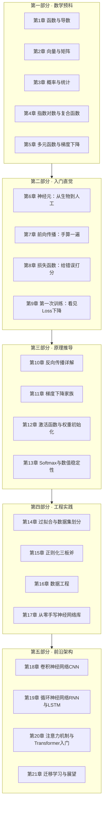

# 前言与学习指南

## 这本教材是写给谁的

写给你——一个对神经网络好奇，但翻开其他教材第一页就被公式劝退的人。

你不需要任何高等数学基础。只要会加减乘除、会一点最基本的 Python（变量、循环、函数），
就能从第 1 章开始，一路学到反向传播的完整推导，并亲手写出一个神经网络库。

这不是一句营销话术。本书的第一部分用五章篇幅，把神经网络所需的全部数学——
导数、矩阵、概率、指数对数、梯度下降——从零讲起。每个概念都配生活类比、
数值例子和可以动手运行的代码。

## 为什么这样设计

大多数教材的失败之处在于：默认你已经会了。它们说"由链式法则显然可得"，
然后你合上书，再也没有打开。

本书的设计原则只有三条：

1. **先直觉，后严格**。每个概念先用生活场景建立感觉，再给定义和公式。
2. **每个数字都能复算**。书里的每个演算例子都写出完整步骤，你拿计算器就能验证；
   每段代码都能直接运行，且附预期输出。
3. **不跳步**。从"什么是函数"到"反向传播的每一步梯度"，中间没有任何
   "显然可得"。

## 全书地图

## 怎么用这本书

**按顺序读**。第 10 章的反向传播依赖第 1 章的链式法则和第 7 章的网络结构，
跳读会让你在最精彩的地方卡住。

**每章的固定结构**：

| 板块 | 你要做的事 |
|------|-----------|
| 学习目标 | 读完后逐条自查 |
| 正文 | 慢读，数值例子跟着算一遍 |
| 动手实验 | 必须亲手运行，改掉参数再运行一次 |
| 常见误区 | 对照检查自己有没有中招 |
| 章末习题 | 先做再看答案（答案在附录A） |
| 小结与预告 | 合上书，试着复述小结要点 |

**估计用时**：每天一章 + 实验，约 3~4 周读完全书。数学预科部分如果你已有基础，
可以快速浏览，只做题验证。

## 环境准备

只需要 Python 3（3.8 及以上版本均可），不需要安装任何第三方库。

- Windows：到 python.org 下载安装包，安装时勾选 "Add Python to PATH"
- 验证：打开终端，输入 `python --version`，能看到版本号即可
- 运行书中的实验：把代码保存为 `xxx.py`，终端执行 `python xxx.py`

书中的公式使用 LaTeX 记号（如 $\frac{\partial L}{\partial w}$），图示使用
Mermaid 与 ASCII 字符图。在支持 Markdown 渲染的阅读器（如 VS Code、Typora、
GitHub 网页）中阅读体验最佳。

## C 语言对照说明

全书每个 Python 实验代码块后面都附有一个"🐘 C 语言对照"折叠块，内含功能等价的
C 版本。主线阅读完全不受影响——不点开它们，本书就是一本纯 Python 教材。

想对照学习的读者可以这样用：

- **先跑通 Python，再读 C**。两版算法逐行对应，预期输出一致（随机实验因随机数
  序列不同，个别数字有出入，趋势必然一致；每个 C 块的"语言差异"一行会具体说明）
- C 版统一使用 **C99 + 标准库**（stdio/stdlib/math/string/time），同样零依赖；
  单文件保存为 `xxx.c`，用 `gcc -std=c99 xxx.c -o xxx` 即可编译运行
- 折叠块开头的一行"语言差异"点出这组代码里最典型的 Python ↔ C 分野：
  列表 vs 数组、类 vs 结构体+函数、动态长度 vs 定长、异常 vs 返回值等
- 第 9、17 章的 C 版库与仓库里的工程级实现相呼应：完整可编译的工程见
  `examples/c-tutorial/`（教学版）与 `examples/nn_framework/`（分层架构版）

不需要 C 基础也能读本书；但如果你的目标之一是嵌入式或底层开发，这些对照块
就是为你准备的"第二视角"。

## 读完之后

第 21 章给出了继续深造的方向。那时你已经具备了：
读懂主流深度学习论文核心段落的能力、从零实现并调试一个小型神经网络的能力、
以及评估"这个问题该不该用神经网络"的判断力。

开始吧。翻到第 1 章，汽车速度表在等你。
