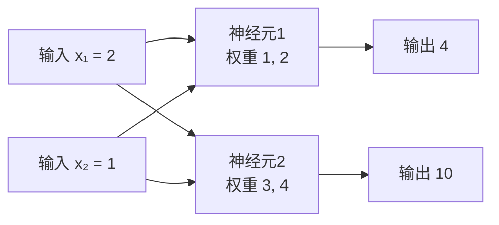

# 第2章 向量与矩阵

> 本章学习目标：
> 1. 能说出向量是"一串有顺序的数字"，并用购物清单类比解释
> 2. 会做向量加法、数乘和点积，每一步能手工验算
> 3. 能说出矩阵是"数字表格"，知道"几行几列"的说法
> 4. 能手算 2×2 矩阵与向量的乘法，并解释每一步的含义
> 5. 理解"一层神经元 = 一次矩阵乘法"这句话

## 从一个例子开始

周末你去超市，手机备忘录里写了一张购物清单：

```
苹果 3 个
牛奶 2 盒
鸡蛋 12 个
```

到了收银台，每件商品有单价：苹果 2 元一个，牛奶 5 元一盒，鸡蛋 1 元一个。你要算总价，会怎么做？

$$3 \times 2 + 2 \times 5 + 12 \times 1 = 6 + 10 + 12 = 28 \text{ 元}$$

注意你刚才做了什么：你把两串数字**对应位置相乘，再全部加起来**。

这个动作看起来平平无奇，但它就是本章的核心——点积（dot product）。而把很多个点积整齐地排在一起做，就是矩阵乘法。**训练神经网络时，计算机每秒做几十亿次的，正是这个动作。**

## 向量：一串有顺序的数字

把购物清单里的数量抽出来，按固定顺序排成一排：

$$\vec{x} = [3,\ 2,\ 12]$$

这就叫向量（vector）。它就是一串数字，但有两个要求：

- **有顺序**：第 1 个位置永远是苹果，第 2 个永远是牛奶，第 3 个永远是鸡蛋。顺序不能乱，乱了意思就变了
- **长度固定**：清单有 3 项，向量就有 3 个数，这叫"3 维向量"

向量上面的小箭头 $\vec{x}$ 只是记号，提醒你"这不是一个数，是一串数"。很多地方也直接用粗体 $\mathbf{x}$ 表示，含义相同。

生活里的向量很多：

| 场景 | 向量 | 每个位置的含义 |
|---|---|---|
| 购物清单 | $[3, 2, 12]$ | 苹果数、牛奶数、鸡蛋数 |
| 三科成绩 | $[85, 90, 78]$ | 语文、数学、英语 |
| 平面上走一步 | $[3, 4]$ | 向东 3 米、向北 4 米 |

为什么神经网络要用向量？因为**一条数据从来不是一个数，而是一串特征**。比如描述一套房子：$[面积,\ 房间数,\ 楼层]$，这就是向量 $[89,\ 3,\ 12]$。你第 1 章学的"输入 $x$ 是一个数"，从本章起升级成"输入 $\vec{x}$ 是一串数"。

再举两个神经网络里真实的向量：一张 28×28 的手写数字图片，拉平后是一个 784 维向量（每个像素一个数）；文章里的一个词，也会被编码成几百维的向量。维度再高，加法和点积的算法与 2 维时完全相同，只是循环多转几圈。

## 向量的加法和数乘

**加法**：两串数字对应位置相加。

$$[2,\ 3] + [1,\ 4] = [2+1,\ 3+4] = [3,\ 7]$$

生活含义：今天买 $[2, 3]$（2 个苹果、3 盒牛奶），明天买 $[1, 4]$，两天合计就是 $[3, 7]$。

加法的逆操作自然也成立：$[3, 7] - [1, 4] = [2, 3]$，对应位置相减，含义是"从合计里去掉明天的部分，还原出今天买的"。

**数乘**：一个数乘以整串数字，每个位置都乘。

$$3 \times [2,\ 1] = [6,\ 3]$$

生活含义：同样的购物清单买 3 份，每种商品数量都乘 3。数成 0 则全部清零——什么也不想买。

两条规则共同的潜台词：**对应位置各算各的，互不干扰。**

向量还有一个直觉画面：在平面上，2 维向量 $[3, 4]$ 可以画成从原点指向坐标 $(3, 4)$ 的一支箭头。

![向量 [3,4] 画成从原点指向 (3,4) 的箭头](figures/ch02-vector-arrow.svg)

向量加法在这个画面里就是"箭头首尾相接"：先按 $[2, 3]$ 走，再按 $[1, 4]$ 走，最终位置和直接按 $[3, 7]$ 走完全一样。数乘 3 则是把箭头拉长到 3 倍。这个画面不是必须掌握，但它能帮你理解为什么向量在物理里表示力和速度。

## 点积：对应相乘再相加

回到收银台。数量向量是 $\vec{x} = [3, 2, 12]$，单价也可以排成向量 $\vec{p} = [2, 5, 1]$。你算总价时做的动作，数学上叫这两个向量的点积：

$$\vec{x} \cdot \vec{p} = 3 \times 2 + 2 \times 5 + 12 \times 1 = 28$$

定义：两个等长向量的点积，等于对应位置相乘后全部相加。结果是一个数，不再是向量。

$$\vec{a} \cdot \vec{b} = a_1 b_1 + a_2 b_2 + \cdots + a_n b_n$$

```
  [3, 2, 12]      数量
   |  |   |
   ×  ×   ×       对应位置相乘
   |  |   |
  [2, 5,  1]      单价
   |  |   |
   6 +10 +12 = 28 全部相加
```

现在揭晓这句话的含金量：**一个神经元的核心计算 $z = wx + b$，当输入是一串数时，就是一个点积再加一个偏置。**

$$z = \vec{w} \cdot \vec{x} + b$$

其中 $\vec{w}$ 是权重（weight）向量——每个输入特征的"重要程度"，$b$ 是偏置（bias）。收银台场景里，数量是输入 $\vec{x}$，单价是权重 $\vec{w}$，总价就是 $z$。神经元做的事和收银员一模一样。

点积还有一个隐藏技能：**衡量两串数字的"合拍程度"。** 两个向量方向越一致，点积越大；互相垂直（比如 $[1, 0]$ 和 $[0, 1]$），点积为 0；方向相反，点积为负。验证一下：

$$[1, 0] \cdot [0, 1] = 1 \times 0 + 0 \times 1 = 0$$

$$[1, 1] \cdot [1, 1] = 1 + 1 = 2, \qquad [1, 1] \cdot [-1, -1] = -2$$

后面你会看到，网络正是靠调整权重向量的"方向"，让它和重要输入特征越来越"合拍"。

## 矩阵：数字的表格

如果超市里不止你一个人，而是一家三口各有一张购物清单呢？把三张清单排整齐：

$$A = \begin{bmatrix} 3 & 2 & 12 \\ 1 & 0 & 6 \\ 0 & 4 & 2 \end{bmatrix}$$

这就是矩阵（matrix）：一张数字表格。上面这个矩阵有 3 行 3 列，叫"3×3 矩阵"。**先说行，再说列**，就像报座位号先说排再说号。

矩阵里每个数字都有坐标。$a_{2,3}$ 表示第 2 行第 3 列的数，在上面的表格里是 6。这个下标记号后面写公式时会反复用到，现在先习惯"先行后列"的读法。

```
        列1  列2  列3
  行1  [ 3    2   12 ]
  行2  [ 1    0    6 ]  ← a_{2,3} = 6 在这里
  行3  [ 0    4    2 ]
```

生活里的矩阵：Excel 成绩表（行是学生、列是科目）、电影院座位表、城市间距离表。记住一个约定：**矩阵习惯用大写字母（$A$、$W$）表示，向量用小写字母加箭头（$\vec{x}$）表示**，看到字母大小写就能猜到它是谁。

拿成绩表对应一下：行是"张三、李四、王五"，列是"语文、数学、英语"。$a_{1,2}$ 就是张三的数学成绩。矩阵不只是符号游戏，它就是你在 Excel 里天天见的表格。

一个随堂小检查：如果成绩表有 30 个学生、5 门课，它对应几行几列的矩阵？（答案：30 行 5 列，先说行。）

矩阵的加法和数乘，和向量一样"对应位置各算各的"：

$$\begin{bmatrix} 1 & 2 \\ 3 & 4 \end{bmatrix} + \begin{bmatrix} 2 & 1 \\ 1 & 2 \end{bmatrix} = \begin{bmatrix} 3 & 3 \\ 4 & 6 \end{bmatrix}, \qquad 2 \times \begin{bmatrix} 1 & 2 \\ 3 & 4 \end{bmatrix} = \begin{bmatrix} 2 & 4 \\ 6 & 8 \end{bmatrix}$$

完整演算加法的左上角：$1 + 2 = 3$；右下角：$4 + 2 = 6$。其余两格同理。数乘的左上角：$2 \times 1 = 2$；右下角：$2 \times 4 = 8$。没有新规则，只是向量运算排成了表格。

注意：矩阵加法要求两个矩阵形状完全相同——都是 2×2 才能加，2×2 加 2×3 是非法操作。

## 矩阵乘法：一整批点积

重头戏来了。先看最简单的情形：**矩阵乘向量**。

$$W = \begin{bmatrix} 1 & 2 \\ 3 & 4 \end{bmatrix}, \qquad \vec{x} = \begin{bmatrix} 2 \\ 1 \end{bmatrix}$$

规则一句话：**结果的每一行 = 矩阵的对应行与向量做点积。**

完整演算，一步不跳：

第 1 行：$[1, 2]$ 与 $[2, 1]$ 点积 $= 1 \times 2 + 2 \times 1 = 2 + 2 = 4$

第 2 行：$[3, 4]$ 与 $[2, 1]$ 点积 $= 3 \times 2 + 4 \times 1 = 6 + 4 = 10$

$$W \vec{x} = \begin{bmatrix} 4 \\ 10 \end{bmatrix}$$

```
  [ 1  2 ]   [ 2 ]     [ 1×2 + 2×1 ]   [  4 ]
  [ 3  4 ] × [ 1 ]  =  [ 3×2 + 4×1 ] = [ 10 ]
```

用神经元的语言读一遍：这个矩阵的**每一行就是一个神经元的权重**。输入 $\vec{x} = [2, 1]$ 同时喂给两个神经元，第一个用权重 $[1, 2]$ 算出 4，第二个用权重 $[3, 4]$ 算出 10。**一次矩阵乘法 = 一整层神经元同时开工。** 这就是"一层神经元 = 一次矩阵乘法"的全部含义。



**矩阵乘矩阵**只是把右边也看成几列向量，每列各做一次"矩阵乘向量"。完整演算一遍 2×2 乘 2×2：

$$\begin{bmatrix} 1 & 2 \\ 3 & 4 \end{bmatrix} \times \begin{bmatrix} 5 & 6 \\ 7 & 8 \end{bmatrix}$$

结果的第 1 行第 1 列：左矩阵第 1 行 $[1,2]$ 点积右矩阵第 1 列 $[5,7]$：
$$1 \times 5 + 2 \times 7 = 5 + 14 = 19$$

第 1 行第 2 列：$[1,2]$ 点积第 2 列 $[6,8]$：
$$1 \times 6 + 2 \times 8 = 6 + 16 = 22$$

第 2 行第 1 列：$[3,4]$ 点积 $[5,7]$：
$$3 \times 5 + 4 \times 7 = 15 + 28 = 43$$

第 2 行第 2 列：$[3,4]$ 点积 $[6,8]$：
$$3 \times 6 + 4 \times 8 = 18 + 32 = 50$$

$$\begin{bmatrix} 1 & 2 \\ 3 & 4 \end{bmatrix} \times \begin{bmatrix} 5 & 6 \\ 7 & 8 \end{bmatrix} = \begin{bmatrix} 19 & 22 \\ 43 & 50 \end{bmatrix}$$

口诀：**左行点右列**。结果第 $i$ 行第 $j$ 列 = 左边第 $i$ 行点积右边第 $j$ 列。

注意一个反直觉的事实：**矩阵乘法不满足交换律**，$AB$ 和 $BA$ 一般不相等。你可以自己把上面两个矩阵换个顺序乘一遍，结果会不同。顺序就是"谁先加工谁后加工"，不能乱。

还有一个合法性问题：**左边矩阵的列数必须等于右边矩阵的行数**，否则点积对不上号。2×3 矩阵可以乘 3×2 矩阵（内层的 3 对上），结果是 2×2；但 2×3 乘 2×3 是非法的，直接算不出来。

```
  [2×3] × [3×2] = [2×2]
      └──┬──┘
       内层必须相等
```

再看一个 2×3 矩阵乘向量的完整例子，感受"一行一个神经元"：

$$W = \begin{bmatrix} 1 & 0 & 2 \\ 2 & 1 & 0 \end{bmatrix}, \qquad \vec{x} = \begin{bmatrix} 1 \\ 3 \\ 1 \end{bmatrix}$$

第 1 行点积：$1 \times 1 + 0 \times 3 + 2 \times 1 = 1 + 0 + 2 = 3$

第 2 行点积：$2 \times 1 + 1 \times 3 + 0 \times 1 = 2 + 3 + 0 = 5$

$$W\vec{x} = \begin{bmatrix} 3 \\ 5 \end{bmatrix}$$

两个神经元，接收 3 个输入，产出 2 个输出——全部信息压缩在一次乘法里。

**两个特殊矩阵值得认识：**

单位矩阵（identity matrix）：对角线是 1，其余是 0。

$$I = \begin{bmatrix} 1 & 0 \\ 0 & 1 \end{bmatrix}, \qquad I\vec{x} = \vec{x} \text{（任何向量乘它都原样返回）}$$

验证：$\begin{bmatrix} 1 & 0 \\ 0 & 1 \end{bmatrix} \begin{bmatrix} 5 \\ 7 \end{bmatrix} = \begin{bmatrix} 1 \times 5 + 0 \times 7 \\ 0 \times 5 + 1 \times 7 \end{bmatrix} = \begin{bmatrix} 5 \\ 7 \end{bmatrix}$。它就像乘法里的数字 1。

零矩阵：所有元素都是 0，任何向量乘它都变成零向量。

## 3×3 矩阵乘向量：再大一号也一样

规则不随尺寸变化。来一个 3×3 的完整演算：

$$\begin{bmatrix} 1 & 2 & 0 \\ 0 & 1 & 1 \\ 2 & 0 & 1 \end{bmatrix} \times \begin{bmatrix} 1 \\ 2 \\ 1 \end{bmatrix}$$

- 第 1 行点积：$1 \times 1 + 2 \times 2 + 0 \times 1 = 1 + 4 + 0 = 5$
- 第 2 行点积：$0 \times 1 + 1 \times 2 + 1 \times 1 = 0 + 2 + 1 = 3$
- 第 3 行点积：$2 \times 1 + 0 \times 2 + 1 \times 1 = 2 + 0 + 1 = 3$

结果是 $\begin{bmatrix} 5 \\ 3 \\ 3 \end{bmatrix}$。三个神经元、三个输入、三个输出——流程和二阶时一字不差。哪怕矩阵变成 784×256（手写数字识别的第一层），规则仍然是"一行一个神经元，左行点右列"。

为什么要费事把计算写成矩阵，而不是逐行循环？两个原因：一是**写法紧凑**，一百个神经元的层在数学上仍是一个矩阵乘一个向量，一行公式写完；二是**算得快**，计算机（尤其是显卡）对矩阵乘法有专门优化，一次批量点积比逐个循环快几十倍。你本章实验里的双重循环，工业界会用矩阵库一次性算完——算的东西一模一样，只是换了更快的算盘。

## 转置：行列互换

转置（transpose）就是把矩阵沿着主对角线"翻个面"：第 1 行变第 1 列，第 2 行变第 2 列。记号是右上角一个 $T$。

$$A = \begin{bmatrix} 1 & 2 & 3 \\ 4 & 5 & 6 \end{bmatrix} \qquad A^T = \begin{bmatrix} 1 & 4 \\ 2 & 5 \\ 3 & 6 \end{bmatrix}$$

```
  转置前 (2行3列)        转置后 (3行2列)
  [ 1  2  3 ]           [ 1  4 ]
  [ 4  5  6 ]     ──►   [ 2  5 ]
                        [ 3  6 ]
```

转置不改变任何数字，只改变摆放方向。后面推导反向传播的矩阵形式时会用到它，现在先眼熟即可。

一条用得上的性质：**转置两次就回到原样**，$(A^T)^T = A$。翻一次面再翻一次，等于没翻。

顺带澄清一个记号问题。向量横着写 $[1, 2, 3]$ 叫行向量，竖着写 $\begin{bmatrix} 1 \\ 2 \\ 3 \end{bmatrix}$ 叫列向量——内容相同，只是摆法不同。一个行向量转置就变成列向量，反之亦然。本书正文里两种写法都会出现，看到时别当成两种东西。

## 动手实验

**实验一：手写点积函数。** 这段代码实现购物清单总价的计算，并验证向量长度不同时会出错。

```python
def dot(a, b):
    if len(a) != len(b):
        raise ValueError("两个向量长度必须相同")
    total = 0
    for i in range(len(a)):
        total += a[i] * b[i]
    return total

数量 = [3, 2, 12]
单价 = [2, 5, 1]
print("总价:", dot(数量, 单价))
```

预期输出：打印 `总价: 28`，和收银台心算一致。你可以把 `数量` 改成 `[1, 2, 3]` 再跑一次，手算验证计算机有没有算错。

再把 `单价` 故意改成只有两个数（比如 `[2, 5]`），重新运行——程序会抛出 `ValueError`，因为 3 项清单对不上 2 项价目表。这正是点积"两边必须等长"在代码里的样子。

**实验二：手写矩阵乘向量。** 这段代码用双重循环实现"左行点右列"，演算正文里 $W\vec{x} = [4, 10]$ 的例子。

```python
def mat_vec_mul(W, x):
    result = []
    for row in W:              # 遍历矩阵的每一行
        result.append(dot(row, x))  # 每行与向量做点积
    return result

def dot(a, b):
    return sum(a[i] * b[i] for i in range(len(a)))

W = [[1, 2],
     [3, 4]]
x = [2, 1]
print("结果:", mat_vec_mul(W, x))
```

预期输出：打印 `结果: [4, 10]`，与你手算的结果完全一致。

**实验三：手写矩阵乘矩阵。** 这段代码实现完整的 2×2 矩阵乘法，验证正文的 $[19, 22; 43, 50]$。

```python
def mat_mul(A, B):
    rows = len(A)
    cols = len(B[0])
    inner = len(B)
    result = []
    for i in range(rows):
        row = []
        for j in range(cols):
            # 结果[i][j] = A第i行 点积 B第j列
            col_j = [B[k][j] for k in range(inner)]
            row.append(sum(A[i][k] * col_j[k] for k in range(inner)))
        result.append(row)
    return result

A = [[1, 2], [3, 4]]
B = [[5, 6], [7, 8]]
print("乘积:", mat_mul(A, B))
```

预期输出：打印 `乘积: [[19, 22], [43, 50]]`。

**实验四：亲手验证"一层神经元"。** 这段代码用矩阵乘法一次性算出 2 个神经元的加权求和 $z$，并加上偏置 $b$。

```python
W = [[1, 0, 2],
     [2, 1, 0]]      # 2 个神经元 × 3 个输入
x = [1, 3, 1]
b = [1, -1]          # 每个神经元一个偏置

z = []
for i in range(len(W)):
    zi = sum(W[i][j] * x[j] for j in range(len(x))) + b[i]
    z.append(zi)

print("z =", z)
```

预期输出：`z = [4, 4]`。其中第一个神经元：$1\times1 + 0\times3 + 2\times1 + 1 = 4$；第二个：$2\times1 + 1\times3 + 0\times1 - 1 = 4$。你刚刚手写出了神经网络一层的前向计算。

## 常见误区

**误区：矩阵乘法就是对应位置相乘。**
真相：那是另一种运算（叫逐元素乘积）。矩阵乘法是"左行点右列"，每个结果都是一次点积。对应位置相乘得到的结果完全不同，别把两者搞混。

拿本章的演算对比一下：矩阵乘法里 $\begin{bmatrix} 1 & 2 \\ 3 & 4 \end{bmatrix}$ 乘 $\begin{bmatrix} 5 & 6 \\ 7 & 8 \end{bmatrix}$ 左上角是 $1\times5 + 2\times7 = 19$；而逐元素相乘的左上角只是 $1 \times 5 = 5$。19 和 5，差别一目了然。

**误区：向量的维度是它包含的数字个数减一。**
真相：有几个数就是几维。$[3, 2, 12]$ 有 3 个数，就是 3 维向量。"维"就是"项数"，没有别的玄机。

**误区：矩阵乘向量时行数列数随便配。**
真相：点积要求两边等长，所以矩阵的**列数**必须等于向量的**长度**。2×2 矩阵只能乘长度为 2 的向量，乘长度为 3 的会直接报错——就像 3 项清单碰上 2 项价目表，对不上号。

## 章末习题

**习题1** 计算 $[1, 2, 3] + [4, 5, 6]$ 和 $2 \times [1, 0, -1]$。

**习题2** 商店里铅笔 1 元、本子 3 元、尺子 2 元。小明买了 $[2, 1, 3]$（2 支铅笔、1 个本子、3 把尺子），用点积计算总价。

**习题3** 手算 $\begin{bmatrix} 2 & 0 \\ 1 & 3 \end{bmatrix} \times \begin{bmatrix} 1 \\ 4 \end{bmatrix}$，写出每一步点积过程。

**习题4** 手算 $\begin{bmatrix} 1 & 1 \\ 0 & 2 \end{bmatrix} \times \begin{bmatrix} 3 & 1 \\ 1 & 1 \end{bmatrix}$，写出四个位置的点积过程。算完后把两个矩阵交换顺序再乘一次，验证 $AB \neq BA$。

**习题5（思考题）** 一层有 4 个神经元的网络，接收长度为 3 的输入向量。这一层的权重矩阵应该有几行几列？如果再加一个偏置向量，偏置向量有几个数？（提示：每个神经元一组权重、一个偏置。）

## 小结与下一章预告

本章要点：

1. 向量是一串有顺序的数字，购物清单、成绩表都是向量
2. 点积 = 对应位置相乘再相加，神经元核心 $z = \vec{w}\cdot\vec{x} + b$ 就是点积
3. 矩阵是数字表格，"几行几列"先说行再说列
4. 矩阵乘法 = 左行点右列，一次矩阵乘法 = 一整层神经元同时计算
5. 转置是行列互换，$AB \neq BA$ 顺序不能乱

下一章换个画风：掷骰子。你会发现"明天 70% 可能下雨"这种话背后有一套精确的数学，而神经网络的"损失函数"本质上就是在和概率打交道。
