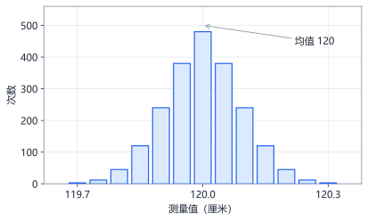
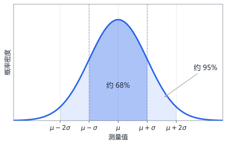
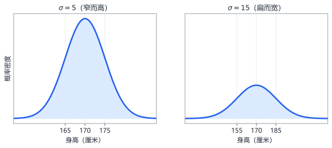

# 第3章 概率与统计

> 本章学习目标：
> 1. 能说出概率是 0 到 1 之间的数，并会算"想要的情况数 ÷ 全部情况数"
> 2. 会算期望值，理解"长期平均值"的含义
> 3. 会算方差和标准差，能解释它们衡量的是什么
> 4. 认识正态分布的钟形曲线，知道"约 68% 的数据落在均值附近一个标准差内"
> 5. 理解神经网络的损失函数为什么和这些概念有关

## 从一个例子开始

气象台说明天降水概率 70%。你朋友听完说："那就是明天肯定下雨。"你觉得对吗？

不对。70% 的意思是：如果有一百个和明天天气条件一模一样的日子，大约七十个会下雨，三十个不会。明天到底下不下，谁都说不准。

再想一个场景。你拿尺子量一张桌子的长度，量了五次：120.1、119.8、120.0、120.2、119.9 厘米。五次结果都不一样，但它们都挤在 120 附近，而且挤得有规律——大多数离 120 很近，偏离很远的极少。

这两个场景里藏着本章的四个主角：概率、期望值、方差、正态分布。它们回答的问题分别是：**一件事多可能发生？长期平均得到什么？数据散得有多开？散开的方式长什么样？**

为什么神经网络需要这些？因为训练数据就像那五次测量——有噪声、有波动、服从某种分布。而判断模型好坏的损失函数 $L$，本质上就是"预测值和真实值差多远"的统计度量。

一张路线图，看清本章四节怎么层层递进：


## 从频率到概率：概率是怎么测出来的

理论上硬币正面概率是 0.5，但你怎么确认？办法只有一个：抛很多次，看比例。

抛 10 次，可能 7 次正面，比例 0.7——别慌，这不说明硬币有问题。抛 1000 次，比例几乎一定落在 0.49 到 0.51 之间。**次数越多，实际频率越逼近理论概率**，这叫大数定律（law of large numbers），本章实验一会亲手验证它。

这条定律是统计学的地基：它保证"用大量数据的平均表现去估计理论值"是靠谱的。神经网络的整个训练逻辑——用一批数据的表现代表整体表现——就站在这块地基上。

## 概率：可能性的精确刻度

概率（probability）是一个 0 到 1 之间的数，衡量一件事发生的可能性。

- 概率 0：绝无可能（掷骰子掷出 7）
- 概率 1：必然发生（掷骰子掷出 1 到 6 之间的某个数）
- 概率 0.5：一半一半（抛硬币正面朝上）

当所有结果可能性相同时，概率的计算公式非常直白：

$$P(A) = \frac{\text{事件 } A \text{ 包含的情况数}}{\text{全部可能的情况数}}$$

$P(A)$ 读作"事件 A 的概率"。

**例 1：掷骰子掷出偶数。**
全部情况：1、2、3、4、5、6，共 6 种。想要的情况：2、4、6，共 3 种。
$$P(\text{偶数}) = \frac{3}{6} = 0.5$$

**例 2：掷两个骰子，点数之和为 7。**
两个骰子共有 $6 \times 6 = 36$ 种组合。和为 7 的组合有：$(1,6)$、$(2,5)$、$(3,4)$、$(4,3)$、$(5,2)$、$(6,1)$，共 6 种。
$$P(\text{和为7}) = \frac{6}{36} = \frac{1}{6} \approx 0.167$$

一个常用技巧：**"至少发生一次"很难直接算，可以先算它的反面。** 抛三次硬币，"至少一次正面"的反面是"三次全反"。每次反面的概率是 $1/2$，三次全反是 $\frac{1}{2} \times \frac{1}{2} \times \frac{1}{2} = \frac{1}{8}$。所以：

$$P(\text{至少一次正面}) = 1 - \frac{1}{8} = \frac{7}{8} = 0.875$$

这里用到了另一条规则：**两件独立的事同时发生，概率相乘。** "独立"的意思是互不干扰——第一次抛的结果不会影响第二次。掷骰子和抛硬币都独立；但"今天下雨"和"今天堵车"不独立，因为下雨会让堵车更可能。

**例 3：从 1 到 20 中随机选一个数，选到质数。**
质数是只能被 1 和自己整除的数。1 到 20 的质数：2、3、5、7、11、13、17、19，共 8 个。

$$P = \frac{8}{20} = 0.4$$

注意 1 不是质数，这是最常踩的坑。

概率还有三条基本性质，做题时可以随时拿来检查答案：

- 任何事件的概率都在 0 到 1 之间。算出 $P = 1.5$ 或 $P = -0.2$，一定算错了
- 所有互斥结果的概率加起来等于 1。骰子六面朝上的概率加起来是 $6 \times \frac{1}{6} = 1$
- "不发生"的概率 = 1 减去"发生"的概率。$P(\text{不掷出6}) = 1 - \frac{1}{6} = \frac{5}{6}$

第三条前面已经用过一次（至少一次正面 = 1 - 全反），它是概率题里最常用的侧身闪避技巧。

## 期望值：长期平均的回报

你玩一个游戏：掷一次骰子，掷出几点就得几块钱。玩一次的结果没法预测，但玩一万次，平均每把得多少钱？

这个问题有精确答案。期望值（expected value）的定义：**每种结果乘它的概率，再全部加起来。**

$$E(X) = x_1 p_1 + x_2 p_2 + \cdots + x_n p_n$$

代入骰子游戏，每个点数概率都是 $1/6$：

$$E(X) = 1 \times \frac{1}{6} + 2 \times \frac{1}{6} + 3 \times \frac{1}{6} + 4 \times \frac{1}{6} + 5 \times \frac{1}{6} + 6 \times \frac{1}{6} = \frac{1+2+3+4+5+6}{6} = \frac{21}{6} = 3.5$$

平均每把 3.5 元。注意一个细节：**你永远不会真的掷出 3.5 点**，但 3.5 依然是正确答案——期望值描述的是长期平均，不是单次结果。

再看一个彩票例子。某彩票中奖概率 $1/1000$，奖金 900 元，不中奖得 0 元：

$$E = 900 \times \frac{1}{1000} + 0 \times \frac{999}{1000} = 0.9 \text{ 元}$$

如果这张彩票卖 1 元，你每买一张平均亏 0.1 元。期望值是你判断"这事长期看划不划算"的尺子。

再看一个不等概率的例子，练一下一般公式。一个游戏：50% 得 0 元，30% 得 10 元，20% 得 50 元：

$$E = 0 \times 0.5 + 10 \times 0.3 + 50 \times 0.2 = 0 + 3 + 10 = 13 \text{ 元}$$

三个概率加起来是 $0.5 + 0.3 + 0.2 = 1$，这是合法概率分布的必要条件：**所有结果的概率之和必须等于 1。**

期望值还有一条好性质：**和的期望 = 期望的和。** 掷两个骰子，总点数的期望不用列 36 种组合，直接 $3.5 + 3.5 = 7$。

顺手算一下抛硬币的期望。正面记 1、反面记 0，各 1/2 概率：

$$E = 1 \times \frac{1}{2} + 0 \times \frac{1}{2} = 0.5$$

这种"结果只有 0 或 1"的随机变量叫伯努利分布（Bernoulli distribution），它看着简单，却是二分类问题的数学原型——"是猫还是不是猫"，就是一次伯努利试验。

顺手把它的方差也算了。正面概率 $p = 0.5$ 时，均值 $\mu = 0.5$：

$$\text{Var} = (1 - 0.5)^2 \times 0.5 + (0 - 0.5)^2 \times 0.5 = 0.25 \times 0.5 + 0.25 \times 0.5 = 0.25$$

一般结论：伯努利分布的方差是 $p(1-p)$。$p = 0.5$ 时方差最大（最拿不准），$p$ 接近 0 或 1 时方差趋近 0（几乎确定）。这和你对"硬币最 unpredictable、作弊骰子最 predictable"的直觉完全吻合。

再算一个骰子的方差，练一遍完整流程。骰子点数期望 $\mu = 3.5$，六个点数的偏差平方：

- $(1-3.5)^2 = 6.25$，$(2-3.5)^2 = 2.25$，$(3-3.5)^2 = 0.25$
- $(4-3.5)^2 = 0.25$，$(5-3.5)^2 = 2.25$，$(6-3.5)^2 = 6.25$

$$\text{Var} = \frac{6.25 + 2.25 + 0.25 + 0.25 + 2.25 + 6.25}{6} = \frac{17.5}{6} \approx 2.917$$

标准差 $\sigma = \sqrt{2.917} \approx 1.71$。含义：掷一次骰子，结果典型地偏离平均值 3.5 约 1.7 个点。你可以在实验五里用模拟数据验证这个数字。

**与神经网络的联系**：训练时，损失 $L$ 是在一批批数据上算出来的平均值。你关心的不是某一条数据上的误差，而是**全部数据上的期望误差**——误差足够小的模型，才是真正可靠的模型。

## 从方差到损失函数：均方误差

先看一眼第 5 章会正式登场的损失函数，你会发现它其实是本章的老朋友。

模型对三条数据的预测是 $\hat{y} = [0.9, 0.1, 0.8]$，真实值是 $y = [1, 0, 1]$。均方误差（mean squared error, MSE）定义为"误差的平方求平均"：

$$L = \frac{(0.9 - 1)^2 + (0.1 - 0)^2 + (0.8 - 1)^2}{3} = \frac{0.01 + 0.01 + 0.04}{3} = \frac{0.06}{3} = 0.02$$

把这个公式和方差对比：方差是"每个数据减均值的平方，求平均"；MSE 是"每个预测减真实值的平方，求平均"。**结构一模一样——它们都在度量"偏离目标有多远"。** 方差衡量数据偏离均值的程度，MSE 衡量预测偏离真相的程度。学会方差，你已经学会了半个损失函数。

MSE 还有一个来自正态分布的正当理由。测量误差近似正态分布时，误差越大，出现的概率越低，而且概率的对数恰好正比于误差的平方（回看正态分布公式里那个 $-\frac{(x-\mu)^2}{2\sigma^2}$ 就明白了）。换句话说：**让平方误差最小，等价于让"观测到这些数据"的概率最大。** 这不是巧合，是统计学的深刻结果，名字也很好听——最大似然估计。现在记住结论即可。

## 方差与标准差：数据散得有多开

两个班平均分都是 75 分。甲班人人 74 到 76 分，乙班从 40 分到 100 分都有。平均分看不出差别，但两个班完全不同。差别在哪？在数据的分散程度。

方差（variance）就是分散程度的度量。定义分三步：

1. 先算平均值 $\mu$（希腊字母 mu，读作"谬"）
2. 每个数据减去平均值，差值平方（平方是为了让正负偏差都变成正数，不会互相抵消）
3. 把平方后的结果求平均

$$\text{Var}(X) = \frac{(x_1 - \mu)^2 + (x_2 - \mu)^2 + \cdots + (x_n - \mu)^2}{n}$$

完整演算一组数据 $[1, 2, 3, 4, 5]$：

- 平均值：$\mu = (1+2+3+4+5)/5 = 15/5 = 3$
- 各偏差平方：$(1-3)^2 = 4$，$(2-3)^2 = 1$，$(3-3)^2 = 0$，$(4-3)^2 = 1$，$(5-3)^2 = 4$
- 方差：$(4 + 1 + 0 + 1 + 4)/5 = 10/5 = 2$

对比数据 $[1, 1, 1, 1, 1]$：平均值是 1，每个偏差都是 0，方差为 0。完全一样 = 完全不分散，合理。

方差有个小毛病：单位被平方了（长度的方差单位是"平方厘米"，不直观）。所以取它的平方根，叫标准差（standard deviation），记作 $\sigma$（希腊字母 sigma，读作"西格玛"）：

$$\sigma = \sqrt{\text{Var}(X)}$$

上例中 $\sigma = \sqrt{2} \approx 1.41$。

直觉记法：**方差大 = 数据散；标准差是"典型偏离平均值有多远"的尺度。**

再练一组，对比感受。数据集 $[3, 3, 3, 4, 4, 5, 5]$：

- 均值：$(3+3+3+4+4+5+5)/7 = 27/7 \approx 3.857$
- 偏差平方：$(3-3.857)^2 \approx 0.735$（出现 3 次），$(4-3.857)^2 \approx 0.020$（2 次），$(5-3.857)^2 \approx 1.306$（2 次）
- 方差：$(0.735 \times 3 + 0.020 \times 2 + 1.306 \times 2)/7 \approx (2.204 + 0.041 + 2.612)/7 \approx 0.694$
- 标准差：$\sqrt{0.694} \approx 0.83$

对比前面 $[1, 2, 3, 4, 5]$ 的标准差 1.41：两组数据的范围差不多，但这组挤在均值附近，标准差明显更小。数字忠实反映了"挤"和"散"。

为什么要平方而不是直接取绝对值？两个原因：平方让大的偏差受到更重的惩罚（偏 2 的代价是偏 1 的 4 倍而不是 2 倍），而且平方函数处处光滑可导——第 5 章你会看到，损失函数用平方误差正是为了好求导。

## 抽样：为什么训练数据是一批一批喂的

最后一节把本章串到神经网络的训练实践上。

假如你想知道全校学生的平均身高。最准确的办法是量全校每一个人，但太慢。实际做法是随机抽 100 个人量一量，用这 100 人的均值估计全校均值。大数定律保证：只要抽样是随机的、数量不太少，估计就八九不离十。

训练神经网络一模一样。全部训练数据可能有几百万条，每次更新参数都把所有数据算一遍太慢。所以每次随机抽一小批（比如 32 条），算这一批的平均损失和梯度，用它代替全体数据的梯度。这叫**小批量梯度下降（mini-batch gradient descent）**。

这批数据就是一次抽样：批次的均值和方差会围绕全体数据的真实值小幅波动，但大数定律保证它不会偏得离谱。抽样带来的轻微随机性甚至有好处——它像下山路上偶尔被推一把，有时能帮模型跳出浅的小坑。

抽样有一个纪律：**必须随机。** 如果你只量篮球队的身高来估计全校平均，结果会系统性偏高，再多数据也救不回来。对应到训练上：每批数据要随机打乱再抽取，不能总按固定顺序喂——否则模型会记住顺序而不是规律。

## 正态分布：钟形曲线

把开头量桌子的实验做一万次，把每次的测量结果画成直方图，你会看到一条对称的钟形曲线：



这就叫正态分布（normal distribution），又叫高斯分布。它有两个特点：

- 以均值 $\mu$ 为中心，左右对称
- 离中心越远，出现的次数越少，曲线向两边逐渐贴近横轴

为什么它无处不在？因为**很多微小的随机误差叠加在一起，结果就趋向正态分布**。测量误差、身高、工厂零件的尺寸偏差，都近似服从正态分布。

正态分布由两个参数完全确定：均值 $\mu$ 决定钟的中心在哪，标准差 $\sigma$ 决定钟有多宽。$\sigma$ 大，钟又扁又宽（数据散）；$\sigma$ 小，钟又窄又陡（数据集中）。

有一条非常实用的经验法则（叫"68-95-99.7 法则"）：



- 约 **68%** 的数据落在 $\mu \pm 1\sigma$ 之内
- 约 **95%** 的数据落在 $\mu \pm 2\sigma$ 之内
- 约 **99.7%** 的数据落在 $\mu \pm 3\sigma$ 之内

举个例子：某地区成年男性身高近似正态分布，$\mu = 170$ 厘米，$\sigma = 10$ 厘米。那么身高在 $170 \pm 10 = 160$ 到 180 厘米之间的人约占 68%；在 150 到 190 厘米之间的约占 95%。

再练一个：考试分数近似正态分布，$\mu = 70$ 分，$\sigma = 15$ 分。

- 55 到 85 分（$\mu \pm \sigma$）：约占 68%
- 40 到 100 分（$\mu \pm 2\sigma$）：约占 95%
- 高于 100 分：$\mu + 2\sigma$ 右侧，约占 $(100\% - 95\%)/2 = 2.5\%$（除以 2 是因为对称，只取右半边）

正态分布的完整公式长这样（不用记，眼熟即可）：

$$p(x) = \frac{1}{\sqrt{2\pi}\,\sigma}\, e^{-\frac{(x-\mu)^2}{2\sigma^2}}$$

你只需要看懂结构：分子里有 $e$ 的负指数，指数里是"$(x - \mu)$ 的平方"——离均值越远，指数越负，概率密度被压得越低。钟形就是这么来的。

再看一组对比，体会 $\sigma$ 的作用。同一个均值 170，两种标准差：



$\sigma = 5$ 时绝大多数身高挤在 165 到 175；$\sigma = 15$ 时从 155 到 185 都有不少。两条曲线下面的总面积都等于 1（概率总和），所以窄的必然高、宽的必然扁。

**与神经网络的联系**：后面你会学到，网络的初始权重 $w$ 就是从一个均值 0、小标准差的正态分布里随机抽取的；而分类任务的输出，也是用概率来表达的（"这张图有 92% 的可能是猫"）。本章的概念会反复出现。

## 动手实验

**实验一：模拟掷骰子，验证大数定律。** 理论上掷骰子的期望是 3.5。这段代码让计算机掷很多次，看实际平均值是否逼近 3.5。

```python
import random

random.seed(42)          # 固定随机种子，结果可复现

for times in [10, 100, 1000, 10000, 100000]:
    total = 0
    for _ in range(times):
        total += random.randint(1, 6)   # 掷一次骰子
    print(f"掷 {times:>6} 次，平均值 = {total / times:.4f}")
```

预期输出：掷 10 次时平均值可能在 3.2 到 3.9 之间乱跳；掷 100000 次时稳定在 3.5 附近（如 3.49 或 3.50）。次数越多，平均值越接近期望值——这就是大数定律（law of large numbers）。

**实验二：手算均值、方差、标准差。** 这段代码对 $[1, 2, 3, 4, 5]$ 实现方差三步法。

```python
import math

data = [1, 2, 3, 4, 5]

mu = sum(data) / len(data)
squared_diffs = [(x - mu) ** 2 for x in data]   # 每个偏差的平方
variance = sum(squared_diffs) / len(data)
std = math.sqrt(variance)

print("平均值:", mu)
print("偏差平方:", squared_diffs)
print("方差:", variance)
print("标准差:", round(std, 4))
```

预期输出：平均值 3.0，偏差平方 $[4.0, 1.0, 0.0, 1.0, 4.0]$，方差 2.0，标准差约 1.4142——与正文手算完全一致。

**实验三：亲手"造出"钟形曲线。** 这段代码每次抛 10 枚硬币、统计正面个数，重复 10000 次，用星号画出分布。

```python
import random

random.seed(42)

counts = [0] * 11                     # 正面个数从 0 到 10
for _ in range(10000):
    heads = sum(random.randint(0, 1) for _ in range(10))
    counts[heads] += 1

for k in range(11):
    bar = "*" * (counts[k] // 200)    # 每 200 次画一颗星
    print(f"{k:>2} 个正面: {bar}")
```

预期输出：星号在"5 个正面"处最长，向两边对称变短，0 和 10 处几乎没有——一个字符画出的钟形。多个小随机事件相加，结果自然趋向正态分布。

**实验四：模拟测量误差。** 这段代码模拟"真实长度 120 厘米、每次测量带随机误差"的场景，重复 2000 次，统计落在一个标准差内的比例。

```python
import random

random.seed(42)

mu, sigma = 120, 2
inside = 0
times = 2000
for _ in range(times):
    measure = random.gauss(mu, sigma)     # 从正态分布抽一个测量值
    if mu - sigma <= measure <= mu + sigma:
        inside += 1

print(f"落在 μ±σ 内的比例: {inside / times:.3f}")
```

预期输出：比例约为 0.68 左右，验证 68-95-99.7 法则的第一条。把代码里的区间改成 $\mu \pm 2\sigma$，你会看到约 0.95。

**实验五：亲手验证"和的期望 = 期望的和"。** 这段代码模拟掷两个骰子 10 万次，统计点数之和的平均值。

```python
import random

random.seed(42)

total = 0
times = 100000
for _ in range(times):
    total += random.randint(1, 6) + random.randint(1, 6)

print("两个骰子点数之和的平均:", round(total / times, 3))
```

预期输出：平均值约为 7.0，与 $3.5 + 3.5 = 7$ 的理论值一致。

**实验六：模拟验证骰子的方差。** 这段代码掷骰子 10 万次，用方差三步法算出实际方差，和理论值 $17.5/6 \approx 2.917$ 对比。

```python
import random

random.seed(42)

results = [random.randint(1, 6) for _ in range(100000)]
mu = sum(results) / len(results)
variance = sum((x - mu) ** 2 for x in results) / len(results)

print("模拟均值:", round(mu, 3))
print("模拟方差:", round(variance, 3))
print("理论方差:", round(17.5 / 6, 3))
```

预期输出：模拟均值约 3.5，模拟方差约 2.91，与理论方差 2.917 几乎相等。

## 常见误区

**误区：期望值是"最可能得到的值"。**
真相：期望值是长期平均值，可能根本不是可能出现的结果。掷骰子永远掷不出 3.5 点，但期望值就是 3.5。

**误区：方差大说明数据"不好"。**
真相：方差只描述分散程度，不分好坏。测量同一桌子的长度，方差大说明尺子不靠谱；但一个班里学生成绩方差大，只是说明水平差异大。要结合场景解读。

**误区：正态分布是唯一"正常"的分布。**
真相：名字里的"正态"只是历史叫法。骰子的点数是均匀分布（每种 $1/6$），抛硬币是两点分布，它们都同样"正常"。只是大量微小随机因素叠加时，结果趋向钟形，所以它最常见。

**误区：概率 0.7 的事件发生了，说明概率算错了。**
真相：概率描述的是大量重复下的频率。降水概率 70% 而明天没下雨，完全正常——那 30% 的情况就是在这种日子兑现的。要检验 70% 靠不靠谱，得看一百个"降水概率 70%"的日子里，是不是约七十天真的下了雨。

## 章末习题

**习题1** 从 1 到 10 中随机选一个整数，选到 3 的倍数的概率是多少？

**习题2** 抛三次硬币，恰好出现两次正面的概率是多少？（提示：先列出全部 8 种结果。）

**习题3** 某游戏：掷一次骰子，掷出 6 得 12 元，其他点数得 0 元。计算期望值。如果玩一次收 3 元，长期玩下去是赚还是亏？

**习题4** 计算数据集 $[2, 4, 4, 4, 5, 5, 7, 9]$ 的均值、方差和标准差（标准差保留两位小数）。

**习题5（思考题）** 某城市公交车到站时间误差近似正态分布，$\mu = 0$ 分钟，$\sigma = 2$ 分钟。你等车时，车比时刻表晚到超过 4 分钟的概率大约是多少？（用 68-95-99.7 法则估算。）

## 小结与下一章预告

本章要点：

1. 概率是 0 到 1 的数，等可能情形 = 想要的情况数 ÷ 全部情况数
2. 期望值 = 每种结果乘概率再求和，描述长期平均
3. 方差 = 偏差平方的平均，标准差 = 方差的平方根，衡量分散程度
4. 正态分布是钟形曲线，约 68% 数据在 $\mu \pm \sigma$ 内，95% 在 $\mu \pm 2\sigma$ 内
5. 损失函数、权重初始化、分类输出背后都是概率统计

下一章你会认识两个"长得像魔法"的函数：指数函数和对数函数。你会发现后面分类网络必备的 softmax 和交叉熵，拆开看全是他俩的组合。
