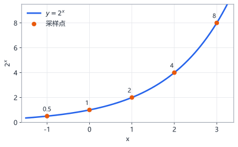
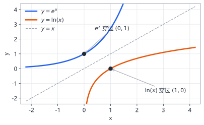
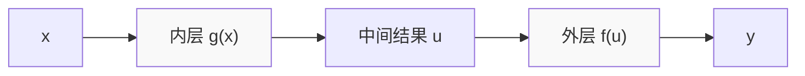
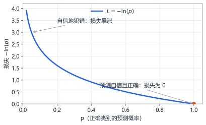
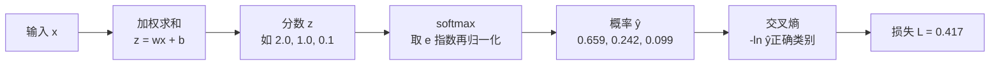
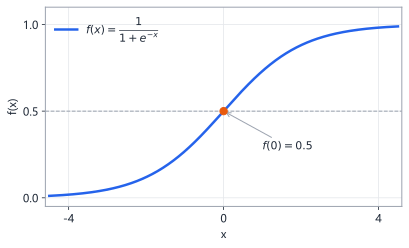

# 第4章 指数、对数与复合函数

> 本章学习目标：
> 1. 能解释 $2^3$、$2^{-1}$、$2^{0.5}$ 各自是什么意思
> 2. 说出自然常数 $e$ 的近似值，并知道 $e^x$ 的导数是它自己
> 3. 理解对数是指数的"反向提问"，会算 $\ln(1)$、$\ln(e)$ 这类简单值
> 4. 能熟练用链式法则求两层复合函数的导数
> 5. 知道 softmax 和交叉熵各由哪些零件拼成

## 从一个例子开始

一张纸对折一次变 2 层，再对折变 4 层，再对折 8 层。对折 $x$ 次，层数是：

$$f(x) = 2^x$$

对折 10 次是 $2^{10} = 1024$ 层。理论上对折 42 次，厚度就能从地球够到月球。

现在反过来问：想要 1024 层，需要对折几次？

这个问题问的就是"对数"。答案是 10，写作 $\log_2(1024) = 10$。

**指数是"翻倍多少次变成多少"，对数是"要变成这么多得翻倍几次"。** 一个正着问，一个反着问。

这两个函数为什么这么重要？因为神经网络的分类输出（softmax）全靠指数函数，衡量分类准不准的损失（交叉熵，cross-entropy）全靠对数函数。本章把它们彻底拆开给你看。

## 指数函数：反复相乘

指数（exponent）表示"连乘几次"。$2^3 = 2 \times 2 \times 2 = 8$，右上角的 3 叫指数，底下的 2 叫底数。

把定义推广开，有三条规则值得记住：

**规则一：零次方等于 1。**

$$2^0 = 1$$

直觉：一次都不翻倍，就停在起点 1。

**规则二：负指数表示倒过来除。**

$$2^{-1} = \frac{1}{2}, \qquad 2^{-3} = \frac{1}{2^3} = \frac{1}{8}$$

**规则三：分数指数表示开方。** $2^{0.5} = \sqrt{2} \approx 1.414$。这条只需眼熟，本书用得少。

还有一条运算律会反复用到：**同底数相乘，指数相加。**

$$2^3 \times 2^4 = 2^{3+4} = 2^7 = 128$$

验算：$2^3 = 8$，$2^4 = 16$，$8 \times 16 = 128$。对上了。这条规则后面推导 softmax 时会救场。

指数函数的图像特点是"越涨越快"：



每一段的斜率都比上一段更陡——这正是"增长的速度和当前的量成正比"的直观画面。

底数换成 0 和 1 之间的数，指数函数就变成"越降越慢"。比如 $f(x) = 0.5^x$，表示每次减半：

| $x$ | 0 | 1 | 2 | 3 | 4 |
|---|---|---|---|---|---|
| $0.5^x$ | 1 | 0.5 | 0.25 | 0.125 | 0.0625 |

放射性物质衰变、热水变凉，都是这种"衰减型指数"。它永远靠近 0 但到不了 0——每次只减一半，永远减不完。

## 自然常数 e：最"自然"的底数

数学家发现，在所有底数里，有一个特殊的数性质最干净，记作 $e$：

$$e \approx 2.71828$$

它特殊在哪？回忆第 1 章：导数是"变化的快慢"。**函数 $e^x$ 的导数就是它自己。**

$$\frac{d}{dx} e^x = e^x$$

用数字感受一下。$e^x$ 在 $x = 1$ 处的值约 2.718，它在该点的增长速度也正好是 2.718；在 $x = 2$ 处值约 7.389，增长速度也是 7.389。**当前有多大，就涨多快**——唯一能做到这点的函数，就是以 $e$ 为底的指数函数。

动手验证一下这个性质（用第 1 章的数值逼近法，$h$ 取 0.0001）：

$$\frac{e^{1.0001} - e^{1}}{0.0001} \approx \frac{2.71855 - 2.71828}{0.0001} \approx 2.72 \approx e^1$$

因为 $e^x$ 求导太方便了，神经网络里的指数函数几乎一律用 $e$ 当底数。其他底数也能换算：$2^x$ 的导数是 $2^x \ln(2)$，多出来的 $\ln(2)$ 因子正是"底数不够自然"的代价。

## 对数：指数的反向提问

对数（logarithm）回答的问题是：**底数要自乘几次，才能得到这个数？**

$$\log_2(8) = 3 \quad\text{因为}\quad 2^3 = 8$$

$$\log_{10}(100) = 2 \quad\text{因为}\quad 10^2 = 100$$

以 $e$ 为底的对数有专门记号 $\ln$（读作"自然对数"，natural logarithm）：

$$\ln(x) = \log_e(x)$$

几个能直接背出来的值：

- $\ln(1) = 0$，因为 $e^0 = 1$
- $\ln(e) = 1$，因为 $e^1 = e$
- $e^{\ln(5)} = 5$——指数和对数互相抵消，就像穿袜子再脱袜子

对数有一条黄金法则：**对数把乘法变成加法。**

$$\ln(a \times b) = \ln(a) + \ln(b)$$

验算：$\ln(2 \times 4) = \ln(8) \approx 2.079$；$\ln(2) + \ln(4) \approx 0.693 + 1.386 = 2.079$。完全一致。

这条法则是交叉熵损失的根基。连乘一百个概率，数字小到计算机存不下；取对数变成连加，问题迎刃而解。

第二条法则：**对数把幂变成乘法。**

$$\ln(a^k) = k \times \ln(a)$$

验算：$\ln(2^3) = \ln(8) \approx 2.079$；$3 \times \ln(2) \approx 3 \times 0.693 = 2.079$。一致。这条在推导交叉熵梯度时会用到。

再补一个直觉画面。指数 $e^x$ 和对数 $\ln(x)$ 互为反函数，它们的图像关于 $y = x$ 这条对角线镜像对称：



$e^x$ 穿过 $(0, 1)$，$\ln(x)$ 穿过 $(1, 0)$——同一道题的正反两面。

对数函数的导数也很简洁：

$$\frac{d}{dx} \ln(x) = \frac{1}{x}$$

## 复合函数与链式法则（强化）

第 1 章你学过链式法则：**外层导数乘内层导数**。现在用它对付指数和对数的复合，这是本章的真功夫。

复习一下结构。复合函数 $y = f(g(x))$ 是流水线作业：



链式法则：$\dfrac{dy}{dx} = f'(u) \times g'(x)$。

**例 1：求 $y = e^{3x}$ 的导数。**

拆：内层 $g(x) = 3x$，外层 $f(u) = e^u$。

- 外层导数 $f'(u) = e^u = e^{3x}$（$e$ 的指数函数导数是自己）
- 内层导数 $g'(x) = 3$

$$y' = e^{3x} \times 3 = 3e^{3x}$$

**例 2：求 $y = \ln(x^2 + 1)$ 的导数。**

拆：内层 $g(x) = x^2 + 1$，外层 $f(u) = \ln(u)$。

- 外层导数 $f'(u) = \dfrac{1}{u} = \dfrac{1}{x^2 + 1}$
- 内层导数 $g'(x) = 2x$

$$y' = \frac{1}{x^2 + 1} \times 2x = \frac{2x}{x^2 + 1}$$

套路永远是三步：认出内外层、各求各的导数、乘起来并把中间变量换回 $x$。

**例 3：求 $y = \ln(5x - 2)$ 的导数。**

- 外层 $f(u) = \ln(u)$，导数 $\frac{1}{u} = \frac{1}{5x - 2}$
- 内层 $g(x) = 5x - 2$，导数 $5$

$$y' = \frac{5}{5x - 2}$$

**例 4（三层复合，先混个眼熟）**：$y = e^{(x+1)^2}$。

从外到内一层层剥：最外层 $e^u$，中间层 $u = v^2$，最内层 $v = x + 1$。链式法则一路乘下去：

$$y' = e^{(x+1)^2} \times 2(x+1) \times 1 = 2(x+1)\,e^{(x+1)^2}$$

三层就是三次相乘。神经网络有几十层，反向传播就是把这条链一路乘几十次——原理和这里一模一样，只是链条更长。

## 登台亮相：softmax 与交叉熵

现在把零件装起来，看神经网络怎么分类。

假设网络最后一层对"猫、狗、鸟"三个类别算出了三个分数（就是第 2 章的 $z = \vec{w}\cdot\vec{x} + b$）：$z = [2.0,\ 1.0,\ 0.1]$。分数有正有负、大小不一，没法直接当概率用。

**softmax 函数**负责把任意分数变成概率，分两步：

第一步，每个分数取 $e$ 的指数（保证全部变正数，且大的更大）：

$$e^{2.0} \approx 7.389, \qquad e^{1.0} \approx 2.718, \qquad e^{0.1} \approx 1.105$$

第二步，除以总和（保证加起来等于 1）：

$$\text{总和} = 7.389 + 2.718 + 1.105 = 11.212$$

$$\hat{y} = \left[\frac{7.389}{11.212},\ \frac{2.718}{11.212},\ \frac{1.105}{11.212}\right] \approx [0.659,\ 0.242,\ 0.099]$$

检查一下：$0.659 + 0.242 + 0.099 = 1.000$。网络说"65.9% 是猫"。

再练一组分数，感受 softmax 对差距的放大。这次 $z = [0.5, 0.4, 0.3]$，三个分数很接近：

$$e^{0.5} \approx 1.649, \qquad e^{0.4} \approx 1.492, \qquad e^{0.3} \approx 1.350$$

总和 $\approx 4.491$，输出概率 $\approx [0.367, 0.332, 0.301]$。分数只差 0.1，概率也只差 0.03 左右——softmax 如实反映"网络拿不准"。分数差得大，概率差得更狠；分数接近，概率也接近。这就是它受欢迎的原因：**输出既合法（和为 1），又保留了网络的信心程度。**

**交叉熵损失**负责给这个预测打分。如果真实答案确实是猫（即 $y = [1, 0, 0]$），损失为：

$$L = -\ln(\hat{y}_{\text{正确类别}}) = -\ln(0.659) \approx 0.417$$

看这条曲线的形状就明白它的用意：



预测概率越接近 1（越自信越正确），损失越接近 0；预测概率越接近 0（错得离谱），损失暴涨到无穷大。**用对数当损失，就是给"自信地犯错"施加猛烈惩罚。**

再过一遍完整流程，把本章零件全部串起来：



分数 $z$ 来自第 2 章的矩阵乘法，softmax 来自本章的 $e^x$，交叉熵来自本章的 $\ln$。训练时再对 $L$ 求导（第 1 章和第 5 章），调参的闭环就转起来了。

## 顺带认识一位亲戚：sigmoid

softmax 处理多分类。如果只有两个类别（是 / 不是），有更轻量的选择：sigmoid 函数。

$$f(x) = \frac{1}{1 + e^{-x}}$$

拆开看它的零件：$e^{-x}$ 是本章的指数（负指数 = 倒数），再加 1、再取倒数。输入 0 时：

$$f(0) = \frac{1}{1 + e^0} = \frac{1}{1 + 1} = 0.5$$

它把任何输入压进 0 到 1 之间，输出可以直接当作"是"的概率。现在只需记住它的长相和用途；它的导数推导留给后面的章节。



## 动手实验

**实验一：感受指数爆炸。** 这段代码对比线性增长 $2x$ 和指数增长 $2^x$。

```python
for x in range(1, 11):
    linear = 2 * x
    exponential = 2 ** x
    print(f"x={x:>2}  线性: {linear:>4}   指数: {exponential:>6}")
```

预期输出：线性一列慢吞吞爬到 20，指数一列飙到 1024。肉眼可见的差距，就是"指数增长"的含义。

<details>
<summary>🐘 C 语言对照</summary>

*语言差异：C 没有 `**` 幂运算符——整数幂用循环连乘，浮点幂用 `math.h` 的 `pow`。*

```c
#include <stdio.h>

int main(void) {
    for (int x = 1; x <= 10; x++) {
        int linear = 2 * x;
        int exponential = 1;
        for (int i = 0; i < x; i++) {
            exponential *= 2;       /* 2**x 在 C 里就是自己乘 x 次 */
        }
        printf("x=%2d  线性: %4d   指数: %6d\n", x, linear, exponential);
    }
    return 0;
}
```

</details>

**实验二：验证 $e^x$ 的导数是它自己。** 这段代码用数值逼近对比导数值与函数值。

```python
import math

def numerical_derivative(f, x):
    h = 0.0001
    return (f(x + h) - f(x)) / h

for x in [0, 1, 2]:
    导数近似 = numerical_derivative(math.exp, x)
    函数值 = math.exp(x)
    print(f"x={x}  数值导数={导数近似:.4f}  e^x={函数值:.4f}")
```

预期输出：每一行两个数字几乎相同（如 x=2 时都约 7.389）。$e^x$ 的导数确实是它自己。

<details>
<summary>🐘 C 语言对照</summary>

*语言差异：Python 的 `math.exp` 在 C 里就是 `math.h` 的 `exp`，而且它能像普通函数一样直接当函数指针传参，用法毫无区别。*

```c
#include <stdio.h>
#include <math.h>

double numerical_derivative(double (*f)(double), double x) {
    double h = 0.0001;
    return (f(x + h) - f(x)) / h;
}

int main(void) {
    int xs[] = {0, 1, 2};
    for (int i = 0; i < 3; i++) {
        double x = xs[i];
        double d = numerical_derivative(exp, x);   /* exp 直接当参数传 */
        printf("x=%g  数值导数=%.4f  e^x=%.4f\n", x, d, exp(x));
    }
    return 0;
}
```

</details>

**实验三：亲手实现 softmax。** 这段代码把分数 $[2.0, 1.0, 0.1]$ 变成概率，并计算真实答案为"猫"时的交叉熵损失。

```python
import math

z = [2.0, 1.0, 0.1]

exp_z = [math.exp(v) for v in z]        # 第一步：全部取指数
total = sum(exp_z)
probs = [v / total for v in exp_z]      # 第二步：归一化

print("指数结果:", [round(v, 3) for v in exp_z])
print("概率:", [round(v, 3) for v in probs])
print("概率之和:", round(sum(probs), 6))

loss = -math.log(probs[0])              # 正确答案是第 0 类"猫"
print("交叉熵损失:", round(loss, 3))
```

预期输出：概率约 $[0.659, 0.242, 0.099]$，概率之和为 1.0，损失约 0.417——与正文手算完全一致。

<details>
<summary>🐘 C 语言对照</summary>

*语言差异：Python 一行列表推导能同时"算出并放进新列表"；C 把它拆成两步——先算好存进数组，再用。`log` 就是自然对数 ln（不是以 10 为底）。*

```c
#include <stdio.h>
#include <math.h>

int main(void) {
    double z[3] = {2.0, 1.0, 0.1};

    double exp_z[3], total = 0;
    for (int i = 0; i < 3; i++) {
        exp_z[i] = exp(z[i]);           /* 第一步：全部取指数 */
        total += exp_z[i];
    }

    double probs[3];
    for (int i = 0; i < 3; i++) {
        probs[i] = exp_z[i] / total;    /* 第二步：归一化 */
    }

    printf("指数结果: [%.3f, %.3f, %.3f]\n", exp_z[0], exp_z[1], exp_z[2]);
    printf("概率: [%.3f, %.3f, %.3f]\n", probs[0], probs[1], probs[2]);
    printf("概率之和: %.1f\n", probs[0] + probs[1] + probs[2]);

    double loss = -log(probs[0]);       /* 正确答案是第 0 类"猫" */
    printf("交叉熵损失: %.3f\n", loss);
    return 0;
}
```

</details>

**实验四：亲手逼近 e。** 这段代码用复利思想逼近 $e$：一年按 100% 利率计息，把一年切成 $n$ 段复利，$n$ 越大结果越接近 $e$。

```python
for n in [1, 10, 100, 10000, 1000000]:
    本息 = (1 + 1 / n) ** n
    print(f"n={n:>7}  (1 + 1/n)^n = {本息:.6f}")
```

预期输出：从 2.0 起步，逐步爬到 2.71828 附近并停住。这就是 $e$ 的一种定义方式：$(1 + 1/n)^n$ 在 $n$ 无限大时的极限。

<details>
<summary>🐘 C 语言对照</summary>

*语言差异：`(1 + 1/n) ** n` 的底数是浮点数，C 里要用 `math.h` 的 `pow`；Python 变量 `本息` 在 C 里只能起英文名。*

```c
#include <stdio.h>
#include <math.h>

int main(void) {
    int ns[] = {1, 10, 100, 10000, 1000000};
    for (int i = 0; i < 5; i++) {
        double n = ns[i];
        double amount = pow(1 + 1 / n, n);   /* 浮点幂用 pow，整数幂才用连乘 */
        printf("n=%7g  (1 + 1/n)^n = %.6f\n", n, amount);
    }
    return 0;
}
```

</details>

## 常见误区

**误区：$\ln(a + b) = \ln(a) + \ln(b)$。**
真相：对数只把**乘法**变加法：$\ln(a \times b) = \ln(a) + \ln(b)$。加法没有对应公式。$\ln(2 + 4) = \ln(6) \approx 1.79$，而 $\ln 2 + \ln 4 \approx 2.08$，并不相等。

**误区：$e$ 是随便定的记号，换成 2 或 10 都一样。**
真相：只有 $e^x$ 的导数恰好是自己，没有多余系数。换底就要背上 $\ln(\text{底数})$ 的包袱，求导和推导都会变啰嗦。

**误区：softmax 输出的最大概率对应的类别，一定是正确答案。**
真相：softmax 输出的是网络的"自信程度"，不是事实。网络可以 99% 自信地答错——这正是交叉熵损失要惩罚、训练要修正的情形。

## 章末习题

**习题1** 计算：$2^5$、$2^{-2}$、$e^0$、$\ln(1)$、$\ln(e^3)$。

**习题2** 求下列函数的导数：
(1) $y = e^{2x}$
(2) $y = \ln(3x)$
(3) $y = (x^2 + 1)^3$（用链式法则）

**习题3** 三个类别的分数是 $z = [1, 1, 1]$，手算 softmax 输出。结果说明了什么？

**习题4** 某网络对正确类别输出的概率是 $\hat{y} = 0.2$，计算交叉熵损失 $-\ln(\hat{y})$（用 $\ln(0.2) \approx -1.609$）。若概率提升到 0.8，损失变为多少（用 $\ln(0.8) \approx -0.223$）？

**习题5（思考题）** 训练时为什么要用 $-\ln(\hat{y})$ 当损失，而不是直接用 $1 - \hat{y}$？从"预测概率 0.01 和 0.5 时两种损失各是多少"的角度比较一下（$\ln(0.01) \approx -4.6$，$\ln(0.5) \approx -0.69$）。

## 小结与下一章预告

本章要点：

1. 指数 $a^x$ 是连乘，负指数是倒数，$a^m \times a^n = a^{m+n}$
2. $e \approx 2.718$，$e^x$ 是唯一"导数等于自己"的指数函数
3. 对数是指数的反向提问，$\ln$ 把乘法变加法，$(\ln x)' = 1/x$
4. 链式法则三步走：认内外层、各求导、乘起来
5. softmax = 取 $e$ 指数再归一化，交叉熵 = 正确类别概率取负对数

数学零件全部备齐。下一章是收官之战：把导数、链式法则、概率揉在一起，回答一个终极问题——**一台机器，怎么自己找到最好的参数？** 答案是梯度下降。
