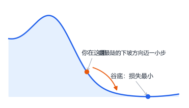
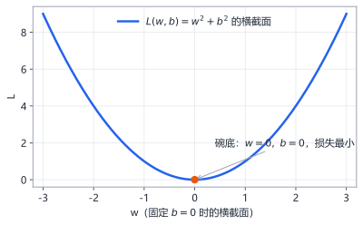
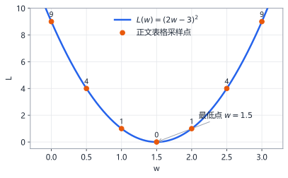
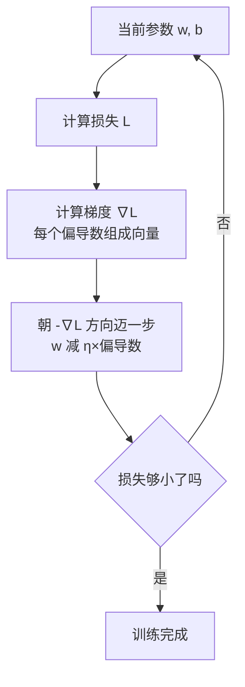
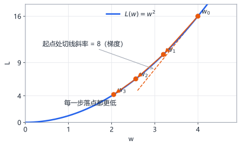
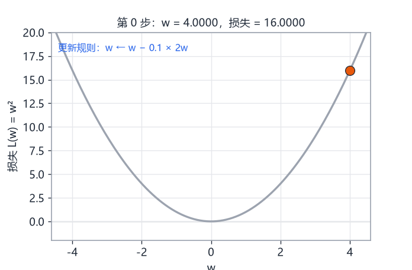
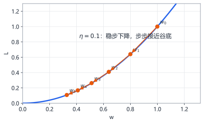
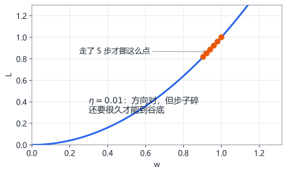
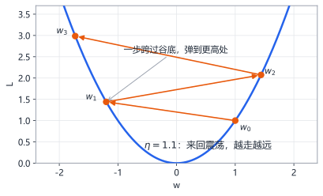

# 第5章 多元函数与梯度下降

> 本章学习目标：
> 1. 能解释多元函数是什么，并说出偏导数"固定其他变量、只看一个变量"的含义
> 2. 会手算两个变量的函数的偏导数
> 3. 理解梯度是把所有偏导数装进一个向量，指向"上升最快的方向"
> 4. 能写出梯度下降更新公式，并手工迭代三步
> 5. 能解释学习率太大和太小各自的后果

## 从一个例子开始

想象你被蒙上眼睛，站在一座山的半山腰。你的任务是走到山谷的最低点，但你看不见任何东西。

你能做的只有一件事：伸出脚，在周围试探哪个方向是下坡。然后朝最陡的下坡方向迈一小步。落地后，再试探，再迈步。只要每一步都朝下坡走，你最终就能走到谷底。



这就是梯度下降（gradient descent）——训练神经网络的发动机，全部原理都藏在这个蒙眼下山的故事里：

- **山的高度**：损失 $L$，预测有多差
- **你站的位置**：当前参数 $w$ 的取值
- **脚下哪个方向下坡**：梯度，由偏导数算出
- **每一步迈多大**：学习率 $\eta$

本章把故事里的每个角色变成精确的数学。

## 多元函数：多个旋钮的机器

第 1 章的函数只有一个输入 $x$。但神经网络里，一个损失往往取决于成百上千个参数。两个参数的写法是：

$$L(w, b) = w^2 + b^2$$

这叫多元函数（multivariable function）——输入不止一个的函数。你可以把它想成一台有两个旋钮 $w$ 和 $b$ 的机器，旋钮怎么调，输出就怎么变。

单个旋钮的函数图像是平面上的一条曲线；两个旋钮的函数图像是一张**曲面**。$L(w, b) = w^2 + b^2$ 画出来是一只碗：



碗底就是损失最小的点。训练的目标，就是找到碗底的坐标。

**一个贴近神经网络的例子。** 回忆全书统一记号 $z = wx + b$。假设你的模型只有一个参数 $w$，用平方误差衡量单条数据的预测好坏：

$$L(w) = (\hat{y} - y)^2 = (wx - y)^2$$

其中 $\hat{y} = wx$ 是预测值，$y$ 是真实值。代入具体数字：$x = 2$，$y = 3$，则：

$$L(w) = (2w - 3)^2$$

把 $w$ 从 0 到 3 扫一遍，画出损失：

| $w$ | 0 | 0.5 | 1 | 1.5 | 2 | 2.5 | 3 |
|---|---|---|---|---|---|---|---|
| $L(w)$ | 9 | 4 | 1 | 0 | 1 | 4 | 9 |



又一只碗。碗底 $w = 1.5$ 正是让 $2w = 3$ 的参数值——最优参数。**训练神经网络，就是在一维、二维甚至亿万维的这类碗状曲面上找碗底。**

## 偏导数：一次只拧一个旋钮

蒙眼下山时你试探的是"往这个方向迈会怎样"。对应到数学：**其他旋钮都按住不动，只拧动其中一个，看输出变化多快。**

这就是偏导数（partial derivative）。记号从 $f'$ 换成弯弯曲曲的 $\partial$（读作"partial"）：

$$\frac{\partial L}{\partial w} \quad\text{读作"L 对 w 的偏导数"}$$

**例 1**：$L(w, b) = w^2 + b^2$。

对 $w$ 求偏导时，把 $b$ 当成普通常数（比如当成 5）。$b^2$ 是常数，导数为 0；$w^2$ 按幂法则得 $2w$：

$$\frac{\partial L}{\partial w} = 2w$$

同理：

$$\frac{\partial L}{\partial b} = 2b$$

**例 2**：$L(w, b) = wb + 2w$。

对 $w$ 求偏导（$b$ 视为常数）：$wb$ 的导数是 $b$（就像 $5w$ 的导数是 5），$2w$ 的导数是 2：

$$\frac{\partial L}{\partial w} = b + 2$$

对 $b$ 求偏导（$w$ 视为常数）：$wb$ 的导数是 $w$，$2w$ 整体是常数导数为 0：

$$\frac{\partial L}{\partial b} = w$$

代入数字验算例 2：在 $w = 3,\ b = 4$ 处，$\partial L/\partial w = 4 + 2 = 6$。含义是：把 $b$ 钉在 4 不动，$w$ 每增加一点点，$L$ 大约增加 6 倍那么多。

**用数值逼近验证一下偏导数。** 对 $L(w, b) = wb + 2w$ 在 $w = 3, b = 4$ 处，用第 1 章的"两点靠近"法：

$$\frac{L(3.0001,\ 4) - L(3,\ 4)}{0.0001} = \frac{(3.0001 \times 4 + 6.0002) - (12 + 6)}{0.0001} = \frac{18.0006 - 18}{0.0001} = 6$$

和公式算出的 6 完全一致。偏导数没有任何神秘之处，它只是普通导数加了一条纪律：**每次只准动一个变量。**

## 梯度：把所有偏导数装进一个向量

把每个旋钮的偏导数都算出来，按顺序装进一个向量，就得到梯度（gradient），记号是倒三角 $\nabla$（读作"nabla"）：

$$\nabla L = \left[\frac{\partial L}{\partial w},\ \frac{\partial L}{\partial b}\right]$$

对例 1 的碗，在点 $w = 2,\ b = 1$ 处：

$$\nabla L = [2 \times 2,\ 2 \times 1] = [4,\ 2]$$

梯度有一个至关重要的几何性质：**它指向函数值上升最快的方向，它的长度表示上升有多快。**

反过来，$-\nabla L$ 就指向下降最快的方向——这就是蒙眼下山时你脚探到的"最陡下坡方向"。



## 梯度下降：一步一景

现在写出完整的更新规则。**梯度下降**：每一步把参数往梯度的反方向挪一点。

$$w_{\text{新}} = w_{\text{旧}} - \eta \times \frac{\partial L}{\partial w}$$

其中 $\eta$（希腊字母 eta，读作"艾塔"）是学习率（learning rate），控制每步迈多大。

完整手工迭代。最小化 $L(w) = w^2$，从 $w_0 = 4$ 出发，学习率 $\eta = 0.1$。偏导数是 $\partial L/\partial w = 2w$。

**第 1 步**：$w_0 = 4$，梯度 $= 2 \times 4 = 8$
$$w_1 = 4 - 0.1 \times 8 = 4 - 0.8 = 3.2$$

**第 2 步**：$w_1 = 3.2$，梯度 $= 2 \times 3.2 = 6.4$
$$w_2 = 3.2 - 0.1 \times 6.4 = 3.2 - 0.64 = 2.56$$

**第 3 步**：$w_2 = 2.56$，梯度 $= 2 \times 2.56 = 5.12$
$$w_3 = 2.56 - 0.1 \times 5.12 = 2.56 - 0.512 = 2.048$$





注意一个美妙的细节：越靠近碗底，梯度越小（4 处梯度是 8，2.048 处只剩约 4.1），步子自动变小。就像下山快到谷底时坡度变缓——**梯度下降自带"刹车"**。

## 双变量完整演算

把流程在两个参数上完整跑一遍。最小化 $L(w, b) = w^2 + b^2$，起点 $w_0 = 2, b_0 = -1$，$\eta = 0.1$。偏导数：$\partial L/\partial w = 2w$，$\partial L/\partial b = 2b$。

**第 1 步**：梯度 $= [2 \times 2,\ 2 \times (-1)] = [4, -2]$

$$w_1 = 2 - 0.1 \times 4 = 1.6, \qquad b_1 = -1 - 0.1 \times (-2) = -0.8$$

损失从 $2^2 + (-1)^2 = 5$ 降到 $1.6^2 + (-0.8)^2 = 2.56 + 0.64 = 3.2$。

**第 2 步**：梯度 $= [3.2, -1.6]$

$$w_2 = 1.6 - 0.32 = 1.28, \qquad b_2 = -0.8 + 0.16 = -0.64$$

损失降到 $1.28^2 + 0.64^2 \approx 1.64 + 0.41 = 2.05$。

两个参数各走各的下坡，但用的是同一个学习率。损失一路下降：$5 \to 3.2 \to 2.05$，直奔碗底 $(0, 0)$。这就是训练的每一次迭代在做的事，只不过真实网络里这一步要算几百万个偏导数——靠的正是第 2 章的矩阵乘法和第 4 章的链式法则。

## 学习率：一步迈多大

学习率 $\eta$ 是整个训练过程里最关键的旋钮。它对结果的影响，用三张对比图看清楚。

**$\eta$ 合适（$\eta = 0.1$）**：稳定下降，步步接近谷底。



**$\eta$ 太小（$\eta = 0.01$）**：方向对，但步子碎，走很多步还离谷底很远。表现为损失下降慢得让人心焦，训练时间白白烧掉。



**$\eta$ 太大（$\eta = 1.1$）**：一步跨过谷底，在对岸更高的位置落地，下一步再跨回来、更高——来回震荡，越走越远，损失不降反升。



用数字验证震荡。$L = w^2$，$w_0 = 1$，$\eta = 1.1$：

- $w_1 = 1 - 1.1 \times 2 = -1.2$（跨过谷底到对岸）
- $w_2 = -1.2 - 1.1 \times (-2.4) = -1.2 + 2.64 = 1.44$（又跨回来，更远了）
- $w_3 = 1.44 - 1.1 \times 2.88 = 1.44 - 3.168 = -1.728$（绝对值越来越大）

发散了。这就是为什么训练神经网络时，调学习率是最常做的事。

把三个学习率的表现放进一张表，结论更直观（$L = w^2$，$w_0 = 1$，各走 10 步）：

| 学习率 | 10 步后的 $\lvert w \rvert$ | 表现 |
|---|---|---|
| 0.01 | 0.817 | 方向对，太慢 |
| 0.1 | 0.107 | 又快又稳 |
| 1.1 | 6.192 | 震荡发散 |

这张表你稍后可以在实验二里亲手复现。

## 损失曲面的直觉

真实网络的损失不是一条曲线，也不是一只碗，而是亿万维空间里的一张崎岖曲面——有谷底、有山脊、有平地。你没法画出亿万维，但道理和二维一样：

- **梯度告诉你此刻脚下哪边是下坡**
- **学习率决定你敢迈多大步**
- **反复迭代，损失总体趋势向下**

为什么还要知道一个诚实的提醒：崎岖曲面有很多"局部谷底"（local minimum），蒙眼下山可能停在一个不是最深的谷里。实践中靠好的初始化（第 3 章的正态分布随机数）、批数据和调学习率来缓解。知道这回事存在就够了，细节属于进阶内容。

## 为什么不能一步算出答案

你可能会问：既然碗底导数为 0，直接解方程 $\partial L/\partial w = 0$ 不就行了？

对本章的玩具问题 $L = w^2$，确实可以：$2w = 0$ 直接解出 $w = 0$。但神经网络不行，原因有两个：

1. **方程解不出来**。真实损失里套着 softmax、激活函数和几十层复合（第 4 章的链式法则），令梯度为 0 得到的方程组没有笔算解
2. **数据是抽样来的**（第 3 章）。损失本身每批都在波动，没有固定的"方程"可解

所以只能用迭代：看一眼脚下，迈一小步，再看一眼。梯度下降不是没办法的办法，它是为"方程无解、数据有噪声"的现实量身定做的办法。

## 收官：把五章装进一个例子

用一个微型训练任务收个尾，看五章知识如何咬合。

任务：用模型 $\hat{y} = wx$ 拟合一条数据 $x = 2, y = 3$，损失用第 3 章见过的平方误差 $L = (wx - y)^2 = (2w - 3)^2$。

- **第 1 章 + 第 4 章**：求导。链式法则：外层平方导数 $2(2w-3)$，内层 $2w - 3$ 导数 2，所以 $\dfrac{dL}{dw} = 4(2w - 3)$
- **第 5 章**：梯度下降。取 $w_0 = 0$，$\eta = 0.1$：
  - $w_1 = 0 - 0.1 \times 4 \times (-3) = 1.2$，损失从 9 降到 0.36
  - $w_2 = 1.2 - 0.1 \times 4 \times (-0.6) = 1.44$，损失降到 0.0144
- **第 2 章**：真实网络里 $w$ 是矩阵，这一步更新是一次矩阵运算
- **第 3 章**：真实数据是一批批抽样的，每次更新用的是一批数据的平均损失

两步就把损失从 9 压到 0.0144，$w$ 逼近最优值 1.5。这个玩具例子和训练真实神经网络的每一步，结构上毫无差别。

最后提一句后续：梯度下降有一系列改进版（带动量的、自适应学习率的等等），它们都在本章这个骨架上加小机关——核心永远是"算梯度、反着走、控制步长"。把它们学透的前提，就是把本章的骨架练熟。

## 动手实验

**实验一：手写梯度下降。** 这段代码最小化 $L(w) = w^2$，复现正文的迭代过程。

```python
eta = 0.1
w = 4.0

for step in range(10):
    grad = 2 * w              # L = w² 的偏导数
    w = w - eta * grad        # 梯度下降更新
    print(f"第{step+1}步: w = {w:.4f}, 损失 = {w*w:.4f}")
```

预期输出：$w$ 从 4 一路下降，10 步后降到 0.43 左右，损失从 16 降到 0.18 附近，并且越降越慢（梯度的自动刹车）。

<details>
<summary>🐘 C 语言对照</summary>

*语言差异：这个算法只有"存两个数、循环十次"，C 版和 Python 版几乎逐行对应——梯度下降的骨架本来就近乎伪代码。*

```c
#include <stdio.h>

int main(void) {
    double eta = 0.1;
    double w = 4.0;

    for (int step = 0; step < 10; step++) {
        double grad = 2 * w;        /* L = w² 的偏导数 */
        w = w - eta * grad;         /* 梯度下降更新 */
        printf("第%d步: w = %.4f, 损失 = %.4f\n", step + 1, w, w * w);
    }
    return 0;
}
```

</details>

**实验二：对比三种学习率。** 这段代码并排跑 $\eta = 0.01$、$0.1$、$1.1$，各 10 步。

```python
def run(eta, steps=10):
    w = 1.0
    history = []
    for _ in range(steps):
        w = w - eta * 2 * w
        history.append(w)
    return history

for eta in [0.01, 0.1, 1.1]:
    hs = run(eta)
    print(f"η={eta:<4} 10步后 w = {hs[-1]:>10.4f}, 损失 = {hs[-1]**2:.4f}")
```

预期输出：$\eta = 0.01$ 时 $w$ 还剩 0.82 左右（太慢）；$\eta = 0.1$ 时 $w \approx 0.107$（稳步下降）；$\eta = 1.1$ 时 $w \approx 6.19$，绝对值反而变大（震荡发散）。三种命运一目了然。

<details>
<summary>🐘 C 语言对照</summary>

*语言差异：Python 函数参数可以带默认值（`steps=10`），C 没有，调用时必须写全；Python 的 `history` 列表记录了全程，但代码只用最后一个值——C 干脆只保存最后一步的 `w`。*

```c
#include <stdio.h>

double run(double eta, int steps) {
    double w = 1.0;
    for (int i = 0; i < steps; i++) {
        w = w - eta * 2 * w;
    }
    return w;                       /* 只需最后一步的结果 */
}

int main(void) {
    double etas[] = {0.01, 0.1, 1.1};
    for (int i = 0; i < 3; i++) {
        double w = run(etas[i], 10);
        printf("η=%-4g 10步后 w = %10.4f, 损失 = %.4f\n", etas[i], w, w * w);
    }
    return 0;
}
```

</details>

**实验三：两个变量的梯度下降。** 这段代码同时更新 $w$ 和 $b$，找到碗 $L = w^2 + b^2$ 的碗底。

```python
w, b = 3.0, -4.0
eta = 0.1

for step in range(15):
    grad_w = 2 * w            # 对 w 的偏导数
    grad_b = 2 * b            # 对 b 的偏导数
    w = w - eta * grad_w
    b = b - eta * grad_b
    if step % 5 == 4:
        loss = w * w + b * b
        print(f"第{step+1:>2}步: w={w:+.3f}, b={b:+.3f}, L={loss:.4f}")
```

预期输出：每 5 步打印一次，$w$ 和 $b$ 都向 0 收缩，损失从 25 降到接近 0。两个旋钮同时朝谷底走。

<details>
<summary>🐘 C 语言对照</summary>

*语言差异：Python 的 `w, b = 3.0, -4.0` 一行赋两个变量，C 要分开写；条件打印的 `if step % 5 == 4` 两种语言完全同构。*

```c
#include <stdio.h>

int main(void) {
    double w = 3.0, b = -4.0;
    double eta = 0.1;

    for (int step = 0; step < 15; step++) {
        double grad_w = 2 * w;      /* 对 w 的偏导数 */
        double grad_b = 2 * b;      /* 对 b 的偏导数 */
        w = w - eta * grad_w;
        b = b - eta * grad_b;
        if (step % 5 == 4) {
            double loss = w * w + b * b;
            printf("第%2d步: w=%+.3f, b=%+.3f, L=%.4f\n",
                   step + 1, w, b, loss);
        }
    }
    return 0;
}
```

</details>

**实验四：不同起点，同一谷底。** 这段代码从四个不同起点出发跑梯度下降，看它们是否都收敛到 0。

```python
def run(w0, eta=0.1, steps=25):
    w = w0
    for _ in range(steps):
        w = w - eta * 2 * w
    return w

for start in [-10, -2, 3, 8]:
    print(f"起点 w={start:>3}  →  25 步后 w = {run(start):.6f}")
```

预期输出：四个起点最终都停在 0.01 附近。只要曲面是一只碗、学习率合适，从哪出发都能到谷底——但记住，真实损失曲面有多个谷，起点可能影响你落进哪一个。

<details>
<summary>🐘 C 语言对照</summary>

*语言差异：又是"函数当零件反复调用"的写法。C 调用时传 `int` 起点，编译器会自动把它转成 `double` 参数——这种"隐式类型转换"方便但也容易藏错，是 C 和 Python 的一大分野。*

```c
#include <stdio.h>

double run(double w0, double eta, int steps) {
    double w = w0;
    for (int i = 0; i < steps; i++) {
        w = w - eta * 2 * w;
    }
    return w;
}

int main(void) {
    int starts[] = {-10, -2, 3, 8};
    for (int i = 0; i < 4; i++) {
        printf("起点 w=%3d  →  25 步后 w = %.6f\n", starts[i],
               run(starts[i], 0.1, 25));
    }
    return 0;
}
```

</details>

## 常见误区

**误区：偏导数和导数是两套不同的数学。**
真相：偏导数就是普通导数加一条纪律——每次只动一个变量，其余全部当常数。你会求 $x^2$ 的导数，就会求 $w^2 + b^2$ 对 $w$ 的偏导数。

**误区：梯度下降一步到位直接算出最优解。**
真相：它是迭代算法，一步只挪一点。简单问题（如线性回归）有公式直接算答案，但神经网络没有，只能靠成千上万次小步走。

**误区：学习率越大训练越快。**
真相：大过了头会震荡发散，损失不降反升。学习率是"在安全范围内尽量大"，不是无限大。

**误区：梯度为 0 的地方一定是全局最低点。**
真相：梯度为 0 还可能是局部谷底、山顶或鞍部（一个方向是谷、另一个方向是脊的"马鞍点"）。梯度为 0 只说明"脚下是平的"，不说明"这是全世界最低"。

## 章末习题

**习题1** 求 $L(w, b) = w^2 + 3b$ 的两个偏导数。

**习题2** 求 $L(w, b) = wb + b^2$ 在 $w = 1, b = 2$ 处的梯度向量。

**习题3** 最小化 $L(w) = w^2$，从 $w_0 = 3$ 出发，$\eta = 0.1$，手工计算前三次更新后的 $w$。

**习题4** 同一个问题，若改用 $\eta = 0.6$，计算前两次更新，并判断这个学习率会收敛还是发散。（提示：每次更新 $w_{\text{新}} = w - 0.6 \times 2w = -0.2w$。）

**习题5（思考题）** 训练一个有两个参数 $w$、$b$ 的模型，你发现损失在第 50 步后几乎不再下降，但离期望的值还很远。列出三种可能的原因，并各给出一个可以尝试的对策。

（提示：从"步子""地形""坡度"三个角度各想一个。）

## 小结与下一部分预告

本章要点：

1. 多元函数有多个输入，偏导数 = 固定其他变量、只看一个变量的变化快慢
2. 梯度 = 所有偏导数组成的向量，指向上升最快方向，反方向就是最陡下坡
3. 梯度下降公式：$w_{\text{新}} = w_{\text{旧}} - \eta \times \partial L/\partial w$
4. 学习率太小收敛慢，太大震荡发散，合适才能又快又稳
5. 越靠近谷底梯度越小，步子自动变小——梯度下降自带刹车

恭喜你，数学预科全部修完。函数、导数、向量、矩阵、概率、指数对数、偏导数、梯度下降——这些就是你理解神经网络所需的全部数学武器。下一部分，我们把武器装起来：从单个神经元开始，亲手写出你人生中的第一个神经网络。
