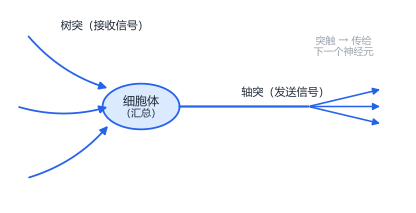
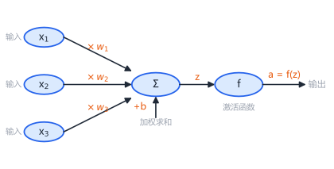
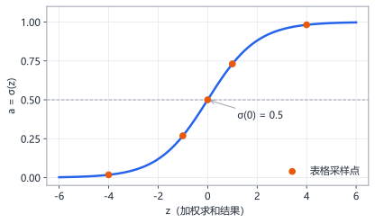
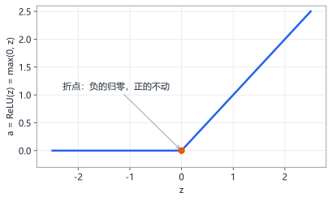

# 第6章 神经元：从生物到人工

> 本章学习目标：
> 1. 能用"评审打分过门槛"的类比，说清一个人工神经元在做什么
> 2. 能手算单个神经元的输出：先加权求和 $z$，再经激活函数得 $a$
> 3. 能解释权重 $w$ 和偏置 $b$ 各自控制什么
> 4. 能用"两层线性等于一层"的道理，说明为什么必须有激活函数

## 从一个例子开始

假设你要做一个决定：要不要买某套房子。你拿不定主意，于是请了三位你信得过的朋友帮你把关：

- 朋友甲是建筑师，主要看**户型结构**
- 朋友乙是房产中介，主要看**价格是否划算**
- 朋友丙是你家人，主要看**通勤是否方便**

三人各自打分（0 到 10 分），但你不会把三个分数简单相加——因为在你心里，三个人的分量不一样。你最信甲的判断，给甲的分数乘以 0.5；乙次之，乘 0.3；丙再次之，乘 0.2。加权之后加总，得到一个总分。

最后一步：你心里有个门槛，比如 6 分。总分超过 6 分，就买；不到 6 分，就放弃。

恭喜，你刚才完成了一次"人工神经元"的完整计算。三个朋友的打分是**输入**，你给的三个系数是**权重**，那道 6 分的门槛和"过线就行动"的转换，对应**偏置**和**激活函数**。这一章就是把这个过程说清楚。

## 生物神经元：灵感来源

神经网络（neural network）的名字不是随便起的，它模仿的是人脑的基本单元——**神经元（neuron）**。

你大脑里大约有 860 亿个神经元，每个神经元的结构可以简化成这样：



它的工作方式惊人地简单：

1. 通过**树突**接收来自上游成千上万个神经元的电信号
2. 在**细胞体**里把这些信号汇总起来
3. 如果汇总后的信号强度超过某个**阈值**，就"放电"，通过**轴突**把信号传给下游神经元；没超过就保持沉默

单个神经元只会做"汇总、比阈值、决定动不动"这一件事。但 860 亿个这样的简单单元连在一起，就产生了你的全部思维。

> 关键启示：**复杂智能可以从海量简单单元的连接中涌现**。人工神经网络走的就是这条路——单个"人工神经元"同样简单到可笑，但成千上万个连起来，就能识别图片、翻译语言。

## 人工神经元：评审打分的数学化

把买房例子的过程写成式子。设三个朋友的打分是 $x_1, x_2, x_3$（输入），你给的三个系数是 $w_1, w_2, w_3$（**权重，weight**）。

第一步，加权求和：

$$z = w_1 x_1 + w_2 x_2 + w_3 x_3 + b$$

这里的 $b$ 叫**偏置（bias）**，它的作用我们马上讲。$z$ 是激活之前的中间结果，记号上全书统一用 $z$ 表示"加权求和的结果"。

第二步，过门槛。把 $z$ 送进一个**激活函数（activation function）**，记作 $f$，得到最终输出：

$$a = f(z)$$

$a$ 就是这个神经元的输出（activation，激活值）。两步合起来，就是人工神经元的全部工作：



回到买房的例子，代入具体数字验算一遍。假设三位朋友打分：户型 8 分、价格 6 分、通勤 9 分，即 $x_1=8, x_2=6, x_3=9$；权重 $w_1=0.5, w_2=0.3, w_3=0.2$；先不看偏置（$b=0$）：

```
z = 0.5×8 + 0.3×6 + 0.2×9 + 0
  = 4.0   + 1.8   + 1.8
  = 7.6
```

总分 7.6，超过门槛 6 分——决定"买"。一个神经元，就是这么点事。

> 用你自己的话复述一遍：**神经元 = 加权求和 + 过门槛**。

## 权重和偏置：各管一件事

### 权重 $w$：这个输入有多重要

权重衡量的是"信任程度"。上面例子里，$w_1=0.5$ 最大，说明户型（$x_1$）对你影响最大：户型分每变化 1 分，总分 $z$ 就变化 0.5 分；而通勤分每变化 1 分，$z$ 只变化 0.2 分。

权重也可以是负数。假如$w_2 = -0.4$，表示价格分越高，总分反而越低——比如这个"价格分"其实是"溢价程度"，溢价越高你越不想买。负权重 = 抑制作用，这在生物神经元里也真实存在（抑制性突触）。

### 偏置 $b$：门槛的高低

现在看偏置。没有偏置时，"$z$ 超过 6 分才行动"这个门槛要靠激活函数内部写死。有了偏置，公式变成 $z = \text{加权和} + b$：

- $b = +2$：总分凭空加 2，门槛更容易跨过——神经元"天生乐观"，容易被激活
- $b = -2$：总分先扣 2，门槛更难跨过——神经元"天生谨慎"，不容易被激活

直觉：**偏置把激活门槛整体上移或下移**，让神经元能表达自己的"倾向性"，而不仅仅是被动响应输入。

### 数值对比：同一个神经元，三种参数

固定输入 $x_1=8, x_2=6$，看参数改变带来什么（加权求和部分，暂不过门槛）：

| 方案 | 权重 | 偏置 | 计算 | $z$ |
|---|---|---|---|---|
| A | $w_1=0.5, w_2=0.3$ | $b=0$ | $0.5×8+0.3×6+0$ | $5.8$ |
| B | $w_1=0.5, w_2=-0.3$ | $b=0$ | $0.5×8+(-0.3)×6+0$ | $2.2$ |
| C | $w_1=0.5, w_2=0.3$ | $b=-3$ | $0.5×8+0.3×6+(-3)$ | $2.8$ |

同样的输入，方案 B 把第二个输入从"加分项"变成"减分项"，方案 C 把门槛提高了 3 分。**权重决定"听谁的"，偏置决定"多难被说服"**。训练神经网络，本质上就是在调整这两组数字——这是后面几章的主题。

## 激活函数：给神经元一个"非线性的脾气"

### 先看最常用的一个：sigmoid

如果激活函数什么都不做（$a = z$，原样输出），那么 $z=7.6$ 就输出 7.6，$z=100$ 就输出 100。但很多场景下，我们想要的是"一个程度"或"一个概率"，最好在 0 到 1 之间。

**sigmoid 函数**就是干这个的：

$$\sigma(z) = \frac{1}{1 + e^{-z}}$$

符号说明：$e$ 是自然常数（约 2.718），$e^{-z}$ 表示 $e$ 的 $-z$ 次方。不用怕这个式子，它的形状才是重点：



sigmoid 的三个特点，看算几个点就明白：

| $z$ | $e^{-z}$ | $\sigma(z) = 1/(1+e^{-z})$ |
|---|---|---|
| $-4$ | $54.60$ | $1/55.60 \approx 0.018$ |
| $-1$ | $2.72$ | $1/3.72 \approx 0.269$ |
| $0$ | $1.00$ | $1/2 = 0.500$ |
| $1$ | $0.37$ | $1/1.37 \approx 0.731$ |
| $4$ | $0.018$ | $1/1.018 \approx 0.982$ |

无论 $z$ 是 $-100$ 还是 $+100$，输出永远被压进 $(0, 1)$ 区间，而且 $z$ 越大输出越接近 1。这正好可以解释成"信心程度"：买房总分 $z=7.6$ 经过 sigmoid 得到约 0.9995，意思是"几乎确定买"；$z = -1$ 得到 0.269，"多半不买"。

### 常见激活函数一览

| 名称 | 公式 | 输出范围 | 直觉 |
|---|---|---|---|
| sigmoid | $1/(1+e^{-z})$ | $(0, 1)$ | 压成"概率/信心" |
| tanh | $\tanh(z)$ | $(-1, 1)$ | 同上，但有正有负 |
| ReLU | $\max(0, z)$ | $[0, +\infty)$ | 负数直接关掉，正数原样放行 |

ReLU（Rectified Linear Unit，修正线性单元）是现在隐藏层里最常用的，它简单到一句话：**负的归零，正的不动**。它的形状是一条折线：



代几个数验证：$z=-2$ 输出 $0$；$z=-0.5$ 输出 $0$；$z=0.3$ 输出 $0.3$；$z=2$ 输出 $2$。没有指数、没有除法，一次比较就完事——这是它计算快的原因。为什么这么简单反而好用，后面章节会体会到。本章和第 7、8 章先用 sigmoid，因为它形状平滑、输出像概率，最适合建立直觉。

### 三个激活函数怎么选

刚开始你只需要记住一个粗糙的分工：

- **隐藏层**：默认 ReLU（第 9 章的 sin 实验会用 tanh，原因到时讲）
- **输出层**：看任务。要"概率"用 sigmoid；要"任意数值"（房价、温度）就什么激活都不用，直接输出 $z$——这叫线性输出（linear）

输出层的选择在第 7 章的思考题和第 9 章的实验里都会用到，到时再回头看这句话。

### 为什么非要激活函数不可

这是本章最重要的一节。做个思想实验：把激活函数全部去掉，神经元只剩 $z = wx + b$（纯线性），然后堆两层，看看会发生什么。

第一层：$z_1 = 3x + 1$

第二层：$z_2 = 2z_1 - 4$

把第一层代入第二层：

$$z_2 = 2(3x + 1) - 4 = 6x + 2 - 4 = 6x - 2$$

看出问题了吗？**两层"神经网络"，效果完全等价于一层** $z = 6x - 2$。你堆一百层也一样——线性变换套线性变换，结果永远还是线性变换，可以合并成一步。

打个比方：线性变换就像复印机，放大、缩小、平移，但印出来的永远是直线变直线。你把一张直线图复印一百次，它还是直线。而真实世界的问题——sin 曲线、XOR 逻辑、图片里猫的形状——全是"弯的"。

激活函数就是那个"掰弯"的步骤。sigmoid 是弯的（S 形），ReLU 有一个折点。每过一次激活函数，数据就被"掰弯"一次。一层一层掰下去，网络才有本事拟合任意复杂的弯曲形状。

> 记住这句话：**没有激活函数，多层等于一层；有了它，深度才有意义。**

### 生物与人工：一张对照表

| 生物神经元 | 人工神经元 |
|---|---|
| 树突接收上游信号 | 输入 $x_1, x_2, \dots$ |
| 突触连接的强弱 | 权重 $w$（可正可负） |
| 细胞体汇总信号 | 加权求和 $z = \sum w_i x_i + b$ |
| 放电阈值 | 偏置 $b$ 设定的门槛 |
| 是否放电 | 激活函数输出 $a = f(z)$ |
| 轴突传给下游 | $a$ 成为下一层神经元的输入 |

### 权重初始化：为什么不能全是同一个数

动手实验之前，先回答一个自然会冒出来的问题：这些 $w$ 和 $b$ 一开始取什么值？

答案是：**权重随机撒，偏置设为零**。为什么不能全设成同一个值，比如全设成 0？想象一层里有 4 个神经元，如果它们权重完全相同，那么收到同样的输入、算出同样的输出、训练中收到同样的反馈、做同样的调整——四个神经元永远步调一致，**一万个神经元等于一个神经元**。随机初始化就是故意让它们"出生时就各不相同"，各自去探索不同的分工。

这个直觉到第 9 章写训练代码时会变成一行真实的代码，到时再细看。

## 动手实验：用 Python 捏一个神经元

下面这段代码用纯 Python 实现一个人工神经元：三个输入、三个权重、一个偏置，激活函数用 sigmoid。它做两件事：先让计算机算一遍，再打印出中间结果，方便你和手算对账。

```python
import math


def sigmoid(z):
    return 1.0 / (1.0 + math.exp(-z))


def neuron(inputs, weights, bias):
    z = 0.0
    for x, w in zip(inputs, weights):
        z += w * x          # 逐个累加 w*x
    z += bias               # 别忘了偏置
    return z, sigmoid(z)    # 返回激活前后的两个值


# 买房例子：户型8分、价格6分、通勤9分
inputs = [8.0, 6.0, 9.0]
weights = [0.5, 0.3, 0.2]
bias = 0.0

z, a = neuron(inputs, weights, bias)
print(f"加权求和 z = {z:.4f}")
print(f"激活输出 a = {a:.4f}")

# 把偏置调成 -3，看看信心掉多少
z2, a2 = neuron(inputs, weights, -3.0)
print(f"偏置-3时：z = {z2:.4f}, a = {a2:.4f}")
```

**预期输出**：

```
加权求和 z = 7.6000
激活输出 a = 0.9995
偏置-3时：z = 4.6000, a = 0.9900
```

对账：$z=7.6$ 和我们在正文里手算的一模一样。$\sigma(7.6) = 1/(1+e^{-7.6})$，其中 $e^{-7.6} \approx 0.0005$，所以输出约 $0.9995$——几乎满格的信心。把偏置降到 $-3$ 后，$z$ 变成 $4.6$，信心降到 $0.99$，仍然想买，但没那么笃定了。

**动手任务**：

1. 把权重改成 `[0.5, -0.3, 0.2]`（价格变成减分项），重跑，观察 $a$ 的变化
2. 调整 `bias`，找一找：$b$ 等于多少时，输出 $a$ 恰好掉到 0.5 以下（即"不买了"）？（提示：$a < 0.5$ 当且仅当 $z < 0$）

## 常见误区

**误区：人工神经元就是在模拟大脑，所以神经网络能"思考"。**
真相：人工神经元只借用了"汇总-阈值-输出"这一个灵感，真实生物神经元的复杂度（脉冲时序、化学递质、可塑性）远超这个模型。神经网络是**受生物启发的数学函数**，跟"意识""思考"没有关系。

**误区：权重越大的输入越"好"。**
真相：权重大只表示这个输入**影响大**，不代表它对输出起正面作用。权重是负的，输入越大输出反而越小。读权重时要看绝对值（影响力）和符号（促进还是抑制）。

**误区：激活函数是为了把输出压缩到 0~1，方便显示。**
真相：压缩区间只是 sigmoid 的附带效果。激活函数存在的根本理由是**引入非线性**——没有它，无论多少层都等价于一层，网络永远学不会弯曲的规律。

## 章末习题

1. 手算：输入 $x_1=4, x_2=10$，权重 $w_1=0.4, w_2=-0.2$，偏置 $b=1$。求 $z$，再查本章的 sigmoid 表格估算 $a$ 的大致范围（不用算精确值，说出介于哪两个表值之间即可）。
2. 一个神经元有 5 个输入。它一共有多少个可调参数（权重加偏置）？
3. 用"评审打分"类比解释：为什么偏置 $b$ 很大（比如 $+100$）时，输入几乎影响不了输出？
4. 验证"两层线性等于一层"：第一层 $z_1 = -2x + 5$，第二层 $z_2 = 0.5 z_1 + 3$。把它合并成一层 $z = wx + b$ 的形式，$w$ 和 $b$ 各是多少？
5. （思考题）ReLU 在 $z=0$ 处有一个"折点"，不可导。第 1 章说过，训练要靠导数。你觉得工程师们是怎么绕过这个问题的？猜一猜即可，后续章节会揭晓。

## 小结与下一章预告

本章要点：

- 人工神经元模仿生物神经元"汇总-阈值-输出"的工作方式
- 计算只有两步：加权求和 $z = w_1x_1 + \cdots + b$，再过激活函数 $a = f(z)$
- 权重决定"每个输入的话语权"，偏置决定"门槛的高低"
- 没有激活函数，多层网络等价于单层，深度失去意义

一个神经元能做决策，但只有一个神经元的"大脑"太简陋了。下一章我们把几个神经元连成一个小小的网络，拿起笔，把数据从输入一路算到输出——**你将亲手完成一次完整的前向传播**。
