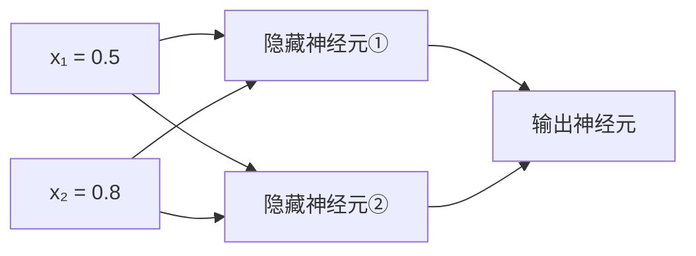

# 第7章 前向传播：手算一遍

> 本章学习目标：
> 1. 能说清"前向传播"每一步在做什么：数据从输入层流向输出层
> 2. 能拿着笔，把一个 2-2-1 网络的输出从头到尾算出来
> 3. 能把同一计算改写成矩阵乘法，体会两种视角的等价
> 4. 能用 Python 复现手算结果，逐位对账

## 从一个例子开始

你去银行申请贷款。柜员收了你的材料（收入、负债），但她不做决定——材料被送到风控部门。风控部门有两位审核员：

- 审核员 A 擅长看"偿债能力"，把收入和负债按自己的权重汇总成一个分数
- 审核员 B 擅长看"风险水平"，用另一套权重汇总出另一个分数

最后，部门主管拿到 A 和 B 的两个分数，再按自己的偏好加权汇总，给出最终结论：批还是不批。

数据只往一个方向流：你 → 审核员 → 主管，没有任何一环回头看。这个"数据单向流过整个网络"的过程，就叫**前向传播（forward propagation）**。

第 6 章你学会了算一个神经元。本章只做一件事：把三个神经元连成一个小网络，然后拿起笔，把一个具体输入从入口一路算到出口。算完这一遍，你对神经网络的"黑盒感"会消失一大半。

## 本章的网络：2-2-1

我们的网络有三层：2 个输入、2 个隐藏神经元、1 个输出神经元，简称 **2-2-1 结构**。



每条连线上挂着一个权重，每个隐藏/输出神经元带着一个偏置。全部参数如下，**一共 9 个数**：

| 参数 | 数值 | 含义 |
|---|---|---|
| $w_{11}$ | $0.4$ | $x_1$ → 隐藏①的权重 |
| $w_{12}$ | $0.9$ | $x_2$ → 隐藏①的权重 |
| $b_1$ | $0.1$ | 隐藏①的偏置 |
| $w_{21}$ | $-0.3$ | $x_1$ → 隐藏②的权重 |
| $w_{22}$ | $0.6$ | $x_2$ → 隐藏②的权重 |
| $b_2$ | $-0.2$ | 隐藏②的偏置 |
| $v_1$ | $0.7$ | 隐藏① → 输出的权重 |
| $v_2$ | $-0.5$ | 隐藏② → 输出的权重 |
| $b_3$ | $0.2$ | 输出层的偏置 |

记号说明：$w_{ij}$ 的下标读作"第 $j$ 个输入，连到隐藏层第 $i$ 个神经元"。为了和全书记号一致，输出层权重复用 $v$ 只是本章为区分两层而用的临时写法，它本质上也是 $w$。所有神经元的激活函数都用 sigmoid（第 6 章讲过，$\sigma(z) = 1/(1+e^{-z})$，把任意数压进 0 到 1）。

输入取 $x_1 = 0.5,\ x_2 = 0.8$。目标：算出最终输出 $\hat{y}$。

## 手算第一步：隐藏神经元①

回忆第 6 章的两步：先 $z$，再 $a = \sigma(z)$。

$$z_1 = w_{11} x_1 + w_{12} x_2 + b_1 = 0.4 \times 0.5 + 0.9 \times 0.8 + 0.1$$

逐个乘法写出来：

```
0.4 × 0.5 = 0.20
0.9 × 0.8 = 0.72
z1 = 0.20 + 0.72 + 0.1 = 1.02
```

再过 sigmoid。$e^{-1.02} \approx 0.3606$（用计算器按 $e^x$ 键，输入 $-1.02$），所以：

$$a_1 = \sigma(1.02) = \frac{1}{1 + 0.3606} = \frac{1}{1.3606} \approx 0.7350$$

隐藏神经元①的输出是 **0.7350**。这个数接下来要当"输入"用。

## 手算第二步：隐藏神经元②

完全同样的套路，只是参数换成②的那一套：

$$z_2 = w_{21} x_1 + w_{22} x_2 + b_2 = (-0.3) \times 0.5 + 0.6 \times 0.8 + (-0.2)$$

```
(-0.3) × 0.5 = -0.15
   0.6 × 0.8 =  0.48
z2 = -0.15 + 0.48 - 0.2 = 0.13
```

$e^{-0.13} \approx 0.8781$，所以：

$$a_2 = \sigma(0.13) = \frac{1}{1 + 0.8781} = \frac{1}{1.8781} \approx 0.5325$$

隐藏神经元②的输出是 **0.5325**。

注意：①和②吃的是**完全相同的输入**，却因为权重和偏置不同，给出了不同的输出（0.7350 vs 0.5325）。这正是上一章说的——权重决定了每个神经元"关心什么"。

## 手算第三步：输出神经元

现在输出神经元的输入不再是原始的 $x$，而是隐藏层的两个输出 $a_1 = 0.7350$、$a_2 = 0.5325$：

$$z_3 = v_1 a_1 + v_2 a_2 + b_3 = 0.7 \times 0.7350 + (-0.5) \times 0.5325 + 0.2$$

```
   0.7 × 0.7350 =  0.5145
(-0.5) × 0.5325 = -0.2663
z3 = 0.5145 - 0.2663 + 0.2 = 0.4482
```

最后过一次 sigmoid。$e^{-0.4482} \approx 0.6388$：

$$\hat{y} = a_3 = \sigma(0.4482) = \frac{1}{1 + 0.6388} = \frac{1}{1.6388} \approx 0.6102$$

**完成。输入 $(0.5, 0.8)$ 经过这个 2-2-1 网络，输出 $\hat{y} \approx 0.6102$。**

回顾一下整条流水线：

```
(0.5, 0.8) ──→ [z1=1.02] ──σ──→ a1=0.7350 ──┐
                                              ├──→ [z3=0.4482] ──σ──→ 0.6102
(0.5, 0.8) ──→ [z2=0.13] ──σ──→ a2=0.5325 ──┘
```

每个神经元做的都是同一件事：加权求和、过 sigmoid。所谓前向传播，就是把这件事按层重复三遍。没有魔法，只有算术。

### 手算的意义

你可能会嘀咕：有计算机，为什么还要手算？

三个理由。第一，**祛魅**。亲手算过一遍之后，"神经网络"这四个字对你来说不再是黑盒，而是一组你算过的乘法和加法。第二，**排错能力**。将来自己写网络代码、输出明显不对时，能挑一个最小网络手算对账，是最快的定位手段。第三，**面试常考**。手推一遍前向传播，是这个领域面试里的高频题。

所以这一遍手算不是仪式，是投资。

## 换个视角：矩阵乘法

上面的算法一个神经元一个神经元地算，清楚但啰嗦。还记得第 2 章的矩阵乘法吗——"行乘列，对应相乘再相加"。其实**一整层的计算可以写成一次矩阵乘法**。

把隐藏层的 4 个权重排成矩阵 $W^{(1)}$，输入排成列向量 $\mathbf{x}$，偏置排成 $\mathbf{b}^{(1)}$：

$$W^{(1)} = \begin{bmatrix} 0.4 & 0.9 \\ -0.3 & 0.6 \end{bmatrix}, \quad \mathbf{x} = \begin{bmatrix} 0.5 \\ 0.8 \end{bmatrix}, \quad \mathbf{b}^{(1)} = \begin{bmatrix} 0.1 \\ -0.2 \end{bmatrix}$$

则隐藏层的加权求和是：

$$\mathbf{z}^{(1)} = W^{(1)} \mathbf{x} + \mathbf{b}^{(1)}$$

按第 2 章"行 × 列"的规则展开：

$$\begin{bmatrix} 0.4 & 0.9 \\ -0.3 & 0.6 \end{bmatrix} \begin{bmatrix} 0.5 \\ 0.8 \end{bmatrix} = \begin{bmatrix} 0.4\times0.5 + 0.9\times0.8 \\ (-0.3)\times0.5 + 0.6\times0.8 \end{bmatrix} = \begin{bmatrix} 0.92 \\ 0.33 \end{bmatrix}$$

加偏置：

$$\mathbf{z}^{(1)} = \begin{bmatrix} 0.92 + 0.1 \\ 0.33 + (-0.2) \end{bmatrix} = \begin{bmatrix} 1.02 \\ 0.13 \end{bmatrix}$$

对照前面手算的 $z_1 = 1.02$、$z_2 = 0.13$——**一模一样**。矩阵的第一行，就是隐藏①的全部权重；第二行，就是隐藏②的全部权重。一次矩阵乘法，算出了整层所有神经元的 $z$。

再对向量的每个分量分别过 sigmoid（记作 $\sigma$ 作用于整个向量），得到 $\mathbf{a}^{(1)} = [0.7350,\ 0.5325]^T$。输出层同理：

$$\mathbf{z}^{(2)} = W^{(2)} \mathbf{a}^{(1)} + b_3 = \begin{bmatrix} 0.7 & -0.5 \end{bmatrix} \begin{bmatrix} 0.7350 \\ 0.5325 \end{bmatrix} + 0.2 = 0.4482$$

所以整个前向传播，用矩阵语言只有两行：

$$\mathbf{a}^{(1)} = \sigma\left(W^{(1)} \mathbf{x} + \mathbf{b}^{(1)}\right), \qquad \hat{y} = \sigma\left(W^{(2)} \mathbf{a}^{(1)} + b_3\right)$$

### 矩阵的形状由谁决定

有一个规律值得停下来看一眼：**每个矩阵的形状，被它前后两层的宽度完全锁死**。

| 对象 | 形状 | 为什么是这个形状 |
|---|---|---|
| $W^{(1)}$ | $2 \times 2$ | 隐藏层 2 个神经元 × 输入层 2 个输入 |
| $\mathbf{b}^{(1)}$ | $2$ | 隐藏层每个神经元 1 个偏置 |
| $W^{(2)}$ | $1 \times 2$ | 输出层 1 个神经元 × 隐藏层 2 个输出 |
| $b_3$ | $1$ | 输出层 1 个神经元 |

一般规律：连接"前层 $m$ 个神经元 → 后层 $n$ 个神经元"的权重矩阵是 $n \times m$——$n$ 行 $m$ 列，第 $i$ 行是后层第 $i$ 个神经元的全部权重。偏置永远是 $n$ 个。第 2 章学过矩阵乘法要求"左矩阵的列数等于右矩阵的行数"，这个规律恰好保证了 $W^{(l)} \mathbf{a}^{(l-1)}$ 永远合法：$n \times m$ 的矩阵乘 $m$ 维向量，得到 $n$ 维向量。

记住"行 = 后层宽度，列 = 前层宽度"，你以后看到任何网络的参数表都能心算出矩阵形状。

### 两种视角是同一件事

两种视角是同一件事的两种记法：

```
逐神经元视角（本章前半）        矩阵视角（工程实现的写法）
─────────────────────────      ─────────────────────────
z1 = w11·x1 + w12·x2 + b1      ┌ z1 ┐   ┌ w11 w12 ┐ ┌ x1 ┐   ┌ b1 ┐
                         <==>  │    │ = │         │·│    │ + │    │
z2 = w21·x1 + w22·x2 + b2      └ z2 ┘   └ w21 w22 ┘ └ x2 ┘   └ b2 ┘
```

为什么工程代码全用矩阵写法？因为矩阵乘法正是计算机最擅长的事——现代 GPU 一次能并行算几千个"行乘列"。你将来看到的所有神经网络框架，底层都是这个大公式的各种变体。

## 再深一点：模式不会变

你可能想问：如果网络不是 2-2-1，而是 2-3-2-1、甚至几十层呢？会不会有新的算法？

不会。前向传播从三层到一百层，**模式完全不变**：每一层都重复同一个动作——

$$a^{(l)} = f\left( W^{(l)} a^{(l-1)} + b^{(l)} \right)$$

上标 $(l)$ 表示第 $l$ 层。上一层的输出 $a^{(l-1)}$ 就是本层的输入，乘权重矩阵、加偏置、过激活函数，得到本层输出，再传给下一层。如此循环到输出层为止：

```
x → [W⁽¹⁾, b⁽¹⁾, f] → a⁽¹⁾ → [W⁽²⁾, b⁽²⁾, f] → a⁽²⁾ → … → [W⁽ᴸ⁾, b⁽ᴸ⁾, f] → ŷ
     第1层              第2层                        第L层
```

变的只有两件事：**层数变多**（多循环几圈）和**每层变宽**（矩阵的行列变大）。参数总量会涨得很快——本章 2-2-1 网络只有 9 个参数，一个 784-128-64-10 的手写数字识别网络就有约 11 万个。但每个参数参与的计算，和你手算过的 $0.4 \times 0.5$ 没有任何区别。

所以真正的分水岭不是"三层和一百层"，而是你已经跨过的这道坎：**从"一个神经元"到"层与层首尾相接"**。一旦理解 $a^{(l)}$ 是下一层的输入，多深的网络都只是重复。

## 动手实验：让 Python 替你验算

下面这段代码把上面的手算原样翻译成 Python：先逐个神经元算（对应前半章），再用矩阵写法算（对应后半章），最后打印两边结果，应该完全一致。

```python
import math


def sigmoid(z):
    return 1.0 / (1.0 + math.exp(-z))


# ---- 写法一：逐神经元手算的翻译 ----
x1, x2 = 0.5, 0.8

z1 = 0.4 * x1 + 0.9 * x2 + 0.1      # 隐藏①的加权求和
a1 = sigmoid(z1)
z2 = -0.3 * x1 + 0.6 * x2 - 0.2     # 隐藏②的加权求和
a2 = sigmoid(z2)
z3 = 0.7 * a1 - 0.5 * a2 + 0.2      # 输出层的加权求和
y_hat = sigmoid(z3)

print(f"写法一: a1={a1:.4f}  a2={a2:.4f}  y_hat={y_hat:.4f}")


# ---- 写法二：矩阵乘法（用列表模拟） ----
def matvec(W, x):
    # 矩阵乘向量：每一行与 x 做"对应相乘再相加"
    return [sum(w * xi for w, xi in zip(row, x)) for row in W]


W1 = [[0.4, 0.9], [-0.3, 0.6]]
b1 = [0.1, -0.2]
W2 = [[0.7, -0.5]]
b2 = [0.2]

x = [0.5, 0.8]
z_hidden = [z + b for z, b in zip(matvec(W1, x), b1)]
a_hidden = [sigmoid(z) for z in z_hidden]
z_out = [z + b for z, b in zip(matvec(W2, a_hidden), b2)]
y_hat2 = sigmoid(z_out[0])

print(f"写法二: a1={a_hidden[0]:.4f}  a2={a_hidden[1]:.4f}  y_hat={y_hat2:.4f}")
```

**预期输出**：

```
写法一: a1=0.7350  a2=0.5325  y_hat=0.6102
写法二: a1=0.7350  a2=0.5325  y_hat=0.6102
```

两种写法的结果逐位相同，也和你的手算一致——三个 0.6102 互相印证。以后每当你对"网络内部发生了什么"感到模糊，就回到这个实验：它只有 9 个参数、3 次 sigmoid，全部透明。

**动手任务**：

1. 把输入改成 `x1, x2 = 1.0, 0.0`，先**用笔**按正文三步算一遍，再运行代码对答案
2. 把隐藏①的偏置从 0.1 改成 -2.0，预测输出会变大还是变小？先下结论，再跑代码验证
3. 把 `W1` 的两行**交换**（变成 `[[-0.3, 0.6], [0.4, 0.9]]`，`b1` 也对应交换），运行看最终输出变不变。想想为什么

## 常见误区

**误区：输入层是"一层神经元"，也要算加权和。**
真相：输入层不做任何计算，它只是原始数据的"摆放架"。所以 2-2-1 网络里需要算的只有隐藏层和输出层，统计层数时通常说"两层网络"（输入层不计入）。

**误区：每个神经元的算法各不相同，网络才强大。**
真相：恰恰相反，所有神经元的算法**完全一样**（加权求和 + 激活），网络的多样性全部来自参数数值的不同。改的是数，不是公式。

**误区：手算时可以把几层的加权和攒在一起，最后统一过激活函数。**
真相：绝对不行。$a_1, a_2$ 必须先各自过 sigmoid，才能作为输出层的输入。激活函数隔在层与层之间，这正是"非线性"注入的位置——攒到最后一起过，就退化成了"两层线性等于一层"。

**误区：输出 0.6102 就表示"61.02% 的概率"，可以直接当概率用。**
真相：sigmoid 的输出只是**长得像概率**（落在 0 到 1 之间），但它是否真等于现实意义上的概率，取决于网络是否经过良好训练。随手赋值的一组权重算出的 0.6102，什么概率含义都没有。

## 章末习题

1. 用本章网络的参数，手算输入 $(x_1, x_2) = (1.0, 0.0)$ 的输出 $\hat{y}$，精确到小数点后 4 位。（提示：$x_2=0$ 会让很多项消失，计算量比正文的例子还小。sigmoid 参考值：$\sigma(0.5)\approx0.6225$，$\sigma(-0.5)\approx0.3775$）
2. 保持输入 $(0.5, 0.8)$ 不变，只把输出层偏置 $b_3$ 从 0.2 改成 0.7，输出 $\hat{y}$ 是变大还是变小？算出新的 $\hat{y}$。
3. 数参数：一个 3-4-2 结构的网络（3 输入、4 隐藏、2 输出），一共有多少个权重、多少个偏置？
4. 把输出层的矩阵写法 $W^{(2)} \mathbf{a}^{(1)} + b_3$ 展开成逐分量形式，验证它和"手算第三步"是同一个式子。
5. （思考题）本章网络的输出在 0 到 1 之间（因为 sigmoid）。如果任务要求输出"房价"，可能是几十万的数值，你会改动网络的哪一处来实现？不用写公式，说出思路。

## 小结与下一章预告

本章要点：

- 前向传播 = 数据从输入层单向流到输出层，每层做"加权求和 + 激活"
- 2-2-1 网络共 9 个参数，输入 $(0.5, 0.8)$ 的输出是 $0.6102$——你亲手算出来的
- 逐神经元算法与矩阵乘法 $W\mathbf{x}+\mathbf{b}$ 完全等价，后者是工程实现的形态
- 输入层不做计算；激活函数必须在层与层之间逐个施加
- 权重矩阵形状规律：行 = 后层宽度，列 = 前层宽度

现在网络能给出一个输出了：0.6102。可这个数是好是坏？和正确答案差多少？下一章我们给"错误"本身打一个分——这个分数，就是驱动整个训练的**损失函数**。
