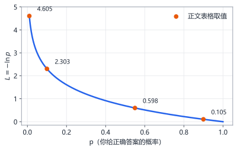
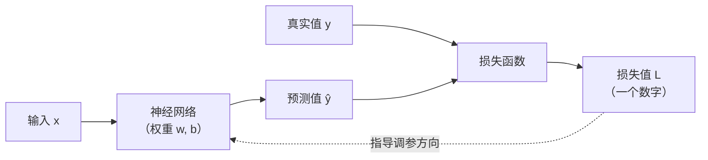
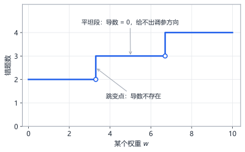
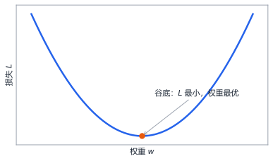

# 第8章 损失函数：给错误打分

> 本章学习目标：
> 1. 能说清损失函数在训练中的角色：把"预测得差"翻译成一个数字
> 2. 能手算 MSE（均方误差），并解释为什么要平方
> 3. 能用"自信程度"的直觉理解交叉熵，知道它用于分类问题
> 4. 能解释为什么不能直接用"答错的个数"来训练网络

## 从一个例子开始

你在练射箭。射完一轮，教练怎么评价你？

他不会只说"脱靶了"或者"中了"。他会说：**"偏左 5 厘米""偏右上 2 厘米""正中靶心"**。差别在哪？"脱靶"只有对错，而"偏左 5 厘米"给出了**差距的大小和方向**——你知道下一箭该往哪边调、调多少。

训练神经网络也是同样的问题。第 7 章的网络输出了 $\hat{y} = 0.6102$，如果正确答案是 $y = 1.0$，网络"错"了。但光知道"错"没用，你需要一个数字告诉网络：**错得有多离谱**。这个数字就是**损失（loss）**，计算它的函数叫**损失函数（loss function）**，全书记作 $L$。

损失函数是训练的"裁判"：它每打一个分，网络就知道该往哪个方向调整参数。本章认识两位最常用的裁判：管回归的 MSE，和管分类的交叉熵。

## MSE：给回归问题打分

### 定义

回归问题的输出是连续数值（房价、温度、sin 值）。最常用的损失函数是**均方误差（mean squared error，MSE）**：

$$L = \frac{1}{n} \sum_{i=1}^{n} \left( \hat{y}_i - y_i \right)^2$$

逐符号解释：

- $y_i$：第 $i$ 个样本的**真实值**（标准答案）
- $\hat{y}_i$：网络对第 $i$ 个样本的**预测值**
- $\hat{y}_i - y_i$：第 $i$ 个样本的**误差**（预测减真实）
- $(\cdots)^2$：把误差**平方**
- $\sum_{i=1}^{n}$：把 $n$ 个样本的平方误差**加总**
- $\frac{1}{n}$：除以样本数，取**平均**

一句话：**每个样本的误差平方后取平均**。名字"均方误差"就是"平均的平方误差"的缩写。

### 完整数值演算

假设有 3 个样本，网络预测和真实值如下。跟着表格一步步算：

| 样本 | 预测 $\hat{y}$ | 真实 $y$ | 误差 $\hat{y}-y$ | 误差平方 |
|---|---|---|---|---|
| 1 | $0.8$ | $1.0$ | $-0.2$ | $0.04$ |
| 2 | $0.5$ | $0.0$ | $+0.5$ | $0.25$ |
| 3 | $0.9$ | $1.0$ | $-0.1$ | $0.01$ |

$$L = \frac{1}{3} \times (0.04 + 0.25 + 0.01) = \frac{1}{3} \times 0.30 = 0.10$$

MSE 是 0.10。这个数字单独看没意义，它的价值在于**比较**：如果调完参数后再算一遍变成 0.03，说明网络变准了；变成 0.40，说明越调越糟。训练的目标就一句话——**让 $L$ 尽可能小**。

### 为什么要平方

两个原因，一个比一个关键。

**原因一：去掉正负号。** 样本 1 的误差是 $-0.2$，样本 2 是 $+0.5$。如果不平方直接相加，$-0.2 + 0.5 = +0.3$，正负误差互相抵消，明明两个都错了，加总起来却显得错得不多。平方后都是正数，谁也赖不掉。

**原因二：重罚大错误。** 看这组对比：

| 误差 | 平方后 | 惩罚放大 |
|---|---|---|
| $0.1$ | $0.01$ | — |
| $0.5$ | $0.25$ | 误差 5 倍，惩罚 25 倍 |
| $1.0$ | $1.00$ | 误差 10 倍，惩罚 100 倍 |

误差越大，平方后涨得越凶。这让网络在训练时**优先消灭大错误**，就像教练会先纠正你"脱靶一米"的问题，而不是纠结"偏离靶心一毫米"。

那用绝对值 $|\hat{y}-y|$ 行不行？也能去正负号，但回想第 1 章：绝对值函数在 $0$ 点有个尖角，**导数不存在**。而我们马上要靠导数来调参数——裁判本人不能算分，整个训练就瘫痪了。平方处处光滑可导，这是它胜出的深层原因。

## 交叉熵：给分类问题打分

### MSE 在分类上的别扭

换一个场景：网络判断一张图是不是猫，输出 $\hat{y}=0.9$ 表示"90% 的把握是猫"，真实答案 $y=1$（确实是猫）。用 MSE 算：$(0.9-1)^2 = 0.01$，扣分不多，好像还行。

再看另一个网络，同样这道题输出 $\hat{y}=0.55$——勉强猜对，其实心里很虚。MSE 算出来 $(0.55-1)^2 = 0.2025$。

现在关键对比来了：第三个网络输出 $\hat{y}=0.1$，**斩钉截铁地说"这不是猫"**——不仅错，而且错得自信满满。MSE 给它的惩罚是 $(0.1-1)^2 = 0.81$。不到 1 分，和"虚着答对"的差距只有 4 倍。直觉上，"自信地答错"应该被重罚得多，MSE 的尺子在这里不够狠，也不够准。

### 交叉熵的直觉：答错的代价取决于你有多自信

分类问题换一把尺子：**交叉熵（cross-entropy）**。对二分类问题，它的样子是：

$$L = -\left[ y \ln \hat{y} + (1-y) \ln (1-\hat{y}) \right]$$

符号说明：$\ln$ 是自然对数（以 $e$ 为底）；$y$ 是真实标签（0 或 1）；$\hat{y}$ 是网络输出的"是猫"概率。

这个式子看着复杂，但因为 $y$ 只能是 0 或 1，实际每次只有一半起作用：

- 真实是猫（$y=1$）：$L = -\ln \hat{y}$ —— 只看你说"是猫"的概率
- 真实不是猫（$y=0$）：$L = -\ln(1-\hat{y})$ —— 只看你说"不是猫"的概率

统一成一句人话：**损失 = 你给正确答案赋予的概率，取对数再加负号**。概率越接近 1，损失越接近 0；概率越接近 0，损失越大，而且涨得飞快。看 $-\ln(p)$ 的曲线：



代入具体数字感受一下（$y=1$，即答案确实是猫）：

| 预测 $\hat{y}$ | $L = -\ln \hat{y}$ | 解读 |
|---|---|---|
| $0.9$ | $0.105$ | 自信且正确，扣分很少 |
| $0.55$ | $0.598$ | 心虚地答对，扣更多 |
| $0.1$ | $2.303$ | 自信地答错，重罚 |
| $0.01$ | $4.605$ | 嚣张地答错，罚到肉疼 |

对比 MSE 给"自信答错"的 0.81，交叉熵给了 2.303，而且预测越离谱惩罚增长越猛——$\hat{y}$ 从 0.1 降到 0.01，损失翻一倍。**它逼网络不仅要答对，还要答得笃定；更怕它错了还嘴硬。**

> 交叉熵为什么长这样、和信息论什么关系、多分类怎么推广——这些推导需要概率基础，我们放到第 13 章。本章你只要带走直觉：**交叉熵惩罚"对正确答案缺乏信心"**。

### 顺带一问：为什么叫"交叉"熵

"熵"来自信息论，衡量一个概率分布的"不确定程度"（第 3 章的概率基础到第 13 章会派上用场）。交叉熵衡量的是**两个分布之间的距离**：网络预测的概率分布，和真实答案的分布（正确答案概率为 1，其余为 0），差得越远，交叉熵越大。

现在不必深究这个名字。你只要知道：交叉熵不是拍脑袋定的公式，它有严格的信息论含义，这也是它在分类问题上表现优异的原因之一。

### 损失函数在训练回路中的位置

先把裁判放到全景图里，看清它的位置（第 9 章会把这张图变成真正的训练循环）：



注意损失函数的**两个入口**：预测值 $\hat{y}$ 和真实值 $y$，缺一不可。它的输出只有一个数字 $L$。这个数字沿着虚线回流，成为调整权重的唯一依据。

### 两把尺子各管一段

| 任务类型 | 输出是什么 | 用哪把尺子 |
|---|---|---|
| 回归（预测连续数值） | 房价、温度、sin 值 | MSE |
| 分类（预测类别概率） | 是不是猫、0~9 哪个数字 | 交叉熵 |

### 多分类的交叉熵：只看正确答案那一项

刚才的交叉熵公式是二分类（是/否）版本。如果是三分类——猫、狗、鸟——网络会输出三个概率，比如 $[0.7,\ 0.2,\ 0.1]$，表示"70% 是猫、20% 是狗、10% 是鸟"（三个数加起来必须等于 1，这是输出层一个叫 softmax 的变换保证的，细节第 13 章讲）。

假设正确答案是猫，损失怎么算？出人意料地简单：

$$L = -\ln 0.7 \approx 0.357$$

**只取正确答案那一项的概率，取对数加负号，其它类别看都不看。** 狗和鸟的 0.2、0.1 不直接出现在公式里——但它们并非没起作用：既然三项之和恒为 1，压低正确答案的概率必然抬高其它项，所以"只看正确答案"已经把全局信息浓缩进来了。

直觉还是同一个：**你对正确答案有多自信**。三分类、十分类、一千分类，这条直觉不变。

## 为什么不能数"对错个数"

最直觉的评分方式其实是：答错一题扣一分，数总扣分。分类问题用"错判的样本数"当损失，不是最直接吗？

不行，而且这个"不行"决定了整门技术的形态。原因是**它不可导**。

回想第 1 章：导数描述"输入微小变化时，输出变化多快"。训练网络靠的就是"损失对每个权重的导数"——它告诉我们每个权重该往哪边调。

而"对错个数"是一条**阶梯曲线**：



权重连续变化一点点，"对错个数"要么纹丝不动（导数为 0），要么在某个临界点上突然跳变 1（导数不存在）。也就是说：**这条曲线的导数几乎处处为零**。

导数为零意味着什么？调参的信号全灭。网络问"我该往哪边调权重"，损失函数回答"不知道，反正对错数没变"。一百万个权重全都得不到任何指引，训练完全无从下手。

MSE 和交叉熵恰恰相反：它们是**光滑曲线**，权重动一丝丝，损失就变一丝丝，导数处处存在且不为零。哪怕预测从"错"变成"错得没那么离谱"（比如 0.1 → 0.3，仍然没超过 0.5 的判定线），损失也会诚实地下降，给出"方向对了，继续"的信号。

> 这就是深度学习的核心交易：**我们放弃"数错题"这种人类直觉的评分，换取一条处处光滑、处处可导的损失曲线**。可导性不是数学洁癖，是训练的命根子。

## 损失曲面：下一站的地形图

最后看一眼 $L$ 和权重之间的关系，为下一章铺路。

把网络的所有权重想象成平面上的坐标，$L$ 是每个坐标点上的"海拔"。网络只有 2 个权重时，这真是一张可以画出来的地形图：



这张图叫**损失曲面（loss surface）**。训练的目标，就是从某个随机起点（权重是随机初始化的）走到谷底。怎么知道往哪走？靠第 1 章的导数——导数指出"哪边是上坡"，反着走就是下坡。这就是下一章梯度下降的全部直觉。

真实网络有成千上万个权重，损失曲面是几万维空间里的曲面，画不出来，但性质一样：**有高有低，有谷底，而导数永远指向局部最陡的上坡方向**。

> 带着这张图进入下一章：你将亲眼看着 $L$ 从山坡上一路滚到谷底。

## 动手实验：亲手当一回裁判

下面这段代码实现 MSE 和交叉熵两个损失函数，用同一组预测算两遍，让你直观看到两把尺子的差别。

```python
import math


def mse(preds, trues):
    total = 0.0
    for p, t in zip(preds, trues):
        total += (p - t) ** 2
    return total / len(preds)


def cross_entropy(preds, trues):
    total = 0.0
    for p, t in zip(preds, trues):
        p = min(max(p, 1e-12), 1 - 1e-12)   # 防止 ln(0) 崩溃
        total += -(t * math.log(p) + (1 - t) * math.log(1 - p))
    return total / len(preds)


# 三个网络对同一道题的作答：真实标签 y=1
candidates = {
    "自信正确 (0.9)": [0.9],
    "心虚答对 (0.55)": [0.55],
    "自信答错 (0.1)": [0.1],
}
y = [1.0]

for name, pred in candidates.items():
    l_mse = mse(pred, y)
    l_ce = cross_entropy(pred, y)
    print(f"{name}:  MSE={l_mse:.4f}  交叉熵={l_ce:.4f}")
```

**预期输出**：

```
自信正确 (0.9):  MSE=0.0100  交叉熵=0.1054
心虚答对 (0.55):  MSE=0.2025  交叉熵=0.5978
自信答错 (0.1):  MSE=0.8100  交叉熵=2.3026
```

对照正文的表格，每个数都吻合。重点感受最后一行：自信答错时，交叉熵（2.30）和心虚答对（0.60）差了将近 4 倍，而 MSE（0.81 与 0.20）的差距温和得多。

<details>
<summary>🐘 C 语言对照</summary>

*语言差异：Python 用字典存"名字 → 预测值"，C 用两个平行的数组（字符串数组 + 预测数组）按下标对应；`min(max(p, 1e-12), ...)` 这种夹取在 C 里写成两个 `if`。*

```c
#include <stdio.h>
#include <math.h>

double mse(const double preds[], const double trues[], int n) {
    double total = 0.0;
    for (int i = 0; i < n; i++) {
        total += (preds[i] - trues[i]) * (preds[i] - trues[i]);
    }
    return total / n;
}

double cross_entropy(const double preds[], const double trues[], int n) {
    double total = 0.0;
    for (int i = 0; i < n; i++) {
        double p = preds[i];
        if (p < 1e-12)      p = 1e-12;        /* 防止 ln(0) 崩溃 */
        if (p > 1 - 1e-12)  p = 1 - 1e-12;
        total += -(trues[i] * log(p) + (1 - trues[i]) * log(1 - p));
    }
    return total / n;
}

int main(void) {
    double y[1] = {1.0};          /* 三个网络对同一道题的作答：真实标签 y=1 */
    double preds[3][1] = {{0.9}, {0.55}, {0.1}};
    const char *names[3] = {"自信正确 (0.9)", "心虚答对 (0.55)", "自信答错 (0.1)"};

    for (int i = 0; i < 3; i++) {
        printf("%s:  MSE=%.4f  交叉熵=%.4f\n", names[i],
               mse(preds[i], y, 1), cross_entropy(preds[i], y, 1));
    }
    return 0;
}
```

</details>

**动手任务**：

1. 把预测改成 0.01（"嚣张地答错"），看交叉熵涨到多少；再改成 0.9999，看两个损失各是多少
2. 把 `1e-12` 那行保护代码删掉，直接把预测设成 0.0，观察程序报什么错，理解为什么要防 $\ln 0$

## 常见误区

**误区：损失为 0 才算训练成功。**
真相：真实数据带噪声，损失降到 0 往往意味着网络把噪声也背下来了（过拟合，第 15 章细讲）。实践中看的是损失**降到合理水平并不再下降**，而不是追求归零。

**误区：MSE 和交叉熵随便用哪个都行。**
真相：尺子要配任务。分类问题硬用 MSE，网络会学得更慢甚至卡住（梯度太小，原因第 13 章展开）；回归问题没法用交叉熵，因为它的输出不在 0~1 区间，$\ln$ 直接报错或算出无意义的值。

**误区：损失函数的值有绝对意义，0.5 就是"中等水平"。**
真相：损失只有**相对比较**的意义——同一个任务、同一把尺子下，0.1 比 0.5 好。不同任务、不同损失函数之间的数值不能直接比。MSE=0.5 的回归模型可能比交叉熵=0.5 的分类模型好得多。

## 章末习题

1. 手算 MSE：3 个样本，预测 $[0.2, 0.5, 0.9]$，真实 $[0.0, 1.0, 1.0]$。写出每一步。
2. 上题中如果只把第 1 个样本的预测从 0.2 改成 0.1，MSE 变成多少？损失下降了多少？下降全部来自哪个样本？
3. 手算交叉熵：真实标签 $y=1$，预测 $\hat{y}=0.8$；再算 $y=0$、$\hat{y}=0.8$ 的情况。（参考：$\ln 0.8 \approx -0.223$，$\ln 0.2 \approx -1.609$）
4. 一位同学说："我把判定阈值从 0.5 改成 0.6，错判个数从 8 降到 5，说明损失下降了。"这句话哪里有问题？
5. （思考题）MSE 对大误差重罚是优点，但如果数据里混进了几个"标错的脏数据"（比如真实值抄错了一位小数点），这个优点会变成什么麻烦？

## 小结与下一章预告

本章要点：

- 损失函数把"预测得差"翻译成一个数字 $L$，训练的目标就是让它最小
- 回归用 MSE：误差平方取平均，平方去掉正负号、重罚大错误、保证处处可导
- 分类用交叉熵：惩罚"对正确答案缺乏信心"，自信地答错会被重罚
- "对错个数"不可导，给不出调参方向，所以不能当损失函数
- 把 $L$ 看作权重坐标上的海拔，就得到损失曲面——训练就是找谷底，导数负责指路

现在万事俱备：网络会算输出（第 7 章），裁判会打分（本章）。还差最后一块——**网络拿到分数后，怎么知道自己该往哪边改参数？**

下一章你将写出人生第一个完整的训练程序，亲眼看着 loss 一路下降。
