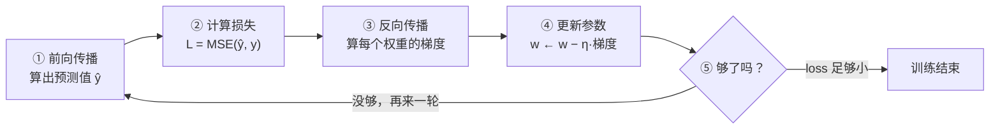
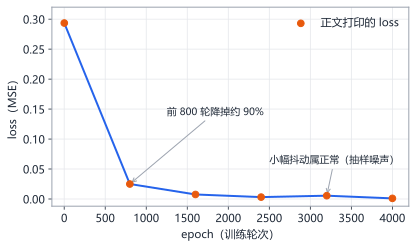
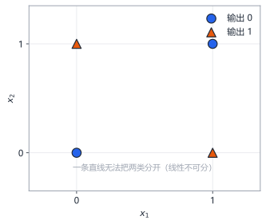

# 第9章 第一次训练：看见 Loss 下降

> 本章学习目标：
> 1. 能复述训练循环的五个步骤，并说明每步的目的
> 2. 能跑通用纯 Python 实现的完整训练程序（不借助任何第三方库）
> 3. 能通过 loss 曲线判断训练是否正常
> 4. 能用 XOR 实验证明：没有隐藏层的网络学不会非线性问题

## 从一个例子开始

想象你被蒙住眼睛，放在一座山的山坡上，任务是走到山谷最低处。你看不见地形，但能感觉到脚下的坡度。你会怎么做？

最自然的策略：**用脚探一探哪个方向最陡地往下，朝那个方向迈一小步；到了新位置，再探，再迈**。只要步子别太大，重复足够多次，你迟早会站在谷底。

这就是训练神经网络的全部本质。这座山是"损失函数曲面"——海拔是损失 $L$，平面坐标是所有权重。网络蒙着眼（它不知道怎样能一步降到最优），但它能算"坡度"——也就是第 1 章学的**导数（梯度）**。然后：

1. 算当前位置的梯度（哪边是下坡）
2. 朝下坡方向迈一小步（调权重）
3. 重复

这个方法叫**梯度下降（gradient descent）**。本章你要做的，就是亲手把这座山、这个蒙眼人、这套策略全部写成代码，然后看着 loss 一步步降下来。

## 训练循环：五个步骤

一次完整的训练由成千上万轮循环组成，每一轮做五件事：



逐步说明：

**① 前向传播**：第 7 章的内容。喂入样本 $x$，算出预测 $\hat{y}$。

**② 计算损失**：第 8 章的内容。用 MSE 算这次预测错得有多离谱。

**③ 反向传播（backpropagation）**：从损失出发，倒着算出"每个权重对损失各负多少责任"，即每个权重的梯度 $\frac{\partial L}{\partial w}$。这是全书推导的重头戏，我们在第 10~12 章会把它彻底拆开。**本章你先把它当作一个能算出梯度的工具，重点看训练的整体效果。**

**④ 更新参数**：每个权重朝梯度的反方向挪一小步：

$$w \leftarrow w - \eta \cdot \frac{\partial L}{\partial w}$$

$\eta$（读作 eta）是**学习率（learning rate）**，控制步子大小。为什么用减号？梯度指向"上坡"（损失增大的方向），我们要下坡，所以反着走。

**⑤ 判断停不停**：loss 降到满意水平，或者轮数用完，就停。

## 主角登场：一个不到 60 行的神经网络

下面这个 `Net` 类是本部分最重要的代码。它只用 `math` 和 `random` 两个标准库，实现了任意层数、任意宽度的全连接网络，训练步骤①~④全在里面。先完整列出来，后面逐段解释。

```python
import math
import random


class Net:
    def __init__(self, sizes, hidden_act="sigmoid", out_act="sigmoid",
                 lr=0.5, seed=42):
        random.seed(seed)
        self.lr = lr
        self.hidden_act = hidden_act
        self.out_act = out_act
        self.w = []          # w[i] 是第 i+1 层的权重矩阵（列表套列表）
        self.b = []          # b[i] 是第 i+1 层的偏置向量
        for i in range(1, len(sizes)):
            rows, cols = sizes[i], sizes[i - 1]
            scale = math.sqrt(2.0 / (rows + cols))   # 控制初始权重幅度
            self.w.append([[random.gauss(0, 1) * scale
                            for _ in range(cols)] for _ in range(rows)])
            self.b.append([0.0] * rows)

    def _activate(self, z, act):
        if act == "sigmoid":
            return 1.0 / (1.0 + math.exp(-z))
        if act == "tanh":
            return math.tanh(z)
        return z             # "linear"：原样输出

    def forward(self, x):
        acts = [x]           # 逐层保存激活值，反向传播要用
        for i in range(len(self.w)):
            act = self.hidden_act if i < len(self.w) - 1 else self.out_act
            a_prev = acts[-1]
            a = []
            for r in range(len(self.w[i])):
                z = sum(self.w[i][r][c] * a_prev[c]
                        for c in range(len(a_prev))) + self.b[i][r]
                a.append(self._activate(z, act))
            acts.append(a)
        return acts          # acts[-1] 就是预测值 ŷ

    def train_step(self, x, y):
        acts = self.forward(x)
        a_out = acts[-1]
        delta = [a_out[k] - y[k] for k in range(len(y))]   # 输出层误差
        if self.out_act == "sigmoid":
            delta = [d * a * (1 - a) for d, a in zip(delta, a_out)]

        for layer in range(len(self.w) - 1, -1, -1):       # 从后往前
            a_prev = acts[layer]
            new_delta = [0.0] * len(a_prev)
            for r in range(len(self.w[layer])):
                for c in range(len(a_prev)):
                    new_delta[c] += self.w[layer][r][c] * delta[r]
                    self.w[layer][r][c] -= self.lr * delta[r] * a_prev[c]
                self.b[layer][r] -= self.lr * delta[r]
            if layer > 0:
                if self.hidden_act == "sigmoid":
                    delta = [new_delta[c] * a_prev[c] * (1 - a_prev[c])
                             for c in range(len(a_prev))]
                else:
                    delta = [new_delta[c] * (1 - a_prev[c] ** 2)
                             for c in range(len(a_prev))]

    def loss(self, data):
        total = 0.0
        for x, y in data:
            a = self.forward(x)[-1]
            total += sum((a[k] - y[k]) ** 2 for k in range(len(y)))
        return total / len(data)
```

### 逐段解释

**`__init__`：搭骨架、撒随机权重。** `sizes=[2, 4, 1]` 就表示"2 输入、4 隐藏、1 输出"。注意权重**不能全初始化为 0 或相同的数**——那样同一层的神经元会永远同步调整，等于只有一个神经元。这里用高斯随机数乘以 `scale`（神经元的数量越多，`scale` 越小，防止信号在层间越放越大）。偏置初始化为 0，从一个中立的起点开始。

**`forward`：第 7 章的矩阵写法。** 每层做同一件事：行乘列加偏置，过激活函数。它把每一层的输出都存进 `acts`——反向传播要回头用这些中间值。

**`train_step`：步骤③④合在这里。** 先算输出层的误差 `delta`（预测减真实），然后从最后一层**倒着走**：一边把误差往前传（`new_delta`），一边按 $w \leftarrow w - \eta \cdot \delta \cdot a$ 更新本层权重。里面出现的 `a*(1-a)`、`1-a²` 分别是 sigmoid 和 tanh 的导数——这行代码凭什么长这样，正是第 11 章要推导的。现在只需确认它的行为符合"梯度下降"：**loss 大就大改，loss 小就小改**。

**`loss`：第 8 章的 MSE。** 对所有样本的误差平方取平均，用来观察训练进度。

<details>
<summary>🐘 C 语言对照</summary>

*语言差异：Python 的类在 C 里是"结构体 + 一组以自身为第一个参数的函数"——`net_forward(net, ...)` 的第一个参数 `net` 就是 Python 里隐身的 `self`；`self.w` 的"列表套列表套列表"在 C 里是一张三维数组。为了聚焦算法，这里用固定上限的数组代替动态内存（想要任意层宽的工程版写法，见 `examples/c-tutorial/`）。另外本书任务都是单输出，C 版把输出维数固定为 1 以保持简短。*

```c
#include <stdio.h>
#include <stdlib.h>
#include <math.h>

#define MAX_M 4      /* 最多几个权重矩阵（本书任务最多 2 个，留余量） */
#define MAX_N 32     /* 每层最多多少个神经元 */

typedef struct {
    int nl;                          /* 权重矩阵个数，对应 len(self.w) */
    int rows[MAX_M], cols[MAX_M];    /* 第 i 层：行=本层神经元数，列=前层宽度 */
    double w[MAX_M][MAX_N][MAX_N];   /* self.w[i][r][c]，三维数组 */
    double b[MAX_M][MAX_N];          /* self.b[i][r] */
    int hidden_act, out_act;         /* 0=sigmoid 1=tanh 2=linear */
    double lr;
    double acts[MAX_M + 1][MAX_N];   /* 逐层保存激活值，反向传播要用 */
    int act_sizes[MAX_M + 1];
} Net;

typedef struct {                     /* 一条训练样本：输入向量 + 目标值 */
    double x[2];
    double y[1];
    int nx;                          /* 输入是几维 */
} Sample;

/* ---- 随机数工具：对应 Python 的 random 模块 ---- */
double grand(void) {                 /* 高斯随机数，对应 random.gauss(0,1) */
    double u1 = (rand() + 1.0) / (RAND_MAX + 2.0);
    double u2 = (rand() + 1.0) / (RAND_MAX + 2.0);
    return sqrt(-2.0 * log(u1)) * cos(6.283185307179586 * u2);
}

void net_init(Net *net, const int sizes[], int n,
              int hidden_act, int out_act, double lr) {
    net->nl = n - 1;                 /* 搭骨架：sizes=[2,4,1] 表示 2 输入 4 隐藏 1 输出 */
    net->hidden_act = hidden_act;
    net->out_act = out_act;
    net->lr = lr;
    for (int i = 0; i < net->nl; i++) {
        int r = sizes[i + 1], c = sizes[i];
        net->rows[i] = r;
        net->cols[i] = c;
        double scale = sqrt(2.0 / (r + c));           /* 控制初始权重幅度 */
        for (int j = 0; j < r; j++) {
            for (int k = 0; k < c; k++) {
                net->w[i][j][k] = grand() * scale;    /* 高斯随机数，不能全相同 */
            }
            net->b[i][j] = 0.0;                       /* 偏置从中立起点开始 */
        }
    }
}

double activate(double z, int act) {
    if (act == 0) return 1.0 / (1.0 + exp(-z));   /* sigmoid */
    if (act == 1) return tanh(z);                 /* tanh */
    return z;                                     /* linear：原样输出 */
}

/* 前向传播：返回指向最后一层激活值（即预测值 ŷ）的指针 */
double *net_forward(Net *net, const double x[], int in_size) {
    net->act_sizes[0] = in_size;
    for (int c = 0; c < in_size; c++) {
        net->acts[0][c] = x[c];
    }
    for (int i = 0; i < net->nl; i++) {
        int act = (i < net->nl - 1) ? net->hidden_act : net->out_act;
        for (int r = 0; r < net->rows[i]; r++) {
            double z = net->b[i][r];
            for (int c = 0; c < net->cols[i]; c++) {
                z += net->w[i][r][c] * net->acts[i][c];   /* 行乘列加偏置 */
            }
            net->acts[i + 1][r] = activate(z, act);
        }
        net->act_sizes[i + 1] = net->rows[i];
    }
    return net->acts[net->nl];       /* acts 的最后一层就是预测值 */
}

/* 训练一步：前向 + 反向传播 + 按梯度更新（对应 train_step） */
void net_train_step(Net *net, const double x[], int in_size, const double y[]) {
    net_forward(net, x, in_size);

    double delta[MAX_N];
    delta[0] = net->acts[net->nl][0] - y[0];       /* 输出层误差：预测减真实 */
    if (net->out_act == 0) {                       /* sigmoid 输出要乘导数 a(1-a) */
        double a = net->acts[net->nl][0];
        delta[0] *= a * (1 - a);
    }

    for (int layer = net->nl - 1; layer >= 0; layer--) {   /* 从后往前 */
        int np = net->act_sizes[layer];
        double new_delta[MAX_N];
        for (int c = 0; c < np; c++) {
            new_delta[c] = 0.0;
        }
        for (int r = 0; r < net->rows[layer]; r++) {
            for (int c = 0; c < np; c++) {
                new_delta[c] += net->w[layer][r][c] * delta[r];              /* 误差往前传 */
                net->w[layer][r][c] -= net->lr * delta[r] * net->acts[layer][c];  /* 更新权重 */
            }
            net->b[layer][r] -= net->lr * delta[r];                        /* 更新偏置 */
        }
        if (layer > 0) {                       /* 给前一层准备 delta */
            for (int c = 0; c < np; c++) {
                double a = net->acts[layer][c];
                if (net->hidden_act == 0) {
                    new_delta[c] *= a * (1 - a);        /* sigmoid 的导数 */
                } else {
                    new_delta[c] *= 1 - a * a;          /* tanh 的导数 */
                }
            }
            for (int c = 0; c < np; c++) {
                delta[c] = new_delta[c];
            }
        }
    }
}

/* MSE 损失：全部样本误差平方取平均（对应 loss 方法） */
double net_loss(Net *net, const Sample data[], int n) {
    double total = 0.0;
    for (int i = 0; i < n; i++) {
        double *a = net_forward(net, data[i].x, data[i].nx);
        total += (a[0] - data[i].y[0]) * (a[0] - data[i].y[0]);
    }
    return total / n;
}
```

</details>

## 实验 A：拟合 sin(x)（回归任务）

任务：网络只看 $(x, \sin x)$ 的样本，学着画出 sin 曲线。网络结构 1-16-1：1 个输入，16 个隐藏神经元（tanh），1 个线性输出。

为什么输出层用 linear 而不是 sigmoid？因为 $\sin x$ 的取值范围是 $[-1, 1]$，而 sigmoid 只能输出 $(0, 1)$——第 7 章的思考题就是这个问题的预演。

```python
# 接上面的 Net 类，同一个文件里继续写

random.seed(7)
data = []
for _ in range(200):                       # 在 [0, 2π] 上撒 200 个采样点
    xv = random.uniform(0, 2 * math.pi)
    data.append(([xv], [math.sin(xv)]))

net = Net([1, 16, 1], hidden_act="tanh", out_act="linear", lr=0.02)

for epoch in range(1, 4001):
    random.shuffle(data)
    for x, y in data[:30]:                 # 每轮随机取 30 个样本训练
        net.train_step(x, y)
    if epoch == 1 or epoch % 800 == 0:
        print(f"epoch {epoch:5d}   loss {net.loss(data):.6f}")

print("\n训练后抽查：")
for xv in [0.0, 1.0, 2.0, 3.0, 4.0, 5.0]:
    pred = net.forward([xv])[-1][0]
    print(f"x={xv:.1f}   预测 {pred:+.4f}   真实 {math.sin(xv):+.4f}")
```

这段代码做的事：生成 200 个训练样本；每轮（epoch，即"训练轮次"）打乱数据、取 30 个样本各做一次 `train_step`；每 800 轮用全部 200 个样本算一次 MSE 打印出来；最后抽查 6 个点的拟合效果。运行大约几秒钟。

**预期输出**（数字每次运行略有出入，趋势必然如此）：

```
epoch     1   loss 0.293546
epoch   800   loss 0.024993
epoch  1600   loss 0.007556
epoch  2400   loss 0.003157
epoch  3200   loss 0.005512
epoch  4000   loss 0.001037

训练后抽查：
x=0.0   预测 -0.0226   真实 +0.0000
x=1.0   预测 +0.8166   真实 +0.8415
x=2.0   预测 +0.8830   真实 +0.9093
x=3.0   预测 +0.1278   真实 +0.1411
x=4.0   预测 -0.7999   真实 -0.7568
x=5.0   预测 -0.9205   真实 -0.9589
```

把 loss 画成曲线，形状是这样的：



**先快后慢**：前 800 轮降掉 90% 的误差，后面 3200 轮都在"精修"。这符合学习的直觉——新技能入门时进步飞快，精益求精越来越难。

两个小观察，都是正常现象：

1. loss 不是严格单调下降的（比如 2400 轮的 0.0032 到 3200 轮的 0.0055 反而升了）。因为每轮只用 30 个随机样本，梯度带有"抽样噪声"，偶尔会走上坡路。长期趋势向下就没问题。
2. 抽查的 6 个点都不是训练集里的点（训练点是随机撒的），预测依然很准——说明网络学到的是 sin 的**形状**，不是背答案。

<details>
<summary>🐘 C 语言对照</summary>

*语言差异：Python 的 `random.shuffle` 和 `random.uniform` 在 C 里没有现成的，要自己写——洗牌用经典的 Fisher-Yates 算法，均匀随机数用 `rand()` 除以 `RAND_MAX` 缩放。C 的随机数序列与 Python 不同，loss 数字不会逐位相同，但"先快后慢、降到千分之一量级"的趋势必然一致。*

```c
/* 接上面的 Net 代码，同一个文件里继续写。下面是实验 A：拟合 sin(x) */

/* Fisher-Yates 洗牌，对应 random.shuffle：把编号表随机打乱 */
void shuffle(int idx[], int n) {
    for (int i = n - 1; i > 0; i--) {
        int j = rand() % (i + 1);        /* 从 0..i 里随机挑一个 */
        int t = idx[i]; idx[i] = idx[j]; idx[j] = t;
    }
}

int main(void) {
    srand(7);                            /* 对应 random.seed(7) */

    Sample data[200];
    for (int i = 0; i < 200; i++) {      /* 在 [0, 2π] 上撒 200 个采样点 */
        double xv = ((double)rand() / RAND_MAX) * 6.283185307179586;  /* uniform(0, 2π) */
        data[i].x[0] = xv;
        data[i].y[0] = sin(xv);
        data[i].nx = 1;
    }

    Net net;
    int sizes[3] = {1, 16, 1};
    net_init(&net, sizes, 3, 1, 2, 0.02);    /* 1-16-1：隐藏 tanh(1)，输出 linear(2) */

    int order[200];                          /* 洗牌用的编号表 */
    for (int i = 0; i < 200; i++) order[i] = i;

    for (int epoch = 1; epoch <= 4000; epoch++) {
        shuffle(order, 200);                 /* 每轮打乱数据 */
        for (int k = 0; k < 30; k++) {       /* 每轮随机取 30 个样本训练 */
            Sample *s = &data[order[k]];
            net_train_step(&net, s->x, s->nx, s->y);
        }
        if (epoch == 1 || epoch % 800 == 0) {
            printf("epoch %5d   loss %.6f\n", epoch, net_loss(&net, data, 200));
        }
    }

    printf("\n训练后抽查：\n");
    double xs[6] = {0.0, 1.0, 2.0, 3.0, 4.0, 5.0};
    for (int i = 0; i < 6; i++) {
        double xin[1] = {xs[i]};
        double pred = net_forward(&net, xin, 1)[0];
        printf("x=%.1f   预测 %+.4f   真实 %+.4f\n", xs[i], pred, sin(xs[i]));
    }
    return 0;
}
```

</details>

## 实验 B：XOR——为什么必须有隐藏层

XOR（异或）逻辑门：两个输入不同则输出 1，相同则输出 0。全部样本只有 4 条：

```
(0,0) → 0      (0,1) → 1
(1,0) → 1      (1,1) → 0
```

### B1：先让"单神经元"试试

用 2-1 网络——没有隐藏层，输入直接连一个 sigmoid 输出神经元：

```python
# 接同一个文件继续写

xor_data = [([0.0, 0.0], [0.0]), ([0.0, 1.0], [1.0]),
            ([1.0, 0.0], [1.0]), ([1.0, 1.0], [0.0])]

print("=== 无隐藏层 ===")
net1 = Net([2, 1], out_act="sigmoid", lr=0.5)
for epoch in range(1, 5001):
    for x, y in xor_data:
        net1.train_step(x, y)
    if epoch == 1 or epoch % 1000 == 0:
        print(f"epoch {epoch:5d}   loss {net1.loss(xor_data):.6f}")

for x, y in xor_data:
    pred = net1.forward(x)[-1][0]
    print(f"输入 {x}   预测 {pred:.4f}   真实 {y[0]}")
```

**预期输出**：

```
=== 无隐藏层 ===
epoch     1   loss 0.251314
epoch  1000   loss 0.250397
epoch  2000   loss 0.250397
epoch  3000   loss 0.250397
epoch  4000   loss 0.250397
epoch  5000   loss 0.250397
输入 [0.0, 0.0]   预测 0.5161   真实 0.0
输入 [0.0, 1.0]   预测 0.5000   真实 1.0
输入 [1.0, 0.0]   预测 0.4839   真实 1.0
输入 [1.0, 1.0]   预测 0.4678   真实 0.0
```

**loss 卡在 0.2504，一动不动了。** 5000 轮训练，四个预测全部接近 0.5——网络放弃了思考，对谁都回答"一半一半"。

为什么？把四个样本画在平面上就明白了：



没有隐藏层的网络只能做线性划分——在平面上画**一条直线**，一边输出 0，一边输出 1。但你试试：无论这条线怎么画，都没法把两个 ① 和两个 ⓪ 分开。这个问题叫**线性不可分**。

单神经元的极限就在这里：它是一条直线，而 XOR 需要曲线。loss 卡住的 0.25 正是"全部猜 0.5"时的 MSE——每题错 0.5，平方 0.25，平均还是 0.25。

<details>
<summary>🐘 C 语言对照</summary>

*语言差异：继续沿用上面的 `Net`。Python 用 `(x, y)` 元组列表存数据，C 用 `Sample` 结构体数组；初始化器的 `{0.0, 0.0}, {0.0}, 2` 依次填入 `x`、`y`、`nx`。另外 C 和 Python 的随机数序列不同：`srand(7)` 是特意选的，能让 C 版和 Python 版一样落进"全部输出 ≈0.5"的鞍点（换别的种子可能卡在别的对称解上，但 loss 照样卡死 0.2504，结论不变）。*

```c
/* 接同一个文件继续写。把 main 里实验 A 的部分注释掉，改为调用本函数 */
void experiment_b1(void) {           /* 实验 B1：无隐藏层的 2-1 网络 */
    Sample xor_data[4] = {
        {{0.0, 0.0}, {0.0}, 2}, {{0.0, 1.0}, {1.0}, 2},
        {{1.0, 0.0}, {1.0}, 2}, {{1.0, 1.0}, {0.0}, 2},
    };

    printf("=== 无隐藏层 ===\n");
    Net net1;
    int sizes[2] = {2, 1};
    srand(7);                                /* 选 7：复现"全部输出 ≈0.5"的鞍点 */
    net_init(&net1, sizes, 2, 0, 0, 0.5);    /* 2-1：输入直接连 sigmoid 输出 */

    for (int epoch = 1; epoch <= 5000; epoch++) {
        for (int i = 0; i < 4; i++) {
            net_train_step(&net1, xor_data[i].x, 2, xor_data[i].y);
        }
        if (epoch == 1 || epoch % 1000 == 0) {
            printf("epoch %5d   loss %.6f\n", epoch, net_loss(&net1, xor_data, 4));
        }
    }

    for (int i = 0; i < 4; i++) {
        double pred = net_forward(&net1, xor_data[i].x, 2)[0];
        printf("输入 [%.1f, %.1f]   预测 %.4f   真实 %.1f\n",
               xor_data[i].x[0], xor_data[i].x[1], pred, xor_data[i].y[0]);
    }
}
```

</details>

### B2：加一个隐藏层

只改一处：`Net([2, 1])` 改成 `Net([2, 4, 1])`——中间加 4 个 sigmoid 隐藏神经元：

```python
print("\n=== 有隐藏层 ===")
net2 = Net([2, 4, 1], out_act="sigmoid", lr=0.5)
for epoch in range(1, 5001):
    for x, y in xor_data:
        net2.train_step(x, y)
    if epoch == 1 or epoch % 1000 == 0:
        print(f"epoch {epoch:5d}   loss {net2.loss(xor_data):.6f}")

for x, y in xor_data:
    pred = net2.forward(x)[-1][0]
    print(f"输入 {x}   预测 {pred:.4f}   真实 {y[0]}")
```

**预期输出**：

```
=== 有隐藏层 ===
epoch     1   loss 0.256352
epoch  1000   loss 0.158838
epoch  2000   loss 0.005230
epoch  3000   loss 0.001919
epoch  4000   loss 0.001127
epoch  5000   loss 0.000786
输入 [0.0, 0.0]   预测 0.0147   真实 0.0
输入 [0.0, 1.0]   预测 0.9735   真实 1.0
输入 [1.0, 0.0]   预测 0.9736   真实 1.0
输入 [1.0, 1.0]   预测 0.0391   真实 0.0
```

loss 一路降到 0.0008，四个预测全部正确。

发生了什么？隐藏层的 4 个神经元各自学出一条"直线划分"，相当于把平面做了几种不同的切分；输出层再把这些切分**组合**起来，拼出一个弯曲的决策边界。直觉是：一条直线切不开，那就先用几条直线各切一刀，再综合投票。

对比两个实验：

| | 无隐藏层 | 有隐藏层 |
|---|---|---|
| 结构 | 2-1（7 个参数） | 2-4-1（17 个参数） |
| 最终 loss | 0.2504（卡死） | 0.0008（收敛） |
| 预测 | 全部 ≈ 0.5 | 全部正确 |
| 决策边界 | 一条直线 | 弯曲边界 |

第 6 章说"没有激活函数，多层等于一层"，这个实验是它的孪生兄弟：**没有隐藏层，一层就是全部，而一层解决不了非线性问题**。深度不是玄学，是能力的分水岭。

<details>
<summary>🐘 C 语言对照</summary>

*语言差异：和 B1 相比只改了一处——`sizes` 从 `{2, 1}` 变成 `{2, 4, 1}`，与 Python 版把 `Net([2, 1])` 改成 `Net([2, 4, 1])` 完全对应。`srand(42)` 对应 Python `Net` 构造函数里 `seed=42` 的默认值。随机序列不同，中间数字会与 Python 版略有出入，但"loss 一路降到千分之一量级、四个预测全部正确"的结局一致。*

```c
void experiment_b2(void) {           /* 实验 B2：加 4 个 sigmoid 隐藏神经元 */
    Sample xor_data[4] = {
        {{0.0, 0.0}, {0.0}, 2}, {{0.0, 1.0}, {1.0}, 2},
        {{1.0, 0.0}, {1.0}, 2}, {{1.0, 1.0}, {0.0}, 2},
    };

    printf("\n=== 有隐藏层 ===\n");
    Net net2;
    int sizes[3] = {2, 4, 1};                /* 只改这一处 */
    srand(42);
    net_init(&net2, sizes, 3, 0, 0, 0.5);    /* 隐藏层也是 sigmoid */

    for (int epoch = 1; epoch <= 5000; epoch++) {
        for (int i = 0; i < 4; i++) {
            net_train_step(&net2, xor_data[i].x, 2, xor_data[i].y);
        }
        if (epoch == 1 || epoch % 1000 == 0) {
            printf("epoch %5d   loss %.6f\n", epoch, net_loss(&net2, xor_data, 4));
        }
    }

    for (int i = 0; i < 4; i++) {
        double pred = net_forward(&net2, xor_data[i].x, 2)[0];
        printf("输入 [%.1f, %.1f]   预测 %.4f   真实 %.1f\n",
               xor_data[i].x[0], xor_data[i].x[1], pred, xor_data[i].y[0]);
    }
}
```

</details>

## 常见误区

**误区：loss 下降就是一切正常，不用看预测值。**
真相：一定要抽查预测。loss 下降但预测离谱的情况真实存在（比如数据标签写错、输出层激活函数选错）。本实验里如果给 sin 任务误用了 sigmoid 输出，loss 也会降，但网络永远学不会负半周。

**误区：训练时间越长越好，loss 越小越好。**
真相：训练太久，网络会把训练样本的噪声也背下来（过拟合），换新数据反而变差。loss 降到平台期、抽查预测满意，就该停了。

**误区：这次没训好是运气差，多跑几次总会好。**
真相：随机初始化确实有运气成分（换 `seed` 结果会变），但如果 loss 完全不动（像 XOR 无隐藏层那样卡死），那是**结构问题**，重启一万次也没用。先查结构，再查学习率，最后才轮得到运气。

## 章末习题

1. 在实验 A 的代码里，把 `lr=0.02` 分别改成 `0.001` 和 `0.5`，运行并记录 800 轮时的 loss。用自己的话解释两次现象。
2. 实验 B1 中，loss 最终卡在 0.250397。不运行代码，只用 XOR 的四条样本和手算，解释为什么"全部输出 0.5"时 MSE 恰好是 0.25。
3. 实验 A 的 `Net([1, 16, 1])` 一共有多少个可调参数？实验 B2 的 `Net([2, 4, 1])` 呢？
4. 把实验 B2 的隐藏层从 4 个神经元改成 2 个（`Net([2, 2, 1])`），运行观察。loss 还能降到 0.01 以下吗？这说明隐藏层宽度起什么作用？
5. （思考题）实验 A 里每轮只随机取 30 个样本训练，却用全部 200 个样本评估 loss。如果改成"每轮也用 30 个样本评估 loss"，打印出的曲线会发生什么变化？这样做有没有好处？

## 小结与下一章预告

本章要点：

- 训练 = 梯度下降：前向传播 → 算损失 → 反向传播求梯度 → 更新权重 → 重复
- 权重必须随机初始化；学习率 $\eta$ 控制每步大小，太大震荡、太小缓慢
- loss 曲线的正常形态是"先快后慢"，允许小幅抖动，看长期趋势
- XOR 实验证明：无隐藏层 = 只能画直线 = 学不会非线性问题；隐藏层是必需的

你已经训练出了两个能干活的小网络，但 `train_step` 里那段反向传播代码对你来说还是个黑盒——凭什么 `delta` 要那样往前传？凭什么 `a*(1-a)` 出现在那里？下一部分"核心原理"，我们从第 1 章的链式法则出发，把反向传播的每一行都推导出来。黑盒即将打开。
