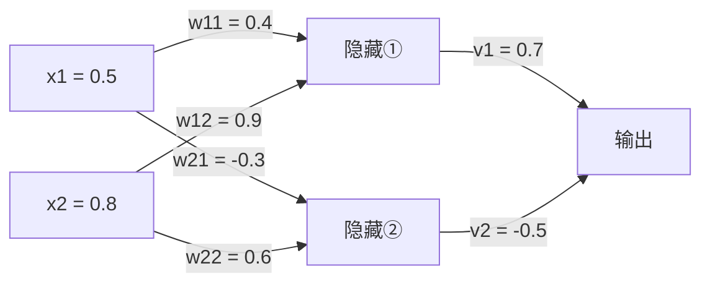
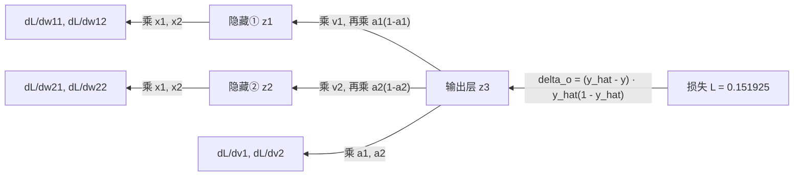
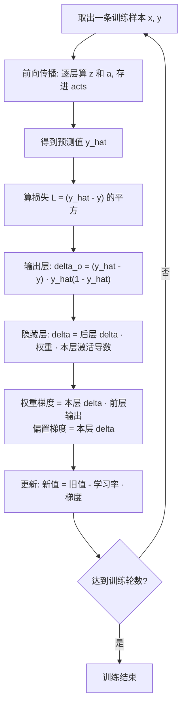
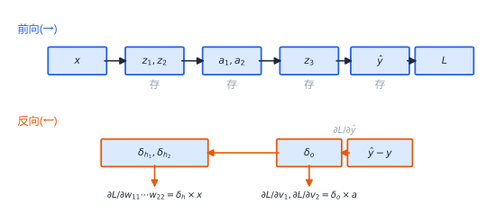

# 第10章 反向传播详解

> 本章学习目标：
> 1. 能用链式法则写出输出层和隐藏层误差项 $\delta$ 的推导过程，不跳步
> 2. 能跟着本章的数字，用笔和计算器把一次反向传播完整复算一遍
> 3. 能说出"权重梯度 = $\delta$ × 前层输出"的原因
> 4. 能画出一次完整训练迭代（前向 + 反向 + 更新）的流程图
> 5. 能用数值方法（有限差分）验证自己算的梯度

## 从一个例子开始

小组四个人交了一份作业，老师批改后说："总分扣了 20 分。"

接下来老师要做一件事：把这 20 分的责任**分摊**到每个人头上。

- 谁直接写错了最后结论？承担大部分责任。
- 谁的中间结果算错了，害得后面的人跟着错？也承担一部分。
- 谁的部分压根没被采用？不承担责任。

反向传播（backpropagation）干的就是这件事：网络的预测错了（损失 $L$ 不为零），把"责任"从输出层开始，一层一层往回分摊，直到每个权重、每个偏置都领到属于自己的那一份——**梯度**。领到责任之后，每个参数按责任大小调整自己。这就是训练。

本章是全书的理论核心。第 9 章的 `train_step` 里那几行 `delta` 代码，本章要把它们一行一行推导出来。你会看到完整的推导和完整的数字，不跳一步。准备好纸笔，跟着算。

## 10.1 回顾：第 7 章的网络和数字

本章继续用第 7 章那个 2-2-1 网络，参数、输入完全一样——你在第 7 章已经手算过它的前向传播，现在我们要给它的每个参数算梯度。



参数表（和第 7 章逐一对齐，$v_1, v_2$ 是输出层权重，本质上也是 $w$）：

| 参数 | 值 | 参数 | 值 |
|---|---|---|---|
| $w_{11}$（$x_1 \to$ 隐藏①） | 0.4 | $w_{12}$（$x_2 \to$ 隐藏①） | 0.9 |
| $w_{21}$（$x_1 \to$ 隐藏②） | -0.3 | $w_{22}$（$x_2 \to$ 隐藏②） | 0.6 |
| $v_1$（隐藏① $\to$ 输出） | 0.7 | $v_2$（隐藏② $\to$ 输出） | -0.5 |
| $b_1$ | 0.1 | $b_2$ | -0.2 |
| $b_3$（输出层） | 0.2 | 输入 $x_1, x_2$ | 0.5, 0.8 |

目标值取第 8 章的 $y = 1.0$，学习率取第 9 章用过的 $\eta = 0.5$。激活函数全是 sigmoid：$\sigma(z) = \dfrac{1}{1+e^{-z}}$。

**前向传播的结果直接抄第 7 章**（本章数字保留 6 位小数，你复算时末位可能因四舍五入差一点，不影响结论）：

$$z_1 = 0.4 \times 0.5 + 0.9 \times 0.8 + 0.1 = 1.02, \qquad a_1 = \sigma(1.02) = 0.734973$$

$$z_2 = (-0.3) \times 0.5 + 0.6 \times 0.8 + (-0.2) = 0.13, \qquad a_2 = \sigma(0.13) = 0.532454$$

$$z_3 = 0.7 \times 0.734973 + (-0.5) \times 0.532454 + 0.2 = 0.448254$$

$$\hat{y} = \sigma(0.448254) = 0.610224$$

用第 8 章的 MSE（单样本就是误差平方）：

$$L = (\hat{y} - y)^2 = (0.610224 - 1.0)^2 = (-0.389776)^2 = 0.151925$$

建议把这组数字抄在纸上。10.3 节会把 9 个梯度的数值逐个算出来，你可以一边读一边对账。

现在的问题是：**9 个参数，每个该往哪调、调多少？**

## 10.2 抽象推导：误差怎么往回传

### 10.2.1 一个记号：$\delta$

每个神经元的"责任"用一个字母表示：

$$\delta = \frac{\partial L}{\partial z}$$

读作"损失 $L$ 对这个神经元激活前加权和 $z$ 的偏导数"。还记得偏导数吗（第 5 章）——只盯着一个变量看，其他全部当常数。

为什么盯住 $z$？因为 $z$ 是每条计算链的咽喉要道：权重和偏置先影响 $z$，$z$ 再过激活函数影响输出。算出了 $\delta$，权重梯度就只是"再乘一步"的事。

### 10.2.2 输出层的 $\delta$

输出神经元的计算链是：

$$v_1 \to z_3 \to \hat{y} \to L$$

链式法则（第 4 章：复合函数求导 = 各环导数相乘）：

$$\delta_o = \frac{\partial L}{\partial z_3} = \frac{\partial L}{\partial \hat{y}} \times \frac{\partial \hat{y}}{\partial z_3}$$

两环分别算。

第一环，$L = (\hat{y}-y)^2$。把 $(\hat{y}-y)$ 看成整体 $u$，$L = u^2$ 对 $u$ 求导得 $2u$，$u$ 对 $\hat{y}$ 求导得 1，所以严格写出来是：

$$\frac{\partial L}{\partial \hat{y}} = 2(\hat{y} - y)$$

这里要做全书统一的一个约定：**系数 2 会被学习率吸收**。它只改变步长（所有梯度同乘一个常数），不改变方向。第 9 章的 `train_step` 代码里写的就是不带 2 的版本——`delta = 预测 - 真实`。本章遵循同一个约定，以下都用：

$$\frac{\partial L}{\partial \hat{y}} = \hat{y} - y$$

第二环，$\hat{y} = \sigma(z_3)$。sigmoid 有个好性质：导数可以用它自己表示，$\sigma'(z) = \sigma(z)(1-\sigma(z))$（第 6 章见过这个形式），所以：

$$\frac{\partial \hat{y}}{\partial z_3} = \hat{y}\,(1 - \hat{y})$$

两环相乘：

$$\boxed{\delta_o = (\hat{y} - y)\;\hat{y}\,(1 - \hat{y})}$$

读一下这个公式：$\hat{y} - y$ 是"错多少"，$\hat{y}(1-\hat{y})$ 是"这个神经元当时有多敏感"。责任 = 错误 × 敏感度。

### 10.2.3 隐藏层的 $\delta$

隐藏①不直接产生损失，它通过 $z_3$ 间接影响。链条是：

$$w_{11} \to z_1 \to a_1 \to z_3 \to \hat{y} \to L$$

从 $L$ 往回走到 $a_1$：

$$\frac{\partial L}{\partial a_1} = \frac{\partial L}{\partial z_3} \times \frac{\partial z_3}{\partial a_1} = \delta_o \times v_1$$

因为 $z_3 = v_1 a_1 + v_2 a_2 + b_3$，对 $a_1$ 求偏导（$v_1, v_2, a_2, b_3$ 全当常数）就是 $v_1$。

再往回走到 $z_1$，乘激活函数的导数：

$$\boxed{\delta_{h_1} = \delta_o \times v_1 \times a_1\,(1 - a_1)}$$

同理 $\delta_{h_2} = \delta_o \times v_2 \times a_2(1-a_2)$。

**这个公式在说什么**：隐藏神经元的责任 = 后一层传回来的责任 × 连线的粗细（权重）× 自己当时的敏感度。注意 $v_2 = -0.5$ 是负数——责任是带符号传回来的，隐藏②对损失的"贡献"方向和隐藏①相反。如果网络更深、后面有多个神经元，就把每条连线传回来的责任**加起来**。这就是"误差从输出层一层层往回传"的全部内容。

### 10.2.4 权重和偏置的梯度

最后一步。$v_1$ 只通过 $z_3$ 影响 $L$，而 $\dfrac{\partial z_3}{\partial v_1} = a_1$，所以：

$$\frac{\partial L}{\partial v_1} = \frac{\partial L}{\partial z_3} \times \frac{\partial z_3}{\partial v_1} = \delta_o \times a_1$$

一般规律：

$$\boxed{\frac{\partial L}{\partial w} = \delta_{\text{本层}} \times a_{\text{前层}}}$$

权重梯度 = 本层神经元的责任 × 前层神经元当时的输出。前层输出越大，这条连接对错误的"贡献"越大，调整越多；前层输出是 0，这个权重免责。

偏置更简单。$z_3 = \cdots + b_3$，所以 $\dfrac{\partial z_3}{\partial b_3} = 1$：

$$\boxed{\frac{\partial L}{\partial b} = \delta_{\text{本层}}}$$

### 10.2.5 整条链写在一起

以离输出最远的 $w_{11}$ 为例，把从 $L$ 到它的每一步都写出来——五个环节，一环不少：

$$\frac{\partial L}{\partial w_{11}} = \underbrace{\frac{\partial L}{\partial \hat{y}}}_{\hat{y}\,-\,y} \times \underbrace{\frac{\partial \hat{y}}{\partial z_3}}_{\hat{y}(1-\hat{y})} \times \underbrace{\frac{\partial z_3}{\partial a_1}}_{v_1} \times \underbrace{\frac{\partial a_1}{\partial z_1}}_{a_1(1-a_1)} \times \underbrace{\frac{\partial z_1}{\partial w_{11}}}_{x_1}$$

五个导数，每一个都来自链上相邻的两个量。前两个乘起来是 $\delta_o$，再乘第三、第四个是 $\delta_{h_1}$，乘第五个就是 $w_{11}$ 的梯度。

这就是反向传播省钱的地方：$\delta_o$ 和 $\delta_{h_1}$ 是**中间结果**，算 $w_{12}$、$w_{21}$、$w_{22}$ 的梯度时直接复用，不用从头展开。朴素做法要给 9 个参数各展开一条长链；反向传播只从后往前扫一遍，每层 $\delta$ 算一次，所有梯度全出来。参数越多省得越多——这是它能支撑百万参数网络的原因。

### 10.2.6 为什么必须从后往前算

$\delta_o$ 里有 $\hat{y} - y$——只有算完前向、拿到预测值，才知道错多少。$\delta_{h_1}$ 里有 $\delta_o$——必须先有输出层的责任，才能分摊给隐藏层。

依赖关系决定计算顺序：前向传播把 $z$、$a$ 存下来（第 9 章的 `forward` 把它们存进 `acts`），反向传播从最后一层开始消费这些值。这也是反向传播不用重算前向的原因。

一张图总结三个公式的位置：



箭头方向就是计算顺序：从损失出发，一层一层往左。

## 10.3 数字演算：每个梯度都算出数

现在把 10.2 的公式代入 10.1 的数字。跟着算一遍。

**第 1 步：输出层误差 $\delta_o$**

$$\hat{y} - y = 0.610224 - 1.0 = -0.389776$$

$$\hat{y}(1-\hat{y}) = 0.610224 \times 0.389776 = 0.237851$$

$$\delta_o = -0.389776 \times 0.237851 = -0.092708$$

梯度是**负**的，先记着这个符号，10.4 更新时会对上方向。

**第 2 步：输出层权重和偏置的梯度**

$$\frac{\partial L}{\partial v_1} = \delta_o \times a_1 = -0.092708 \times 0.734973 = -0.068138$$

$$\frac{\partial L}{\partial v_2} = \delta_o \times a_2 = -0.092708 \times 0.532454 = -0.049363$$

$$\frac{\partial L}{\partial b_3} = \delta_o = -0.092708$$

**第 3 步：误差传回隐藏层**

$$\frac{\partial L}{\partial a_1} = \delta_o \times v_1 = -0.092708 \times 0.7 = -0.064896$$

$$\frac{\partial L}{\partial a_2} = \delta_o \times v_2 = -0.092708 \times (-0.5) = 0.046354$$

注意第二个：负负得正。$v_2$ 是负权重，它把责任的符号翻转了。

**第 4 步：隐藏层误差 $\delta_{h_1}, \delta_{h_2}$**

$$a_1(1-a_1) = 0.734973 \times 0.265027 = 0.194788$$

$$\delta_{h_1} = -0.064896 \times 0.194788 = -0.012641$$

$$a_2(1-a_2) = 0.532454 \times 0.467546 = 0.248947$$

$$\delta_{h_2} = 0.046354 \times 0.248947 = 0.011540$$

**第 5 步：输入侧权重的梯度**

$$\frac{\partial L}{\partial w_{11}} = \delta_{h_1} \times x_1 = -0.012641 \times 0.5 = -0.006320$$

$$\frac{\partial L}{\partial w_{12}} = \delta_{h_1} \times x_2 = -0.012641 \times 0.8 = -0.010113$$

$$\frac{\partial L}{\partial w_{21}} = \delta_{h_2} \times x_1 = 0.011540 \times 0.5 = 0.005770$$

$$\frac{\partial L}{\partial w_{22}} = \delta_{h_2} \times x_2 = 0.011540 \times 0.8 = 0.009232$$

$$\frac{\partial L}{\partial b_1} = \delta_{h_1} = -0.012641 \qquad \frac{\partial L}{\partial b_2} = \delta_{h_2} = 0.011540$$

看一眼数量级：输入侧权重的梯度（0.006~0.010）比输出侧的（0.049~0.068）小了约 7 倍。原因就藏在乘法链里——每往回传一层，就要乘一次权重和一个不超过 0.25 的 sigmoid 导数。这个网络只有一层隐藏层，衰减还温和；层数一多，这就是第 12 章要细讲的梯度消失。现在你先在数字里见它一面。

## 10.4 更新权重，验证损失真的降了

梯度下降更新（第 5 章）：新值 = 旧值 $- \eta \times$ 梯度，$\eta = 0.5$。

| 参数 | 旧值 | 梯度 | $\eta \times$ 梯度 | 新值 |
|---|---|---|---|---|
| $v_1$ | 0.700000 | -0.068138 | -0.034069 | 0.734069 |
| $v_2$ | -0.500000 | -0.049363 | -0.024682 | -0.475318 |
| $b_3$ | 0.200000 | -0.092708 | -0.046354 | 0.246354 |
| $w_{11}$ | 0.400000 | -0.006320 | -0.003160 | 0.403160 |
| $w_{12}$ | 0.900000 | -0.010113 | -0.005056 | 0.905056 |
| $b_1$ | 0.100000 | -0.012641 | -0.006320 | 0.106320 |
| $w_{21}$ | -0.300000 | 0.005770 | 0.002885 | -0.302885 |
| $w_{22}$ | 0.600000 | 0.009232 | 0.004616 | 0.595384 |
| $b_2$ | -0.200000 | 0.011540 | 0.005770 | -0.205770 |

核对方向：当前预测 $\hat{y} = 0.61$，比目标 $1.0$ **偏小**，需要调大。看第一行：$v_1$ 的梯度为负，"旧值减去负数"等于**加上**一个正数，$v_1$ 从 0.7 增到 0.734——$v_1$ 增大让 $z_3$ 增大、$\hat{y}$ 增大，方向完全对。九个参数每一个都可以这样核对。

用新参数重跑一遍前向传播（你可以自己验算）：

$$\hat{y}_{\text{新}} = 0.630831, \qquad L_{\text{新}} = (0.630831 - 1.0)^2 = 0.136286$$

损失从 0.151925 降到 0.136286。预测从 0.610224 朝目标 1.0 靠近了一步。

一次迭代只走一小步。把同一组数字的训练循环跑下去，轨迹是：

```
 轮数      ŷ         L
    0   0.610224   0.151925
    1   0.630831   0.136286   ← 本章手算的这一轮
  100   0.919110   0.006543
  500   0.966683   0.001110
 2000   0.984131   0.000252
```

$\hat{y}$ 单调地朝 1.0 爬。每一轮做的事和本章手算的这一轮完全一样，只是数字不同。

## 10.5 一次完整训练迭代的全景图



再看数据怎么流动——前向存值，反向消费，方向相反：



对照第 9 章的 `train_step`：`delta = [a_out[k] - y[k] ...]` 是第 1 步；乘 `a*(1-a)` 是补 sigmoid 导数；`new_delta[c] += w * delta[r]` 是第 3 步的累加；`w -= lr * delta * a_prev` 是权重梯度那一乘。每一行现在都有了出处。

## 动手实验：用数值方法验证你手算的梯度

怎么确认上面的梯度没算错？有个不依赖任何公式的笨办法：**把某个参数稍微改动一点点，看损失变化多少**，变化量 ÷ 改动量就是梯度的近似值。这叫有限差分（finite difference）。它和反向传播互相独立——两个方法算出同一个数，才算真的对。

这段代码实现本章的 2-2-1 网络，先用反向传播算出 9 个梯度，再对每个参数做有限差分验证：

```python
import math

def sigmoid(x):
    return 1.0 / (1.0 + math.exp(-x))

w = {"w11": 0.4, "w12": 0.9, "b1": 0.1,
     "w21": -0.3, "w22": 0.6, "b2": -0.2,
     "v1": 0.7, "v2": -0.5, "b3": 0.2}
x1, x2 = 0.5, 0.8
y = 1.0

def forward(p):
    a1 = sigmoid(p["w11"] * x1 + p["w12"] * x2 + p["b1"])
    a2 = sigmoid(p["w21"] * x1 + p["w22"] * x2 + p["b2"])
    y_hat = sigmoid(p["v1"] * a1 + p["v2"] * a2 + p["b3"])
    return (y_hat - y) ** 2, a1, a2, y_hat

loss, a1, a2, y_hat = forward(w)
print(f"前向: a1={a1:.6f} a2={a2:.6f} y_hat={y_hat:.6f} L={loss:.6f}")

delta_o = (y_hat - y) * y_hat * (1 - y_hat)          # 输出层误差
delta_h1 = delta_o * w["v1"] * a1 * (1 - a1)         # 传回隐藏①
delta_h2 = delta_o * w["v2"] * a2 * (1 - a2)         # 传回隐藏②

grad = {
    "v1": delta_o * a1, "v2": delta_o * a2, "b3": delta_o,
    "w11": delta_h1 * x1, "w12": delta_h1 * x2, "b1": delta_h1,
    "w21": delta_h2 * x1, "w22": delta_h2 * x2, "b2": delta_h2,
}

eps = 1e-5
for name in ["w11", "w12", "b1", "w21", "w22", "b2", "v1", "v2", "b3"]:
    w_up = dict(w); w_up[name] += eps                # 参数加一点点
    w_dn = dict(w); w_dn[name] -= eps                # 参数减一点点
    numeric = (forward(w_up)[0] - forward(w_dn)[0]) / (2 * eps)
    analytic = 2 * grad[name]      # 乘回被吸收进学习率的系数 2
    print(f"dL/d{name}: 反向传播={analytic:.8f}  数值={numeric:.8f}")
```

**预期输出**：先打印 `y_hat=0.610224 L=0.151925`，和你手算一致；然后 9 行梯度，每行两个值到小数点后 8 位都相同，例如 `dL/dv1: 反向传播=-0.13627641  数值=-0.13627641`。

那行 `analytic = 2 * grad[name]` 里的 2 是怎么回事？`forward` 里的损失是 $(\hat{y}-y)^2$，其梯度严格带系数 2；而 10.2.2 约定把这个 2 吸收进学习率，`grad` 里存的是不带 2 的版本。乘回去正好和有限差分逐位相等——"系数只影响步长、不影响方向"这句话，在这里变成了可以直接核对的数字。把 `2 *` 删掉再跑一次，你会看到所有行都差整整 2 倍。

这个验证方法值得带走：以后写任何网络的反向传播，先用有限差分对一遍梯度，能抓住绝大多数推导或编码错误。有限差分慢（每个参数要跑两次前向），只用于验证，不用于训练。

## 常见误区

**误区：反向传播是一种和梯度下降并列的学习方法。**
真相：反向传播只负责"高效地算出所有梯度"，真正更新参数的还是梯度下降（$w \leftarrow w - \eta \cdot \partial L/\partial w$）。一个算账，一个调参。

**误区：误差 $\delta$ 就是预测减真实（$\hat{y} - y$）。**
真相：$\hat{y} - y$ 只是输出层 $\delta$ 的一部分。完整的 $\delta_o = (\hat{y}-y)\,\hat{y}(1-\hat{y})$；隐藏层的 $\delta$ 还要乘权重和激活导数往回传，符号都可能被负权重翻转（本章隐藏②就是例子）。

**误区：前向和反向各算各的，互不相干。**
真相：反向传播依赖前向传播存下的每个 $a$——sigmoid 的导数要用 $a_1$ 的值算，权重梯度要乘前层输出。不写反向传播可以只存预测值，要写就必须把中间结果全存下来（第 9 章的 `acts` 列表干的就是这件事）。

## 章末习题

1. 本章网络中，假设某次前向传播里 $a_2 = 0$。不重新推导，用 10.2.4 的规律直接回答：$\dfrac{\partial L}{\partial v_2}$ 是多少？解释直觉。
2. 用本章的数字，手算 $\dfrac{\partial L}{\partial v_1}$：从 $L$ 出发写出三步乘法链，代入数值，和 10.3 第 2 步对账。
3. 本例中 $\delta_o$ 为负，更新后 $v_1$ 变大了。如果把目标改成 $y = 0$，$\delta_o$ 的符号会怎样？$v_1$ 会往哪个方向调？（不算具体数，只判断方向。）
4. 动手实验里 `eps = 1e-5` 改成 `1e-2` 会怎样？改成 `1e-12` 呢？动手试，并解释观察到的现象。
5. （思考题）如果隐藏层改用第 12 章要讲的 ReLU（$f(z) = \max(0, z)$，正区间导数为 1），$\delta_{h_1}$ 的公式要改哪一处？代入本章数字，新的 $\delta_{h_1}$ 是多少？

## 小结与下一章预告

- 反向传播 = 链式法则 + 从后往前的计算顺序，本质是把损失的责任分摊到每个参数。
- 核心公式只有三个：$\delta_o = (\hat{y}-y)\,\hat{y}(1-\hat{y})$，$\delta_{\text{前层}} = \delta_{\text{后层}} \cdot w \cdot f'(z)$，$\partial L/\partial w = \delta \cdot a_{\text{前层}}$。
- 每个梯度都能算出具体数值，并用有限差分独立验证——手算和代码可以对账。
- 一次训练迭代 = 前向存值 → 反向摊责 → 梯度下降更新，循环几千次，损失从 0.152 磨到 0.0003。

下一章解决一个实际问题：梯度有了，但每次该用多少数据算梯度、步子怎么迈得更聪明？梯度下降其实有一整个家族。
