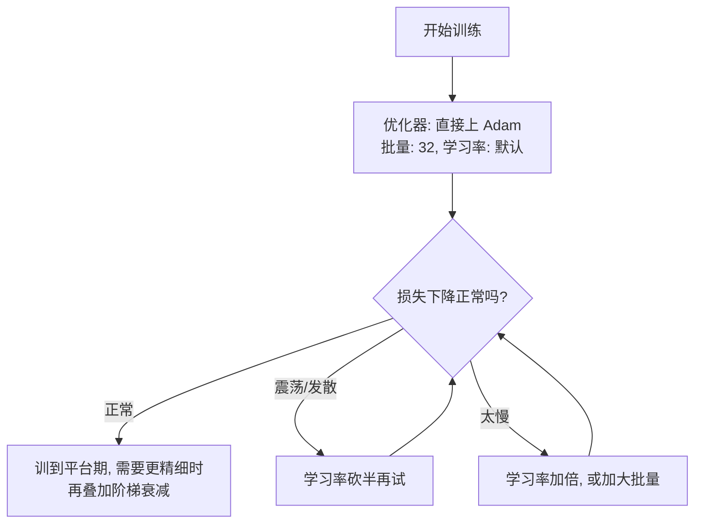

# 第11章 梯度下降家族

> 本章学习目标：
> 1. 能说出批量、随机、小批量三种梯度下降的区别和各自代价
> 2. 能解释动量法为什么收敛更快，说出"速度累积"的直觉
> 3. 能描述 Adam 的两个核心思想（不谈公式细节）
> 4. 能说出至少一种学习率调度策略及其动机

## 从一个例子开始

你在炒一锅菜，边炒边尝，目标是调到最佳咸度。

有两种尝法：

- **每尝一口只凭这一口调味**：快，但这一口可能正好舀到一块没化开的盐，你被带偏了。
- **把整锅搅匀，仔细尝一大勺再调味**：准，但每调一次都要搅一整锅，太慢。

还可以折中：每次舀一小碗尝。这就是本章要讲的三种梯度下降。第 5 章你学过梯度下降的基本形式——沿负梯度方向走一小步；第 10 章你学会了怎么用反向传播算出这一步的方向。但有两个问题还没回答：**梯度用哪些数据算**，以及**步子怎么迈得更聪明**。这两个问题的答案，构成了梯度下降的整个家族。

## 11.1 批量、随机、小批量

第 10 章的一次迭代用了一条样本。真实训练集有成千上万条样本，梯度到底用哪条算？

**批量梯度下降（batch gradient descent）**：每走一步，用**全部**训练数据算梯度。

- 优点：梯度方向最准，每一步都朝着整体损失下降的方向。
- 代价：数据集有 100 万条时，走一步要算 100 万次前向+反向。走一步，等一年。

**随机梯度下降（stochastic gradient descent，SGD）**：每次随机抽**一条**样本算梯度，立刻更新。

- 优点：一步只要一次前向+反向，飞快。
- 代价：单条样本的梯度方向噪声很大，损失曲线抖动厉害，像被那一口盐带偏的调味。

**小批量梯度下降（mini-batch）**：每次抽一小批（比如 32 条）算梯度的平均值。

- 梯度比单条稳，又比全量便宜得多。
- 实践中"SGD"这个词通常就是指小批量，批量大小（batch size）是一个要调的旋钮。

算一笔具体的账。训练集 60000 条样本，网络跑一条样本的前向+反向花 1 毫秒：

| 方式 | 一次更新算什么 | 一次更新的成本 | 走完一遍数据能更新几次 |
|---|---|---|---|
| 批量 | 60000 条的总梯度 | 60 秒 | 1 次 |
| 随机 | 1 条的梯度 | 1 毫秒 | 60000 次 |
| 小批量(32) | 32 条的平均梯度 | 32 毫秒 | 1875 次 |

同样过完一遍数据，批量法只挪了一步，小批量已经挪了 1875 步。即使单步方向没那么准，步数上的巨大优势几乎总是赢。

三个并排对比：

| | 批量 | 随机 | 小批量 |
|---|---|---|---|
| 单步方向 | 最准 | 噪声最大 | 较稳 |
| 单步成本 | 最贵 | 最便宜 | 便宜 |
| 损失曲线 | 平滑下降 | 剧烈抖动 | 轻微抖动 |
| 实践地位 | 几乎不用 | 理论原型 | 默认选择 |

三者放在一张图上，损失随时间下降的样子：

```
 损失
  │\
  │ \        批量: 稳但慢, 每一步都很贵
  │  \
  │   ~~~~\   小批量: 轻微抖动, 稳定向下
  │  ~\/~~/\~
  │  /\/\/\/~~\   随机(单条): 抖动剧烈, 大方向仍然向下
  │ /\/  \/\  \~~\
  └──────────────────────→ 时间
```

噪声有多大？用数字感受一下。假设真实的（全量）梯度是 1.0，四条样本各自的梯度是：

```
 样本1: 0.6    样本2: 1.5    样本3: 0.8    样本4: 1.1
 全量平均: (0.6 + 1.5 + 0.8 + 1.1) / 4 = 1.0   ← 最准
 随机抽 1 条: 抽到样本2就走 1.5, 抽到样本1只走 0.6, 忽大忽小
 小批量(2条): 抽到(1,2)走 1.05, 抽到(1,3)走 0.7, 抖动减半
```

抽的条数越多，平均后的梯度越贴近 1.0。批量大小本质上是"方向精度"和"更新频率"之间的兑换率。

**怎么选批量大小？** 经验起点是 32。样本之间差异大、噪声多，就调大一点让梯度更稳；数据量太大跑不动，就调小。没有理论能告诉你最优值，试出来的。

最后说一个反直觉的点：**噪声不全是坏事**。批量法的梯度太"诚实"，遇到浅的局部谷底（第 5 章提过）就老老实实停在里面。随机抽样的抖动像小球上绑了个震动马达，偶尔能把它从一个浅坑里颠出来，继续往更低处滚。这不是使用 SGD 的主要理由，但能解释为什么"每步都准"的批量法有时反而训不过带噪声的小批量。

## 11.2 动量法：带惯性的小球

只用当前梯度决定方向，还有一个问题：在狭长的山谷里，梯度下降会来回震荡。

想象一个两端翘起、中间狭长的碗。小球从边上滚下去，由于"左右方向"比"前后方向"陡，梯度几乎全指向左右，小球就在两壁之间来回撞，缓慢地才蹭到谷底。

```
   狭长山谷的俯视图 (越靠中心损失越低)

   ┌─────────────────────┐
   │  ╲                ╱ │
   │   ╲   ←─→←─→    ╱   │   ← 普通GD: 在两壁间震荡
   │    ╲  →→→→→→  ╱     │   ← 动量法: 震荡被抵消, 直冲谷底
   │     ╲___◎____╱      │       ◎ = 谷底
   └─────────────────────┘
```

**动量法（momentum）**给小球加上惯性：不只听当前梯度的，还记住之前一直在往哪走。

更新规则变成两行：

$$v \leftarrow \mu \cdot v + g$$

$$w \leftarrow w - \eta \cdot v$$

其中 $g$ 是当前梯度，$\eta$ 是学习率，$\mu$（mu）是动量系数，通常取 0.9。新变量 $v$ 可以理解成小球当前的"速度"。

$\mu = 0.9$ 意味着：每一步的速度 = 上一步速度的九成 + 当前梯度。

- 如果梯度连续多步指向同一方向（下坡），$v$ 越滚越大，步子越迈越快——**加速**。
- 如果梯度左右摇摆（山谷两壁间震荡），正负梯度在 $v$ 里互相抵消，横向晃动被**压掉**。

一个数字例子：假设梯度连续 5 步都是 1.0，$\mu = 0.9$：

```
 步数   v = 0.9·v_old + g
  1     0.9×0     + 1 = 1.000
  2     0.9×1.000 + 1 = 1.900
  3     0.9×1.900 + 1 = 2.710
  4     0.9×2.710 + 1 = 3.439
  5     0.9×3.439 + 1 = 4.095
```

第 5 步的实际步长已经是普通梯度下降的 4 倍多。滚得越久越快，这正是"惯性"。

再看震荡方向怎么被压掉。假设梯度左右摇摆：+1、-1、+1、-1 交替，$\mu = 0.9$：

```
 步数   v = 0.9·v_old + g
  1     0.9×0      + (+1) =  1.000
  2     0.9×1.000  + (-1) = -0.100
  3     0.9×(-0.1) + (+1) =  0.910
  4     0.9×0.910  + (-1) = -0.181
```

普通 GD 每一步都全速冲 +1 或 -1，来回满幅震荡；动量法的 $v$ 在 $\pm 1$ 之间越晃越小，震荡被"平均"掉了。同一时刻，沿着山谷方向（梯度恒为正）的分量却在持续累积——**一致的加速，摇摆的抵消**，这就是动量法的全部机制。

## 11.3 Adam：给每个参数配一个自动挡

动量法解决了"方向不稳"，还剩一个问题：**所有参数共用同一个学习率**。

有的参数梯度一直很大，有的参数梯度一直很小。用同一个 $\eta$，梯度大的参数可能步子过大来回跳，梯度小的参数半天爬不动。

**Adam（Adaptive Moment Estimation，自适应矩估计）**的思想，用两句话说完：

1. **像动量法一样**，记住梯度最近的走向，让方向更稳。
2. **给每个参数单独记一本账**：如果某个参数的梯度最近一直很小，就给它把步长自动放大；梯度一直很大的，自动把步长收小。

结果是每个参数都用自己的节奏前进，你不再需要小心翼翼地手调学习率——这就是为什么今天训练神经网络，绝大多数情况下第一个试的优化器就是 Adam。

名字里的"矩"你可以不管：它指的是程序里维护的两个滑动平均（梯度的平均走向、梯度大小的平均幅度），就对应上面两条。

Adam 的代价：每个参数要多存两个状态量（滑动平均值），内存翻倍多一点；行为也比 SGD 难分析。但在"开箱即用"这件事上，它目前没对手。

一个数字直觉。两个参数：$w_1$ 的梯度最近一直是 0.001 左右，$w_2$ 的梯度一直是 1.0 左右。普通 SGD 用同一个 $\eta$：

```
 普通SGD: 步长 = η·梯度
   w1 每步走 η×0.001  ← 慢得几乎不动
   w2 每步走 η×1.0    ← 可能来回跳

 Adam: 步长 ≈ η × (梯度走向 / 梯度幅度)
   w1 每步走 ≈ η×1    ← 小梯度被自动放大
   w2 每步走 ≈ η×1    ← 大梯度被自动收小
```

两个参数最后迈的步子差不多大——梯度只提供方向，幅度由 Adam 自己校准。这就是"自适应"三个字的具体含义。

那 Adam 是不是永远最优？也不是。两个例外要知道：一是资源受限的场景——比如嵌入式芯片上训练，每个参数多存两个滑动平均，内存直接乘三，小内存单片机可能装不下，这时朴素的 SGD 或动量法更实际；二是有些任务里 SGD 加动量精心调参后，最终精度略好于 Adam。但"先上 Adam 把模型跑起来"永远是合理的第一步。

## 11.4 学习率调度：先大后小

第 5 章说过：学习率太大来回跳，太小爬得慢。其实你不必二选一——**训练早期用大学习率，后期调小**。

直觉：刚出发时离谷底远，大步流星赶路；快到谷底时，步子收小，免得在谷底来回蹦。

```
 学习率
  │███████
  │       ████
  │           ████        ← 阶梯式: 每过若干轮砍一半
  │               ████
  └──────────────────────→ 训练轮数
```

最常见的做法叫**阶梯衰减（step decay）**：每训练固定的轮数，把 $\eta$ 乘一个小于 1 的数（比如 0.5）。也有平滑下降的做法，思想一样：前期求快，后期求稳。

一个具体的调度例子：初始 $\eta = 0.5$，每 1000 轮砍一半：

```
 轮数        η
 1~1000      0.5
 1001~2000   0.25
 2001~3000   0.125
 3001~4000   0.0625
```

什么时候用？损失曲线降到某个位置后不再下降、只在原地抖动——说明步子在谷底附近太大了，该砍学习率了。

用数字感受一下"砍学习率"的作用。最小化 $L = w^2$，当前 $w = 0.1$，梯度是 $2w = 0.2$：

```
 η = 0.5 不变:   w = 0.1 - 0.5×0.2 = 0      ← 看似一步到谷底
                 但下一步 w = 0 - 0 = 0, 有噪声时就会在 0 附近来回跳
                 假设梯度带噪声 ±0.1: w 在 -0.05 ~ +0.05 之间晃

 η 砍到 0.05:    w = 0.1 - 0.05×0.2 = 0.09   ← 前期慢
                 到谷底附近时, 同样 ±0.1 的噪声只让 w 晃 ±0.005
```

步长越小，噪声把你推离谷底的幅度也越小。后期砍学习率，本质是让"随机抖动"的影响收缩，把已经到手的精度守住。

## 11.5 怎么选：一张决策图

实际训练中面对的旋钮一下子多了起来。多数情况的默认路径：



先跑起来，再按损失曲线的症状调。这比开训前纠结参数值有效得多。

把本章的家族成员收进一张总表：

| 方法 | 改动的是什么 | 一句话记忆 |
|---|---|---|
| 小批量 SGD | 梯度用 32 条样本的平均 | 快与稳的折中 |
| 动量法 | 用累积速度代替单次梯度 | 一致加速，摇摆抵消 |
| Adam | 每个参数单独校准步长 | 自动挡，开箱即用 |
| 阶梯衰减 | 学习率随轮数变小 | 前期求快，后期求稳 |

它们不互斥——真实训练里常见的组合是"小批量 + Adam + 阶梯衰减"，三件套一起上。

## 动手实验：亲眼看动量法的加速

理论讲完了，让数字说话。这段代码构造一个狭长山谷：损失 $L = x^2 + 40y^2$。$y$ 方向比 $x$ 方向陡 40 倍，普通梯度下降会在 $y$ 方向来回震荡。我们分别用普通 GD 和动量法从 $(1, 1)$ 出发跑 300 步，对比损失下降速度：

```python
def loss(x, y):
    return x * x + 40.0 * y * y

def grad(x, y):
    return 2.0 * x, 80.0 * y

lr = 0.01
momentum = 0.9
steps = 300

xg, yg = 1.0, 1.0        # 普通 GD 的位置
xm, ym = 1.0, 1.0        # 动量法的位置
vx = vy = 0.0            # 动量法的速度

print("步数    普通GD损失     动量法损失")
hist_gd, hist_mom = [], []
for i in range(steps + 1):
    gx, gy = grad(xg, yg)
    xg -= lr * gx
    yg -= lr * gy
    hist_gd.append(loss(xg, yg))

    gx, gy = grad(xm, ym)
    vx = momentum * vx + gx      # 速度累积旧方向
    vy = momentum * vy + gy
    xm -= lr * vx
    ym -= lr * vy
    hist_mom.append(loss(xm, ym))

    if i % 50 == 0:
        print(f"{i:4d}   {hist_gd[-1]:12.6f}  {hist_mom[-1]:12.6f}")

target = 1e-4
t_gd = next((i for i, v in enumerate(hist_gd) if v < target), None)
t_mom = next((i for i, v in enumerate(hist_mom) if v < target), None)
print(f"\n损失降到 {target} 以下: 普通GD 用 {t_gd} 步, 动量法 用 {t_mom} 步")
```

**预期输出**：两种方法的损失都在降，但动量法明显更快——动量法约 86 步就把损失压到 0.0001 以下，普通 GD 要 227 步左右。第 50 步时普通 GD 的损失还在 0.13，动量法已经到 0.024。

为什么差距这么大？这个山谷的 $y$ 方向梯度（$80y$）是 $x$ 方向（$2x$）的 40 倍。普通 GD 的步子被大梯度方向主导，在 $y$ 方向来回震荡，$x$ 方向（真正通向谷底的方向）进展缓慢。动量法把 $y$ 方向的正负震荡抵消掉，把 $x$ 方向的一致梯度累积起来——震荡少了，直路快了，两头都赚。

试试把 `momentum` 改成 0.0（退化成普通 GD）、0.5、0.95，观察加速效果怎么变。改太大（比如 0.999）会看到损失先冲过头再回来——惯性太大的小球会滚过谷底。

代码里还有一个细节值得停下来看：动量法的更新写成两行（先更新 `vx, vy`，再用它们更新位置），而不是直接把梯度累加进位置。`vx, vy` 这对变量就是小球的"速度记忆"——少了它们，算法就退化成只看脚下的普通 GD。

## 常见误区

**误区：批量越大梯度越准，所以批量越大越好。**
真相：批量大意味着每一步都贵。全量数据算一次梯度的成本，小批量可能已经走了几百步、损失降了一大截。准不准要和快不快一起算账。

**误区：动量法是一种不同的"求梯度"方法。**
真相：动量法不改梯度的算法，改的是**用梯度的方式**——把历史梯度累积成速度，用速度而不是单次梯度来更新权重。

**误区：学习率调度有标准答案，照抄 0.1→0.01→0.001 就行。**
真相：什么时候降、降多少，取决于你的数据和模型。判断依据永远是损失曲线：还在稳定下降就别动，开始原地抖动了就砍。

## 章末习题

1. 训练集有 60000 条样本，批量大小设为 32。走完一遍全部数据（一个 epoch）需要更新多少次权重？
2. 用动量法，$\mu = 0.9$，前三步的梯度分别是 2.0、2.0、-1.0。算前三步的 $v$，并解释第三步发生了什么。
3. 本章实验中，狭长山谷是 $L = x^2 + 40y^2$。如果把 40 改成 1（圆形山谷），动量法的加速优势还在吗？为什么？
4. Adam 比动量法多记了一本什么账？这解决了什么问题？
5. （思考题）训练时损失曲线降到 0.1 后开始来回抖动、不再下降。你有两个旋钮可以动：学习率和批量大小。你会先动哪个，往哪个方向调？说出理由。

## 小结与下一章预告

- 梯度用多少数据算：全量（准而慢）、单条（快而飘）、小批量（折中，实践默认）。
- 动量法把梯度累积成速度，方向一致就加速、方向摇摆就抵消，狭长山谷里收敛快得多。
- Adam = 动量 + 每个参数自适应的步长，是目前最常用的默认选择。
- 学习率不必一成不变：前期大步赶路，后期小步微调。

下一章换个角度看训练失败的另一种原因：梯度还没传到前面的层就"消失"了——这和激活函数的形状、权重的初始值直接相关。
