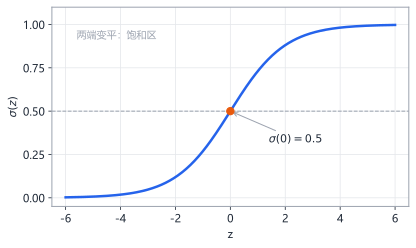
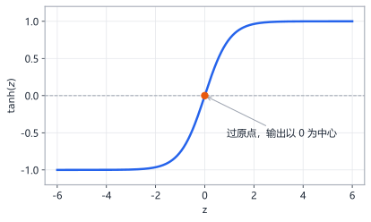
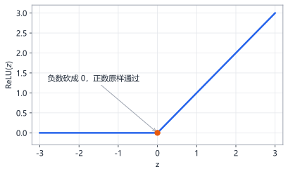
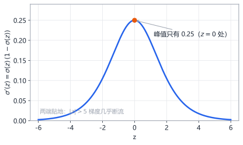
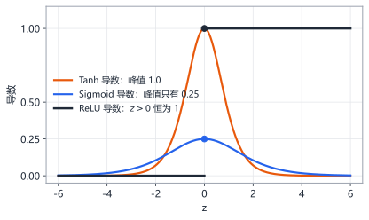
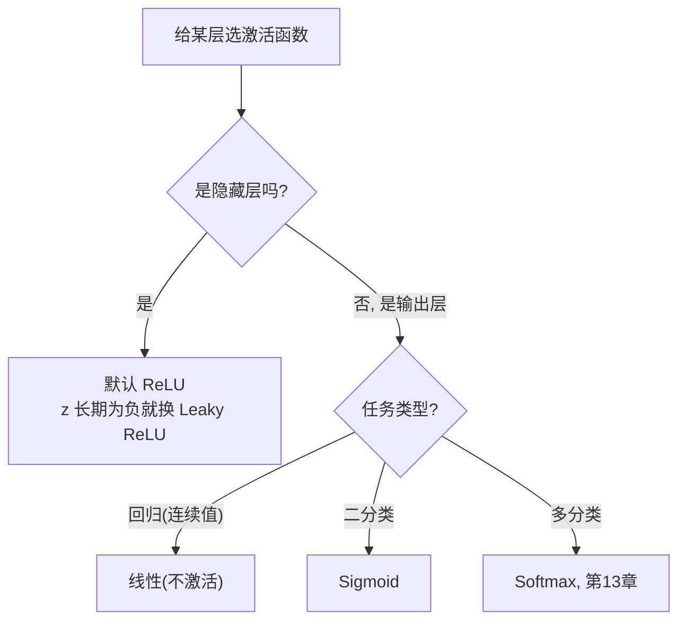

# 第12章 激活函数与权重初始化

> 本章学习目标：
> 1. 能画出 Sigmoid、Tanh、ReLU 的曲线，并说出三者导数的最大区别
> 2. 能用具体数字演示梯度消失是怎么发生的
> 3. 能解释 ReLU 成为隐藏层默认选择的两个理由
> 4. 能说出 Xavier 初始化要解决的问题和它的核心思想

## 从一个例子开始

传话游戏：一句话从第一个人传到最后一个人，每传一次都打一点折扣。

如果每个人复述时保留九成内容，传 5 个人还剩 $0.9^5 \approx 0.59$——勉强能懂。如果每个人只保留四分之一，传 5 个人就只剩 $0.25^5 \approx 0.001$——最后的人听到的基本是噪音。

第 10 章你算出过一个具体例子：2-2-1 网络里，输入侧权重的梯度只有输出侧的约十分之一。当时只有一层隐藏层，衰减还温和。现在想象 10 层、20 层——每传一层的折扣是固定的，层数翻倍，总折扣是**平方**关系。这就是为什么网络一加深，训练就可能莫名其妙地"卡住"：不是代码错了，是梯度在路上走丢了。

神经网络训练时，梯度就是这样从输出层往输入层传的。每传一层打多少折扣，取决于两件事：你选的**激活函数**，和权重的**初始值**。这一章把这两件事讲透——讲完之后，"为什么大家都用 ReLU"和"为什么初始化不能随便填"这两个问题的答案，你自己就能推出来。

## 12.1 三个候选激活函数

先回顾激活函数是干什么的（第 6 章）：没有它，多少层网络叠起来都等价于一层线性变换，学不会弯曲的边界。它在第 6 章登场时的角色是"给神经元一个非线性的脾气"；本章换个视角，把它当成"梯度通道上的一个关卡"来审查。三个最常用的候选：

**Sigmoid**：$\sigma(z) = \dfrac{1}{1+e^{-z}}$，把任何数压进 $(0, 1)$。



**Tanh**：$\tanh(z) = \dfrac{e^{z}-e^{-z}}{e^{z}+e^{-z}}$，压进 $(-1, 1)$，过原点。



**ReLU（Rectified Linear Unit，修正线性单元）**：$f(z) = \max(0, z)$，负数砍成 0，正数原样通过。



代入同一个数 $z = 2$ 对比一下手感：

```
 Sigmoid(2) = 0.881     ← 压到 0~1
 Tanh(2)    = 0.964     ← 压到 -1~1
 ReLU(2)    = 2         ← 原样放行
```

前两个像"闸门"，把任何输入压进固定范围；ReLU 像"单向阀"，负数挡死，正数不碰。

怎么读这三张图？盯两个位置：**中间**（$z$ 接近 0，神经元最敏感，输出随输入明显变化）和**两端**（$|z|$ 大，曲线变平，输入再变化输出也几乎不动——这叫饱和）。Sigmoid 和 Tanh 两端都是平的，ReLU 只有左半边是平的。这个差别在下一节会变成决定性差距。

Tanh 还有一个细节值得记：它的输出以 0 为中心（负输入得负输出），而 sigmoid 的输出永远是正数。作为隐藏层激活，零中心的输出让下一层收到的信号有正有负、均值接近 0，梯度更新更均衡——所以"一定要用闸门型激活"时，Tanh 通常优于 Sigmoid。

## 12.2 关键不在形状，在导数

激活函数影响训练，靠的不是它的输出长什么样，而是它的**导数**——因为反向传播每过一层就要乘一次激活函数的导数（第 10 章的 $\delta$ 公式）。

换句话说：前向传播时激活函数决定"输出是什么"，反向传播时它的导数决定"梯度能传回去多少"。选激活函数，本质是在选后者的形状。三个导数：

| 函数 | 导数 | 导数最大值 | 大 $\lvert z \rvert$ 时的导数 |
|---|---|---|---|
| Sigmoid | $\sigma(z)(1-\sigma(z))$ | 0.25（在 $z=0$） | 接近 0 |
| Tanh | $1-\tanh^2(z)$ | 1.0（在 $z=0$） | 接近 0 |
| ReLU | $z>0$ 时为 1，否则为 0 | 1.0 | 正区间恒为 1 |

Sigmoid 导数的形状（第 10 章已经用过这个数）：



配一张数值表，每个数都能拿计算器核对（$\sigma(z) = 1/(1+e^{-z})$，导数 $= \sigma(1-\sigma)$）：

| $z$ | $\sigma(z)$ | $\sigma'(z)$ | 状态 |
|---|---|---|---|
| -5 | 0.007 | 0.007 | 深度饱和，梯度几乎断流 |
| -2 | 0.119 | 0.105 | 开始饱和 |
| 0 | 0.500 | 0.250 | 最敏感，导数峰值 |
| 2 | 0.881 | 0.105 | 开始饱和 |
| 5 | 0.993 | 0.007 | 深度饱和，梯度几乎断流 |

注意两处：**峰值只有 0.25**，两端几乎贴地。这意味着只要神经元的输入 $z$ 落到 $|z| > 5$ 的区间（称为饱和区），导数就接近 0，梯度传到这层基本断流。Tanh 稍好（峰值 1.0），但两端同样饱和。

把三个导数画在同一坐标里对比，差距一目了然：



Sigmoid 的导数全程不到 0.25；Tanh 在原点附近冲到 1.0 但两端同样衰减；只有 ReLU 在整个正区间保持满格的 1。

顺带回答一个你可能攒了很久的问题：$\sigma'(z) = \sigma(z)(1-\sigma(z))$ 这个好记的形式是怎么来的？对 $\sigma(z) = (1+e^{-z})^{-1}$ 用链式法则求导（外层是 $u^{-1}$，内层是 $1+e^{-z}$，第 4 章的工具），化简后指数项全部消掉，只剩 $\sigma$ 自己。推导细节不展开，但这个性质有实际的工程价值：算导数时不用再算一遍 $e^{-z}$，直接用前向传播存下来的输出值——第 9 章代码里的 `a*(1-a)` 就是这么省出来的。

## 12.3 梯度消失：用数字看一遍

第 10 章你已经看到：误差每往回传一层，要乘一次权重、乘一次激活函数导数。现在把这个机制推到极致，看深网络里会发生什么。

假设一个 5 层网络，每层都用 sigmoid，且每个神经元的导数都取到最大值 0.25——**最乐观**的情况。输出层的梯度是 1.0，传到第 1 层时：

```
 传到第4层: 1.0 × 0.25        = 0.25
 传到第3层: 0.25 × 0.25       = 0.0625
 传到第2层: 0.0625 × 0.25     = 0.0156
 传到第1层: 0.0156 × 0.25     = 0.0039
```

还没乘权重，梯度已经只剩出发时的 0.4%。如果导数不是最理想（实际中 sigmoid 导数平均远低于 0.25），或者层数再翻一倍，梯度就是字面意义上的"消失"——前面层的权重每次更新量接近零，训练几万个轮次也纹丝不动。

把账算到 10 层：$0.25^9 \approx 0.0000038$。输出层附近的权重正常学习，第 1 层的权重每步只动百万分之几——**同一个网络，后半段在上学，前半段在睡觉**。这个现象不是理论恐吓：深度学习历史上，sigmoid 主导的深层网络长期训不动，整个领域一度因此停滞；直到 ReLU 被大规模采用，"加深网络"才重新变成可用的武器。你现在手里这个直觉（连乘小于 1 的数会消失），就是那段历史的全部数学。

第 10 章的 2-2-1 网络里其实已经出现过这个现象的前奏：输出侧权重的梯度约 0.068，输入侧只有约 0.006——才隔一层就小了 10 倍，因为链上夹着一个 $v_1$ 和一个不到 0.25 的 sigmoid 导数。层数加深，这个差距会一层一层指数级放大。

权重也在同一条乘法链里。第 10 章的公式 $\delta_{\text{前层}} = \delta_{\text{后层}} \times w \times f'(z)$ 说明每传一层还要再乘一次 $w$：

```
 若权重普遍 |w| < 1:  0.25 × 0.5 = 0.125, 每层折扣更狠 → 消失更快
 若权重普遍 |w| > 1:  0.25 × 1.5 = 0.375, 可能反而越乘越大 → 梯度爆炸
```

消失和爆炸是同一枚硬币的两面：连乘的因子平均小于 1 就消失，大于 1 就爆炸。深层网络训练难，难在这条链上每个因子都得"刚刚好"。

换成 ReLU 呢？正区间导数恒为 1：

```
 传到第4层: 1.0 × 1 = 1.0
 传到第3层: 1.0 × 1 = 1.0
 传到第2层: 1.0 × 1 = 1.0
 传到第1层: 1.0 × 1 = 1.0    ← 不打折
```

只要神经元处于激活状态（$z > 0$），梯度传多远都不衰减。当然，权重那一项还在链上——ReLU 解决的是"激活函数这一环不再打折"，权重该初始化好还是得初始化好，这就是 12.5 的事。

## 12.4 为什么默认选 ReLU

综合前两节，答案已经摆在桌面上了。两个理由：

1. **导数不衰减**。上面那组数字就是全部理由。
2. **便宜**。Sigmoid 和 Tanh 要算 $e^z$（指数运算），ReLU 只是"比 0 大不大"。在没有硬件浮点加速的嵌入式芯片上，这个差距直接体现为推理速度和功耗——一片 Cortex-M 上跑一次 `exp` 的开销，够 ReLU 比几十次。

有人可能会想：梯度消失，那把学习率调大补偿不就行了？行不通。消失是**逐层不同**的——第 1 层衰减到百万分之一，第 5 层只衰减到千分之一，没有一个全局学习率能同时补偿所有层：照顾了第 1 层，输出层就会一步跨过谷底发散。病根在连乘结构上，只能从激活函数和初始化下手。

ReLU 不是没有代价：**死亡 ReLU**。看一个具体场景。某神经元的偏置在某次大更新后变成 $-5$，此后对训练集中的大多数输入，$z = w_1x_1 + \cdots - 5$ 都是负数：

```
 z = -3.2 → 输出 0, 导数 0 → 这轮它收不到任何梯度
 z = -1.8 → 输出 0, 导数 0 → 还是没有
 ... 参数永远不动, z 永远为负, 永远输出 0
```

输出恒为 0、导数恒为 0，梯度到它这里彻底断流，它再也收不到更新信号——永久"死亡"。一个网络里死掉 30% 的神经元，等于白白砍掉近三分之一的容量。

缓解办法：学习率别太大（避免一步把它打进负区间出不来），或者用它的变体（负数区间留一个小斜率，如 Leaky ReLU，$z<0$ 时 $f(z)=0.01z$，导数 0.01 而不是 0，留一口气）。

工程上的默认配方：**隐藏层用 ReLU，输出层按任务选**——回归用线性（不激活），二分类用 sigmoid，多分类用 softmax（第 13 章）。三者全貌收进一张表：

| | Sigmoid | Tanh | ReLU |
|---|---|---|---|
| 输出范围 | $(0, 1)$ | $(-1, 1)$ | $[0, +\infty)$ |
| 导数峰值 | 0.25 | 1.0 | 1.0（正区间恒为 1） |
| 饱和区 | 两端都有 | 两端都有 | 只有负区间 |
| 计算成本 | 指数运算，贵 | 指数运算，贵 | 一次比较，最便宜 |
| 典型风险 | 梯度消失 | 梯度消失（较轻） | 神经元死亡 |
| 今天的位置 | 二分类输出层 | 少数老网络 | 隐藏层默认 |

用一张决策图收尾：



## 12.5 权重初始化：别让信号第一圈就衰减

梯度消失是训练**过程中**的病。还有一种病在训练**开始前**就埋下了：权重初始值没选好。

这里要守住一个区分：激活函数决定的是"梯度每传一层打几折"，是**长期**问题；初始化决定的是"第一圈前向/反向传播时信号有多强"，是**开局**问题。开局就进饱和区或缩到零附近，后面用什么激活函数都救不回来。

看前向传播的信号强度。一层里 $z = w_1 x_1 + w_2 x_2 + \cdots + w_n x_n$，是 $n$ 个乘积相加。用数字感受一下两种坏情况。假设每层有 10 个输入，每个输入都在 1 左右：

```
 情况A: 权重都在 2 左右
   第1层 z ≈ 10×2×1 = 20
   第2层 z ≈ 10×2×20 = 400
   第3层 z ≈ 10×2×400 = 8000     ← 三层就冲上天, sigmoid 全部饱和

 情况B: 权重都在 0.01 左右
   第1层 z ≈ 10×0.01×1 = 0.1
   第2层 z ≈ 10×0.01×0.1 = 0.01
   第3层 z ≈ 10×0.01×0.01 = 0.001 ← 三层就缩没了, 所有输出≈0
```

直觉总结：

- 权重普遍太大 → 每过一层，信号幅度被放大一次，几层之后 $z$ 冲到饱和区（sigmoid 导数归零，ReLU 也只剩单边）。
- 权重普遍太小 → 每过一层信号缩一次，几层之后全变成 0 附近，什么都学不到。
- 输入的个数 $n$ 也很关键：100 个输入各自贡献一点，$z$ 的幅度天然比 2 个输入时大。

**Xavier 初始化（Xavier initialization）**的思想一句话：**让信号穿过每一层后强度不衰减也不放大**。要做到这点，权重不能乱取，它的典型幅度应该大约是

$$\text{幅度} \approx \sqrt{\frac{2}{n_{\text{in}} + n_{\text{out}}}}$$

其中 $n_{\text{in}}$ 是这一层的输入个数，$n_{\text{out}}$ 是输出个数。具体做法：从均值为 0、标准差等于上面这个值的正态分布（第 3 章的钟形曲线）里随机取权重。均值取 0 是因为没有理由让信号偏向正或负；标准差由层的宽度决定——这才是 Xavier 的核心。

数字感受一下。2 个输入、2 个输出的层（第 10 章的隐藏层）：

$$\text{幅度} = \sqrt{\frac{2}{2+2}} = \sqrt{0.5} \approx 0.707$$

100 个输入、50 个输出的层：

$$\text{幅度} = \sqrt{\frac{2}{100+50}} = \sqrt{\frac{2}{150}} \approx 0.115$$

输入越多，每个权重就得越小——因为求和的项数多了，每项必须收敛，总和才不爆。分母里同时放 $n_{\text{in}}$ 和 $n_{\text{out}}$，是兼顾前向（信号从输入来）和反向（梯度往输入去）两个方向的折中。

怎么判断你的初始化健不健康？一个可操作的检查：随机初始化后跑一圈前向传播，看每一层 $z$ 的典型幅度。如果逐层暴涨（1 → 20 → 400 那样）或逐层萎缩（1 → 0.1 → 0.01 那样），初始化就有问题；各层幅度差不多，开局就是健康的。

这个公式不是凭空来的，它的推导逻辑（了解即可，不要求会推）：

```
 目标: 信号穿过一层后, 强度(波动幅度)不变
 一层做的是 z = w1·x1 + ... + wn·xn, 共 n 项相加
 n 个随机项相加, 总和的波动 ≈ 单项波动 × √n   (第 3 章: 方差随项数线性增长)
 要让总波动不放大: 每个 w 的波动就该 ≈ 1/√n
 前向看 n_in、反向看 n_out, 折中: 2/(n_in + n_out), 再开根号
```

你不用记住推导，记住结论和那句直觉就够：**输入越多的层，权重必须越小**。

不用 Xavier 也行——但你会在深层网络上频繁看到"损失一动不动"或"第一轮就 NaN"，排查半天发现是初始化。这是低成本高回报的一步。第 9 章的 `Net` 类里那句 `scale = math.sqrt(2.0 / (rows + cols))`，就是 Xavier——现在你知道它为什么长这样了。

偏置怎么办？偏置不参与"输入项数累加"，没有放大信号的问题，**初始化为 0 就可以**（第 9 章的代码正是这么做的）。需要随机的只有权重——权重全为零会让同层神经元永远同步（见常见误区第三条），偏置全零没有这个问题，因为打破对称的工作已经被随机权重完成了。

## 动手实验：亲眼看梯度消失

理论讲了半天"连乘衰减"，不如让程序把每层传到第 1 层的梯度直接打出来。这段代码搭一个"每层只有 1 个神经元"的极简深网络（深度可调），输出层损失已知，然后用第 10 章的方法把梯度逐层传回第 1 层，看它的量级。同样的网络分别用 sigmoid 和 ReLU 各跑一遍。

先说明代码结构：`first_layer_grad` 分两段——第一段前向传播，把每层的 $z$ 和激活值存进 `zs`、`acts`（第 10 章说过，反向传播离不开这些中间值）；第二段从输出层往回走，每层乘一次权重和激活导数。网络简化成"每层 1 个神经元、权重都是 0.8"，唯一的目的就是让"连乘衰减"这个现象孤立地暴露出来：

```python
import math

def sigmoid(x):
    return 1.0 / (1.0 + math.exp(-x))

def relu(x):
    return max(0.0, x)

def first_layer_grad(activation, depth):
    w = 0.8                      # 每层一个权重
    x, y = 1.0, 1.0
    zs, acts = [], [x]
    for _ in range(depth):       # 前向: 逐层存 z 和激活值
        z = w * acts[-1]
        zs.append(z)
        acts.append(activation(z))
    delta = acts[-1] - y         # 输出层误差 (y_hat - y)
    for l in range(depth - 1, 0, -1):   # 逐层传回第 1 层
        if activation is sigmoid:
            delta *= w * acts[l] * (1 - acts[l])
        else:
            delta *= w * (1.0 if zs[l] > 0 else 0.0)
    return delta * x             # 第 1 层权重梯度 = delta · 前层输出

print("层数   Sigmoid 第1层梯度      ReLU 第1层梯度")
for depth in [1, 2, 3, 5, 8, 10]:
    g_sig = first_layer_grad(sigmoid, depth)
    g_relu = first_layer_grad(relu, depth)
    print(f"{depth:4d}   {g_sig:18.8f}   {g_relu:18.8f}")
```

**预期输出**：随层数加深，sigmoid 一侧的第 1 层梯度从 -0.31 一路缩到 -0.0000001（10 层时），ReLU 一侧始终保持在 -0.1 ~ -0.3 之间，不衰减。逐层读这张表：sigmoid 每多两层大约再小一个数量级，这就是"指数级衰减"在数字里的样子。

把输出里的两组数字除一下：10 层时 sigmoid 的梯度只剩 ReLU 的约百万分之一。如果用 sigmoid 的深网络做梯度下降，第 1 层的权重每步更新量是这个微小的梯度再乘学习率——这就是为什么深层 sigmoid 网络"前面几层根本学不动"。

再把 `depth` 列表里加上 20 跑一遍：sigmoid 一侧的梯度会小到浮点数都快表示不下，ReLU 一侧还在原来的量级。现象随深度指数级加剧，没有任何"调参"能绕过它。

最后说一句诚实的边界：ReLU 一族之外还有更新的激活函数（GELU、Swish 等），它们在大型网络里略有优势，思想都是"在 ReLU 基础上把负半轴处理得更平滑"。学会本章的读法（看导数、看饱和区），以后见到任何新激活函数你都能自己判断它的脾气。

把代码里的 `w = 0.8` 改成 `0.3`，sigmoid 消失得更快；改成 `1.2` 也不会爆炸——$z$ 被推进饱和区，sigmoid 导数反而更小，消失只会加剧。想亲眼看爆炸，把激活函数换成 ReLU 再设 `w = 1.2`：梯度每层乘 1.2，10 层后第 1 层梯度涨到 26 以上。消失的反面是爆炸，病根相同：连乘的因子偏离 1。

## 常见误区

**误区：ReLU 处处导数为 1，所以用 ReLU 就不会有梯度问题。**
真相：负区间导数是 0。权重乘积过大时梯度照样爆炸（本章实验的最后一步就能看到），$z$ 跌进负区间的神经元照样死亡。ReLU 只是缓解了消失，不是免疫。

**误区：Xavier 初始化能保证训练成功。**
真相：它只保证**第一圈**前向/反向传播时信号幅度正常。训练中权重会变化，激活函数、学习率、数据归一化任何一环出问题，梯度照样会消失或爆炸。它是入场券，不是保险单。

**误区：权重全部初始化为 0，最简单也最对称。**
真相：全零初始化下，同一层的所有神经元前向输出相同、反向梯度相同、更新量相同——它们永远保持一模一样，等于这一层只有一个神经元。用数字看一眼：某层两个神经元权重都是 0、偏置都是 0，输入 $(0.5, 0.8)$——前向输出相同；反向时两者的 $\delta$ 相同、乘的前层输出相同、梯度相同、更新后还是相同。永远锁死。必须随机，打破对称。

## 章末习题

1. sigmoid 在 $z = 0$ 处导数最大，为 0.25。用 $\sigma(0) = 0.5$ 直接验证这个数值，并说明为什么这是它的最大值（从 $\sigma(1-\sigma)$ 这个形式想）。
2. 一个 6 层网络全用 sigmoid，假设每层导数都是 0.2，输出层梯度为 0.5。传到第 1 层时梯度大约是多少？
3. 一个神经元用 ReLU，某次前向传播中 $z = -2$。这次反向传播中它会收到梯度更新吗？如果这种情况持续很多轮，后果是什么？
4. 某层有 200 个输入、100 个输出，用 Xavier 初始化，权重的典型幅度是多少？如果改成 200 输入、200 输出呢？两个答案的变化方向说明了什么？
5. （思考题）第 10 章的 2-2-1 网络中，输入侧权重的梯度（约 0.006）比输出侧（约 0.068）小约 10 倍。用本章的知识解释：链上夹了哪几个折扣因子？如果网络加深到 5 个隐藏层，你预计差距会变成几个数量级？

## 小结与下一章预告

本章要点：

- 激活函数影响训练靠的是导数：Sigmoid 峰值 0.25，ReLU 正区间恒为 1。
- 梯度消失 = 小于 1 的数沿层连乘；5 层 sigmoid 最乐观也只剩 0.4%。
- ReLU 成为隐藏层默认：导数不衰减 + 计算便宜，代价是可能"死亡"。
- Xavier 初始化让信号穿层不衰减：权重幅度 $\approx \sqrt{2/(n_{\text{in}}+n_{\text{out}})}$，输入越多权重越小；偏置初始化为 0 即可。

把三件事串起来看：初始化管开局（第一圈信号正常），激活函数管过程（梯度传得回去），学习率管节奏（步子不跨过谷底）。训练一个深层网络不出事，三个条件缺一不可。

下一章讲输出层的最后一道工序：多分类时怎么把一串任意实数变成概率（softmax），以及为什么分类问题的损失函数不用平方误差，而用交叉熵。
