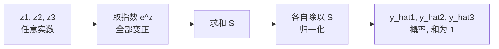

# 第13章 Softmax与数值稳定性

> 本章学习目标：
> 1. 能手算一遍 softmax：从任意实数到概率的每一步
> 2. 能逐步推出"softmax + 交叉熵"的梯度为什么是 $\hat{y} - y$
> 3. 能解释 `log(0)` 和 `e^1000` 各会引发什么事故，以及对应的标准防护手段
> 4. 能说明温度系数 $T$ 如何调节 softmax 输出的"自信程度"
> 5. 能用具体数字说明输入特征量纲不同为什么会拖垮训练

## 从一个例子开始

期末考试，三门课的原始分是：语文 2 分、数学 1 分、英语 0.1 分——这不是真实分数，是网络最后一层吐出的三个任意实数 $z$。

老师要做两件事：

1. 把这三个数变成"哪门课最可能是答案"的概率——必须非负、加起来等于 1。
2. 给这份答案打分：正确答案越没被你押中，扣分越狠。

第一件事用 softmax，第二件事用交叉熵（cross-entropy）。这两个加起来，就是所有分类网络输出层的标准配置。本章把它们逐步拆开，再讲两个"数字太大/太小会把程序搞崩"的坑，最后回到输入端：特征量纲不齐会带来什么麻烦。

## 13.1 Softmax：从任意实数到概率

先想清楚"为什么不能直接归一化"。最简单的想法是把三个 $z$ 直接除以它们的和——但 $z$ 可以是负数（比如 $2, -1, -0.5$），除出来的"概率"有负有正，不是概率。我们需要一个东西先把任意实数**全部变正**。

第 4 章学过的指数函数 $e^x$ 正好合用：它永远为正，且增长极快——输入差 1，输出差约 2.7 倍。softmax（软最大化）就借用了这两个性质。

给定输出层的三个 $z$（沿用上面的例子）：$z_1 = 2.0,\ z_2 = 1.0,\ z_3 = 0.1$。

**第 1 步：每个数取指数，全部变正。**

$$e^{2.0} = 7.389, \qquad e^{1.0} = 2.718, \qquad e^{0.1} = 1.105$$

**第 2 步：求和。**

$$S = 7.389 + 2.718 + 1.105 = 11.212$$

**第 3 步：每个除以总和，归一化成概率。**

$$\hat{y}_1 = \frac{7.389}{11.212} = 0.659, \qquad \hat{y}_2 = \frac{2.718}{11.212} = 0.242, \qquad \hat{y}_3 = \frac{1.105}{11.212} = 0.099$$

写成公式，第 $i$ 个输出：

$$\hat{y}_i = \frac{e^{z_i}}{\sum_{j} e^{z_j}}$$

结果满足概率的两条铁律：每个都在 $(0, 1)$ 内，加起来恰好等于 1（$0.659+0.242+0.099 = 1.000$）。

再注意一个性质：**指数放大了差距**。$z_1$ 只比 $z_3$ 大 1.9，但概率 0.659 是 0.099 的 6.7 倍。网络只要对正确答案有一点点倾向，softmax 就把这个倾向放大成明显的偏好。



## 13.2 交叉熵：只盯正确答案

有了概率，怎么打分？假设正确答案是第 1 类，真实标签用 one-hot 写成 $y = [1, 0, 0]$。

**交叉熵损失**：

$$L = -\sum_i y_i \ln \hat{y}_i$$

$\ln$ 是以 $e$ 为底的对数（第 4 章讲过，它是 $e^x$ 的反函数）。因为 $y$ 里只有一个 1，求和展开后其他项全被乘成 0，实际只剩：

$$L = -\ln \hat{y}_1$$

代入数字：$\hat{y}_1 = 0.659$，则

$$L = -\ln 0.659 = 0.417$$

直觉很直白：

```
 预测概率 ŷ1   损失 L = -ln(ŷ1)
   1.00        0.000   ← 押中满分, 不扣分
   0.659       0.417
   0.50        0.693
   0.10        2.303   ← 快没押中, 狠扣
   0.01        4.605
   → 0         → ∞     ← 完全没押中, 扣到无穷大
```

为什么不用平方误差？两个原因。第一，交叉熵只盯正确类别的概率，其他类别不分散注意力。第二——也是下一节要证的——它和 softmax 搭配时，梯度会简化成一个极其干净的形式。

## 13.3 推导：梯度为什么恰好是 $\hat{y} - y$

这是神经网络里最漂亮的一次化简。目标：求 $L$ 对输出层某个 $z_i$ 的偏导数（就是第 10 章的 $\delta$）。

**第 1 步：把 $L$ 用 $z$ 表示。** $\hat{y}_1 = e^{z_1} / S$，对数拆除法为减法：

$$L = -\ln \hat{y}_1 = -\ln\frac{e^{z_1}}{S} = -z_1 + \ln S$$

**第 2 步：分别对 $z_i$ 求偏导。** 第一项：如果 $i = 1$，导数是 $-1$；否则是 0。用 one-hot 标签写，正好是 $-y_i$。

第二项 $\ln S$，其中 $S = \sum_j e^{z_j}$。链式法则：外层 $\ln$ 的导数是 $\frac{1}{S}$，内层 $S$ 对 $z_i$ 的导数是 $e^{z_i}$（求和里只有含 $z_i$ 的那一项求导不为零）：

$$\frac{\partial \ln S}{\partial z_i} = \frac{1}{S} \cdot e^{z_i} = \hat{y}_i$$

**第 3 步：合起来。**

$$\boxed{\frac{\partial L}{\partial z_i} = \hat{y}_i - y_i}$$

没了。没有 sigmoid 那样的 $\hat{y}(1-\hat{y})$ 因子，没有连乘——输出层误差直接就是"预测概率减真实标签"。

代入数字验证直觉：$\hat{y} - y = [0.659-1,\ 0.242-0,\ 0.099-0] = [-0.341,\ 0.242,\ 0.099]$。

- 正确类别的梯度是**负**的 → 更新时 $z_1$ 被调高 → 正确类概率上升。
- 错误类别的梯度是**正**的 → $z_2, z_3$ 被压低。

这个组合（softmax + 交叉熵）是分类问题的默认答案：误差信号干净、不需要额外乘激活导数、算得还快。

## 13.4 温度系数：给 softmax 装一个旋钮

softmax 还有一个隐藏旋钮：**温度系数（temperature）**，记作 $T$。公式只是多除一步：

$$\hat{y}_i = \frac{e^{z_i / T}}{\sum_j e^{z_j / T}}$$

$T = 1$ 就是普通的 softmax。$T$ 的作用像空调的设定温度，只不过它调的是分布的"冷热"——

- $T < 1$（低温）：每个 $z$ 先被放大再取指数，差距被进一步拉开，概率分布变**尖**，赢家几乎通吃。
- $T > 1$（高温）：每个 $z$ 先被压扁，差距被抹平，概率分布变**平**，大家雨露均沾。

还用 $z = [2.0,\ 1.0,\ 0.1]$ 这组数，看看不同 $T$ 下的输出：

```
 T=0.5  0.864 / 0.117 / 0.019   尖锐: 第一名拿走绝大部分
 T=1.0  0.659 / 0.242 / 0.099   (普通 softmax)
 T=2.0  0.502 / 0.304 / 0.194
 T=100  0.337 / 0.333 / 0.330   平坦: 几乎平均分
```

两个极端值得记住：

- $T \to 0$：softmax 退化成"硬最大化"——最大那一类概率为 1，其余全为 0，和直接取最大值没区别。
- $T \to \infty$：所有类别概率都等于 $1/n$，完全不表达任何偏好。

什么时候拧这个旋钮？想让模型输出"更果断"就调低 $T$；想保留多个候选供下游模块参考，就调高 $T$。你在大模型聊天界面上见到的"temperature"参数，就是这个 $T$——调低它回答更保守确定，调高它回答更发散多样。

一个细节：下一节的"减最大值"防护和温度可以叠加，先减最大值再除以 $T$，即 $e^{(z_i - m)/T}$，数学结果不变，数值上依然安全（softmax 的平移不变性对任意缩放都成立）。

## 13.5 两个数值陷阱

### 13.5.1 $e^{1000}$：溢出

计算机里的浮点数有上限，双精度大约能装到 $1.8 \times 10^{308}$，对应 $e^{709}$。$z$ 达到 1000 时，$e^{1000}$ 直接溢出，程序报错或得到无穷大，概率变成 NaN，训练当场报废。

**防护：先减去最大值再取指数。**

$$\hat{y}_i = \frac{e^{z_i - m}}{\sum_j e^{z_j - m}}, \qquad m = \max(z)$$

减完之后，最大的指数项变成 $e^0 = 1$，其余都小于 1，永不溢出。

这样做结果会变吗？不会。分子分母同乘了一个 $e^{-m}$，约掉了：

$$\frac{e^{z_i - m}}{\sum_j e^{z_j - m}} = \frac{e^{-m} \cdot e^{z_i}}{e^{-m} \cdot \sum_j e^{z_j}} = \frac{e^{z_i}}{\sum_j e^{z_j}}$$

数学上严格相等，数值上安全。所有成熟实现的 softmax 里都藏着这一行减最大值。

### 13.5.2 $\log(0)$：负无穷

交叉熵里有 $\ln \hat{y}$。如果某个类别的预测概率恰好是 0（浮点下溢时会发生），$\ln 0 = -\infty$，损失变成无穷大，接着梯度变成 NaN，后面所有权重全部被污染。

**防护：加一个极小值 $\varepsilon$。**

$$L = -\ln(\hat{y} + 10^{-10})$$

$10^{-10}$ 是 0.0000000001，小到不影响正常概率的损失值，又刚好让对数的输入永远大于 0。

这两个防护加起来不到三行代码，但少了它们，你的训练会在某个深夜的第几万轮突然崩掉，而且很难查。

## 13.6 输入端：量纲不齐的代价

数值稳定不只输出端有坑。看一个输入端的例子。

你要预测一个综合评分，两个特征：$x_1$ 是距离，单位**千米**，取值 0.001 左右；$x_2$ 是重量，单位**克**，取值 500 左右。模型是 $y = w_1 x_1 + w_2 x_2$，损失是平方误差。

第 10 章的结论：权重梯度 = 误差 × 输入值。初始预测为 0、目标为 1 时：

$$\frac{\partial L}{\partial w_1} = 2 \times (-1) \times 0.001 = -0.002$$

$$\frac{\partial L}{\partial w_2} = 2 \times (-1) \times 500 = -1000$$

**同一个误差，两个梯度差了 50 万倍。** 而两个权重共用同一个学习率 $\eta$：

- $\eta$ 按 $w_2$ 的梯度（1000）调到不发散 → $w_1$ 每步的更新量只有 $w_2$ 的五十万分之一，训练到天荒地老也学不到东西；
- $\eta$ 调得适合 $w_1$（稍大）→ $w_2$ 一步跨过最优值，损失震荡甚至发散。

一个学习率伺候不了两种量纲。解决办法简单到不像话：**归一化（normalization）**——训练前把每个特征单独缩放到相近的范围（比如都压到 $[0, 1]$）：

$$x' = \frac{x - x_{\min}}{x_{\max} - x_{\min}}$$

量纲消失，梯度回到同一量级，一个学习率就能让两个权重同步学习。这就是为什么几乎所有训练流程的第一步都是归一化。

## 动手实验：溢出、防护与归一化

这段代码分三部分。第一部分对比"朴素 softmax"和"减最大值版 softmax"在大输入下的表现；第二部分用两个量纲悬殊的特征做梯度下降，对比归一化前后的训练结果；第三部分拧动温度旋钮，看同一组 $z$ 在不同 $T$ 下的概率分布变化。

```python
import math

def softmax_naive(zs):
    exps = [math.exp(z) for z in zs]
    s = sum(exps)
    return [e / s for e in exps]

def softmax_stable(zs):
    m = max(zs)                        # 先减最大值
    exps = [math.exp(z - m) for z in zs]
    s = sum(exps)
    return [e / s for e in exps]

print("== 实验1: Softmax 数值稳定 ==")
zs = [2.0, 1.0, 0.1]
print("普通输入:", [round(p, 4) for p in softmax_naive(zs)])
print("稳定版本:", [round(p, 4) for p in softmax_stable(zs)])

zs_big = [1000.0, 1001.0, 1002.0]
try:
    softmax_naive(zs_big)
    print("朴素版居然没溢出?")
except OverflowError:
    print("朴素版: 溢出 (OverflowError)")
print("稳定版本:", [round(p, 4) for p in softmax_stable(zs_big)])

print()
print("== 实验2: 量纲悬殊 vs 归一化 ==")
# 真实规律 y = 1000*x1 + 0.001*x2, 两个样本
def train(data, lr, steps):
    w1 = w2 = 0.0
    loss = 0.0
    for _ in range(steps):
        g1 = g2 = loss = 0.0
        for x1, x2, y in data:
            d = w1 * x1 + w2 * x2 - y
            loss += d * d
            g1 += 2 * d * x1
            g2 += 2 * d * x2
        w1 -= lr * g1
        w2 -= lr * g2
        if loss > 1e8:
            break
    return w1, w2, loss

raw = [(0.001, 500.0, 1.5), (0.002, 100.0, 2.1)]     # 原始量纲
norm = [(0.5, 0.5, 1.5), (1.0, 0.1, 2.1)]            # 归一化后

w1, w2, loss = train(raw, 1e-6, 2000)
print(f"不归一化(小学习率): w1={w1:.4f}(真值1000) w2={w2:.6f}(真值0.001) 损失={loss:.4f}")

w1, w2, loss = train(raw, 1e-4, 30)
print(f"不归一化(大学习率): 损失={loss:.2e}  {'发散!' if loss > 1e8 else '收敛'}")

w1, w2, loss = train(norm, 0.5, 2000)
print(f"归一化之后:       w1={w1:.4f}(真值2.0) w2={w2:.4f}(真值1.0) 损失={loss:.8f}")

print()
print("== 实验3: 温度系数 ==")
def softmax_T(zs, T):
    m = max(zs)                          # 减最大值防护依然保留
    exps = [math.exp((z - m) / T) for z in zs]
    s = sum(exps)
    return [e / s for e in exps]

zs = [2.0, 1.0, 0.1]
for T in [0.5, 1.0, 2.0, 100.0]:
    ps = softmax_T(zs, T)
    print("T={:>6.1f}: {}".format(T, [round(p, 3) for p in ps]))
```

**预期输出**：

- 实验 1：普通输入下两版结果一致（0.659 / 0.242 / 0.099）；大输入时朴素版报 `OverflowError`，稳定版正常输出概率（约 0.09 / 0.245 / 0.665）。
- 实验 2：不归一化 + 小学习率时，2000 步后损失卡在 3.1 左右，$w_1$ 几乎为 0（真值 1000）——小量纲特征被完全无视；学习率稍大就 4 步内发散。归一化后，$w_1, w_2$ 分别收敛到真值 2.0 和 1.0，损失降到 0。
- 实验 3：$T$ 从 0.5 升到 100，概率分布从 `[0.864, 0.117, 0.019]` 逐渐摊平到 `[0.337, 0.333, 0.330]`——低温尖锐、高温平坦，与正文手算的数字一致。

<details>
<summary>🐘 C 语言对照</summary>

*语言差异：最大的分野在实验 1——Python 溢出会抛 `OverflowError`，程序大声报错；C 没有异常，`exp(1000)` 悄悄返回 `inf`，概率变成 `nan` 继续往下跑，污染一圈才被发现。所以 C 程序员更要靠"减最大值"这类防护，不能指望运行时报错。列表推导在 C 里仍是拆成显式循环。*

```c
#include <stdio.h>
#include <math.h>

void softmax_naive(const double zs[], int n, double out[]) {
    double s = 0;
    for (int i = 0; i < n; i++) {
        out[i] = exp(zs[i]);        /* C 溢出不报错：这里会得到 inf */
        s += out[i];
    }
    for (int i = 0; i < n; i++) {
        out[i] /= s;                /* inf / inf = nan，静默产出垃圾 */
    }
}

void softmax_stable(const double zs[], int n, double out[]) {
    double m = zs[0];
    for (int i = 1; i < n; i++) {
        if (zs[i] > m) m = zs[i];   /* 先减最大值 */
    }
    double s = 0;
    for (int i = 0; i < n; i++) {
        out[i] = exp(zs[i] - m);
        s += out[i];
    }
    for (int i = 0; i < n; i++) {
        out[i] /= s;
    }
}

/* 三个 softmax 共享"减最大值"的骨架，只有指数那一步不同 */
void softmax_T(const double zs[], int n, double T, double out[]) {
    double m = zs[0];
    for (int i = 1; i < n; i++) {
        if (zs[i] > m) m = zs[i];   /* 减最大值防护依然保留 */
    }
    double s = 0;
    for (int i = 0; i < n; i++) {
        out[i] = exp((zs[i] - m) / T);
        s += out[i];
    }
    for (int i = 0; i < n; i++) {
        out[i] /= s;
    }
}

/* ---- 实验2：量纲悬殊 vs 归一化 ---- */
typedef struct { double x1, x2, y; } Point;

double train(const Point data[], int n, double lr, int steps,
             double *pw1, double *pw2) {
    double w1 = 0.0, w2 = 0.0, loss = 0.0;
    for (int s = 0; s < steps; s++) {
        double g1 = 0, g2 = 0;
        loss = 0.0;
        for (int i = 0; i < n; i++) {
            double d = w1 * data[i].x1 + w2 * data[i].x2 - data[i].y;
            loss += d * d;
            g1 += 2 * d * data[i].x1;
            g2 += 2 * d * data[i].x2;
        }
        w1 -= lr * g1;
        w2 -= lr * g2;
        if (loss > 1e8) break;
    }
    *pw1 = w1;
    *pw2 = w2;
    return loss;
}

int main(void) {
    printf("== 实验1: Softmax 数值稳定 ==\n");
    double zs[3] = {2.0, 1.0, 0.1}, out[3];

    softmax_naive(zs, 3, out);
    printf("普通输入: [%.4f, %.4f, %.4f]\n", out[0], out[1], out[2]);
    softmax_stable(zs, 3, out);
    printf("稳定版本: [%.4f, %.4f, %.4f]\n", out[0], out[1], out[2]);

    double zs_big[3] = {1000.0, 1001.0, 1002.0};
    softmax_naive(zs_big, 3, out);  /* 不会抛异常，会打印出 nan */
    printf("朴素版(大输入): [%.4f, %.4f, %.4f]  ← C 溢出变 inf/nan\n",
           out[0], out[1], out[2]);
    softmax_stable(zs_big, 3, out);
    printf("稳定版本: [%.4f, %.4f, %.4f]\n", out[0], out[1], out[2]);

    printf("\n== 实验2: 量纲悬殊 vs 归一化 ==\n");
    /* 真实规律 y = 1000*x1 + 0.001*x2, 两个样本 */
    Point raw[2] = {{0.001, 500.0, 1.5}, {0.002, 100.0, 2.1}};  /* 原始量纲 */
    Point norm[2] = {{0.5, 0.5, 1.5}, {1.0, 0.1, 2.1}};         /* 归一化后 */

    double w1, w2, loss;
    loss = train(raw, 2, 1e-6, 2000, &w1, &w2);
    printf("不归一化(小学习率): w1=%.4f(真值1000) w2=%.6f(真值0.001) 损失=%.4f\n",
           w1, w2, loss);

    loss = train(raw, 2, 1e-4, 30, &w1, &w2);
    printf("不归一化(大学习率): 损失=%.2e  %s\n",
           loss, loss > 1e8 ? "发散!" : "收敛");

    loss = train(norm, 2, 0.5, 2000, &w1, &w2);
    printf("归一化之后:       w1=%.4f(真值2.0) w2=%.4f(真值1.0) 损失=%.8f\n",
           w1, w2, loss);

    printf("\n== 实验3: 温度系数 ==\n");
    double Ts[4] = {0.5, 1.0, 2.0, 100.0};
    for (int i = 0; i < 4; i++) {
        softmax_T(zs, 3, Ts[i], out);
        printf("T=%6.1f: [%.3f, %.3f, %.3f]\n", Ts[i], out[0], out[1], out[2]);
    }
    return 0;
}
```

</details>

## 常见误区

**误区：softmax 会改变"哪个类别最大"的排名。**
真相：$e^x$ 是单调函数，减最大值、除总和也都是保序操作。softmax 前后类别排名完全一致，它只把相对差距转换成概率形式。

**误区：交叉熵的梯度 $\hat{y} - y$ 是巧合，换个损失函数也成立。**
真相：它是 softmax 的导数与交叉熵的导数正好相消的结果，只对这一对组合成立。换成 sigmoid + 平方误差，就必须老老实实乘激活导数（第 10 章的 $\delta_o$）。

**误区：归一化是把所有特征加在一起再除。**
真相：归一化是**每个特征独立**缩放——距离归距离、重量归重量，各自压到相近范围。混在一起除就丢失了各特征自身的分布信息。

## 章末习题

1. 对 $z = [1, 1, 1]$ 手算 softmax。结果说明了什么？
2. 正确类别的预测概率为 0.9、0.5、0.1 时，交叉熵损失各是多少？（$\ln 0.9 \approx -0.105$，$\ln 0.5 \approx -0.693$，$\ln 0.1 \approx -2.303$）
3. 推导中 $\dfrac{\partial \ln S}{\partial z_i} = \hat{y}_i$ 这一步用了链式法则。把这一步的两环分别写出来。
4. $z = [1000, 1001, 1002]$ 用减最大值法，减完之后取指数的三个数分别是多少？（$e^0, e^{-1}, e^{-2}$ 的近似值可查第 4 章）
5. （思考题）本章的归一化把特征压到 $[0, 1]$。如果把特征都压到 $[-1, 1]$（减均值再除范围），配合第 12 章讲的激活函数，你认为对 sigmoid 和 ReLU 各有什么好处？
6. 对 $z = [2.0,\ 1.0,\ 0.1]$，用温度 $T = 2$ 手算 softmax（即对 $z/T = [1,\ 0.5,\ 0.05]$ 做普通 softmax，$e^1 \approx 2.718$，$e^{0.5} \approx 1.649$，$e^{0.05} \approx 1.051$）。与 $T = 1$ 的结果 $[0.659,\ 0.242,\ 0.099]$ 对比，分布变尖了还是变平了？

## 小结与下一章预告

- Softmax = 取指数（变正）→ 求和 → 归一化（变概率），单调保序，放大差距。
- Softmax + 交叉熵的输出层梯度恰好是 $\hat{y} - y$，三步就能推出来。
- 温度系数 $T$ 是分布的"冷热旋钮"：$T$ 小则尖锐，$T$ 大则平坦，$T \to \infty$ 时所有类别等概率。
- 两个标准防护：取指数前先减最大值防溢出，对数输入加 $10^{-10}$ 防 $\log(0)$。
- 特征量纲不齐会让梯度差几十万倍，一个学习率无法兼顾——归一化是训练前的必修课。

到这里，"原理推导"部分的核心已经完成：你会手推反向传播、会选优化器、懂得激活函数和初始化如何影响梯度、也见识了数值陷阱。下一部分将进入工程视角：这些原理在一台没有显卡的嵌入式芯片上怎么落地。
