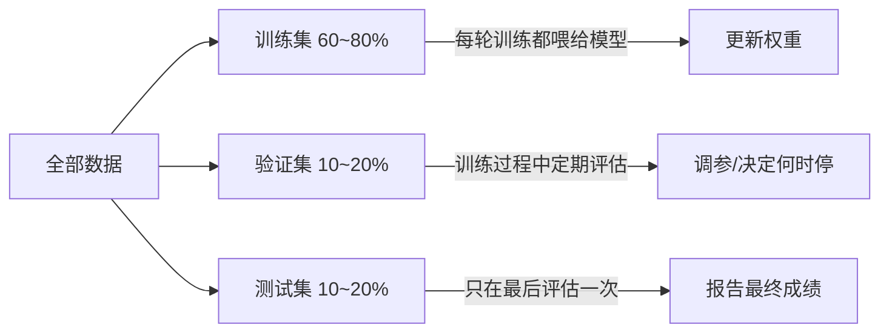

# 第14章 过拟合与数据集划分

> 本章学习目标：
> 1. 能用"背答案的学生"类比解释什么是过拟合、什么是欠拟合
> 2. 能说出训练集、验证集、测试集各自的用途，以及为什么不能混用
> 3. 能看懂学习曲线的三种典型形态，并判断模型当前处于哪种状态
> 4. 能说出 K 折交叉验证的做法和适用场景，能识别常见的数据泄漏
> 5. 能动手画出训练/验证损失曲线，并从曲线中找到过拟合的起点

## 从一个例子开始

想象你是老师，期末要考学生一道没教过的题。班上有两个学生：

- 小明把练习册上每道题的答案都背下来了，连"第 3 页第 5 题选 C"都记得。练习册上的题他全对，但新题一出来就傻眼。
- 小红没背答案，她搞懂了公式为什么成立。练习册上的题她偶尔粗心错一两道，但新题也能做出来。

你希望神经网络像谁？显然是小红。

遗憾的是，神经网络天生更像小明。给它足够多的参数，它能把训练数据一字不差地"背"下来——每个训练样本都预测得完美，但面对没见过的新数据却错误百出。

这一章，我们就来认识这个训练神经网络时最普遍、也最容易被忽视的陷阱：**过拟合（overfitting）**。

## 拟合：从"学不会"到"背答案"

还记得第 1 章的内容吗——训练神经网络，就是不断调整权重 $w$ 和偏置 $b$，让损失 $L$ 越来越小。损失越小，说明预测值 $\hat{y}$ 越接近真实值 $y$。

但"损失小"有两种完全不同的含义：

```
                 欠拟合                刚好               过拟合
               （学不会）           （真学会）          （背答案）

  数据点     o    o    o          o    o    o          o    o    o
                o     o              o     o              o     o
             o                       o                    o

  拟合线   ─────────────        ～～～～～～～        ～～∿∿～∿∿～∿∿～
          （一条直线，         （平滑曲线，          （七扭八歪，
           根本跟不上           穿过数据点             精确穿过每
           数据趋势）           中间）                 一个点）

  训练误差    很大                很小                 几乎为零
  新数据误差  很大                很小                 很大！
```

- **欠拟合（underfitting）**：模型太简单，连训练数据里的规律都没学会。就像一个学生连练习册都做不对。
- **过拟合（overfitting）**：模型太复杂，把训练数据的每一个细节（包括噪声和巧合）都当成了"规律"背下来。练习册满分，新题抓瞎。
- **刚好（good fit）**：模型学到了数据背后真正的规律，忽略掉了噪声。新数据上一样表现好。

用一句话总结：**过拟合就是模型在训练数据上表现很好，在新数据上表现很差。**

### 一个数值例子

假设你要拟合 5 个点，它们其实来自一条直线 $y = 2x$，只是测量时带了一点噪声：

| $x$ | 真实规律 $2x$ | 带噪声的测量值 $y$ |
|---|---|---|
| 1 | 2 | 2.1 |
| 2 | 4 | 3.9 |
| 3 | 6 | 6.2 |
| 4 | 8 | 7.8 |
| 5 | 10 | 10.1 |

- 欠拟合的模型可能输出 $\hat{y} = 5$（一条水平线），每个点都差得远。
- 刚好的模型学到 $\hat{y} \approx 2x$，每个点误差约 0.1~0.2，来一个 $x = 6$，它预测 12，基本正确。
- 过拟合的模型用一条 4 次多项式精确穿过全部 5 个点，训练误差为 0。但 $x = 6$ 时它可能预测 8.5——因为那条七扭八歪的曲线在点与点之间乱跳。

过拟合最迷惑人的地方就在于：**按训练误差看，它是三者中"最好"的模型。** 这就是为什么光看训练误差会骗了你。

## 泛化：我们真正想要的东西

模型在**没见过的新数据**上的表现，叫做**泛化能力（generalization）**。

训练神经网络的最终目的从来不是"把训练数据拟合好"，而是"对新数据预测得准"。训练数据只是手段，泛化才是目的。

这就像教学生的目的不是让他记住练习册，而是让他通过练习册掌握知识，好在考场上对付新题。

## 三个数据集：训练集、验证集、测试集

既然训练误差会骗人，我们怎么知道模型泛化好不好？办法很朴素：留一部分数据不让模型训练，拿来考它。

通常我们把收集到的数据分成三份：



| 数据集 | 用途 | 类比 |
|---|---|---|
| 训练集（training set） | 真正用来计算梯度、更新权重的数据 | 练习册 |
| 验证集（validation set） | 训练中监控泛化，用来调超参数、决定何时停止 | 模拟考 |
| 测试集（test set） | 训练全部结束后才用，评估模型的最终水平 | 正式高考 |

三个角色不能混用，理由和学生考试一模一样：

- **用测试集调参 = 提前偷看高考试卷。** 你根据测试集成绩调了十次超参数，实际上等于让模型"见过"测试集，测试集就不再能反映真实泛化能力了。
- **只用训练集评估 = 让学生自己批改自己的练习册。** 背答案的学生会给自己一个虚假的高分。

所以纪律是：**训练集随便用，验证集用来调，测试集锁进保险柜，最后一刻才打开。**

### 常见的划分比例

数据量不大时（几千到几万条），常见比例是 60/20/20 或 70/15/15。数据量巨大时（上百万条），验证集和测试集各留 1~5% 就够——因为它们只需要"足够多到评估结果可信"。

还有一条容易忽略的规则：**划分之前要先打乱数据顺序。** 如果你的数据是按类别排好的（前一半是猫、后一半是狗），直接切两段，训练集里就全是猫——模型连狗长什么样都没见过。

## 数据太少不够分：K 折交叉验证

60/20/20 的划分有个前提：数据够多。如果你一共只有 500 条数据，切完验证集只剩 100 条，评估结果波动很大——换一批切分，验证成绩可能差出好几个百分点。这时调参就变成"碰运气"：你不知道调出来的提升是真实的，还是恰好迎合了这 100 条验证数据。

**K 折交叉验证（K-fold cross-validation）** 是解决之道：把数据均分成 K 份（K 常取 5 或 10），轮流让每一份当一次验证集，其余 K-1 份合起来当训练集。这样每份数据都恰好被验证一次：

```
 第1次: [验证][训练][训练][训练][训练]
 第2次: [训练][验证][训练][训练][训练]
 第3次: [训练][训练][验证][训练][训练]
 第4次: [训练][训练][训练][验证][训练]
 第5次: [训练][训练][训练][训练][验证]

 最终成绩 = 5 次验证成绩的平均值
```

以 K = 5、共 500 条数据为例：每折 100 条，每次训练用 400 条、验证 100 条，共训练 5 个模型，最后把 5 次验证成绩取平均。因为每条数据都参与过验证、且每次验证集互不重叠，平均值比单次划分稳定得多。

代价也很直白：**训练量变成 K 倍**。所以它的适用场景是"数据少、模型小、训练快"——几百到几千条数据、几分钟能训完一遍的场合。数据量大或训练一次要几天时，老实用单次划分。

注意：K 折交叉验证替代的只是"训练集 + 验证集"这一对角色。**测试集仍然要先锁进保险柜**，交叉验证的平均成绩用来调参，调完之后才用测试集做最终评估。

## 数据泄漏：看不见的作弊

前面说"测试集只考一次"，是明面上的纪律。还有一类更隐蔽的作弊：**数据泄漏（data leakage）**——训练数据里偷偷混入了本不该在训练时出现的信息。它不靠"偷看测试集"发生，所以更危险：你完全按流程操作，结果照样虚假乐观。

三个真实世界里反复出现的案例：

1. **同一个对象出现在两边。** 某工厂做"听声音判断机器是否故障"：10 台机器各录 100 段声音，随机切分后测试准确率 99%，上线后一塌糊涂。问题在哪？同一台机器的录音被切到了训练集和测试集两边——模型记住的是"3 号机床的嗓音"，而不是"故障的声音"。正确做法是**按机器分组切分**：某台机器的所有录音要么全进训练集，要么全进测试集。
2. **用全部数据做预处理。** 归一化时用训练集+测试集一起算最小值、最大值，测试集的信息就顺着统计量流进了训练流程。第 16 章会细讲这条铁律：统计量只能来自训练集。
3. **特征里混入"未来的信息"。** 医院想预测"病人是否会发展成重症"，特征表里有一列"住院天数"——能住很久的往往就是发展成重症的病人。这个特征在"入院时做预测"的实际场景里根本拿不到，模型却靠它拿了高分。判断方法：问自己"在需要做预测的那一刻，这个特征存在吗？"

泄漏的共同特征：**离线评估好得不真实，一上线就露馅。** 所以看到 99.9% 这种好到离谱的成绩，第一反应不该是庆祝，而是排查泄漏。

## 学习曲线：一眼看穿模型状态

训练过程中，把每一轮（epoch，即完整过一遍训练集）的训练损失和验证损失都记下来，画成曲线，就得到**学习曲线（learning curve）**。它是诊断模型状态最有用的工具。

三种典型形态：

```
  形态一：欠拟合                形态二：理想                 形态三：过拟合

 损失 ↑                        损失 ↑                      损失 ↑
 1.0│ ── 训练                 1.0│                        1.0│
    │ ── 验证（贴着训练）        │╲                        │╲
 0.8│                          │ ╲                       │ ╲
    │                          │  ╲                      │  ╲___ 训练
 0.6│                          │   ╲__                   │       ╲___
    │                          │      ╲__ 训练            │           ╲
 0.4│                          │         ╲___            │ 验证╲      ╲
    │                          │             ─── 验证      │      ╲__   ╲
 0.2│                          │          （两条都         │         ╲__╱╲
    │                          │            停在低位）      │            ↑
 0.0└──────────────→          0.0└──────────────→        0.0└──────────────→
     轮次                        轮次                       轮次
                                                           验证损失在此回升
  两条曲线都停在高位           两条曲线都降到低位           训练降、验证回升
  → 模型太简单                 → 正是我们想要的           → 模型开始背答案
```

判读口诀：

- **两条都高**：欠拟合。该加层、加神经元，或者多训练几轮。
- **两条都低**：状态良好，继续观察。
- **一低一高（分叉）**：过拟合。训练损失还在降，验证损失已经掉头向上——模型从这一刻开始"背答案"。

## 为什么会过拟合？

过拟合的根源可以用一个不等式概括：

> 模型的记忆能力 > 数据里真实规律的信息量

具体来说，通常有三种情况：

1. **模型太大，数据太少。** 一个有 100 万个参数的网络去拟合 100 个样本，相当于让一个记忆力超群的人背 100 道题——他当然选择背下来，而不是理解。经验法则：样本数最好在参数量的 10 倍以上。
2. **训练太久。** 即使模型大小合适，训练轮数太多，它把真正的规律学完之后，会开始"学"噪声。这正对应学习曲线里验证损失回升的阶段。
3. **数据本身有噪声或标注错误。** 数据里的错误标注会被大模型当成规律记住。

对应的解决方向也就清晰了：减小模型、增加数据、提前停止训练，以及下一章要讲的正则化三件套。

## 动手实验

这个实验做两件事：先构造一份带噪声的数据并划分成训练/验证/测试三份；再用一个"故意设计得容易过拟合"的过程，画出训练误差和验证误差随轮数变化的曲线，亲眼看到过拟合的发生。

### 第一部分：数据划分

这段代码生成 100 个来自 $y = 2x + 1$ 加噪声的数据点，打乱后按 60/20/20 划分三份，并检查各份数量。

```python
import random

random.seed(42)

# 生成 100 个样本：y = 2x + 1 + 噪声
data = []
for i in range(100):
    x = i / 10.0
    noise = random.uniform(-0.5, 0.5)
    y = 2 * x + 1 + noise
    data.append((x, y))

random.shuffle(data)          # 划分前必须先打乱

n = len(data)
n_train = int(n * 0.6)
n_val = int(n * 0.2)

train_set = data[:n_train]
val_set = data[n_train:n_train + n_val]
test_set = data[n_train + n_val:]

print("训练集:", len(train_set), "条")
print("验证集:", len(val_set), "条")
print("测试集:", len(test_set), "条")
```

**预期输出**：三行数字，分别是 60、20、20。

### 第二部分：亲眼看一次过拟合

这段代码模拟一个"记性太好"的模型：它一边学真实规律（$y = 2x+1$），一边偷偷背诵训练集里每个样本的噪声。随着轮数增加，它在训练集上的误差越来越低，但在验证集上的误差会先降后升——这就是过拟合的完整生命周期。

```python
import math

def true_fn(x):
    return 2 * x + 1

def model_predict(x, epoch, train_data):
    # 学到的规律随轮数逐渐逼近 2x+1
    learned = true_fn(x) * (1 - math.exp(-epoch / 15.0)) + 1.0 * math.exp(-epoch / 15.0)
    # 随轮数增加，越来越多地"背诵"训练集噪声
    if epoch > 20:
        best_match = min(train_data, key=lambda s: abs(s[0] - x))
        memorize_ratio = min((epoch - 20) / 60.0, 0.9)
        learned = (1 - memorize_ratio) * learned + memorize_ratio * best_match[1]
    return learned

def mean_error(data, epoch, train_data):
    total = 0.0
    for x, y in data:
        total += abs(model_predict(x, epoch, train_data) - y)
    return total / len(data)

print("轮次   训练误差   验证误差")
for epoch in range(0, 101, 10):
    e_train = mean_error(train_set, epoch, train_set)
    e_val = mean_error(val_set, epoch, train_set)
    print("{:>4d}   {:>8.3f}   {:>8.3f}".format(epoch, e_train, e_val))
```

**预期输出**：训练误差从约 10 左右一路下降，最终降到 0.2 以下；验证误差先跟着下降，在 20~40 轮之间到达最低点，随后开始回升。两条误差"分道扬镳"的那个点，就是过拟合的起点。

把这两列数字在纸上画成曲线，你就亲手复现了"形态三"那张图。下一章讲的早停，就是要在验证误差的最低点处及时收手。

## 常见误区

- 误区：训练损失降到 0，说明模型训练得非常成功。
  真相：训练损失为 0 往往恰恰是过拟合的危险信号。它只说明模型把训练数据背下来了，对新数据可能一塌糊涂。判断好坏要看验证集/测试集的表现。

- 误区：验证集效果好，就反复用测试集确认一下，反正数据又没参与训练。
  真相：每看一次测试集并根据结果做任何调整，测试集就"泄漏"一分。看多了，它就退化成了第二个验证集，最终评估结果会虚假乐观。测试集只用一次。

- 误区：数据只要按比例切分就行，顺序无所谓。
  真相：不打乱就切分，很可能让训练集缺某些类别、某些取值范围，模型从一开始就输在起跑线上。先 shuffle，再切分。

## 章末习题

1. 一个学生把 500 道练习题全部背熟，练习正确率 100%，但考试遇到同知识点的变式题正确率只有 40%。用本章术语描述这个现象，并说明对应神经网络的哪种状态。
2. 你有 1000 条数据，按 70/15/15 划分。训练集、验证集、测试集各有多少条？划分前必须做什么操作，为什么？
3. 观察下面的训练记录，判断模型从第几轮开始过拟合，并说明理由。

   | 轮次 | 训练损失 | 验证损失 |
   |---|---|---|
   | 10 | 0.80 | 0.85 |
   | 20 | 0.50 | 0.52 |
   | 30 | 0.30 | 0.35 |
   | 40 | 0.18 | 0.28 |
   | 50 | 0.10 | 0.33 |

4. 某同学训练后验证集准确率 95%，他很高兴，又用测试集测了一次是 82%。他觉得"再调调参数，测试集肯定能上 90%"。这个做法错在哪里？
5. 思考题：本章的实验二里，模型"背噪声"的能力是我们故意写进去的。真实的神经网络并没有这样一段代码，它为什么会自己学会背噪声？提示：从参数量和训练轮数的角度想。
6. 你有 800 条数据，做 5 折交叉验证。每折多少条？一共要训练几次？每次训练用多少条、验证用多少条？最终成绩怎么算？
7. 某团队做皮肤照片的疾病筛查，每位患者拍了 20 张照片，随机切分后验证准确率 97%，部署到医院后准确率只有 71%。最可能的原因是什么？应该怎么重新切分？

## 小结与下一章预告

- 过拟合 = 训练表现好、新数据表现差，本质是模型把噪声当规律背了下来。
- 泛化能力才是训练的真正目标，训练误差无法衡量它，必须留出没参与训练的数据来评估。
- 训练集练、验证集调、测试集只考一次，三者各司其职，不能混用。
- 数据少时用 K 折交叉验证：轮流让每份数据当验证集，平均成绩更稳，代价是训练 K 遍。
- 数据泄漏是隐蔽的作弊：同一对象横跨训练/测试、预处理偷用全部数据、特征里混入未来信息，都会让评估虚假乐观。
- 学习曲线的三种形态：双高是欠拟合，双低是理想，分叉是过拟合。

下一章我们学习对抗过拟合的三件武器：L2 正则、Dropout 和早停——它们分别从"管住权重""拆掉依赖""及时收手"三个角度，把模型从背答案的路上拉回来。
