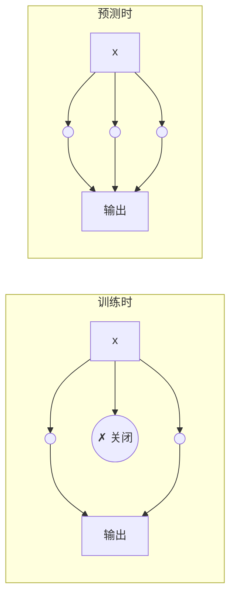
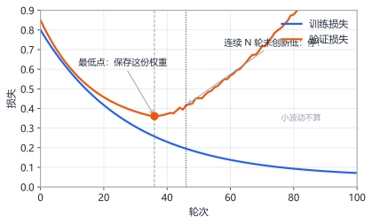

# 第15章 正则化三板斧

> 本章学习目标：
> 1. 能用自己的话解释 L2 正则、Dropout、早停各自的直觉原理
> 2. 能写出带 L2 惩罚项的损失函数，并手工算一步正则化后的权重更新
> 3. 能说明 Dropout 在训练时和预测时的行为差异
> 4. 能根据验证集曲线找到早停点，并说出三种方法各自的适用场景

## 从一个例子开始

公司有个五人项目组，其中老王能力最强。每次遇到问题，大家都直接问老王，老王也确实每次都能解决。年终考核，项目组在"熟悉的问题"上表现完美。

后来老王跳槽了。项目组瞬间瘫痪——剩下四个人从没独立解决过问题，因为过去他们什么都不用干。

经理痛定思痛，立下三条新规：

1. **不许一个人说了算**：任何方案必须多人参与，弱化个人权重。
2. **随机排班**：每天随机抽一个人"休假"，逼着剩下的人顶上。
3. **见好就收**：项目评审一旦发现开始"为了讨好评审而表演"，立刻叫停。

这三条新规，恰好对应本章要学的三种**正则化（regularization）**技术。正则化就是"给模型立规矩"，防止它像依赖老王一样依赖少数权重、少数神经元，或者沉溺于训练数据无法自拔。

上一章说过，过拟合的根源是"模型记性太好"。正则化的思路不是把模型变笨，而是给它加约束，逼它把记忆力用在真正的规律上。

## 第一板斧：L2 正则——不让某个权重一家独大

### 直觉

过拟合的模型往往有几个特别大的权重。为什么？因为它要精确穿过每一个训练点（包括噪声点），曲线必须扭得很厉害，而"扭得厉害"在数学上就是某些权重数值特别大。

L2 正则会（L2 regularization）的做法：在损失函数里加一项"权重大小的惩罚"，让模型在"拟合数据"和"保持权重小"之间做平衡。

### 公式

原来的损失函数是 $L$（比如均方误差），加正则项之后变成：

$$L_{总} = L + \lambda \sum_{i} w_i^2$$

符号解释：

- $w_i$：网络里第 $i$ 个权重。$\sum_i w_i^2$ 就是把所有权重的平方加起来。
- $\lambda$（lambda）：正则化强度，一个人工设定的正数，比如 0.001。它控制"惩罚多重"——$\lambda$ 越大，模型越不敢用大权重。

权重更新规则（还记得第 1 章的梯度下降吗——沿着让损失变小的方向走一步）随之变成：

$$w \leftarrow w - \eta \frac{\partial L}{\partial w} - \eta \lambda \cdot 2w$$

符号解释：$\eta$ 是学习率，$\frac{\partial L}{\partial w}$ 是原来那部分梯度。多出来的 $-\eta\lambda \cdot 2w$ 是正则项的梯度，它的效果很直白：**每一步都把权重往 0 的方向拉一点**，拉的力度正比于权重本身的大小。权重越大，被拉回来越狠；权重接近 0，几乎不受影响。

所以 L2 正则也叫**权重衰减（weight decay）**——权重每步都"缩水"一点点。

### 数值例子

设某个权重 $w = 2.0$，这一步算出的原始梯度 $\frac{\partial L}{\partial w} = 0.5$，学习率 $\eta = 0.1$，正则强度 $\lambda = 0.01$。

不带正则的更新：

$$w \leftarrow 2.0 - 0.1 \times 0.5 = 1.95$$

带 L2 正则的更新，多减一项 $\eta\lambda \cdot 2w = 0.1 \times 0.01 \times 2 \times 2.0 = 0.004$：

$$w \leftarrow 2.0 - 0.05 - 0.004 = 1.946$$

每一步多缩水 0.004，看起来微不足道，但训练几万步累积下来，大权重会被明显压小。只有那些"对降低损失真正有用"的权重，才能靠梯度的推力抵抗住衰减、保持较大数值；没什么用的权重会被慢慢拉回 0 附近。

### 为什么权重小就更平滑？

直觉想一个极端情况：输出对输入的敏感度由权重决定，$z = wx + b$。$w$ 很大时，输入 $x$ 抖一点点，输出就跳一大截——这就是那条七扭八歪的过拟合曲线。$w$ 小时，输出对输入的变化反应温和，曲线自然平滑，噪声点也就没那么容易把它带偏。

### 适用场景

- 几乎所有训练都可以加一点 L2 正则，代价只是每步多一次乘法，几乎零成本。
- $\lambda$ 常见取值 $10^{-4}$ 到 $10^{-2}$，太大则模型欠拟合（权重被压得太小，连真规律也学不动）。

### 表兄弟 L1：把没用的权重直接清零

L2 还有个表兄弟 **L1 正则**，惩罚项换成权重的绝对值：

$$L_{总} = L + \lambda \sum_i |w_i|$$

差别在梯度。$|w|$ 的导数不看 $w$ 的大小，只看正负：$w > 0$ 时恒为 $+1$，$w < 0$ 时恒为 $-1$。所以 L1 的更新项是 $-\eta\lambda\cdot\text{sign}(w)$——**不管权重多大，每一步都被恒定地拉一截**。

用数字对比（$\eta = 0.1$，$\lambda = 0.01$，即每步拉 0.001）：

| 当前权重 | L2 每步拉多少（$\eta\lambda\cdot 2w$） | L1 每步拉多少（$\eta\lambda$） |
|---|---|---|
| $w = 2.0$ | 0.004 | 0.001 |
| $w = 0.01$ | 0.00002 | 0.001 |

大权重时 L2 拉得更狠，小权重时 L1 拉得更狠。这个差异决定了两者性格相反：

- **L2 把权重都压小，但很难压到 0。** 越接近 0 拉力越弱，最后剩一堆"小但非零"的权重。
- **L1 对小权重毫不留情。** 恒定拉力会把没用的权重一路推到恰好 0，最后剩少数大权重和一堆精确的 0。

所以 L1 有个实用副产品：**稀疏化**——权重为 0 的连接等于不存在，相当于自动做了一次特征筛选。存储和计算时这些 0 可以跳过，在内存紧张的嵌入式设备上这是实实在在的好处。代价是绝对值在 0 处不可导，优化过程不如 L2 平滑，实践中 L2 仍是默认首选，L1 用于"确实想要稀疏"的场景。

## 第二板斧：Dropout——随机让部分员工请假

### 直觉

回到项目组的故事：老王在的时候，其他四个人永远学不会独立工作。解决办法是强制排班——每天随机抽人休假，剩下的人必须顶上。久而久之，每个人都练出了独当一面的能力，团队不再依赖任何单个人。

Dropout 就是这个思路：训练时，每一步随机"关闭"一部分神经元（让它们输出 0），网络剩下的部分必须靠自己完成任务。



### 做法

训练时，对每个神经元，以概率 $p$（比如 0.5，叫丢弃率）把它这次前向传播的输出置 0：

$$a_i' = \begin{cases} 0 & \text{以概率 } p \\ \dfrac{a_i}{1-p} & \text{以概率 } 1-p \end{cases}$$

符号解释：$a_i$ 是神经元原本的激活输出。除以 $(1-p)$ 是为了保持输出的平均大小不变——一半神经元被关掉后，剩下的人要把活干完，所以每人的贡献放大一倍。

预测（推理）时：所有神经元全部上岗，不做任何丢弃，也不用再缩放。因为训练时已经把"平均贡献"调平了。

### 为什么它有效？

- **不让网络依赖单一路径。** 任何一个神经元随时可能"请假"，网络不敢把宝押在某条连接上，只能把规律分散存到多条冗余路径里。冗余 = 稳健。
- **相当于同时训练了很多个不同的子网络。** 每一步随机关掉一半神经元，等于每一步都在用一个不同的网络结构训练。最后预测时全部神经元一起上，效果接近"多个模型投票"——这正是机器学习中经典的集成（ensemble）思想。

### 数值例子

某层 4 个神经元的输出是 $[0.8,\ 0.4,\ 1.2,\ 0.6]$，丢弃率 $p = 0.5$，本次随机抽中第 2、4 号"休假"：

- 被保留的第 1、3 号输出放大为 $0.8 / 0.5 = 1.6$ 和 $1.2 / 0.5 = 2.4$。
- 最终传给下一层的是 $[1.6,\ 0,\ 2.4,\ 0]$。
- 检查平均大小：原始总和 3.0，处理后总和 4.0？不对——注意每次随机抽的神经元不同，长期平均下来保留部分恰好抵消被丢弃部分，这就是除以 $(1-p)$ 的意义。

### 适用场景

- 网络越大、数据越少，Dropout 越有用。丢弃率常见 0.2~0.5。
- 小网络（比如本书前面那些十几个神经元的例子）通常不需要它——本身就没多少"依赖"可拆。
- 切记：Dropout 只在训练时开启，预测时必须关闭。写代码时这是最常见的 bug 来源。

## 第三板斧：早停——在拐点处收手

### 直觉

第 14 章的学习曲线告诉我们：过拟合不是一开始就有的，而是训练到某个时刻才开始的。既然知道它会来，最简单的办法就是**不练了**——在验证损失开始回升的那一刻停止训练。

这就是**早停（early stopping）**。它是三种方法里最省事的一个：不改损失函数，不改网络结构，只改训练循环。

### 做法

```
每训练一轮：
    1. 用训练集更新权重
    2. 用验证集算一次验证损失，记下来
    3. 如果验证损失创下新低 → 保存当前权重（这是"最好的模型"）
    4. 如果验证损失连续 N 轮没有创新低 → 停止训练，回滚到第 3 步保存的权重
```

第 4 步里的 $N$ 叫**耐心（patience）**，常见取值 5~20。为什么要连续 $N$ 轮而不是一上升就停？因为验证损失有随机波动，偶尔抖一下不代表趋势反转。给它几次机会，确认是真回升再收手。



### 为什么"保存最佳权重"很重要？

注意第 3 步：早停不是简单地"停下"，而是回到验证损失最低时的那组权重。停止那一刻的权重往往已经比最优点差了一点（多练了 $N$ 轮），所以要像游戏存档一样，每次破纪录就存一次档。

### 适用场景

- 任何用验证集监控的训练都可以用，几乎总是应该开着。
- 它和 L2、Dropout 不冲突，三者经常同时使用。
- 唯一代价：需要一份验证集，且每轮多算一次验证损失。

## 三板斧怎么选？

| 方法 | 管的是什么 | 代价 | 何时首选 |
|---|---|---|---|
| L2 正则 | 权重的大小 | 每步一次乘法 | 默认都加一点 |
| Dropout | 神经元之间的依赖 | 训练变慢、需调丢弃率 | 大网络、小数据 |
| 早停 | 训练的时长 | 每轮一次验证 | 总是该用 |

三者是互补关系，不是三选一。实战中常见的组合是：小 $\lambda$ 的 L2 打底，网络偏大就加 Dropout，训练循环里永远带早停。

组合时有一个先后逻辑：**先把模型做得"够大"，再用正则把它"管住"**。顺序反了会怎样？先选个小模型再叠加三招，模型容量和正则约束两头挤压，直接欠拟合，怎么调都学不动。正确姿势是：选一个明显学得动训练集（甚至有点过拟合）的模型，确认它能背下训练数据——这证明容量足够；然后逐步加正则，盯紧验证曲线，直到过拟合消失。正则化管的是"多余的能力"，前提是先有多余的能力可管。

## 动手实验

### 第一部分：L2 正则给权重装上"橡皮筋"

这段代码模拟一个带 L2 正则的权重更新过程：一个权重在"梯度想让它变大"和"正则在拉它变小"两股力量下的最终归宿。你可以看到正则如何给权重设一个"天花板"。

```python
def train(lambda_, steps=200):
    w = 0.0          # 权重从 0 开始
    eta = 0.1        # 学习率
    for step in range(steps):
        grad = -1.0  # 假设数据梯度恒定想把 w 推向 +10
        grad_total = grad + 2 * lambda_ * w   # 加上正则项梯度
        w = w - eta * grad_total
        if step % 50 == 0:
            print("  第 {:>3d} 步: w = {:.3f}".format(step, w))
    return w

print("不用正则 (lambda=0):")
w0 = train(0.0)
print("最终 w = {:.2f}\n".format(w0))

print("用 L2 正则 (lambda=0.1):")
w1 = train(0.1)
print("最终 w = {:.2f}".format(w1))
```

**预期输出**：不用正则时，$w$ 每步稳定增大 0.1，200 步后涨到 20 左右，一路狂奔不回头；用 $\lambda = 0.1$ 的 L2 后，$w$ 增长越来越慢，最终停在 5.0 附近——那是梯度推力 $1.0$ 与正则拉力 $2 \times 0.1 \times 5 = 1.0$ 恰好平衡的位置。正则就像一根橡皮筋，权重越大拉得越紧，最终把权重"拴"在一个有限的大小上。

<details>
<summary>🐘 C 语言对照</summary>

*语言差异：Python 的默认参数 `steps=200` 在 C 里要显式传；命名参数 `lambda_` 是 C 的普通形参。算法两行核心完全一致。*

```c
#include <stdio.h>

double train(double lambda_, int steps) {
    double w = 0.0;                      /* 权重从 0 开始 */
    double eta = 0.1;                    /* 学习率 */
    for (int step = 0; step < steps; step++) {
        double grad = -1.0;              /* 假设数据梯度恒定想把 w 推向 +10 */
        double grad_total = grad + 2 * lambda_ * w;   /* 加上正则项梯度 */
        w = w - eta * grad_total;
        if (step % 50 == 0) {
            printf("  第 %3d 步: w = %.3f\n", step, w);
        }
    }
    return w;
}

int main(void) {
    printf("不用正则 (lambda=0):\n");
    printf("最终 w = %.2f\n\n", train(0.0, 200));

    printf("用 L2 正则 (lambda=0.1):\n");
    printf("最终 w = %.2f\n", train(0.1, 200));
    return 0;
}
```

</details>

### 第二部分：亲眼看 Dropout 的"平均不变"

正文说过：训练时以概率 $p$ 丢弃神经元，保留的输出要除以 $(1-p)$，这样长期平均不变。这段代码用一个 4 神经元的小层验证这句话——先随机抽 4 次看看每次长什么样，再重复 10 万次看平均值。

```python
import random

random.seed(42)

def dropout(vec, p):
    scale = 1.0 / (1.0 - p)              # 保留者放大 1/(1-p)
    return [v * scale if random.random() > p else 0.0 for v in vec]

layer_out = [0.8, 0.4, 1.2, 0.6]         # 某层 4 个神经元的输出
p = 0.5                                  # 丢弃率

print("四次随机抽样:")
for _ in range(4):
    print("  ", [round(v, 2) for v in dropout(layer_out, p)])

trials = 100000
sums = [0.0] * len(layer_out)
for _ in range(trials):
    out = dropout(layer_out, p)
    for i in range(len(out)):
        sums[i] += out[i]

print("10 万次平均:", [round(s / trials, 3) for s in sums])
print("原始输出:   ", layer_out)
```

**预期输出**：四次抽样结果各不相同，每次大约一半位置被置 0，保留下来的值放大为原来的 2 倍（如 0.8 变成 1.6）。而 10 万次平均下来，每个位置的平均值约等于原始输出 `[0.8, 0.4, 1.2, 0.6]`（误差在小数点后第三位）——单次看是"缺斤短两再放大"，长期看恰好公平。这就是为什么预测时全员上岗、不做缩放，数值尺度依然对得上。

<details>
<summary>🐘 C 语言对照</summary>

*语言差异：列表推导 `[v * scale if rand() > p else 0.0 for v in vec]` 拆成"抽样时直接累加"的循环——C 版顺手省掉了 sums 数组之外的中间向量；Python 的 `random.random()` 对应 `(double)rand() / RAND_MAX`。随机序列不同，四次抽样各行数字与 Python 不同，但"10 万次平均 ≈ 原始输出"的结论一致。*

```c
#include <stdio.h>
#include <stdlib.h>

int main(void) {
    srand(42);

    double layer_out[4] = {0.8, 0.4, 1.2, 0.6};   /* 某层 4 个神经元的输出 */
    double p = 0.5;                               /* 丢弃率 */
    double scale = 1.0 / (1.0 - p);               /* 保留者放大 1/(1-p) */
    int n = 4;

    printf("四次随机抽样:\n");
    for (int t = 0; t < 4; t++) {
        printf("   [");
        for (int i = 0; i < n; i++) {
            double v = (rand() / (double)RAND_MAX) > p
                       ? layer_out[i] * scale : 0.0;
            printf("%.2f%s", v, i < n - 1 ? ", " : "");
        }
        printf("]\n");
    }

    int trials = 100000;
    double sums[4] = {0, 0, 0, 0};
    for (int t = 0; t < trials; t++) {
        for (int i = 0; i < n; i++) {
            /* 抽样并直接累加，长期平均即 Dropout 的期望 */
            sums[i] += (rand() / (double)RAND_MAX) > p
                       ? layer_out[i] * scale : 0.0;
        }
    }

    printf("10 万次平均: [");
    for (int i = 0; i < n; i++) {
        printf("%.3f%s", sums[i] / trials, i < n - 1 ? ", " : "");
    }
    printf("]\n");
    printf("原始输出:   [0.80, 0.40, 1.20, 0.60]\n");
    return 0;
}
```

</details>

## 常见误区

- 误区：$\lambda$ 越大，正则效果越好，过拟合越轻。
  真相：$\lambda$ 太大会把有用的权重也压垮，模型直接从过拟合跳进欠拟合。正则强度要用验证集来调，不是越大越好。

- 误区：预测时也保持 Dropout 开启，"多随机几次取平均更稳"。
  真相：标准的 Dropout 用法是训练开、预测关。预测时所有神经元一起工作，输出才是确定且正确的尺度。预测忘关 Dropout 会导致每次结果不一样，而且数值普遍偏小。

- 误区：验证损失一上升就立刻停止训练最划算。
  真相：验证损失有噪声，单次回升可能只是抖动。设一个耐心值（比如连续 10 轮不创新低才停），并始终保存历史最优权重，才是稳健的做法。

- 误区：模型越小越不容易过拟合，所以先把模型做小，再加正则双保险。
  真相：小模型加正则容易两头挤压成欠拟合。正确顺序是先保证模型容量足够（能拟合训练集），再用正则管住多余的能力。

## 章末习题

1. 设 $w = 1.5$，$\frac{\partial L}{\partial w} = -0.2$，$\eta = 0.1$，$\lambda = 0.02$。分别计算不加正则和加 L2 正则后的一步更新结果。
2. Dropout 训练中，某层输出为 $[2.0,\ 1.0,\ 0.5,\ 3.0]$，丢弃率 $p=0.25$，本次第 2 号神经元被关闭。写出传给下一层的向量，并解释为什么要除以 $(1-p)$。
3. 某次训练的验证损失记录为：0.52, 0.48, 0.45, 0.44, 0.46, 0.43, 0.44, 0.45, 0.46, 0.47。设耐心值 patience = 3，应在第几轮停止？最终采用哪一轮的权重？（轮次从 1 数起）
4. 训练时发现加上 L2 正则后训练损失和验证损失都很高，可能是什么原因？怎么调整？
5. 思考题：L2 正则会惩罚所有大权重，但一个能力强的"老王权重"也可能对任务至关重要。正则如何区分"必要的大权重"和"造成过拟合的大权重"？提示：想想两股力量的平衡。
6. 用 L1 正则重做习题 1（惩罚项为 $\lambda\sum|w_i|$，其梯度是 $\lambda\cdot\text{sign}(w)$）。$w = 1.5$ 时一步更新后是多少？再算 $w = 0.005$ 时 L1 和 L2 各拉多少，说明为什么 L1 能把小权重推到恰好 0 而 L2 不能。
7. 思考题：早停为什么不改损失函数、不改网络结构，却能和 L2 一样抑制过拟合？提示：想想权重在训练初期离初始化点多远，训练越久能走多远。

## 小结与下一章预告

- L2 正则：在损失里加 $\lambda\sum w^2$，每步把权重往 0 拉一点，逼模型用平滑的小权重；表兄弟 L1 用 $\lambda\sum|w|$，恒定拉力能把没用的权重推到恰好 0，换来稀疏性。
- Dropout：训练时随机关闭部分神经元并放大剩余输出，拆掉网络对单一路径的依赖；预测时全部恢复。
- 早停：监控验证损失，连续多轮不创新低就停，并回滚到历史最优权重。
- 三者互补，实战中通常组合使用。

模型管住了，下一章轮到数据——数据量多少才够？为什么输入要先归一化？数据不够时怎么"变"出更多？这些看似琐碎的功夫，往往比改模型结构更能决定最终的训练效果。
