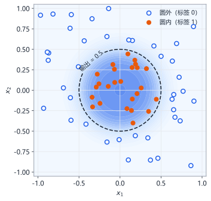
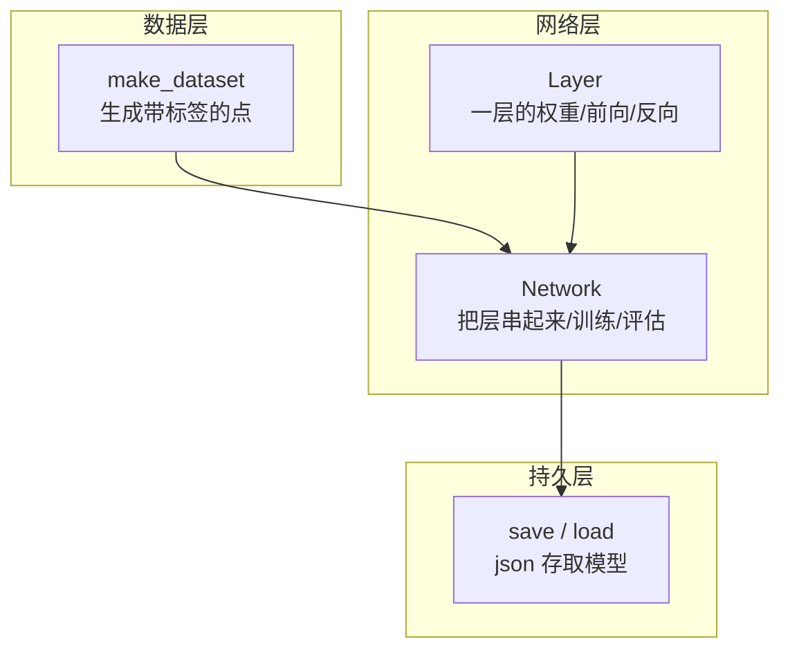

# 第17章 从零手写神经网络库

> 本章学习目标：
> 1. 能把前面学过的层、前向传播、反向传播组织成 Layer / Network 两个可复用的类
> 2. 能实现一个完整训练循环：建网络、喂数据、算损失、更新权重
> 3. 能用 json 把训练好的模型存到文件，再加载回来做预测
> 4. 能走通"建网络 → 训练 → 评估 → 保存 → 加载推理"的完整工程流程

## 从一个例子开始

你家里有一抽屉 Lego 积木。以前每次想搭东西，都从散件里现找：这块接上那块，搭完就拆，下次从头再来。

后来你学聪明了：把常用的组合（轮子+轴、门+框）预先拼成小模块，贴上标签收好。再搭新东西时，直接拿模块组装——又快又不容易错。

前面十几章，我们写的代码都是"散件"：权重是一个列表，前向传播是一个循环，反向传播是另一个循环，全堆在一个文件里。能跑，但每次换任务都要重写。

本章我们把散件拼成模块：一个 `Layer` 类管一层的权重和计算，一个 `Network` 类把层串起来并提供训练、保存、加载。最后用这套"积木"解决一个真实的小问题。这个库只有一百多行，但它的结构和 PyTorch 这样的工业级框架在思想上是一致的。

## 任务：给平面上的点分类

先看我们要解决的问题。在平面上随机撒点，圆心在原点、半径 0.5 的圆内的点标记为 1（圆内），圆外的标记为 0（圆外）：



输入是坐标 $(x_1, x_2)$，输出是一个 0~1 之间的数，越接近 1 表示越可能在圆内。

为什么这个任务适合神经网络？因为分界线是一个圆：$x_1^2 + x_2^2 < 0.25$——它**不是一条直线**。还记得第 2 章的 XOR 吗：线性模型画不出曲线分界，必须有隐藏层和非线性激活函数。这个任务正好检验我们的库有没有真本事。

## 设计：三个模块



- `Layer`：管好自己这一层的权重 $w$、偏置 $b$，会算前向 $a = f(wx+b)$，也会算反向（把误差传给前一层、给自己算梯度）。
- `Network`：持有若干 `Layer`，负责把数据一层层传下去、把误差一层层传回来，外加训练循环和评估。
- `save` / `load`：把权重写成 json 文件、再读回来重建网络。

### 先回顾要用到的全部数学

记号沿用全书统一约定。对某一层的第 $j$ 个神经元：

- 前向：$z_j = \sum_i w_{ji} a_i^{(in)} + b_j$，然后 $a_j = f(z_j)$
- 隐藏层激活用 ReLU：$f(z) = \max(0, z)$，导数是"$z>0$ 时为 1，否则为 0"
- 输出层激活用 sigmoid：$f(z) = \dfrac{1}{1+e^{-z}}$，导数有个好性质：$f'(z) = a(1-a)$
- 损失用均方误差：$L = \dfrac{1}{2}(\hat{y} - y)^2$，它关于输出的梯度就是 $\hat{y} - y$

反向传播我们采用一个清晰的约定：**每层收到的误差 $\delta$，一律是"损失对本层输出 $a$ 的梯度"**。于是每层内部做三件事：

1. 乘上本层激活函数的导数，把误差换算成对 $z$ 的梯度：$\delta_j^{(z)} = \delta_j \cdot f'(z_j)$
2. 向前一层传误差：$\delta_i^{(in)} = \sum_j \delta_j^{(z)} w_{ji}$
3. 更新自己的参数：$w_{ji} \leftarrow w_{ji} - \eta\, \delta_j^{(z)} a_i^{(in)}$，$b_j \leftarrow b_j - \eta\, \delta_j^{(z)}$

这些在第 6~9 章都推导过，本章不再重复推导，直接翻译成代码。你会看到：每条公式恰好对应一两行 Python。

隐藏层为什么用 ReLU 而不是 sigmoid？还记得第 4 章讲的梯度消失吗——sigmoid 在两端几乎水平，导数接近 0，误差传过几层就被"磨没"了。ReLU 在正区间导数恒为 1，误差畅通无阻，训练快得多。输出层保留 sigmoid，因为我们要一个 0~1 之间的"像概率"的数。

## 库的代码

### Layer：一层即一个对象

这段代码定义 `Layer` 类。初始化时随机生成权重；`forward` 算前向，并顺手把输入和输出都存起来（反向传播要用）；`backward` 接收后一层传回来的误差，先乘本层激活导数，再更新权重、把误差传给前一层。

```python
import math
import random
import json

class Layer:
    """一个全连接层：n_in 个输入，n_out 个神经元。"""

    def __init__(self, n_in, n_out, activation):
        scale = 1.0 / math.sqrt(n_in)        # 输入越多，初始权重越小
        self.w = [[random.uniform(-scale, scale) for _ in range(n_in)]
                  for _ in range(n_out)]
        self.b = [0.0] * n_out
        self.activation = activation         # "relu" 或 "sigmoid"
        self.a_in = None                     # 缓存输入/输出，反向传播用
        self.a_out = None

    def _activate(self, z):
        if self.activation == "relu":
            return z if z > 0 else 0.0
        return 1.0 / (1.0 + math.exp(-z))

    def _deriv(self, a):
        if self.activation == "relu":
            return 1.0 if a > 0 else 0.0     # 用输出值即可判断斜率
        return a * (1.0 - a)

    def forward(self, a_in):
        self.a_in = a_in
        self.a_out = []
        for j in range(len(self.b)):
            z = sum(self.w[j][i] * a_in[i] for i in range(len(a_in))) + self.b[j]
            self.a_out.append(self._activate(z))
        return self.a_out

    def backward(self, delta_out, lr):
        # delta_out 是损失对本层输出 a 的梯度
        dz = [delta_out[j] * self._deriv(self.a_out[j]) for j in range(len(self.b))]
        delta_in = [0.0] * len(self.a_in)
        for j in range(len(self.b)):
            for i in range(len(self.a_in)):
                delta_in[i] += dz[j] * self.w[j][i]   # 误差传给前一层
        for j in range(len(self.b)):
            for i in range(len(self.a_in)):
                self.w[j][i] -= lr * dz[j] * self.a_in[i]  # 更新权重
            self.b[j] -= lr * dz[j]                      # 更新偏置
        return delta_in
```

对照公式检查一遍：`forward` 里的循环就是 $z_j = \sum_i w_{ji}a_i + b_j$；`backward` 第一行是 $\delta_j^{(z)} = \delta_j \cdot f'(z_j)$，第一个双重循环是 $\delta_i^{(in)} = \sum_j \delta_j^{(z)} w_{ji}$，第二个是梯度下降更新。

有一个细节必须注意：**"传误差"用的是旧权重，所以它必须排在"更新权重"之前。** 两个循环顺序写反，前一层收到的就是用新权重算出的错误误差——损失照样可能下降，但收敛变慢、效果变差，这种 bug 极难排查。

### Network：把层串起来

这段代码定义 `Network` 类。`forward` 把输入依次穿过每层；`train_one` 完成一个样本的完整训练步（前向 → 算输出层误差 → 逐层反向）；`train` 是外层循环，每轮打印平均损失，让你看到学习过程。

```python
class Network:
    """若干 Layer 串成的网络，用均方误差训练。"""

    def __init__(self, sizes):
        self.layers = []
        for k in range(len(sizes) - 1):
            act = "sigmoid" if k == len(sizes) - 2 else "relu"  # 输出层 sigmoid
            self.layers.append(Layer(sizes[k], sizes[k + 1], act))

    def forward(self, x):
        a = x
        for layer in self.layers:
            a = layer.forward(a)
        return a

    def train_one(self, x, y, lr):
        y_hat = self.forward(x)
        delta = [y_hat[j] - y[j] for j in range(len(y))]  # 损失对输出的梯度
        for layer in reversed(self.layers):               # 从后往前逐层反传
            delta = layer.backward(delta, lr)
        return sum((y_hat[j] - y[j]) ** 2 for j in range(len(y))) / 2

    def train(self, dataset, epochs, lr, log_every=10):
        for epoch in range(1, epochs + 1):
            random.shuffle(dataset)               # 每轮打乱，避免顺序偏差
            loss = 0.0
            for x, y in dataset:
                loss += self.train_one(x, y, lr)
            if epoch % log_every == 0:
                print("轮次 {:>3d}  平均损失 {:.4f}".format(epoch, loss / len(dataset)))

    def predict(self, x):
        return self.forward(x)
```

`train_one` 体现了我们约定的优雅之处：输出层的误差就是 $\hat{y} - y$（均方误差对输出的梯度），乘激活导数的工作由每层 `backward` 自己完成。每一层只需要知道"给我的误差是对我输出的梯度"，不用关心自己是不是最后一层——这就是模块化的好处。

### 保存与加载：给模型拍张"身份证照片"

一个训练好的网络，全部家当就是每层的 `w`、`b` 和激活函数类型。把它们写进 json 文件，下次读出来原样重建，模型就"复活"了。

```python
def save(net, path):
    data = {
        "format": "mininn-v1",                  # 版本标识，防止误加载
        "layers": [{"w": l.w, "b": l.b, "activation": l.activation}
                   for l in net.layers],
    }
    with open(path, "w", encoding="utf-8") as f:
        json.dump(data, f)

def load(path):
    with open(path, "r", encoding="utf-8") as f:
        data = json.load(f)
    if data["format"] != "mininn-v1":           # 校验版本
        raise ValueError("模型文件格式不对: " + data["format"])
    sizes = [len(data["layers"][0]["w"][0])] + [len(l["b"]) for l in data["layers"]]
    net = Network(sizes)                        # 先按结构建网络
    for layer, saved in zip(net.layers, data["layers"]):
        layer.w = saved["w"]                    # 再用文件里的内容覆盖
        layer.b = saved["b"]
        layer.activation = saved["activation"]
    return net
```

`format` 字段是个小工程习惯：文件里放一个版本标识，加载时先校验，防止把别的 json 文件误当模型读进来。以后格式升级了，也能靠它区分新旧版本。另外注意网络结构（每层几个神经元）不用单独存——从权重矩阵的形状就能推出来。

## 完整实战：圆内圆外分类

现在把三个模块组装起来，走完整流程。这段代码生成数据、训练、评估、保存、再加载回来验证。

数据生成有一个讲究：圆内区域面积约占整个正方形的 20%，如果完全随机撒点，100 个点里只有约 20 个正例——还记得第 16 章说的类别不均衡吗？模型会偷懒，"一律猜圆外"也能拿 80% 准确率。所以我们有意让两类各占一半。

```python
def make_dataset(n):
    """生成 n 个样本：半径 0.5 以内标签为 1，两类各占一半。"""
    data = []
    while len(data) < n:
        x1 = random.uniform(-1, 1)
        x2 = random.uniform(-1, 1)
        label = 1.0 if x1 * x1 + x2 * x2 < 0.25 else 0.0
        n_pos = sum(1 for _, y in data if y[0] == 1.0)
        if label == 1.0 and n_pos >= n // 2:    # 正例已满，跳过
            continue
        if label == 0.0 and len(data) - n_pos >= n // 2:
            continue
        data.append(([x1, x2], [label]))
    return data

def accuracy(net, dataset):
    correct = 0
    for x, y in dataset:
        pred = 1.0 if net.predict(x)[0] > 0.5 else 0.0
        if pred == y[0]:
            correct += 1
    return correct / len(dataset)

random.seed(7)

train_data = make_dataset(800)
val_data = make_dataset(200)                    # 训练集外的"新数据"

net = Network([2, 8, 1])                        # 输入2 → 隐藏8 → 输出1
net.train(train_data, epochs=60, lr=0.5, log_every=10)

print("训练集准确率: {:.1%}".format(accuracy(net, train_data)))
print("验证集准确率: {:.1%}".format(accuracy(net, val_data)))

save(net, "circle_model.json")
print("模型已保存到 circle_model.json")

net2 = load("circle_model.json")                # 全新对象，从文件重建
print("加载后验证集准确率: {:.1%}".format(accuracy(net2, val_data)))

for x in [[0.0, 0.0], [0.9, 0.9], [0.45, 0.1]]:
    p = net2.predict(x)[0]
    print("点 ({}, {}) → 预测 {:.3f}".format(x[0], x[1], p))
```

**预期输出**（数字因随机种子不同略有浮动，但量级一致）：

```
轮次  10  平均损失 0.01xx
轮次  20  平均损失 0.009x
轮次  30  平均损失 0.009x
轮次  40  平均损失 0.007x
轮次  50  平均损失 0.007x
轮次  60  平均损失 0.007x
训练集准确率: 97.x%
验证集准确率: 96.x%
模型已保存到 circle_model.json
加载后验证集准确率: 96.x%
点 (0.0, 0.0) → 预测 1.000
点 (0.9, 0.9) → 预测 0.000
点 (0.45, 0.1) → 预测 0.8x
```

逐项确认一次完整的工程闭环：

1. **损失单调下降**：训练在真正学东西，不是原地打转。
2. **训练集和验证集准确率接近**：没有明显过拟合（第 14 章的判据）。这里数据充足、模型不大，所以两者很接近。
3. **保存后加载，准确率分毫不差**：证明 json 里确实存下了模型的全部信息，权重没有丢。
4. **三个测试点合理**：原点 (0,0) 在圆心，预测为 1；(0.9, 0.9) 远在圆外，预测为 0；(0.45, 0.1) 在边界附近（$0.45^2+0.1^2=0.2125$，离阈值 0.25 很近），预测约 0.86——方向对，但不像圆心那么笃定。这恰恰是边界点附近该有的样子，说明模型学到的是一个**平滑的置信度**，而不是死记硬背的 0/1。

## 这个库离"真框架"还差什么？

我们的一百行代码已经具备了骨架，工业级框架在此基础上主要多了：

| 能力 | 我们的库 | 工业框架 |
|---|---|---|
| 层类型 | 全连接 + relu/sigmoid | 卷积、循环、各种激活 |
| 优化器 | 固定学习率 SGD | 动量、Adam、学习率调度 |
| 正则化 | 无 | L2、Dropout、早停（第 15 章） |
| 批量处理 | 逐样本 | mini-batch 矩阵运算 |
| 计算速度 | 纯 Python 循环 | GPU 并行 |

有意思的是，中间三项你都已经懂了原理：优化器的思想、第 15 章的正则化、第 16 章的小批量，都是可以直接往这个库里加的功能。本章习题就留了几个这样的扩展方向。

## 常见误区

- 误区：反向传播时，先更新权重、再用更新后的权重向前传误差。
  真相：传给前一层的误差必须用**更新前**的旧权重计算。本章 `Layer.backward` 故意把"算 `delta_in`"放在"更新 `self.w`"之前，顺序写反会引入隐蔽的偏差——损失照样降，但收敛变慢，很难排查。

- 误区：模型保存就是把权重打印到文件里，精度无所谓。
  真相：保存必须无损。json 存 Python 浮点数是无损的；但如果图省事用 `round(w, 2)` 或格式化字符串截断，加载回来的模型准确率会悄悄掉几个点。

- 误区：库写好了，换任务只要改最后一行就行。
  真相：换任务至少要检查三处——输入维度（`sizes` 第一个数）、输出维度（最后一个数）、数据生成方式与类别均衡。网络结构和数据是任务的"接口"，必须两边对得上。

## 章末习题

1. 在 `Layer.backward` 中，如果把两个双重循环的顺序对调（先更新权重、再算 `delta_in`），从数学上说错在哪里？
2. 用本章的库解决 XOR 问题：数据是 $([0,0]\to0,\ [0,1]\to1,\ [1,0]\to1,\ [1,1]\to0)$，网络结构用 `[2, 4, 1]`。动手跑一跑，并回答：为什么把 4 个样本重复复制成 200 条再训练，比直接用 4 条收敛得快且稳定？
3. 给 `Network` 增加记录训练历史的功能：在 `train` 中把每轮平均损失存进列表，`save` 时一并写入 json，`load` 后还能读出来。写出需要改动的代码。
4. 某同学把隐藏层从 8 个神经元改成 2 个，发现验证集准确率明显下滑。用第 14 章的术语解释原因，并给出两个改进方向。
5. 思考题：本章输出层用"sigmoid + 均方误差"。分类任务更常用的组合是"sigmoid + 交叉熵损失"，此时输出层对 $z$ 的梯度恰好是 $\hat{y} - y$，不需要再乘 sigmoid 的导数 $a(1-a)$。在咱们的代码约定下，这意味着 `Layer.backward` 里哪一步可以跳过？动手改一改，对比改造前后的收敛速度，并解释为什么乘上 $a(1-a)$ 会拖慢学习（提示：sigmoid 饱和时这个因子有多大）。

## 小结与下一章预告

- `Layer` 管一层的权重与前向/反向计算，`Network` 把层串起来并负责训练与评估——这是几乎所有神经网络库的基本结构。
- 误差约定要统一：每层收到"对本层输出的梯度"，乘自己激活函数的导数，再向前传。传误差必须先于更新权重。
- 隐藏层用 ReLU 避免梯度消失，输出层用 sigmoid 得到 0~1 的置信度。
- 模型的全部信息就是结构 + 权重 + 激活类型，用 json 存取即可实现保存与加载；加一个版本标识是良好的工程习惯。
- 完整工程流程：建网络 → 训练 → 验证集评估 → 保存 → 加载推理，每一步都要有可检查的输出。

到这里，本书的第四部分"工程实践"就全部完成了：你已经会划分数据集、诊断过拟合、施加正则化、处理数据，并且亲手写出了一个可以保存、可以复用的神经网络库。如果还有第五部分，它将带你看看工业界如何用卷积和循环结构处理图像与序列——那是另一个精彩的世界。
