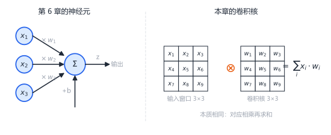
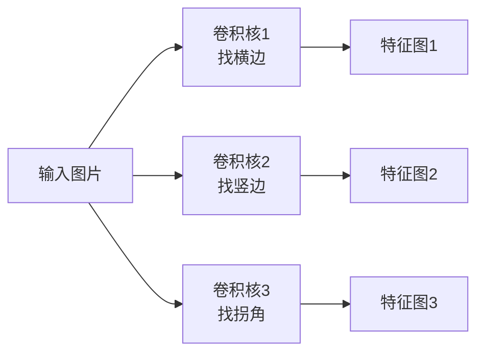
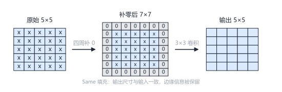
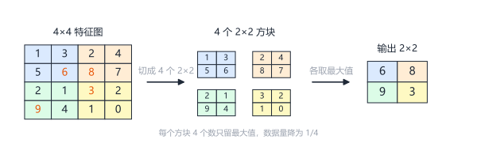
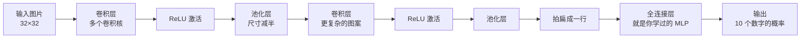
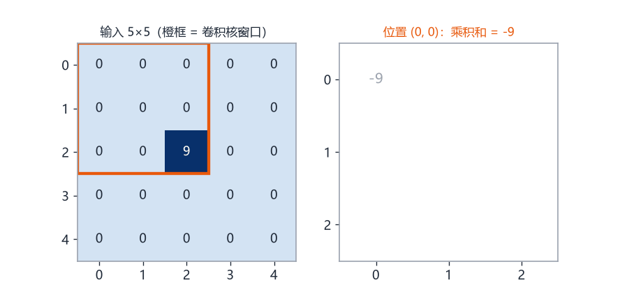

# 第18章 卷积神经网络CNN

> 本章学习目标：
> 1. 说出 MLP 处理图像时的两个致命问题，并能用具体数字说明参数量有多大
> 2. 用自己的话解释卷积操作在做什么，能手算一个 3×3 卷积核对 5×5 输入的完整输出
> 3. 解释卷积核、特征图、步长、填充、池化这五个概念的含义
> 4. 说明"权重共享"为什么让 CNN 的参数量远小于 MLP
> 5. 列举 CNN 的三个典型应用场景

## 从一个例子开始

假设你做了一个手写数字识别器：输入是 32×32 的灰度图片，输出是 0~9 这十个数字。

你已经学完前 17 章，MLP 对你来说轻车熟路。于是你把 32×32=1024 个像素排成一行，当作 1024 个输入，接一个 512 个神经元的隐藏层。

先别管效果，算一笔账——这一层有多少个参数？

$$\text{参数量} = 1024 \times 512 + 512 = 524{,}800$$

五十多万个参数，只为了处理一张邮票大小的图。如果图片换成 128×128，参数量变成 $16384 \times 512 + 512 = 8{,}389{,}120$，八百多万。

这还只是第一层。更要命的是另一个问题，先看一张图：

```
一张"7"的图片（示意）：        同一张"7"向右平移后：

 1 1 1 1 0                    0 1 1 1 1
 0 0 0 1 0                    0 0 0 0 1
 0 0 1 0 0                    0 0 0 1 0
 0 0 1 0 0                    0 0 0 1 0
 0 1 0 0 0                    0 0 1 0 0
```

对人来说，这两张图都是"7"，一眼就能认出来。但对 MLP 来说，它们是完全不同的输入——每个像素的位置都变了，所有权重都得重新适应。

MLP 把图片"拍扁"成一行的那一刻，像素之间的邻居关系就全丢了。它不知道第 1 个像素和第 2 个像素是紧挨着的，也不知道"一条斜线"这个图案无论出现在左边还是右边都是同一个图案。

这一章要讲的卷积神经网络（Convolutional Neural Network，CNN），就是专门为解决这个问题而生的。

## MLP 处理图像的两个困境

先把问题说清楚，再看 CNN 怎么解决。

**困境一：参数量爆炸。**

MLP 的每一层都是全连接——还记得第7章手算的那个 2-2-1 网络吗，每个神经元都和前一层的**所有**输出相连，权重数量 = 输入数 × 神经元数。输入从 2 维涨到 1024 维，参数量就跟着暴涨。图片越大，参数越多，内存和计算都扛不住。

**困境二：丢失空间结构。**

一张图片里，相邻的像素强相关（它们合起来构成一条边、一个角），相隔很远的像素关系很弱。但 MLP 对所有输入一视同仁：像素 (0,0) 和像素 (0,1) 的关系，跟像素 (0,0) 和像素 (31,31) 的关系，在它眼里没有任何区别。

更麻烦的是位置问题。一个"边缘"图案出现在图片左上角，MLP 学了一套权重去识别它；同一个图案出现在右下角，MLP 又得学另一套权重。同一件事学几百遍，纯属浪费。

人类视觉不是这样工作的。你认出一条边，不在乎它在视野的哪个位置。

CNN 的核心思想就一句话：**与其让每个位置各学各的，不如做一个可以到处滑动的"图案探测器"，整个图片共用。**

## 卷积的直觉：滑动放大镜找图案

想象你在一面巨大的马赛克墙上找一种特定的花纹。墙太大，你不可能一眼看完，于是你做了一个小放大镜——镜片上刻着你要找的花纹的"模板"。

你举着放大镜，从墙的左上角开始，一行一行地扫描。每到一个位置，你就对比一下：镜片下的花纹和模板像不像？像，就记一个高分；不像，就记一个低分。扫完整面墙，你得到一张"匹配程度地图"，哪里分数高，花纹就在哪里。

这个放大镜就是**卷积核（kernel，也叫滤波器 filter）**，这面墙就是输入图片，那张"匹配程度地图"就是**特征图（feature map）**，而"举着放大镜逐格对比"的过程，就是**卷积（convolution）**。

"对比"具体怎么做？对应位置相乘，再全部加起来——就是第2章学过的点积，只不过现在权重排成了一个小矩阵。

```
卷积核（3×3）：        输入图片（5×5）：

 -1  -1  -1             0  0  0  0  0
 -1   8  -1             0  0  0  0  0
 -1  -1  -1             0  0  9  0 0
                        0  0  0  0  0
                        0  0  0  0  0
```

先看这个卷积核的含义：中心是 8，周围一圈是 -1。它的意思是"如果中心位置很亮、周围很暗，就输出一个很大的数"——这是一个**亮斑检测器**。

再看输入图片：只有正中间有一个亮点 9，其余全是 0。

## 一次完整的卷积演算

现在把卷积核放到图片上滑动，一步一步算给你看。规则：卷积核覆盖一个 3×3 区域，对应元素相乘再求和，结果写进特征图的对应位置；然后向右挪一格，重复。5×5 的输入配 3×3 的核，每次挪一格，能放的位置是 3×3=9 个，所以输出是 3×3。

**第 1 步**：卷积核盖在左上角（覆盖第 0~2 行、第 0~2 列）：

```
被覆盖的区域：              逐元素相乘：
 0  0  0                   0×(-1) + 0×(-1) + 0×(-1)
 0  0  0        →        + 0×(-1) + 0× 8  + 0×(-1)
 0  0  9                 + 0×(-1) + 0×(-1) + 9×(-1)
                       = -9
```

注意那个 9 落在窗口的右下角，对应卷积核的 -1，所以贡献是 $9 \times (-1) = -9$。输出特征图的第 (0,0) 格填 -9。

**第 2 步**：向右挪一格（覆盖第 0~2 行、第 1~3 列）。9 落在窗口下边缘中间，还是对着 -1，输出同样是 -9。

**正中间那一步**：卷积核盖在第 1~3 行、第 1~3 列，亮点 9 正好在窗口中心，对着卷积核的 8：

$$9 \times 8 + \underbrace{0 + 0 + \cdots + 0}_{\text{其余 8 个位置全是 0}} = 72$$

9 个位置全部算完，得到特征图：

```
输出特征图（3×3）：
 -9  -9  -9
 -9  72  -9
 -9  -9  -9
```

结果非常干净：亮点所在的位置输出 72，一个巨大的正数；亮点擦边的位置输出 -9；没有亮点的位置输出 0。看一眼特征图，就知道亮斑在原图的什么位置。

这就是卷积在做的事：**用一个 9 个数字的小模板，把整张图扫一遍，找出"模板图案"出现的所有位置。**

## 卷积其实就是你学过的加权求和

停下来看一眼刚才的计算：9 个输入值，各自乘一个权重，加起来——这不就是第6章的 $z = wx + b$ 吗？只不过 $x$ 有 9 个、$b$ 暂时为 0。



所以卷积层不是新物种，它就是一种**特殊的全连接层**，特殊在两条约束上：

1. **局部连接**：每个输出只和输入的一个小窗口相连，而不是和所有输入相连
2. **权重共享**：所有输出共用同一组权重，而不是各有各的权重

第7章的全连接层是"每个神经元看全部输入、各有各的权重"；卷积层是"每个神经元只看一小块、大家用同一套权重"。加上这两条约束，参数量从几十万掉到几百——约束即智慧，这就是 CNN 全部的秘密。

后面你会反复看到这种模式：RNN 给全连接加"时间共享"的约束，注意力则是把约束放松、让数据自己决定连接强度。架构演进史，就是一部"加约束、解约束"的历史。

## 卷积核：可学习的图案模板

刚才那个"亮斑检测器"是我们手工设计的。真正的 CNN 里，卷积核的数字不是人定的——它们就是权重 $w$，初始化时是随机数，通过反向传播和梯度下降自动学出来的。第9、10章学的那套训练方法，在这里原封不动地用。

训练一个识别手写数字的 CNN，前几层的卷积核往往会自己学成"横边检测器""竖边检测器""斜边检测器""拐角检测器"，就像刚才的亮斑检测器一样，只不过图案更实用。

一个卷积层通常有**多个卷积核**，每个负责找一种图案：



多个卷积核 = 多个探测器同时扫描，各找各的图案，各画各的地图。

卷积核的大小也有讲究：

- 3×3：看局部细节，找边缘、角点，最常用
- 5×5：看更大范围的纹理
- 1×1：不看空间图案，只做通道间的信息混合（入门阶段了解即可）

## 步长与填充：两个调节旋钮

**步长（stride）**：放大镜每次挪几格。

刚才的例子每次挪 1 格（步长 1），输出 3×3。如果每次挪 2 格（步长 2），能放的位置变少，输出更小：

```
输入 8×8，卷积核 3×3：
  步长 1 → 输出 6×6（要算 36 次）
  步长 2 → 输出 3×3（只算 9 次，计算量降为 1/4）
```

步长是"精度换速度"的旋钮。

**填充（padding）**：注意到没有，5×5 的输入卷积后变成了 3×3——每做一次卷积，图就缩一圈。而且边缘像素只被扫到一两次，信息利用不充分。

解决办法：在输入的四周一圈补 0，再卷积：



不补零叫 Valid 填充（输出变小），补零保持尺寸叫 Same 填充。补的 0 只是占位，不影响"图案在哪"的判断。

## 池化：给特征图"瘦身"

卷积层输出的特征图还是很大，需要压缩。**池化（pooling）** 的做法简单粗暴：把特征图切成小方块，每个方块只留一个代表。

最常用的是**最大池化（max pooling）**：每个 2×2 方块只留最大的数。



每个方块取最大值：max(1,3,5,6)=6，max(2,4,8,7)=8，max(2,1,9,4)=9，max(3,2,1,0)=3

4 个数变 1 个，数据量直接降到 1/4。

为什么取最大值而不是平均值？想想特征图的含义：每个数值是"这里有多像目标图案"的打分。一个 2×2 区域里只要有一个位置强烈匹配，这个区域就该被记住。最大值保住的正是"最强烈的响应"。

池化还附赠一个好性质：**小幅度平移不变性**。图案往旁边挪了一格，2×2 方块里的最大值往往还是同一个数，输出几乎不变。就像你认字，字写在纸的偏左还是偏右，你都认得。

池化层没有任何可学习的参数——它只是取最大值，没有权重。所以它只做压缩，不做识别。

## CNN 为什么参数少：权重共享

现在回到开头的问题。32×32 的图片，64 个特征探测器，MLP 和 CNN 各要多少参数？

```
MLP：1024 个输入 × 64 个神经元 + 64 个偏置 = 65,600 个参数
CNN：64 个卷积核 × 每个 3×3 + 64 个偏置   =    640 个参数
```

差了大约 **100 倍**。图片越大，差距越夸张——CNN 的参数量跟图片大小**完全无关**，只取决于卷积核的大小和个数。

秘密就是**权重共享（weight sharing）**：一个 3×3 卷积核只有 9 个权重，但这 9 个权重在整张图片的每个位置重复使用。左上角用它，右下角也用它。

这正是开头那个"平移的 7"问题的解：因为探测器在整个图片上滑动，同一条斜边无论出现在哪里，都会被同一个卷积核用同一组权重认出来。学一遍，到处能用。

权重复用还有一个隐含的好处：卷积核学的是"图案"本身，而不是"某个位置的图案"。这是 CNN 比 MLP 更懂图片的根本原因。

## 一张完整的 CNN 长什么样

把卷积、激活、池化串起来，再接上你熟悉的全连接层，就是一个典型的 CNN：



数据在网络里流动时，含义在逐层变化：

- 浅层卷积：找边缘、色块这些"零件"
- 深层卷积：把零件拼成"部件"（眼睛、轮子、笔画）
- 全连接层：根据部件组合做最终判断（"这是数字 7"）

从零件到部件再到整体，一层比一层抽象——这是深度学习"深度"二字的真正含义。另外注意最后一步"拍扁"：卷积负责看图，看完还是交给 MLP 做决策，两者是合作关系，不是替代关系。

## CNN 的典型应用

CNN 最初为图像而生，但"滑动窗口找图案"这个思路在任何"相邻数据强相关"的场景都能用：

| 应用 | 输入 | 卷积核找什么 | 输出 |
|------|------|-------------|------|
| 手写数字识别 | 28×28 灰度图 | 笔画、弧线、拐角 | 0~9 |
| 人脸检测 | 照片 | 眼睛、鼻子、轮廓 | 人脸位置 |
| 心电图分析 | 一维心电信号 | 异常波形 | 正常/心律失常 |
| 关键词唤醒 | 音频频谱图 | "你好小X"的频谱图案 | 是否唤醒 |

注意后两个例子：声音和心电是一维信号，那就用一维卷积核（1×3 的小向量在信号上滑动）。图片是二维的用二维卷积，信号是一维的用一维卷积——思想完全一样。

你在手机上的每一次人脸解锁、每一次语音唤醒，背后几乎都有 CNN 在工作。

## 动手实验

下面这段代码，用纯 Python 实现本章演算的那个例子：3×3 卷积核扫描 5×5 图片，再做一次 2×2 最大池化。不用任何第三方库，直接运行。

```python
def conv2d(image, kernel):
    """3×3 卷积，步长 1，无填充"""
    size = len(image) - len(kernel) + 1
    output = []
    for i in range(size):
        row = []
        for j in range(size):
            total = 0
            for ki in range(len(kernel)):
                for kj in range(len(kernel)):
                    total += image[i + ki][j + kj] * kernel[ki][kj]
            row.append(total)
        output.append(row)
    return output

def max_pool2d(feature_map):
    """2×2 最大池化"""
    output = []
    for i in range(0, len(feature_map), 2):
        row = []
        for j in range(0, len(feature_map), 2):
            block = [feature_map[i][j], feature_map[i][j+1],
                     feature_map[i+1][j], feature_map[i+1][j+1]]
            row.append(max(block))
        output.append(row)
    return output

image = [
    [0, 0, 0, 0, 0],
    [0, 0, 0, 0, 0],
    [0, 0, 9, 0, 0],
    [0, 0, 0, 0, 0],
    [0, 0, 0, 0, 0],
]
kernel = [
    [-1, -1, -1],
    [-1,  8, -1],
    [-1, -1, -1],
]

features = conv2d(image, kernel)
print("卷积后的特征图：")
for row in features:
    print(row)

print("最大池化后（特征图是 3×3，只取前 2×2 区域演示）：")
small = [row[:2] for row in features[:2]]
print("左上角 2×2 区域的最大值 =", max_pool2d(small)[0][0])
```

**预期输出**：特征图和正文演算的结果完全一致——

```
卷积后的特征图：
[-9, -9, -9]
[-9, 72, -9]
[-9, -9, -9]
最大池化后（特征图是 3×3，只取前 2×2 区域演示）：
左上角 2×2 区域的最大值 = 72
```

可以看到：亮点在正中间时输出 72，最大池化后这个强响应被保留下来。如果你把 image 里的 9 挪到别的位置再运行，会发现特征图里的 72 也跟着挪——探测器忠实地报告了图案的位置。



<details>
<summary>🐘 C 语言对照</summary>

*语言差异：Python 的 `len(image)` 动态取尺寸，C 的二维数组作参数要写明维度；四重循环的结构与 Python 完全一致——卷积本来就是为循环而生的算法。无随机数，输出与 Python 逐位一致。*

```c
#include <stdio.h>

/* 3×3 卷积，步长 1，无填充 */
void conv2d(const double image[5][5], const double kernel[3][3],
            double output[3][3]) {
    for (int i = 0; i < 3; i++) {
        for (int j = 0; j < 3; j++) {
            double total = 0;
            for (int ki = 0; ki < 3; ki++) {
                for (int kj = 0; kj < 3; kj++) {
                    total += image[i + ki][j + kj] * kernel[ki][kj];
                }
            }
            output[i][j] = total;
        }
    }
}

/* 2×2 最大池化：这里对 2×2 的输入输出 1 个数 */
double max_pool2d(const double fm[2][2]) {
    double m = fm[0][0];
    if (fm[0][1] > m) m = fm[0][1];
    if (fm[1][0] > m) m = fm[1][0];
    if (fm[1][1] > m) m = fm[1][1];
    return m;
}

int main(void) {
    double image[5][5] = {
        {0, 0, 0, 0, 0},
        {0, 0, 0, 0, 0},
        {0, 0, 9, 0, 0},
        {0, 0, 0, 0, 0},
        {0, 0, 0, 0, 0},
    };
    double kernel[3][3] = {
        {-1, -1, -1},
        {-1,  8, -1},
        {-1, -1, -1},
    };

    double features[3][3];
    conv2d(image, kernel, features);

    printf("卷积后的特征图：\n");
    for (int i = 0; i < 3; i++) {
        printf("[%g, %g, %g]\n", features[i][0], features[i][1], features[i][2]);
    }

    /* 特征图是 3×3，只取左上角 2×2 区域演示 */
    double small[2][2] = {
        {features[0][0], features[0][1]},
        {features[1][0], features[1][1]},
    };
    printf("最大池化后（特征图是 3×3，只取前 2×2 区域演示）：\n");
    printf("左上角 2×2 区域的最大值 = %g\n", max_pool2d(small));
    return 0;
}
```

</details>

## 常见误区

**误区：卷积核是人手工设计的，比如"边缘检测核""模糊核"。**

真相：那是传统图像处理的做法。CNN 里的卷积核是随机初始化、靠反向传播学出来的。人只需要决定卷积核的**大小和数量**，具体学什么图案由训练数据说了算。

**误区：池化层也有权重需要训练。**

真相：池化层没有任何可学习参数，它只是"取最大值"这样的纯统计操作。CNN 里需要训练的只有卷积核和全连接层的权重。

**误区：CNN 淘汰了，现在都用 Transformer。**

真相：在图像领域 CNN 依然是主力之一，尤其在数据量不大、算力有限的场景。Transformer 是强大的补充而非全面替代，下一章和第20章你会更清楚各自的地盘。

## 章末习题

1. 一张 64×64 的灰度图输入 MLP，第一隐藏层有 256 个神经元，这一层有多少个参数？如果改用 32 个 5×5 的卷积核，又是多少个参数？
2. 用下面的卷积核，对下面的输入做卷积（步长 1，无填充），手算完整输出：

```
卷积核：          输入 4×4：
 1  0  -1         2  2  0  0
 1  0  -1         2  2  0  0
 1  0  -1         2  2  0  0
                  2  2  0  0
```

这个卷积核检测的是什么图案？

3. 对下面的 4×4 特征图做 2×2 最大池化，写出输出：

```
 2  5  1  1
 3  0  4  2
 1  1  6  3
 0  2  2  8
```

4. 输入 10×10，卷积核 3×3。步长 1 无填充时输出多大？步长 2 无填充时输出多大？（提示：输出尺寸 = 输入尺寸减卷积核尺寸，除以步长，再加 1）
5. （思考题）CNN 靠权重共享大幅减少了参数。请你想一想：权重共享隐含了一个什么假设？如果某种数据不满足这个假设（比如图片上半部分和下半部分的统计规律完全不同），纯 CNN 会遇到什么麻烦？

## 小结与下一章预告

本章要点：

1. MLP 处理图像有两个困境：参数量随输入维度爆炸，拍扁后丢失空间结构
2. 卷积 = 举着小模板（卷积核）在输入上滑动扫描，输出"图案匹配地图"（特征图）
3. 权重共享让一个 9 参数的卷积核扫描整张图，参数量与图片大小无关，还带来平移不变性
4. 池化无参数，取区域最大值，既压缩尺寸又增强抗平移能力
5. 典型 CNN = 卷积+激活+池化 反复堆叠，最后接全连接层做决策

图片有空间结构，CNN 靠滑动窗口解决。那如果数据有**时间**结构呢——读一句话时，后面的意思取决于前面的内容，这种"需要记忆"的数据，卷积还够用吗？下一章的循环神经网络会给你答案。
