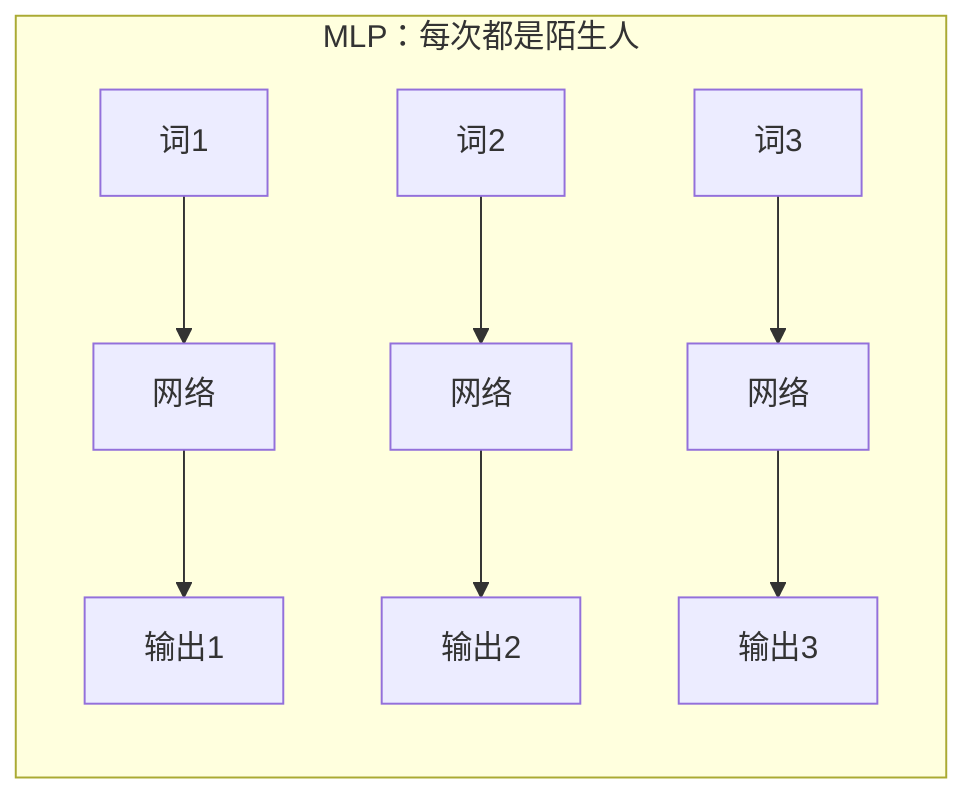
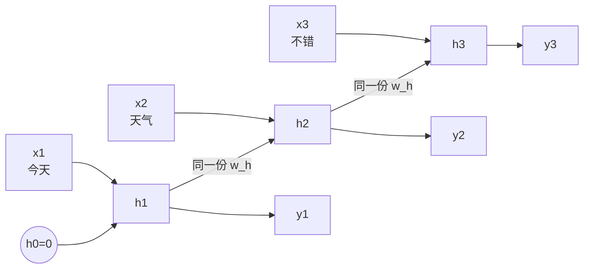
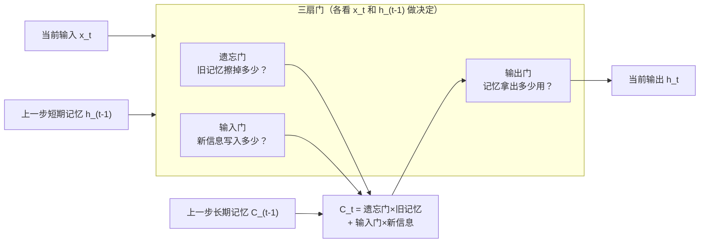

# 第19章 循环神经网络RNN与LSTM

> 本章学习目标：
> 1. 说明时序数据和普通数据的区别，解释 MLP 为什么处理不了时序问题
> 2. 用自己的话解释 RNN 的隐藏状态是什么，能画出 RNN 的展开结构
> 3. 手算一个 3 步的 RNN 前向传播
> 4. 解释长期依赖问题的成因（梯度在时间维度上的消失）
> 5. 说出 LSTM 三个门各自的作用，解释它为什么能记住更早的信息

## 从一个例子开始

读下面这句话，猜最后一个词：

> "今天天气不错，我决定去公园______"

你几乎不假思索地填上"散步"或"晒太阳"。注意你是怎么办到的：读到"散步"该出现的位置时，这个词本身还没出现，你靠的是**前面读过的所有内容**——"天气不错""决定""公园"。

再想想 MLP 会怎么做。MLP 看数据的方式是"一张照片一张照片地看"：给它一个词，它出一个结果，再给下一个词，它再出一个结果。每次处理都是完全独立的，处理"公园"时，它已经不记得三个词之前见过"天气"。



句子、语音、股价、温度记录……这些数据有一个共同点：**顺序本身就是信息的一部分**。把"狗 咬 人"三个字打乱成"人 咬 狗"，意思全变了。这一章要讲的循环神经网络（Recurrent Neural Network，RNN），就是给网络装上"记忆"，让它能处理这种有先后顺序的数据。

## 时序数据：顺序就是信息

先把要解决的问题定义清楚。**时序数据（time series / sequence data）** 指的是：当前时刻的输出，不仅取决于当前时刻的输入，还取决于**之前**的输入。

| 时序数据 | 为什么需要"记忆" |
|---------|----------------|
| 一句话 | 理解"它"指代谁，要回忆前文 |
| 语音 | 一个音节什么意思，要看前后音节 |
| 每日气温 | 预测明天，要看最近一周的趋势 |
| 设备振动 | 判断是否故障，要看振动模式的变化过程 |

你可能会想：把前后几个时刻的数据拼起来，一起喂给 MLP 不就行了？比如每次把最近 5 个词拼成一个长向量。

这个办法确实有人用，但有三个硬伤：

1. **窗口长度得提前定死**。定 5 个词，就永远只看 5 个词；可有的句子需要回想 20 个词之前的内容
2. **参数量暴涨**。输入维度扩大 5 倍，第一层参数量也扩大 5 倍——上一章刚批判过这个问题
3. **同样的图案在不同位置要重复学**。"天气不错"出现在句首和句尾，MLP 要分别学两套权重——和第18章 MLP 处理图像的毛病一模一样

回忆一下 CNN 是怎么解决"图案位置不固定"的：让探测器在整个输入上**滑动共享**。RNN 解决时序问题的思路异曲同工：让网络在时间上**逐步处理、参数共享**，并且每一步都把"到目前为止的记忆"传下去。

## RNN：给网络一个笔记本

RNN 的核心设计只有一样东西：**隐藏状态（hidden state）**，记作 $h$。你可以把它理解成网络的"笔记本"——每读一个新输入，就在笔记本上更新几行笔记；做判断时，既看当前输入，也翻笔记本。

用符号写出来（记号沿用全书惯例，$x$ 是输入，$w$ 是权重，$b$ 是偏置，$f$ 是激活函数）：

$$h_t = f(w_h \cdot h_{t-1} + w_x \cdot x_t + b)$$

$$y_t = g(w_y \cdot h_t + c)$$

下标 $t$ 表示时刻。逐个符号解释：

- $x_t$：$t$ 时刻的输入（比如句子里第 $t$ 个词）
- $h_{t-1}$：上一时刻留下的笔记
- $h_t$：更新后的笔记——由"旧笔记 + 新输入"共同决定
- $y_t$：$t$ 时刻的输出
- $w_h$、$w_x$、$w_y$：三组权重，分别控制"旧笔记的影响""新输入的影响""笔记如何变成输出"

关键在第一个公式：**新的记忆 = 旧记忆和新输入的加权求和，再激活**。这和第6章神经元的计算方式完全相同，只是输入多了一份——来自上一时刻的自己。

再看一个容易忽略但极其重要的细节：所有时刻用的是**同一组** $w_h$、$w_x$、$w_y$。第 1 步用它，第 100 步还是它。这就是时间维度上的权重共享——和 CNN 的空间权重共享是同一个思想，一个管空间，一个管时间。

## 把循环展开来看

RNN 画成一个圈很抽象，把它沿时间轴**展开（unroll）** 就清楚了：



读句子"今天天气不错"的过程：

- $t=1$：$h_1 = f(w_x \cdot x_1)$，笔记上写"在说今天"
- $t=2$：$h_2 = f(w_h \cdot h_1 + w_x \cdot x_2)$，笔记更新为"今天 + 天气"
- $t=3$：$h_3$ 更新为"今天 + 天气 + 不错"

每一步的笔记都压缩了"从开头到现在"的全部信息。这和第18章的卷积有个有趣的对比：CNN 是同一个模板在**空间**上滑，RNN 是同一组权重在**时间**上滚。

## RNN 和 MLP 的区别，一张表说清

| | MLP | RNN |
|---|-----|-----|
| 记忆 | 无，每次输入独立处理 | 有，隐藏状态 $h_t$ 一路传递 |
| 输入长度 | 必须固定 | 任意长，逐时刻喂入 |
| 参数 | 每层一组，互不相关 | 全程共享同一组 $w_h, w_x, w_y$ |
| 适合的数据 | 独立的样本（表格、单点测量） | 序列（文本、语音、传感器流） |
| 输出何时产生 | 喂完输入立即产生 | 可以每步都产生，也可以只要最后一步 |

特别注意"参数全程共享"这一条：序列有 10 步和 10000 步，RNN 的参数量一模一样。这和 CNN"参数量与图片大小无关"是同一个魔法在不同维度的再现。

还有一个输出形式上的灵活性值得记住。RNN 可以"边读边输出"（如实时语音转文字，每个音频帧出一个字符候选），也可以"读完再输出"（如情感分析，读完整句才判断褒贬），还可以"读一段、写一段"（如机器翻译）。同一块积木，三种用法，覆盖绝大多数时序任务。

## 手算一遍：3 步 RNN 前向传播

光说不练假把式。取一组最简单的数字，亲手推一遍。

设：$w_x = 0.5$，$w_h = 0.1$，$b = 0$，激活函数用 tanh（第6章讲过，它把数压到 -1~1 之间），初始记忆 $h_0 = 0$。输入序列是 $x_1=1$，$x_2=2$，$x_3=3$。

**第 1 步**：

$$h_1 = \tanh(0.1 \times 0 + 0.5 \times 1) = \tanh(0.5) \approx 0.462$$

**第 2 步**：注意 $h_1$ 被送了回来：

$$h_2 = \tanh(0.1 \times 0.462 + 0.5 \times 2) = \tanh(1.046) \approx 0.780$$

**第 3 步**：

$$h_3 = \tanh(0.1 \times 0.780 + 0.5 \times 3) = \tanh(1.578) \approx 0.918$$

```
时刻:        t=1        t=2        t=3
输入 x:       1          2          3
记忆 h:      0.462      0.780      0.918
              ↑          ↑          ↑
           只见过1    见过1和2    见过1、2、3
```

记忆值一步步攀升——它在累积所有见过的输入。这就是"记忆"最朴素的样子。

## 长期依赖问题：笔记本会褪色

如果 RNN 只有上面这些，故事就完美了。可惜有一个致命问题。

回忆第12章讲的梯度消失：反向传播时梯度靠链式法则一层层往回传，每过一层乘一次导数，tanh 和 sigmoid 的导数都小于 1，乘得多了梯度就趋近于零。

RNN 展开后相当于一个**超深网络**——100 个时刻就是 100"层"。梯度要从 $t=100$ 传回 $t=1$，得连乘 100 次导数。假设每次传递平均只剩 1/4（tanh 导数的典型量级）：

```
回传步数 n:        1       5        10         20
梯度 ≈ (1/4)^n:  0.25   ≈0.001   ≈0.000001   ≈0.0000000000009

梯度量级示意：
t=1  |#
t=5  |
t=10 |
t=20 |        ← 早就小到可以忽略，权重几乎得不到更新信号
```

后果很直白：**RNN 只能记住最近十几步的内容**。读到第 100 个词时，第 1 个词留下的痕迹在训练时传不回梯度，相当于那本笔记本的字迹会快速褪色。

用填空例子说："我出生在中国……（省略 50 句话）……所以我会说______。"答案"中文"取决于 50 句之前的"中国"。普通 RNN 做不到，这就叫**长期依赖问题（long-term dependency problem）**。

## LSTM：给笔记本加一支笔和一块橡皮

1997 年提出的 **LSTM（Long Short-Term Memory，长短期记忆网络）** 专门解决这个问题。它的思路用一句话概括：**记忆不该被每一步强制改写，该写什么、该擦什么，让网络自己决定。**

LSTM 有两条信息通道：

- **细胞状态（cell state）** $C_t$：长期记忆，像一条传送带，信息可以在上面几乎原样地传很远
- **隐藏状态 $h_t$**：短期记忆，负责当前步的输出和决策

控制传送带的是三扇**门（gate）**。每扇门都是一个小神经网络，输出一个 0~1 之间的数：0 是全关，1 是全开。



用"考试周的笔记本"来理解三扇门：

**遗忘门（forget gate）**——"上一页的笔记还有用吗？"复习到第三章，发现第一章的笔记和考试无关，擦掉（门输出接近 0）；发现有关，留着（接近 1）。

**输入门（input gate）**——"刚听到的这个新知识值得记吗？"老师随口讲的段子，不记（接近 0）；老师强调的考点，赶紧写上（接近 1）。

**输出门（output gate）**——"笔记本上的内容，现在答题要用吗？"记在本子上的公式，这道题用得上就拿出来（接近 1），用不上就先放着。

长期记忆的更新公式（先感受结构，不必背）：

$$C_t = (\text{遗忘门}) \times C_{t-1} + (\text{输入门}) \times (\text{新候选内容})$$

选择性保留旧的，选择性写入新的——每一部分由一扇门控制，而每扇门的开闭程度由当前输入和短期记忆算出，全部是学出来的。

## 门的内部：还是你学过的神经元

"门"听起来玄乎，拆开看没有任何新东西。以遗忘门为例：

$$f_t = \text{sigmoid}(w_f \cdot [h_{t-1}, x_t] + b_f)$$

这就是第6章的神经元：把上一时刻的短期记忆和当前输入拼起来当输入，过一组自己的权重和偏置，用 sigmoid 激活——sigmoid 的输出恰好在 0~1 之间，天然适合当"门的开度"。

三扇门就是三个这样的小神经元（组），各自有自己的权重。它们不神秘：初始时门的开闭是乱来的，训练过程中反向传播会调整它们的权重，让网络自己学会"什么时候该忘、什么时候该记"。

所以 LSTM 的全部构成是：**几个普通神经元 + 一种精心设计的连接方式**。你早已掌握了它的每一个零件，新学问全在"怎么组装"里。这也再次印证本书反复出现的观点：深度学习的进展，更多来自结构设计的巧思，而不是基本元件的翻新。

## 什么时候不要用 RNN

RNN/LSTM 不是时序数据的唯一答案，两种情况下它不合适：

**序列里只有"局部模式"重要时**，比如检测振动信号里有没有某种瞬时冲击波形——第18章的一维卷积更直接：滑窗找图案，不用维护记忆，训练和推理都更快。

**序列很长又需要全局视野时**，比如理解一篇几百词的文章——记忆瓶颈和串行计算的短板都会暴露，这正是下一章 Transformer 的主场。

经验法则：**短序列、重局部 → CNN；中等序列、重顺序 → RNN/LSTM；长序列、重全局 → 注意力。** 三者不是替代关系，而是不同形状的数据各配不同的钥匙。

## LSTM 为什么能记住很久以前的事

秘密藏在上面公式的**运算形式**里。对比普通 RNN 和 LSTM 的记忆更新：

```
普通 RNN：  h_t = f(w_h × h_(t-1) + ...)   ← 每步都乘 w_h，连乘 100 次 → 消失
LSTM：      C_t = f_t × C_(t-1) + 新内容     ← 存在一条"加法"通道
```

看 LSTM 这条通道：如果遗忘门学到"一直开着"（输出≈1），那么 $C_t \approx C_{t-1} + \text{新内容}$。旧记忆是**加**进去的，不是**乘**进去的。

梯度沿着这条加法通道回传时，不需要连乘一堆小于 1 的数，可以几乎无损地传到几百步之前。这就像传话游戏：普通 RNN 是每传一个人都转述一遍（越传越走样），LSTM 是允许把原话直接递过去。

代价也很实在：LSTM 有三扇门加一个候选记忆，共四组权重，参数量和计算量大约是普通 RNN 的 4 倍。用 4 倍的成本，换"记住几百步之前"的能力——在大多数时序任务里，这笔买卖是划算的。

## 两个补充：训练方式与 LSTM 的亲戚

**RNN 怎么训练？** 方法没有新意，还是第10章的反向传播 + 第5章的梯度下降，只是梯度要沿着展开后的时间轴一路回传，学名叫**随时间反向传播（Backpropagation Through Time，BPTT）**。你不需要掌握细节，只要理解：展开后的 RNN 就是一个超深网络，深网络的训练问题（第12章的梯度消失）它全都有，而且更严重——这正是前面"记忆褪色"的根因。

**LSTM 有个简化版亲戚叫 GRU（门控循环单元）**：把三扇门合并成两扇（更新门、重置门），细胞状态和隐藏状态也合而为一，参数量省约 1/4，多数任务上效果和 LSTM 相当。工程上想省资源时，GRU 是常见的平替。记住"门控"这个核心思想即可，具体几个门是取舍问题。

另外还有一种直觉上好懂的变体：**双向 RNN**。读"我决定去公园__"时，如果也能看到后面的词，理解会更准。双向 RNN 就是一个网络从头往后读、另一个从后往前读，两份记忆拼起来用。语音识别的精度提升里，它有重要功劳。

## RNN/LSTM 的典型应用

它们的共同点：单看一个时间点的数据毫无意义，价值全在"变化的过程"里。举两个具体例子感受数据是怎么流的。

**例子一：输入法的下一词预测。**

```
你输入：  今天  →  天气  →  真
RNN：    h1      h2       h3（记住了"今天+天气"）
                          ↓
              预测下一个词：好(35%) 不错(28%) 冷(12%) ...
```

每一步的预测都建立在之前所有词的记忆上。如果只看到孤零零一个"真"字，没人知道后面该接什么；有了"今天天气"的上下文，候选词立刻收窄。

**例子二：设备故障预测。**

```
振动传感器每 10ms 一个读数：
  x1, x2, x3, ..., x500（过去 5 秒）
        ↓ 逐个喂入 LSTM
  h500 里压缩了"振动模式的演变趋势"
        ↓
  输出：未来 24 小时故障概率 73% → 提前安排检修
```

为什么非 LSTM 不可？因为故障的征兆不是一个瞬时读数，而是"振幅缓慢变大 + 频率成分悄悄改变"这样的**趋势**，趋势藏在几百个读数的先后关系里。

**例子三：语音唤醒。** 手机一直在听环境音，把音频切成一帧帧特征序列喂给一个小型 LSTM，只有"音节序列"匹配唤醒词模式时才输出高分、唤醒系统。24 小时待机还能省电，靠的就是 LSTM 模型小、逐帧处理开销低。

| 应用 | 序列是什么 | 网络记住了什么 |
|------|-----------|---------------|
| 文本预测/输入法联想 | 词序列 | 前文语境 |
| 语音识别 | 音频帧序列 | 前后音节 |
| 机器翻译 | 源语言词序列 | 整句含义 |
| 设备故障预测 | 传感器读数序列 | 振动模式的演变趋势 |
| 音乐生成 | 音符序列 | 旋律走向 |

## 动手实验

下面这段代码实现正文手算的那个 3 步 RNN，顺便展示"记忆褪色"：把一个很早的输入对最终记忆的影响打印出来。只用标准库 math。

```python
import math

def rnn_step(x, h_prev, w_x=0.5, w_h=0.1, b=0.0):
    return math.tanh(w_h * h_prev + w_x * x + b)

# 实验一：正文的手算例子
h = 0.0
print("实验一：逐步记忆")
for t, x in enumerate([1, 2, 3], start=1):
    h = rnn_step(x, h)
    print(f"  t={t}  输入={x}  记忆 h={h:.3f}")

# 实验二：早期输入的影响会褪色
# 序列 A：开头是 100，后面全是 0
# 序列 B：开头是 -100，后面全是 0
# 如果记忆不褪色，两条序列的最终记忆应该差很多
def run(seq):
    h = 0.0
    for x in seq:
        h = rnn_step(x, h)
    return h

seq_a = [100] + [0] * 10
seq_b = [-100] + [0] * 10
print("实验二：11 步之后")
print(f"  开头是 +100 的最终记忆：{run(seq_a):.6f}")
print(f"  开头是 -100 的最终记忆：{run(seq_b):.6f}")
print("  两者几乎相同——开头那个天差地别的输入，已经被'忘'了")
```

**预期输出**：

```
实验一：逐步记忆
  t=1  输入=1  记忆 h=0.462
  t=2  输入=2  记忆 h=0.780
  t=3  输入=3  记忆 h=0.918
实验二：11 步之后
  开头是 +100 的最终记忆：0.000000 附近的一个小正数
  开头是 -100 的最终记忆：0.000000 附近的一个小负数
```

实验一复现了你的手算结果（末位可能略有差异，正常）。实验二里，开头差了 200 的两个序列，11 步之后记忆几乎一样——这就是普通 RNN 的"褪色"现象，你亲眼看到了长期依赖问题。

<details>
<summary>🐘 C 语言对照</summary>

*语言差异：Python 的默认参数 `w_x=0.5, w_h=0.1, b=0.0` 在 C 里写成函数内的常量；`[100] + [0] * 10` 这种"拼列表"，在 C 里靠初始化器补零实现（`double seq_a[11] = {100}` 首元素为 100，其余自动为 0）。数值与 Python 逐位一致。*

```c
#include <stdio.h>
#include <math.h>

double rnn_step(double x, double h_prev) {
    const double w_x = 0.5, w_h = 0.1, b = 0.0;
    return tanh(w_h * h_prev + w_x * x + b);
}

double run(const double seq[], int n) {
    double h = 0.0;
    for (int i = 0; i < n; i++) {
        h = rnn_step(seq[i], h);
    }
    return h;
}

int main(void) {
    /* 实验一：正文的手算例子 */
    double h = 0.0;
    double xs[3] = {1, 2, 3};
    printf("实验一：逐步记忆\n");
    for (int t = 0; t < 3; t++) {
        h = rnn_step(xs[t], h);
        printf("  t=%d  输入=%g  记忆 h=%.3f\n", t + 1, xs[t], h);
    }

    /* 实验二：早期输入的影响会褪色
       序列 A：开头是 100，后面全是 0；序列 B：开头是 -100 */
    double seq_a[11] = {100};    /* 其余元素自动补 0 */
    double seq_b[11] = {-100};
    printf("实验二：11 步之后\n");
    printf("  开头是 +100 的最终记忆：%.6f\n", run(seq_a, 11));
    printf("  开头是 -100 的最终记忆：%.6f\n", run(seq_b, 11));
    printf("  两者几乎相同——开头那个天差地别的输入，已经被'忘'了\n");
    return 0;
}
```

</details>

## 常见误区

**误区：RNN 的每个时刻有各自独立的一组权重。**

真相：所有时刻共享同一组 $w_h$、$w_x$、$w_y$。序列多长都一样，这正是 RNN 能处理变长序列的原因。

**误区：LSTM 彻底消灭了梯度消失。**

真相：它只是大幅缓解。遗忘门开着时梯度能传很远，但门是学出来的，不保证永远开；序列极长时 LSTM 依然吃力。第20章的注意力机制从另一个角度解决了这个问题。

**误区：隐藏状态 $h_t$ 里存着历史的完整记录。**

真相：$h_t$ 是固定长度的向量，是对历史的**有损压缩**。把 100 个词的信息压进一个小向量，必然丢东西——这个"压缩瓶颈"正是后来注意力机制要打破的。

## 章末习题

1. 用一句话说明：时序数据和普通数据的本质区别是什么？
2. 沿用正文手算例子的参数（$w_x=0.5$，$w_h=0.1$，$b=0$，tanh 激活，$h_0=0$），输入序列改为 $x_1=2$，$x_2=0$，$x_3=0$，手算 $h_1$、$h_2$、$h_3$（tanh 的取值：$\tanh(1)\approx0.762$，$\tanh(0.076)\approx0.076$，$\tanh(0.008)\approx0.008$）。观察 $h_3$ 和 $h_1$ 的关系，说明"记忆褪色"。
3. 为什么说普通 RNN"只能记住最近十几步"？请从梯度反向传播的角度解释。
4. LSTM 的遗忘门输出 0.9、输入门输出 0.1，上一步长期记忆 $C_{t-1}=10$，新候选内容 $C'=5$。求更新后的 $C_t$，并解释这个结果意味着什么。
5. （思考题）第18章的 CNN 和本章的 RNN 都用了"权重共享"，但共享的维度不同。请对比两者：各在什么维度上共享？各自换来了什么好处？如果一个任务既有空间结构又有时间结构（比如视频），你猜可以怎么组合？

## 小结与下一章预告

本章要点：

1. 时序数据的顺序本身是信息，MLP 无记忆、定窗口的拼接方案有硬伤
2. RNN 用隐藏状态 $h_t$ 做"笔记本"，逐时刻处理、参数全程共享，能处理变长序列
3. 普通 RNN 展开后等效于超深网络，梯度沿时间连乘快速消失，只能记住近十几步
4. LSTM 把记忆拆成长期（细胞状态）和短期（隐藏状态）两条路，用遗忘门、输入门、输出门决定写擦取
5. 加法式的记忆更新让梯度能传几百步，代价是约 4 倍参数

LSTM 让网络记住了更久，但记忆仍要被压缩进一个固定大小的向量，而且必须一个词一个词顺序处理，慢。有没有办法让每个位置**直接看到**所有其他位置，不靠传递、不受距离限制？下一章的注意力机制，是当前 AI 大爆发的地基。
