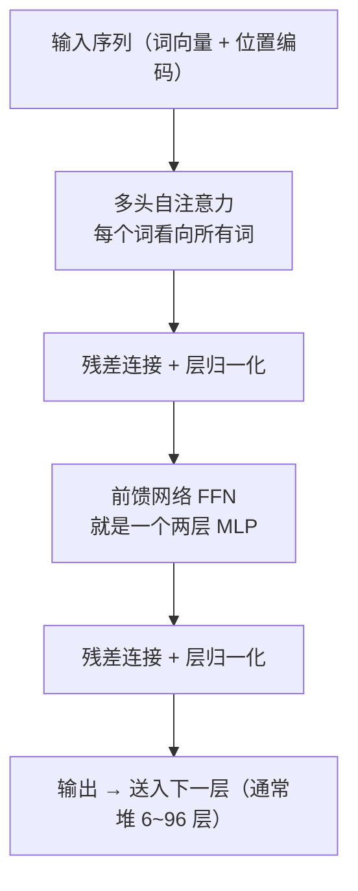

# 第20章 注意力机制与Transformer入门

> 本章学习目标：
> 1. 用生活语言解释注意力机制在做什么
> 2. 说明 Query、Key、Value 三个角色各自的分工
> 3. 手算一次两个词的自注意力（含 softmax 加权求和）
> 4. 描述 Transformer 的核心结构，指出它和 RNN 的本质区别
> 5. 解释 Transformer 取代 RNN 的两个主要原因

## 从一个例子开始

读下面这句话：

> "那只动物没过马路，因为它太宽了。"

"它"指谁？停顿两秒你会发现这句话有两种读法——如果"它"指马路，"太宽"说得通；如果指动物，就有点怪。你刚才做的那件事很有意思：**你的目光自动跳回前面的几个名词，逐个掂量哪个和"它"最配**。

注意你**没有**做的事：你没有从"那"字开始，把整句话重新顺序读一遍。你是直接"跳转"到相关的词上。

第19章的 RNN/LSTM 恰恰只能顺序读：一个词一个词处理，把前文压缩进一个固定大小的记忆向量，指望"它"出现时记忆里有用。句子一长，压缩必然丢信息。

这一章讲的**注意力机制（attention mechanism）**，就是让网络学会你刚才做的事：**不排队、不压缩，每个词直接"看向"所有词，自己决定该重点关注谁。**

## 注意力的直觉：把目光分给该看的词

先回忆人类阅读时的注意力分配：

```
"神经网络的权重通过反向传播更新，其中学习率控制每步的幅度。"
                 ↑↑↑                              ↑↑↑
            目光重点停留                       目光重点停留
```

你不会对每个字投入相同的精力，关键词多看几眼，"的""了"一扫而过。注意力机制就是把这个能力数学化：

1. 对当前要处理的词，计算它和序列里**每个**词的"相关程度"
2. 把相关程度变成一组加起来等于 1 的权重（百分比）
3. 按权重把所有词的信息**加权混合**，得到当前词的新表示

第三步你在第6章就见过——就是加权求和。新瓶装旧酒：注意力无非是一次"权重由内容决定"的加权平均。

对比 RNN，差异一目了然：

```
RNN：     词1 → 词2 → 词3 → ... → 词100
          信息必须逐个传递，词1 的信息传 99 站才到词100

注意力：  词1 ←————————————————→ 词100
          任意两个词直接相连，距离远近一视同仁
```

## Query、Key、Value：查词典的过程

实际计算中，每个词会被投影成三个向量。名字唬人，分工用"查词典"一类比就清楚了：

| 角色 | 查词典类比 | 含义 |
|------|-----------|------|
| **Query（查询）** | 你想查的那个词 | "我在找什么" |
| **Key（键）** | 词典里每个词条的标签 | "我这里是什么内容" |
| **Value（值）** | 词条下的释义正文 | "我这儿的实际信息" |

查词典的流程：拿着你想查的词（Query），和每个词条的标签（Key）比对，找到最像的词条，把它的释义（Value）抄走。

注意力计算就是这个流程的可微分版本。每个词同时备好自己的 Q、K、V 三件套，然后：

```
第 1 步：打分    score = Q·K      （Query 和每个 Key 做点积，
                                    点积越大越"对得上"——第2章学过的点积）
第 2 步：归一    权重 = softmax(各打分)   （把打分转成百分比，加起来为 1）
第 3 步：汇总    输出 = Σ 权重 × V      （按百分比对所有 Value 加权求和）
```

softmax 你在第4章见过：把任意一组数变成一组加起来为 1 的概率。这里的概率就是"目光分配比例"。

还有个工程细节：点积的结果会先除以 $\sqrt{d_k}$（$d_k$ 是 Key 向量的长度）再做 softmax。原因：维度高时点积数值容易很大，softmax 会被顶到饱和区（梯度几乎为 0，第12章的教训），除以一个缩放因子把数值拉回温和区间。入门阶段知道"这是为了训练稳定"即可。

## 自注意力：一次手算

**自注意力（self-attention）** 指 Q、K、V 来自同一个序列——句子内部互相关注。用一个只有两个词的迷你序列，完整算一遍。

设两个词，每个词是 2 维向量：

```
词1 的 Query：q1 = [1, 0]
词1 的 Key：  k1 = [1, 0]     词1 的 Value：v1 = [1, 1]
词2 的 Key：  k2 = [0, 1]     词2 的 Value：v2 = [2, 0]
```

现在计算**词1 的新表示**（即：词1 应该"看向"谁、看多少）。

**第 1 步，打分**——q1 分别和两个 Key 做点积（对应位置相乘再相加）：

$$s_1 = q_1 \cdot k_1 = 1 \times 1 + 0 \times 0 = 1$$

$$s_2 = q_1 \cdot k_2 = 1 \times 0 + 0 \times 1 = 0$$

（例子维度小，省略 $\sqrt{d_k}$ 缩放。）

**第 2 步，softmax 归一**：

$$\text{权重}_1 = \frac{e^1}{e^1 + e^0} = \frac{2.718}{2.718 + 1} \approx 0.731$$

$$\text{权重}_2 = \frac{e^0}{e^1 + e^0} = \frac{1}{3.718} \approx 0.269$$

两个权重加起来正好是 1——目光分配完毕：73% 看自己，27% 看词2。

**第 3 步，按权重加权求和 Value**：

$$\text{输出} = 0.731 \times [1, 1] + 0.269 \times [2, 0] = [0.731 + 0.538,\ 0.731 + 0] = [1.269,\ 0.731]$$

词1 的新表示 [1.269, 0.731] 里，既有自己的信息，也混进了词2 的信息——混合比例由内容相似度自动决定。这就是一次完整的注意力。

## Q、K、V 是从哪来的

上面例子里 q、k、v 的数字是给的，实际模型中它们是**算出来的**：每个词的原始向量，分别乘三组权重矩阵 $W_Q$、$W_K$、$W_V$，得到自己的 Q、K、V。

$$q = x \cdot W_Q, \qquad k = x \cdot W_K, \qquad v = x \cdot W_V$$

这又是老朋友：矩阵乘法，第2章和第7章都练过。这三组矩阵就是注意力层要训练的参数——初始是随机数，反向传播负责把它们调到"会提取有用的查询、有用的标签、有用的内容"。

打个比方：同一个词是一本书的原文，$W_Q$、$W_K$、$W_V$ 是三副不同的眼镜。戴 $W_Q$ 这副，看到的是"这个词想找什么"；戴 $W_K$ 这副，看到的是"这个词的检索标签"；戴 $W_V$ 这副，看到的是"这个词的实际信息"。三副眼镜的镜片参数，全是学出来的。

整个注意力层里没有任何手工设计的规则——"该关注谁"这件事本身，就是从数据中学出来的。这是注意力机制最深刻的一点。

把这件事对序列里**每个词**都做一遍，整层自注意力就完成了。而且注意：每个词的计算互不依赖，可以同时算——记住这一点，后面要用。

## 注意力权重矩阵：一张能"看"的图

把序列里所有词两两之间的注意力权重排成一个方阵，就得到**注意力矩阵**。这是理解注意力最直观的方式：

```
句子："猫 追 老鼠 ，它 跑 得 很 快"

          猫   追  老鼠  ，  它   跑   得   很   快
   猫    [■   ▓   ▒   ·   ▒   ░   ·   ·   · ]
   追    [▓   ■   ▓   ·   ░   ▓   ·   ·   ░ ]
  老鼠   [▒   ▓   ■   ·   ▓   ▒   ·   ·   · ]
   ，    [·   ·   ·   ■   ·   ·   ·   ·   · ]
   它    [▒   ░   ■   ·   ■   ▒   ·   ·   ░ ]  ← "它"最关注"老鼠"
   跑    [·   ▒   ░   ·   ░   ■   ▓   ░   ▒ ]
   得    [·   ·   ·   ·   ·   ▓   ■   ▓   ▒ ]
   很    [·   ·   ·   ·   ·   ░   ▓   ■   ■ ]
   快    [·   ░   ·   ·   ░   ▓   ▒   ■   ■ ]

  ■=高度关注  ▓=较高  ▒=一般  ░=微弱  ·=几乎不关注
```

看第 5 行："它"这一行，权重最高的一列是"老鼠"——网络学会了代词该指向谁，没有任何人告诉过它语法规则，全是数据里统计出来的。

这个矩阵还有两个值得注意的性质：

1. **大小是 n×n**（n 是序列长度）——这就是后面要说的"计算量随长度平方增长"的来源
2. **每一行加起来等于 1**——每个词的目光总量固定，分给别人多，留给自己就少

训练好的模型把这张矩阵画出来，是观察"模型在想什么"的一扇窗口，可解释性研究里经常用到。

## 多头注意力与位置编码

实际模型里还有两个重要配件，用直觉各讲一句。

**多头注意力（multi-head attention）**：一次注意力只能按一种标准判断"相关性"，但语言的相关性有很多种——语法关系、语义近似、指代关系……多头的做法是并行跑好几组 Q/K/V（好几套可学习的投影权重），每组各看一个角度，最后把结果拼起来。就像你审一篇稿子，既看语法、又看逻辑、还看语气，多头让网络也学会"多角度看问题"。

**位置编码（positional encoding）**：注意力只看内容相似度，**本身不知道词的顺序**——"狗咬人"和"人咬狗"的注意力分数一模一样，这显然不行。解决办法：给每个位置的词向量额外加一串"位置信号"（常用不同频率的正弦/余弦值），让网络能区分"第 3 个词"和"第 30 个词"。加上位置编码后，内容的匹配和位置的先后都能被网络利用。

## Transformer 的核心结构

2017 年的论文《Attention Is All You Need》提出了 **Transformer**：标题即纲领——只用注意力，彻底扔掉循环结构。

它的基本积木（一层）长这样：



逐个拆开看，没有一样是你没学过的：

**多头自注意力**：上一节讲过，负责"词与词之间交换信息"。

**前馈网络（FFN）**：就是一个两层 MLP，对**每个词**独立做一次非线性变换。注意力负责"混合信息"，MLP 负责"加工信息"，分工明确。

**残差连接**：输出 = 输入 + 本层变换，即 $\text{out} = x + \text{Sublayer}(x)$。它给梯度修了一条"直通车道"，缓解第12章的梯度消失，让几十上百层的网络训得动。

**层归一化**：把每层的数据重新拉回稳定的数值范围，让训练更平稳。

把这块积木堆 N 层，就是 Transformer 的编码器。用于生成文本的模型（如 GPT 系列）还会在自注意力上加一个**掩码（mask）**：预测第 $t$ 个词时，把 $t$ 之后位置的注意力分数屏蔽掉——防止"偷看答案"，迫使它只根据已出现的词来预测下一个词。著名的 GPT，本质就是一个带掩码的 Transformer 解码器堆很多很多层。

## 编码器与解码器：两种用法

Transformer 原文里编码器和解码器成对出现（用于翻译），但后来的模型把它们拆开了，各自成家：

| | 编码器（Encoder） | 解码器（Decoder） |
|---|---|---|
| 看什么 | 整个序列，前后都能看 | 只看当前位置之前（掩码） |
| 擅长 | **理解**：分类、检索、情感分析 | **生成**：写文章、聊天、写代码 |
| 代表模型 | BERT 系列 | GPT 系列 |

用考试打比方：编码器像做**阅读理解**——整篇文章摊在面前随便翻，然后答题；解码器像做**作文续写**——只能看着已写下的部分，一个词一个词往后编。

翻译那种"先读懂一整句外语、再逐词生成中文"的任务，才需要两者接力：编码器负责读懂，解码器负责生成。而纯理解或纯生成的任务，用其中一半就够了。

## 为什么 Transformer 取代了 RNN

回到上一章结尾留的问题。对比之下，RNN 的两个命门被注意力精准命中：

| | RNN/LSTM | Transformer |
|---|---|---|
| 信息传递 | 逐时刻传递，远距离信息衰减 | 任意两词直接相连，距离无关 |
| 记忆容量 | 压缩进固定大小向量，必然丢失 | 每个词保留自己的表示，按需取用 |
| 计算方式 | 必须串行，第100步要等前99步算完 | 所有位置可同时计算，高度并行 |

**第一个原因：长距离依赖不再是问题。** RNN 里词1 的信息要传 99 站才能影响词100，每站都有损耗；注意力里它们之间是一条直连边。LSTM 的"加法通道"是在修补串行传递的损耗，而注意力直接取消了传递。

**第二个原因：并行带来的训练速度。** RNN 的串行是天生的——$h_t$ 依赖 $h_{t-1}$，想算后面必须先算前面，GPU 再强也只能干等。自注意力中每个词的计算互不依赖，几千个词可以同时算完。现代大模型能在海量文本上训练，靠的就是这个并行性。

当然注意力不是没有代价：每个词要和所有词两两打分，计算量随序列长度**平方**增长。序列从 128 涨到 8192，注意力计算量涨 $64^2=4096$ 倍。这就是为什么"长文本处理"至今仍是研究热点。但在绝大多数任务上，这个代价换来了更好的效果和更快的训练，值得。

从 MLP 到 CNN、RNN 再到 Transformer，脉络很清晰：**每代架构都在为特定结构的数据设计更合适的"信息通路"**——CNN 利用空间局部性，RNN 利用时间顺序，Transformer 用注意力让信息自由流动，通用性最强。

## Transformer 家族的著名成员

知道这几个名字，你看 AI 新闻时就不会迷路：

**BERT（2018）**：编码器路线。训练方式是让模型做"完形填空"——把句子里 15% 的词遮住，让它根据前后文猜。猜了几亿次之后，模型对语言的理解远超从前，成为文本分类、搜索排序的标配底座。

**GPT 系列（2018 起）**：解码器路线。训练任务简单到不可思议：**给定前面的词，预测下一个词**。就这一个任务，用海量文本、堆上百层、几千亿参数去做，做到了能聊天、能写作、能编程——你听说过的 ChatGPT 就是这个路线的产物。"简单的目标 + 巨大的规模"涌现出意想不到的能力，是这几年 AI 领域最重要的发现。

**ViT（Vision Transformer，2020）**：把图片切成 16×16 的小块，每块当作一个"词"喂给 Transformer——注意力机制从此跨界到图像，和第18章的 CNN 分庭抗礼。这再次印证：注意力是一种通用机制，不挑数据类型。

还有你现在每天在用的搜索、翻译、输入法、语音助手，背后几乎都已换成 Transformer 系模型。说它取代了 RNN，一点不夸张。

## 一个容易混淆的点：训练快 ≠ 推理省

要公平地补一句 RNN 的遗言。Transformer 的并行优势在**训练**时是碾压级的，但在**逐词生成**的推理阶段，解码器同样得一个词一个词往外蹦（下一个词依赖上一个词），并行帮不上忙，而且每生成一个词都要和历史所有词算注意力——生成越长越慢。

所以准确的说法是：**训练时 Transformer 完胜；推理时它甩掉的是 RNN 的"压缩瓶颈"，保留的是逐词生成的串行性。** 这也是为什么流式语音等极端低延迟场景里，小模型 RNN 仍有一席之地。

## 平方复杂度，算一笔账

"计算量随序列长度平方增长"这句话值得落到数字上。n 个词的序列，注意力矩阵有 $n \times n$ 个打分要算：

```
序列长度 n:      100        1,000         10,000
打分次数:      10,000    1,000,000     100,000,000
            （1 万）     （100 万）      （1 亿）
相对倍数:        1×         100×          10,000×
```

长度扩大 10 倍，打分次数扩大 100 倍。日常对话几十上百个词，完全没问题；但"把一整本书塞进模型"（几十万词），光一个注意力矩阵就要算几千亿次、占几十 GB 内存——这就是大模型"上下文长度"指标背后真正的战场。

研究者的应对思路，了解名字即可：限制每个词的视野（滑动窗口注意力）、只保留重要的连接（稀疏注意力）、用数学技巧近似 softmax（线性注意力）。目标一致：把平方增长压回接近线性。入门阶段你只要记住：**注意力用平方的成本换来了全局的视野，这笔买卖在中小长度上稳赚，在超长文本上需要打折技巧。**

## 三章架构，一条主线

把第18、19、20 章串起来看，三种架构其实是在回答同一个问题：**信息该怎么在网络里流动？**

```
CNN：        信息只能在小窗口内流动，但窗口扫遍全图
             → 用"局部 + 共享"换效率，适合空间数据

RNN/LSTM：   信息沿时间逐个传递，记忆压缩在固定向量里
             → 用"顺序 + 记忆"换时序建模，受困于距离

注意力：     信息在任意两个位置间自由流动，权重由内容决定
             → 用"平方成本"换全局视野，通用性最强
```

注意一个递进关系：CNN 的连接方式最"硬"（固定窗口），RNN 次之（固定顺序），注意力最"软"（连接强度全部由数据学出来）。约束越少，模型越通用，但需要的数据和算力也越多——架构选型的本质，是在"先验假设"和"学习能力"之间找平衡。你的问题里有多少可利用的结构，就加多少约束；结构不明时，才轮到通用的注意力上场。

## 动手实验

下面用纯 Python 复现正文的手算例子：两个词的自注意力，并多算一步——同时求出词2 的新表示。

```python
import math

def softmax(scores):
    exp_scores = [math.exp(s) for s in scores]
    total = sum(exp_scores)
    return [e / total for e in exp_scores]

def attention(query, keys, values):
    scores = [sum(q * k for q, k in zip(query, key)) for key in keys]
    weights = softmax(scores)
    dim = len(values[0])
    output = [sum(weights[i] * values[i][d] for i in range(len(values)))
              for d in range(dim)]
    return weights, output

# 词1: q=[1,0] k=[1,0] v=[1,1]；词2: k=[0,1] v=[2,0]
keys   = [[1, 0], [0, 1]]
values = [[1, 1], [2, 0]]

w1, out1 = attention([1, 0], keys, values)
print(f"词1 的注意力权重：自己 {w1[0]:.3f}，词2 {w1[1]:.3f}")
print(f"词1 的新表示：[{out1[0]:.3f}, {out1[1]:.3f}]")

w2, out2 = attention([0, 1], keys, values)
print(f"词2 的注意力权重：词1 {w2[0]:.3f}，自己 {w2[1]:.3f}")
print(f"词2 的新表示：[{out2[0]:.3f}, {out2[1]:.3f}]")
```

**预期输出**：

```
词1 的注意力权重：自己 0.731，词2 0.269
词1 的新表示：[1.269, 0.731]
词2 的注意力权重：词1 0.269，自己 0.731
词2 的新表示：[1.731, 0.269]
```

词1 的结果和手算完全一致。词2 的 Query 是 [0,1]，和 k2 匹配度高，所以 73% 看自己——每个词按自己的 Query 独立决定看向谁。你可以改动 keys 里的数字再运行：让 k2 变得和 q1 更像（比如 [0.9, 0.1]），会看到词1 投向词2 的权重明显上升——注意力权重完全由内容决定。

<details>
<summary>🐘 C 语言对照</summary>

*语言差异：`zip(query, key)` 配对点积，C 用下标循环；`attention` 通过指针同时带回权重和新表示（Python 返回二元组）。运算只有点积、softmax、加权求和，两种语言逐位一致——注意力的"老朋友"本性在 C 里看得更清楚。*

```c
#include <stdio.h>
#include <math.h>

void softmax(const double scores[], int n, double out[]) {
    double total = 0;
    for (int i = 0; i < n; i++) {
        out[i] = exp(scores[i]);
        total += out[i];
    }
    for (int i = 0; i < n; i++) {
        out[i] /= total;
    }
}

/* weights 带回注意力权重，out 带回新表示 */
void attention(const double query[2], const double keys[2][2],
               const double values[2][2], double weights[], double out[]) {
    double scores[2];
    for (int i = 0; i < 2; i++) {
        scores[i] = query[0] * keys[i][0] + query[1] * keys[i][1];  /* 点积打分 */
    }
    softmax(scores, 2, weights);
    for (int d = 0; d < 2; d++) {
        out[d] = 0;
        for (int i = 0; i < 2; i++) {
            out[d] += weights[i] * values[i][d];   /* 加权求和 Value */
        }
    }
}

int main(void) {
    /* 词1: q=[1,0] k=[1,0] v=[1,1]；词2: k=[0,1] v=[2,0] */
    double keys[2][2]   = {{1, 0}, {0, 1}};
    double values[2][2] = {{1, 1}, {2, 0}};

    double w1[2], out1[2], w2[2], out2[2];
    double q1[2] = {1, 0}, q2[2] = {0, 1};

    attention(q1, keys, values, w1, out1);
    printf("词1 的注意力权重：自己 %.3f，词2 %.3f\n", w1[0], w1[1]);
    printf("词1 的新表示：[%.3f, %.3f]\n", out1[0], out1[1]);

    attention(q2, keys, values, w2, out2);
    printf("词2 的注意力权重：词1 %.3f，自己 %.3f\n", w2[0], w2[1]);
    printf("词2 的新表示：[%.3f, %.3f]\n", out2[0], out2[1]);
    return 0;
}
```

</details>

## 常见误区

**误区：注意力是一种新的神经元/激活函数。**

真相：注意力的全部运算还是点积、softmax、加权求和这些老朋友，没有任何新的基本运算。它是一种**信息组织方式**：让权重由数据内容动态决定，而不是固定学死。

**误区：Transformer 里不需要任何"记忆"，所以彻底没有顺序概念。**

真相：它靠位置编码注入顺序信息，没有位置编码的 Transformer 分不清"狗咬人"和"人咬狗"。扔掉的是"串行处理"，不是"顺序信息"。

**误区：注意力权重高就代表"因果关系"或"重要性"的最终解释。**

真相：注意力权重反映的是模型选择的信息流向，可以作为理解模型的线索，但不等同于严格的原因解释。把权重热力图当"模型在想什么"的直接证据，是过度解读。

## 章末习题

1. 用查词典的类比，分别解释 Query、Key、Value 的作用。
2. 沿用正文例子的 keys 和 values（$k_1=[1,0]$，$v_1=[1,1]$，$k_2=[0,1]$，$v_2=[2,0]$），但 Query 换成 $q=[0,1]$。手算注意力权重和输出（$e^0=1$，按提示逐步计算）。
3. 自注意力中，"自"体现在哪里？它和"一个词只和相邻词交换信息"相比，优势是什么？
4. Transformer 为什么训练起来比 RNN 快？请从"计算能不能并行"的角度回答。
5. （思考题）注意力的计算量随序列长度平方增长。假设处理 100 个词需要 1 万次打分计算，处理 1000 个词大约需要多少次？这个性质给"让大模型读一整本书"带来了什么困难？你能想到什么缓解思路？

## 小结与下一章预告

本章要点：

1. 注意力让每个词直接"看向"所有词，按内容相关度分配目光，替代了 RNN 的逐站传递
2. Query 是"我要找什么"，Key 是"我是什么"，Value 是"我的实际内容"；计算 = 点积打分 → softmax 归一 → 加权求和 Value
3. 多头注意力从多个角度并行看，位置编码补上顺序信息
4. Transformer = 多头自注意力 + 两层 MLP + 残差连接 + 层归一化，堆叠 N 层
5. 它取代 RNN 靠两点：任意距离直连、全序列并行计算；代价是计算量随长度平方增长

到这里，你已经认识了当今主流架构。但还有一个现实问题没解决：这些强大的模型动辄几亿参数，训练一次要海量数据和算力——普通人、小公司、小数据集怎么办？下一章讲的迁移学习，是"站在巨人肩膀上"的艺术，也是本书的最后一站。
