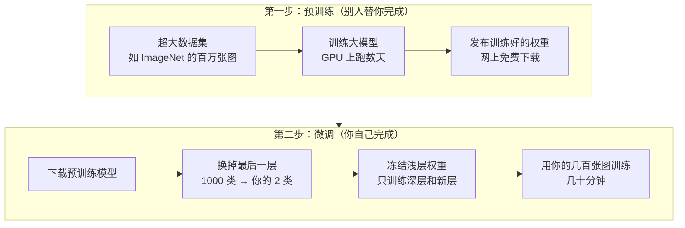
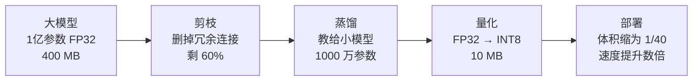
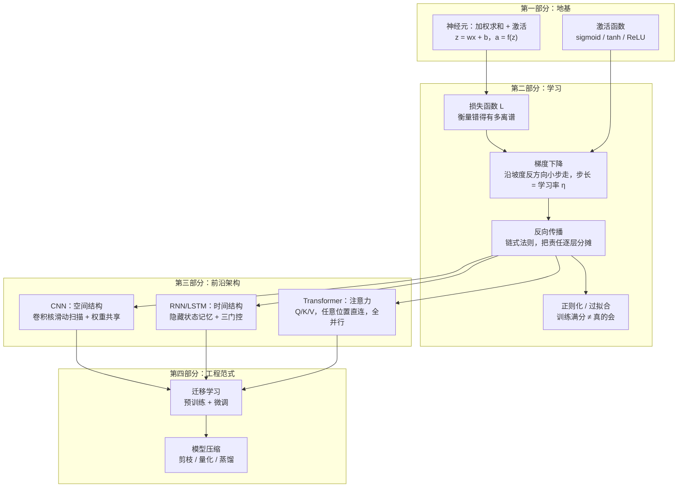

# 第21章 迁移学习与展望

> 本章学习目标：
> 1. 用自己的话解释迁移学习为什么有效
> 2. 描述"预训练 + 微调"的完整流程，说出冻结策略的三种选择
> 3. 各用一句话说清剪枝、量化、知识蒸馏在做什么
> 4. 画出全书的知识地图，说清各章节概念之间的关系
> 5. 知道继续深入学习可以去哪些方向

## 从一个例子开始

回忆你学骑车的经历。

如果你小时候学会了骑自行车，后来学骑摩托车时，平衡、转弯、刹车的感觉都是现成的，只需要适应油门和速度——几个小时就能上路。而一个从没骑过车的人直接学摩托，要摔很多跤。

没有人觉得奇怪：**已经学会的能力，可以搬到新任务上继续用。**

现在换个场景。你手头有 500 张产品照片，想训练一个网络分辨"合格"和"有划痕"。按前面 20 章的知识，你会搭一个 CNN，随机初始化权重，开始训练——然后大概率碰壁：500 张图太少了，网络连"边缘""纹理"这些基本功都没练熟，就要学"划痕"，结果只能是过拟合（第14章讲过的老问题：训练集上满分，新图上一塌糊涂）。

可是，世界上已经有人在**一亿张图片**上训练好了视觉网络，它学到的边缘、纹理、形状识别能力是通用基本功。能不能把这份"骑自行车的经验"借过来？

能。这就是**迁移学习（transfer learning）**。

## 迁移学习为什么有效

关键在于神经网络的**分层特性**——第18章结尾我们见过，CNN 从浅到深学到的东西抽象程度不同：

```
浅层：边缘、颜色、纹理      ← 通用基本功，换什么图像任务都用得上
中层：形状、局部部件        ← 半通用
深层：具体的类别判断        ← 和训练任务强绑定
```

一个在一百万张猫狗汽车照片上训练好的网络，它的浅层是"通用的看图能力"，和你识别划痕需要的基本功高度重叠。真正和你的任务绑定的，只有最后几层。

所以迁移的策略很自然：**基本功整个搬过来，只重新学最后那一点"专业课"。**

这也解释了迁移学习的两大好处：

1. **数据需求骤降**。通用特征不用重新学，小数据集（几百张）只够教最后几层——恰好只需要教最后几层
2. **训练成本骤降**。要更新的参数从几千万变成几万，普通电脑几十分钟就能完成，不再需要成排的 GPU

## 预训练 + 微调：标准范式

迁移学习最主流的落地方式叫**预训练 + 微调（pre-training + fine-tuning）**，分两步：



几个实操要点，每个背后都有道理：

**换输出层**。预训练模型的最后一层是为它原来的任务设计的（比如输出 1000 个类别的概率）。你的任务是 2 分类，就把最后一层拆掉，换成一个输出 2 个数的新层，权重随机初始化。

**冻结（freeze）浅层**。所谓冻结，就是训练时不更新这些层的权重——它们是搬来的基本功，别动。常见三档策略：

| 策略 | 做法 | 适合什么时候 |
|------|------|-------------|
| 全冻结 | 只训练新换的输出层 | 数据极少（几十张） |
| 冻浅层、调深层 | 浅层冻结，深层和新层一起训练 | 数据几百到几千张，最常用 |
| 全解冻 | 所有层一起微调 | 数据充足，追求极致精度 |

**学习率调小**。从头训练常用 0.01 这个量级，微调常用 0.001 甚至更小。原因：预训练权重已经在一个好位置上了，大步更新会把学好的基本功"踩坏"，小步挪动只是让它适应你的数据。回想第5章的学习率——步子大小要和"离目标的距离"匹配，微调时你本来就在目标附近。

**微调的本质**，回到第5章损失曲面的图景：从头训练是从曲面的随机一点出发找山谷；微调是从别人已经找到的"好位置"旁边出发，往你自己的小山谷挪几步。起点不同，难度天差地别。

## 两种力度：特征提取与端到端微调

同样是迁移，"动多少"有讲究，形成两个极端：

**特征提取（feature extraction）**：预训练模型完全冻结，只当一个"特征提取器"用——图片过一遍网络，取出倒数第二层的向量，然后只训练你新加的那层分类器。要学的参数最少。

**端到端微调（end-to-end fine-tuning）**：预训练层全部或大部解冻，和你的新层一起训练。要学的参数最多，上限也最高。

| | 特征提取 | 端到端微调 |
|---|---------|-----------|
| 训练参数量 | 只有新输出层（几千个） | 大部或全部（百万级） |
| 需要的数据 | 几十到几百个样本 | 几千个以上 |
| 训练设备 | 普通 CPU 足够 | 最好有 GPU |
| 过拟合风险 | 低 | 中高 |
| 精度上限 | 中 | 高 |

选择的口诀：**数据越少，动得越少。** 几十张图就别惦记端到端了，老老实实只训输出层；数据涨到几千张，再逐步解冻深层。

## 迁移学习什么时候不灵

迁移不是万能药，两种典型翻车场景值得警惕：

**场景一：源任务和目标任务差太远。** 在自然照片上预训练的模型，迁到 X 光片、显微镜细胞图上，"边缘纹理"这些最底层的特征仍然通用，但中层以上就帮不上忙了——它从没见过骨头和细胞。数据越特殊，能冻结的层越少。

**场景二：盲目微调把好东西学坏。** 数据太少又全解冻、学习率又大，几轮训练就把预训练权重冲得面目全非，通用特征毁于一旦——这就是前面说的灾难性遗忘。迁移来的资产，得小心看管。

判断迁移价值的经验问题只有一个：**"预训练模型见过的数据，和我的数据像不像？"** 越像，能白拿的东西越多。

## 微调要更新多少参数：算一笔账

"只训练最后几层"到底省多少？用一个具体例子感受。

假设预训练模型有 2500 万个参数，倒数第二层输出 2048 维向量，原输出层是 1000 类。你的任务是 3 分类。

```
方案 A：只换输出层（特征提取）
  要训练的 = 新输出层 = 2048 × 3 + 3 = 6,147 个参数
  冻结的   = 25,000,000 个参数
  训练参数占比 ≈ 0.02%

方案 B：解冻最后 1/10 的层 + 新输出层
  要训练的 ≈ 2,500,000 + 6,147 ≈ 250 万个参数
  训练参数占比 ≈ 10%
```

方案 A 的训练参数只有六千多个——500 张图、普通笔记本 CPU 就能搞定，而且参数这么少，想过拟合都难。这就是迁移学习"小数据也能玩"的数学解释：**要学的参数和拥有的数据，终于在数量级上匹配了。**

## 预训练模型从哪来：现代 AI 的分工

你可能会问：那些预训练模型是谁训练的？答案是**分工**——这是过去十年 AI 产业最重要的变化之一。

```
大公司/研究机构                你（使用者）
─────────────                ─────────────
收集海量数据                   下载现成权重
成排 GPU 训练数周      →      换成自己的输出层
（电费以百万计）               用自己的小数据微调
发布权重，免费下载             部署到自己的产品
```

训练一个顶级视觉或语言模型的成本，以百万人民币计；但训练好的权重大多被公开发布（Hugging Face 等平台上数以万计）。于是整个行业形成了"少数人造底座、多数人做适配"的格局。

这和软件行业的开源库是同一个逻辑：没人自己写操作系统，大家都在别人的地基上盖自己的房子。学会挑选和使用预训练模型，和学会写代码一样，已经是 AI 工程师的基本功。

## 模型压缩：把大模型塞进小设备

微调解决了"训练不起"的问题，还有一个姊妹问题：模型太大，部署不起。一个几亿参数的模型，手机都嫌挤，更别说手表、耳机。三种主流压缩技术，各用一句话记住它们：

**剪枝（pruning）**：训练好的网络里大量权重接近 0、贡献甚微，把它们删掉（像冬天给树剪枝），模型变小而精度几乎不掉。

```
剪枝前：  0.8  -0.01  0.3        剪枝后：  0.8   0    0.3
         -0.02  1.2  -0.03    →           0    1.2   0
          0.7  -0.2   0.04               0.7  -0.2   0
（绝对值小于 0.1 的权重直接清零/删除）
```

**量化（quantization）**：把权重从 32 位浮点数改成 8 位整数存储和计算，模型体积直接缩到 1/4，推理还更快，代价是轻微精度损失——就像把高清照片转成压缩格式，肉眼几乎看不出差别。

**知识蒸馏（knowledge distillation）**：让大模型当"老师"、小模型当"学生"。学生不只学标准答案，还模仿老师的输出细节——比如老师说"这张图 70% 像猫、25% 像狐狸、5% 像狗"，这里"猫和狐狸更像"的隐含信息，比干巴巴的"是猫"二字教得多。学生模型因此能用十分之一的参数学到接近老师的水平。

三者常组合使用：先剪枝、再蒸馏、最后量化，一个庞然大物可以缩小几十倍。

典型的压缩流水线长这样：



什么时候用哪招？粗略的决策逻辑：

- 模型只是"有点大"→ 先量化，成本最低、收益最快
- 精度要求极高、量化损失不能接受 → 考虑量化感知训练（训练时就模拟低精度，本书不展开）
- 结构本身臃肿 → 剪枝
- 目标是换一个根本装得下的小模型 → 蒸馏

入门阶段不必深究实现，记住这张"工具箱清单"，遇到"模型装不下、跑不动"时知道有哪些牌可打，就够了。

## 全书知识地图

走到这里，把 21 章的内容收拢成一张图：



看懂这张图，你就真正"入门完成"了：所有复杂的现代 AI 系统，拆开看都是这些积木的组装——加权求和、激活、损失、梯度、反向传播，加上为不同数据结构设计的信息通路。

## 回顾：这本书带你走过的路

合上书之前，按顺序回忆一遍你亲手做过的每件事：

**第 1~5 章**是数学地基：导数告诉你"变化有多快"，向量与点积是数据的语言，概率给可能性刻度，指数函数和 softmax 提前备好了工具，梯度下降给出"沿坡度下山"的总策略。当时看是零散数学，现在你知道每一件用在哪里。

**第 6~9 章**，你认识了神经元 $z = wx + b$ 和激活函数，手算了一遍前向传播，学会用损失函数给错误打分，然后完成了第一次训练——看着 loss 曲线下降的那一刻，你完成了从"知道"到"做到"的跨越。

**第 10~12 章**，你啃下了最硬的骨头：反向传播（链式法则把责任逐层分摊）、梯度下降家族（动量、Adam）、激活函数与梯度消失。到这里，训练网络的全部核心机制你都见过了。

**第 14~16 章**，你从"能训练"进阶到"训练得好"：过拟合与数据集划分、正则化三板斧、数据工程——训练网络不只是数学，还有大量经验性的手艺。

**第 17 章**，你用纯 Python 从零写出了一个完整的神经网络库——不依赖任何框架的完整能力，已经在你手里。

**第 18~21 章**（本部分），你站上了高处：CNN 教你空间结构怎么利用，RNN/LSTM 教你时间怎么记忆，注意力教你信息可以自由流动，迁移学习教你不必事事从零开始。

值得强调的是你**没有**学的：没有 numpy，没有框架，没有矩阵记号，没有严格证明。这不是缺陷，而是路线——直觉先行、徒手实现、眼见为实。现在去补那些形式化的工具，你会发现它们全是在给你已经懂的东西换一套更高效的语言。

## 继续深造的方向

这本书给了你直觉和徒手实现的能力，想继续走，有几个方向：

**动手框架**。学 PyTorch 或 TensorFlow，把本书手写的 MLP 用框架重实现一遍，你会对"框架替你做了什么"有别人没有的理解。

**数学补强**。线性代数（向量、矩阵）和微积分（偏导数）是进阶文献的通用语言。3Blue1Brown 的《线性代数的本质》系列视频是最友好的入口。

**经典读物**。Michael Nielsen 的免费在线书《Neural Networks and Deep Learning》风格与本书一脉相承，可以作为下一站；之后是 Ian Goodfellow 的《Deep Learning》。

**跟住前沿**。Transformer 之后，大语言模型（GPT 系列）、扩散模型（图像生成）是当下的热点，它们的底座都是你在这本书里见过的东西。

**多写代码**。读十遍不如写一遍。给本书每章的实验做变种：换激活函数、换学习率、换数据——"弄坏"再修好，是最快的学习路径。

## 学完之后的第一周，做什么

理论放久了会凉，给你一张可执行的清单：

1. **重做第17章的手写库**，不看原文，凭记忆写出来，再对照查漏——这是你对全书掌握程度的最好体检
2. **把第18章的卷积实验扩展一步**：写一版带填充（Same padding）的卷积，验证输出尺寸和输入相同
3. **找一个真实小数据集**（公开的手写数字集、鸢尾花集都行），用你的手写库跑通一次完整训练
4. **画一遍全书知识地图**，不看本书，凭记忆画，卡住的地方就是该重读的章节
5. **装一个 PyTorch**，用 20 行代码实现第9章的 sin(x) 拟合——你会惊讶于框架之简洁，也会庆幸自己知道那 20 行背后发生了什么

做完这五件事，你就从"读完一本书的人"变成"会用手艺的人"。

## 动手实验

最后做一个概念演示：直观感受"预训练 + 微调"的威力。

场景：目标任务是学 $y = 2x + 1$。假设一个"预训练模型"已经在相似任务 $y = 2x$ 上学过，权重是 $w=2$，$b=0$。现在只有**1 个**训练样本 $(x=3, y=7)$：

- 方案 A（迁移）：冻结 $w=2$，只微调 $b$
- 方案 B（从零）：$w$、$b$ 都从 0 开始学

```python
def train(lr, epochs, freeze_w, w, b, x, y):
    for _ in range(epochs):
        error = (w * x + b) - y
        grad_b = 2 * error
        b -= lr * grad_b
        if not freeze_w:
            grad_w = 2 * error * x
            w -= lr * grad_w
    return w, b

x_train, y_train = 3, 7   # 唯一的训练样本

w_a, b_a = train(lr=0.1, epochs=50, freeze_w=True, w=2.0, b=0.0,
                 x=x_train, y=y_train)
print(f"迁移微调：w={w_a:.3f}（冻结），b={b_a:.3f}")
print(f"  测试 x=100：预测 {w_a*100+b_a:.1f}，真值 201")

w_b, b_b = train(lr=0.05, epochs=60, freeze_w=False, w=0.0, b=0.0,
                 x=x_train, y=y_train)
print(f"从零训练：w={w_b:.3f}，b={b_b:.3f}")
print(f"  测试 x=100：预测 {w_b*100+b_b:.1f}，真值 201")
```

**预期输出**：

```
迁移微调：w=2.000（冻结），b=1.000
  测试 x=100：预测 201.0，真值 201
从零训练：w≈2.100，b≈0.700
  测试 x=100：预测 210.7，真值 201
```

两个方案在那 1 个训练样本上都做到了零误差，但测试时高下立判：迁移方案靠着"预训练得来的正确斜率"，1 个样本就把偏置修准，完美泛化；从零方案只有一个方程却有两个未知数，凑出一个刚好过点的错误答案，$x$ 越大偏得越远。这就是"站在巨人肩膀上"的全部含义。

<details>
<summary>🐘 C 语言对照</summary>

*语言差异：Python 的 `freeze_w=True` 关键字参数与布尔值，在 C 里是位置参数加 1/0；函数通过指针带回 `w`、`b` 两个结果。算法逻辑逐行对应。*

```c
#include <stdio.h>

void train(double lr, int epochs, int freeze_w,
           double w0, double b0, double x, double y,
           double *pw, double *pb) {
    double w = w0, b = b0;
    for (int i = 0; i < epochs; i++) {
        double error = (w * x + b) - y;
        b -= lr * 2 * error;             /* grad_b = 2*error */
        if (!freeze_w) {
            w -= lr * 2 * error * x;     /* grad_w = 2*error*x */
        }
    }
    *pw = w;
    *pb = b;
}

int main(void) {
    double x_train = 3, y_train = 7;   /* 唯一的训练样本 */

    double w_a, b_a;
    train(0.1, 50, 1, 2.0, 0.0, x_train, y_train, &w_a, &b_a);  /* 冻结 w */
    printf("迁移微调：w=%.3f（冻结），b=%.3f\n", w_a, b_a);
    printf("  测试 x=100：预测 %.1f，真值 201\n", w_a * 100 + b_a);

    double w_b, b_b;
    train(0.05, 60, 0, 0.0, 0.0, x_train, y_train, &w_b, &b_b); /* 从零 */
    printf("从零训练：w=%.3f，b=%.3f\n", w_b, b_b);
    printf("  测试 x=100：预测 %.1f，真值 201\n", w_b * 100 + b_b);
    return 0;
}
```

</details>

## 常见误区

**误区：迁移学习就是拿别人的模型直接用。**

真相：预训练模型输出层是为原任务设计的，至少要换掉输出层并用你的数据训练它。"直接用"只在你的任务和原任务完全一致时才成立。

**误区：微调时学习率越大收敛越快，应该调大。**

真相：微调起点已经很好，大学习率会破坏预训练学到的通用特征（俗称"灾难性遗忘"）。微调的学习率通常比从头训练小 10~100 倍。

**误区：模型压缩是训练之外的锦上添花，可有可无。**

真相：在真实产品里，压缩常常决定模型能不能上线。一个精度 99% 但跑不动的模型，价值不如精度 96% 但能在目标设备上实时运行的模型。

## 章末习题

1. 迁移学习为什么能大幅减少对数据量的需求？请从"神经网络分层特性"的角度解释。
2. 你的任务是识别 3 种水果，手里有 200 张标注图片。请写出用预训练模型解决它的完整步骤（从下载模型到训练完成），并说明你会选哪种冻结策略、为什么。
3. 微调阶段的学习率为什么要比从头训练小？如果忘了调小，可能发生什么？
4. 把剪枝、量化、知识蒸馏各对应到一个生活类比（正文已给出线索），并说明三者分别压缩的是什么：参数数量、参数精度，还是模型结构？
5. （思考题）回顾知识地图：CNN、RNN、Transformer 分别利用了数据的什么结构？如果让你设计一个处理"带时间戳的照片序列"（比如监控摄像头分析）的系统，你会怎么组合这三者？

## 小结与下一章预告

本章要点：

1. 迁移学习 = 借用大模型在通用数据上学到的基本功，只重学与任务绑定的深层，数据和算力需求骤降
2. 标准范式是预训练 + 微调：换输出层、冻结浅层、小学习率、少量数据训练
3. 模型压缩三件套：剪枝删冗余参数、量化降参数精度、蒸馏让小模型模仿大模型
4. 全书知识可归约为：加权求和与激活 → 损失与梯度下降 → 反向传播 → 为不同数据结构设计的架构 → 让模型用得起、装得下的工程范式

没有下一章了——你读完了整本书。从 $z = wx + b$ 一个公式出发，你走到了当今 AI 大厦的门口。剩下的路，去写代码、去读论文、去把想法变成能跑的东西。祝你在神经网络的世界里玩得开心。
