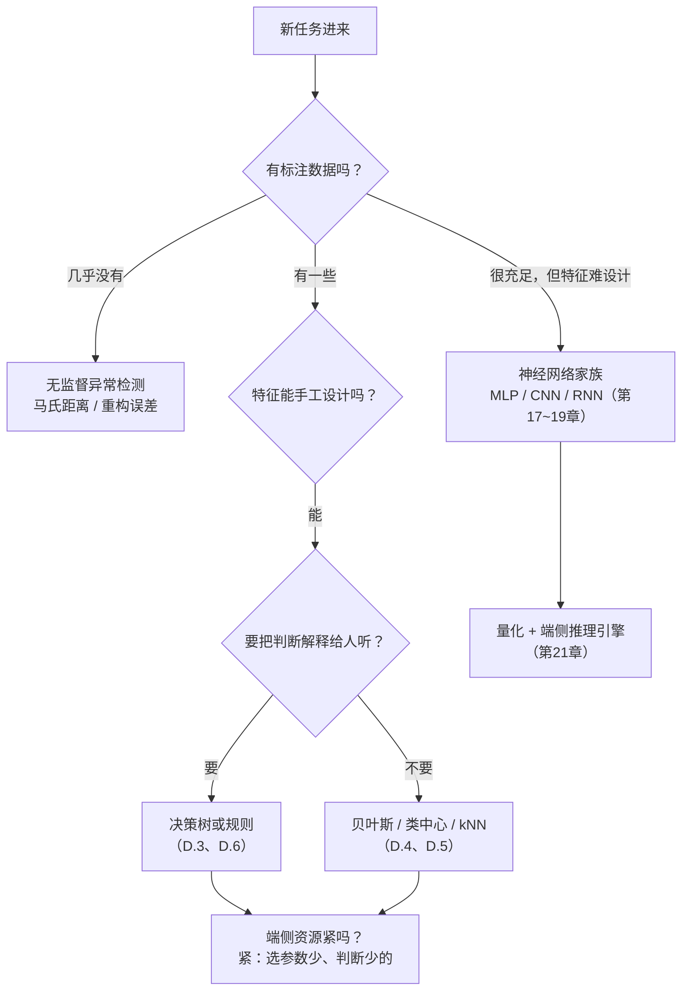

# 附录D 端侧算法图鉴：神经网络之外的选型指南

> 本附录学习目标：
> 1. 能说出端侧算法选型的五个维度：内存、算力、确定性、可解释性、重训成本
> 2. 能用同一份实验数据论证"特征工程决定上限，分类器只是收割"，并举出反例佐证
> 3. 能手写决策树（基尼系数 + 递归分裂）和朴素贝叶斯（高斯似然 + 对数得分）的最小实现
> 4. 能把训练好的决策树导出成 C 的 if-else，理解"模型即代码"与"模型即数据"两种部署形态
> 5. 能拿着选型流程图，为一个新任务说出候选算法和理由

## D.0 只有一把锤子的人

附录C 的结尾说过一句话：**让合适的工具干合适的活，是工程师的判断力。** 可如果认识的工具只有一把锤子，"判断"就无从谈起——看什么都像钉子。

这本书的主线是神经网络，它确实是端侧 AI 当今的主力。但走完附录C你应该隐约感到不安：为了一个三类分类，我们采了 360 条数据、训了 400 轮、背了一整套反向传播——而 C.3 那张特征表里，肉眼就能看出"陡峭度分误触和敲击、峰值分轻敲和重敲"。**既然如此，那些没有梯度、没有轮次、没有学习率的"老"算法，在这类任务上表现如何？**

本附录把附录C的敲击数据原封不动再考一遍：同一份 `tap_features.csv`、同样的划分纪律，请来决策树、朴素贝叶斯、kNN 等一群"神经网络之外"的选手同台。你会发现三个意外：**它们的分数几乎不分先后；它们的"体格"却差着两个数量级；真正拉开差距的不是分类器，而是特征。** 这三点，恰好是端侧算法选型的全部要义。

与附录C一样，所有代码只用 Python 标准库。先跑通附录C的块1、块2，让 `tap_events.csv` 和 `tap_features.csv` 与本章脚本在同一目录。

## D.1 准确率之外的五张考卷

在 PC 上做机器学习，榜单名次几乎是一切；在 MCU 上做，榜单只算入场券。一个算法要住进单片机，得先过五张考卷：

| 考卷 | 问的问题 | 端侧为什么在乎 |
|------|---------|----------------|
| **内存** | 模型多大？推理要多少 RAM？ | MCU 的 Flash/RAM 以 KB 计，一张权重表就可能爆预算 |
| **算力与延迟** | 一次推理几次乘加？ | 电池设备的主频和电量都吝啬，推理还常常发生在中断里 |
| **确定性** | 同样的输入必给同样的输出吗？训练有随机性吗？ | 安全相关的判断要可复现、可回归测试 |
| **可解释性** | 能向人说明"为什么判成这一类"吗？ | 医疗、工业、安全场景要审的是理由，不只是分数 |
| **重训成本** | 换了佩戴者、换了现场，更新模型多麻烦？ | 附录C 坑表说过"现场分布要持续收集"——收集完呢？ |

把这五张考卷摆在面前，你会发现一个此前被榜单遮住的事实：**神经网络只是"算法动物园"里的一位，它在这五张考卷上的成绩单有好有坏**——推理快（83 参数、72 次乘加），但训练要数据、要轮次、有随机性，模型本身读不懂。接下来的选手，各自在这五张考卷上有独门强项。

## D.2 同一场考试：附录C的数据再考一遍

先看总成绩单。实验协议与附录C完全一致：`tap_features.csv` 的 360 条数据，按类划分 70/15/15；**换 10 个随机种子做 10 次划分，每个算法都考 10 场，报平均分和波动**（只看一场，54 条测试集的 ±2% 是噪声，不是差距——第 3 章的统计纪律在这里同样作数）。神经网络与附录C同配置：`Network([6, 8, 3])`、均方误差、400 轮。考场代码收在 D.5 末尾的块3，负责表中手写规则、最近类中心、决策树、神经网络、kNN、朴素贝叶斯六行；逻辑回归、核方法、随机森林、模板匹配四行用完全相同的协议补测，思路见 D.5 的速览。

| 算法 | 十个划分的平均测试准确率 | 全部家当 | 一次推理的成本 |
|------|------------------------|---------|---------------|
| 手写规则（2 条阈值） | 97.4 ± 2.2% | 2 个数 | 2 次比较 |
| 最近类中心 | 98.0 ± 2.1% | 18 个数 | 18 次乘加 |
| 决策树（深度 4） | 98.5 ± 1.6% | 9 个节点 | 最多 4 次比较 |
| 逻辑回归（softmax） | 98.3 ± 1.9% | 21 个数 | 21 次乘加 |
| 神经网络（附录C） | 98.7 ± 1.9% | 83 个参数 | 72 次乘加 |
| RBF 核岭回归 | 98.7 ± 1.9% | 756 个系数 | 约 2,300 次乘加 |
| kNN（k=3） | 98.9 ± 1.5% | **1,512 个数（整个训练集）** | 1,512 次乘加＋排序 |
| 朴素贝叶斯 | 98.9 ± 1.5% | 36 个数 | 几十次乘除＋18 次对数 |
| 随机森林（15 棵小树） | 99.1 ± 1.2% | 约百个判断节点 | 约百次比较 |
| 模板匹配（原始波形） | **71.9 ± 4.3%** | 5,040 个数 | 5,040 次乘加 |

把这张表盯一分钟，三件事会自己浮出来：

**第一，凡是吃了那 6 个特征的学习型算法，全体挤在 98.0%~99.1%。** 波动 ±1.2~2.2 个点和差距同量级——在这份数据上，没有任何算法能"显著胜出"。这不是实验没做好，而是问题被特征解决后，**分类器的选择已经不重要了**。第 16 章说"数据决定上限"，这张表就是它的分类器版。

**第二，分水岭在特征，不在分类器。** 表末的模板匹配是唯一的反例：它不提特征、不训练，直接把 20 点原始波形与 252 条模板逐点比对（按最像的一条投票）。振铃频率 20~30 Hz、衰减快慢、起振早晚都是随机的，逐点比对对不上，只有 71.9%。**同样是"不学"，跳过特征工程的代价是 27 个点**——特征工程注入的先验，价值一目了然。

**第三，分数几乎并列，"家当"却差着数量级。** 同样 98% 上下，朴素贝叶斯只带 36 个数上岗，kNN 要背下整个训练集、每推一次算 1,512 次乘加。在 PC 上这叫实现细节，在 MCU 上这叫能不能立项。

一句诚实的注脚：手写规则的两个阈值来自附录C C.3 的特征表，而那张表本就是盯着这份数据总结的，所以它的 97.4% 偏乐观；真实世界的误触分布要脏得多。但"两条规则能到 97%"这个事实本身，已经足以让每个项目先问一句：**我真的需要训练吗？**

下面把考卷里最重要的两位"神经网络之外"的选手请到台前，亲手实现一遍——纯标准库，百行以内。

## D.3 决策树：让规则自己长出来

手写规则的问题不在写，而在**调**：0.2 这个阈值凭什么是 0.2？换成 0.19 会不会更好？要不要再补第三条？样本一多、特征一多，人脑就枚举不动了。决策树做的事只有一件：**把"挑阈值"变成可计算的搜索**。

衡量"一刀切得好不好"的尺子叫**基尼系数**：从这堆样本里闭眼抽两个，类别不同的概率。纯堆样本为 0（怎么抽都同类）；三类均匀掺杂时是 $1 - 3 \times (1/3)^2 = 2/3$。一刀切下去，两边各自的基尼系数按样本数加权，越小说明这一刀越"值"。

树的生长因此只有三行逻辑：**遍历每个特征的每个候选切点，挑让基尼下降最多的一刀；对切出的两堆各自递归；深到上限或纯度足够就立一块叶子。** 是不是眼熟？梯度下降也是"每步只做眼前最划算的一件事"——一个在参数空间下山，一个在规则空间找刀，都是贪心。

```python
# -*- coding: utf-8 -*-
"""附录D 块1：决策树——让规则从数据里自己长出来"""
import random

NAMES = ["峰值", "均值", "有效值", "陡峭度", "过半样本数", "z轴均值"]


def make_split(seed):
    """按类划分 70/15/15（与附录C块3同一套纪律），种子不同、划分不同"""
    rng = random.Random(seed)
    by_class = {0: [], 1: [], 2: []}
    for line in open("tap_features.csv", encoding="utf-8"):
        parts = line.strip().split(",")
        by_class[int(parts[0])].append([float(v) for v in parts[1:]])
    train, val, test = [], [], []
    for label, feats in by_class.items():
        rng.shuffle(feats)                      # 打乱后再切，保持每类比例
        n_train = int(len(feats) * 0.7)
        n_val = int(len(feats) * 0.15)
        train += [(f, label) for f in feats[:n_train]]
        val += [(f, label) for f in feats[n_train:n_train + n_val]]
        test += [(f, label) for f in feats[n_train + n_val:]]
    return train, val, test


def gini(labels):
    """基尼系数：从这堆样本里随机抽两个、类别不同的概率"""
    n = len(labels)
    counts = {}
    for y in labels:
        counts[y] = counts.get(y, 0) + 1
    return 1.0 - sum((c / n) ** 2 for c in counts.values())


def best_split(rows):
    """逐个特征、逐个切点试一遍，找基尼系数下降最多的一次分裂"""
    parent = gini([y for _, y in rows])
    best_gain, best = 0.0, None
    for j in range(len(rows[0][0])):                     # 每个特征
        values = sorted(set(x[j] for x, _ in rows))      # 该特征的所有取值
        for lo, hi in zip(values, values[1:]):           # 相邻取值的中点当切点
            thr = (lo + hi) / 2
            left = [y for x, y in rows if x[j] <= thr]
            right = [y for x, y in rows if x[j] > thr]
            gain = parent - (len(left) * gini(left)
                             + len(right) * gini(right)) / len(rows)
            if gain > best_gain:
                best_gain, best = gain, (j, thr)
    return best, best_gain


def build(rows, depth=0, max_depth=4):
    """递归生长：够纯了、深到上限、或无利可分，就立一块叶子"""
    labels = [y for _, y in rows]
    majority = max(set(labels), key=labels.count)
    if depth == max_depth or len(set(labels)) == 1:
        return ("叶子", majority)
    split, _ = best_split(rows)
    if split is None:
        return ("叶子", majority)
    j, thr = split
    left = [r for r in rows if r[0][j] <= thr]
    right = [r for r in rows if r[0][j] > thr]
    return (j, thr,
            build(left, depth + 1, max_depth),
            build(right, depth + 1, max_depth))


def tree_predict(node, x):
    while node[0] != "叶子":
        j, thr, left, right = node
        node = left if x[j] <= thr else right
    return node[1]


def show(node, indent=""):
    """把树打印成能读的规则（每行前缀就是走到这片叶子要满足的全部条件）"""
    if node[0] == "叶子":
        print(indent + "判为类别 " + str(node[1]))
        return
    j, thr, left, right = node
    print(indent + f"若 {NAMES[j]} ≤ {thr:.3f}：")
    show(left, indent + "  是，")
    show(right, indent + "  否，")


train, val, test = make_split(42)
print(f"划分：训练 {len(train)} / 验证 {len(val)} / 测试 {len(test)}")

tree = build(train)
show(tree)

correct = sum(1 for x, y in test if tree_predict(tree, x) == y)
print(f"\n决策树 测试集：{correct}/{len(test)} = {100 * correct / len(test):.1f}%")
```

**预期输出**：

```
划分：训练 252 / 验证 54 / 测试 54
若 陡峭度 ≤ 0.178：
  是，判为类别 0
  否，若 峰值 ≤ 0.631：
  否，  是，判为类别 1
  否，  否，若 有效值 ≤ 0.187：
  否，  否，  是，若 均值 ≤ 0.105：
  否，  否，  是，  是，判为类别 2
  否，  否，  是，  否，判为类别 1
  否，  否，  否，判为类别 2

决策树 测试集：54/54 = 100.0%
```

把树读出来，你会起一层鸡皮疙瘩：**头两刀就是附录C C.3 那张人肉特征表的自动化版本**——"陡峭度 ≤ 0.178 分误触"对上人写的"0.2 分误触"，"峰值 ≤ 0.631 分轻敲"对上人写的"0.6 分轻敲"。阈值不再是拍脑袋，而是从 252 条样本里搜出来的。但它没有停在两刀：后面三刀用有效值和均值去修轻敲与重敲的边界——那是肉眼没顾上的角落。人写的两条规则在十个划分上平均 97.4%，树 98.5%：**差距不大，但每 0.1% 都是机器从数据里多抠出来的，而人不需要再改一行代码。**

验证集在块 1 里没有出场——树没有"轮次"，自然没有早停。但它的**深度**就是第 14 章说的容量旋钮：深 1 层是"决策桩"，欠拟合；深 15 层能把训练集背到 100% 然后在测试集上现出原形。章末习题 1 请你亲手拧一拧。

对照五张考卷：树**推理极省**（每次判断就是一次比较）、**可解释性满分**（整棵树读得给你听）、**确定性满分**（同一数据长出同一棵树，没有随机初始化）——代价是它只会"横平竖直"地切：每刀都平行于某个特征轴，斜着的边界要用很多刀去逼近。

## D.4 朴素贝叶斯：一条概率的直路

第 3 章的贝叶斯公式说过：想知道"特征长这样、类别是 c 的概率"，等价于算"类别 c 的样本里、特征长这样的概率"再乘个先验。后一项叫**似然**。神经网络用 83 个参数绕了个大圈去逼近它，朴素贝叶斯直接一步写出来：

**假设每个特征在给定类别下各自独立、各自服从正态分布**（第 3 章的正态分布）。于是"类别 c 的似然"就是 6 个正态密度连乘，而每个正态只需两个数：均值 μ 和方差 σ²。训练全程就是**数数**：每类、每特征，算一遍均值和方差——3 类 × 6 特征 × 2 个数 = **36 个数，这就是模型的全部家当**。

预测时把 6 个密度连乘，哪个类乘积大判哪个。第 4 章的老朋友立刻登场：连乘 6 个小概率会下溢，全取对数，连乘变连加，比较结果一模一样。

```python
# ---- 块2：高斯朴素贝叶斯——36 个数的概率直路（接在块1的文件末尾）----
import math


def fit_gnb(rows):
    """训练 = 给每类、每特征记一个均值和一个方差"""
    buckets = {}
    for x, y in rows:
        buckets.setdefault(y, []).append(x)
    model = {}
    for y, xs in buckets.items():
        model[y] = []
        for j in range(len(xs[0])):
            col = [x[j] for x in xs]
            mu = sum(col) / len(col)
            var = sum((v - mu) ** 2 for v in col) / len(col)
            model[y].append((mu, max(var, 1e-9)))   # 方差贴地时防除零
    return model


def log_gaussian(x, mu, var):
    """对数高斯密度：正态分布见第3章，取对数防连乘下溢见第4章"""
    return -0.5 * math.log(2 * math.pi * var) - (x - mu) ** 2 / (2 * var)


def gnb_scores(model, x):
    return {y: sum(log_gaussian(v, mu, var) for (mu, var), v in zip(params, x))
            for y, params in model.items()}


def gnb_predict(model, x):
    scores = gnb_scores(model, x)
    return max(scores, key=scores.get)


gnb = fit_gnb(train)
correct = sum(1 for x, y in test if gnb_predict(gnb, x) == y)
print(f"\n朴素贝叶斯 测试集：{correct}/{len(test)} = {100 * correct / len(test):.1f}%")

x0, y0 = test[0]
print("一条测试样本的各类对数得分（越大越像）：")
for y, s in gnb_scores(gnb, x0).items():
    print(f"  类别 {y}: {s:8.1f}")
print(f"  → 判为 {gnb_predict(gnb, x0)}，真实 {y0}")
```

**预期输出**：

```
朴素贝叶斯 测试集：53/54 = 98.1%
一条测试样本的各类对数得分（越大越像）：
  类别 0:     11.7
  类别 1:    -82.5
  类别 2:   -161.0
  → 判为 0，真实 0
```

三件事值得停下来看：

1. **没有归一化。** 附录C把归一化当铁律，这里却直接喂原始特征——因为高斯自己带 σ²，特征尺度被方差吸收了。这不是贝叶斯"不守纪律"，而是它把第 13 章归一化要解决的问题在模型内部消化了。（kNN 和最近类中心就不行：它们靠算距离，大尺度特征会垄断距离，必须归一化。）
2. **得分差距悬殊**：11.7 对 -161.0。分类只需要"排序对"，不需要"概率准"——这解释了一个反直觉的现象：6 个特征里峰值和有效值明显相关，"独立"假设明明不成立，它在十个划分上照样平均 98.9%，与任何对手打平。
3. **重训成本几乎为零**：现场来了新数据，把均值方差重数一遍即可，没有学习率、没有轮次、没有随机性。对照五张考卷，它在确定性和重训成本上都是满分，内存 36 个数。

<details>
<summary>🐘 C 语言对照</summary>

*设备端若用贝叶斯，预测函数只需十几行——36 个统计量像附录C的权重文件一样随模型交付：*

```c
/* gnb_predict.c —— 与块2的 log_gaussian/gnb_predict 对应
   model：每类 6 对 (均值, 方差)，按类别 0/1/2 顺序排布 */
#include <math.h>

double log_gaussian(double x, double mu, double var) {
    return -0.5 * log(2.0 * 3.14159265 * var) - (x - mu) * (x - mu) / (2 * var);
}

int gnb_predict(const double model[3][6][2], const double x[6]) {
    double best_score = -1e300;
    int best = 0;
    for (int c = 0; c < 3; c++) {
        double s = 0;
        for (int j = 0; j < 6; j++)
            s += log_gaussian(x[j], model[c][j][0], model[c][j][1]);
        if (s > best_score) { best_score = s; best = c; }
    }
    return best;
}
```

</details>

## D.5 其余座位速览

考场里还有几位常客，一句话一个：

- **最近类中心**：每类算个平均点当"标准像"，谁离得近判谁。18 个数、18 次乘加，是最小的学习型分类器——它假设每类是一团"圆"的云；边界歪一点就吃亏。可信它当**第一个基线**：如果连它都有 95%，说明特征已经赢了，后面的复杂度要掂量着加。
- **kNN（k 近邻）**：干脆不训练，推理时翻整个"花名册"，看最近的 k 个邻居多数投谁。这次考了 98.9%，并列第一——但账单在第三列：**背下全部 252 条训练样本，每推一次算 1,512 次乘加再排个序**。数据集到 10 万条它就自行退出端侧舞台。适合它的位置是"数据少到背得动、边界又不规则"的过渡期。
- **逻辑回归与线性 SVM**：一个用交叉熵、一个用合页损失，训练的都是"6 个特征各配一个权重"的线性打分器，21 个数。第 6 章的神经元砍掉隐藏层就是它——**你的第一个神经网络，本来就是经典统计的老朋友**。核 SVM（本考场用 RBF 核岭回归代言）把特征非线性地映射到新空间再做线性分割，756 个系数换 98.7%：强，但家当随训练集一起长大。
- **随机森林**：把"训练数据的随机抽样"和"每个节点的随机特征抽样"叠起来，长 15 棵各带偏见的树，投票。99.1% 是本场最高——**用群体的互相纠偏换掉单棵树的偶然性**，这是第 14 章"多实验平均降低方差"思想的模型版。桌面端表格数据的王者（XGBoost、LightGBM 都是它的近亲），端侧也有 emlearn、m2cgen 这类工具把树群翻译成 C。
- **模板匹配与 DTW**：模板匹配的 71.9% 说明了"不提特征"的代价。它的进阶版 DTW（动态时间规整）允许时间轴伸缩后再比对，是早期手势识别的主力——但振铃频率变了这类"形状内部"的变化，伸缩时间轴也救不了。特征工程绕不过去。
- **无监督异常检测**：前面的算法都吃标签；若标签根本没有（故障种类无法穷举、新产品还没用户），可以只给"正常类"建模——算马氏距离（贝叶斯的近亲）或自编码器的重构误差，离群就报警。预测性维护的标配打法：**异常检测兜住"没见过的"，再上小分类器分"见过的"**。
- **顺带一段历史**：2010 年代的关键词唤醒是 HMM＋高斯混合的天下——概率链模型，思路与朴素贝叶斯同宗，只是把"特征独立"换成了"状态转移"。理解了 D.4，你就理解了它的一半。

最后把 D.2 那张成绩单的考场代码交出来。它把本章主角装进同一个循环，考场纪律只有三条：**所有算法共用同一种子的划分**（配对比较，公平）；**归一化统计量只从训练集算**（第 16 章的铁律，距离类方法和神经网络吃这套，树和贝叶斯不吃）；**神经网络每个划分换一次初始化**，和它的对手们一样经历完整的"重新来过"。笔记本上约两三分钟，大头是神经网络的那 400 轮。

```python
# ---- 块3：把六种算法放进同一个考场（接在块2的文件末尾）----
from mininn import Network


def rules_predict(f):
    """两条手写规则，阈值读自附录C C.3 的特征表"""
    peak, mean, rms, sharp, above, z_mean = f
    if sharp < 0.2:
        return 0                        # 起得缓 → 误触
    return 2 if peak > 0.6 else 1       # 峰值高 → 重敲


def fit_centers(rows):
    """最近类中心：每类的平均点就是'标准像'"""
    buckets = {}
    for x, y in rows:
        buckets.setdefault(y, []).append(x)
    return {y: [sum(col) / len(col) for col in zip(*xs)]
            for y, xs in buckets.items()}


def center_predict(centers, x):
    d2 = lambda c: sum((a - b) ** 2 for a, b in zip(c, x))
    return min(centers, key=lambda y: d2(centers[y]))


def knn_predict(rows, x, k=3):
    """kNN：不训练，考试时现场翻花名册，看 k 个最近邻居多数投谁"""
    dists = sorted((sum((a - b) ** 2 for a, b in zip(rx, x)), ry)
                   for rx, ry in rows)
    votes = [ry for _, ry in dists[:k]]
    return max(set(votes), key=votes.count)


N_SPLITS = 10
results = {}


def take_exam(name, predict_fn):
    correct = sum(1 for x, y in test if predict_fn(x) == y)
    results.setdefault(name, []).append(100 * correct / len(test))


for s in range(N_SPLITS):
    train, val, test = make_split(s)
    tree_s = build(train)                       # 树和贝叶斯直接吃原始特征
    gnb_s = fit_gnb(train)
    # 距离类方法要归一化，统计量只从训练集算（第16章的铁律）
    fmin = [min(x[j] for x, _ in train) for j in range(6)]
    fmax = [max(x[j] for x, _ in train) for j in range(6)]

    def norm(f):
        return [(v - lo) / (hi - lo) for v, lo, hi in zip(f, fmin, fmax)]

    train_n = [(norm(x), y) for x, y in train]
    centers = fit_centers(train_n)

    random.seed(1000 + s)                       # 每个划分换一次网络初始化
    net = Network([6, 8, 3])
    net.train([(x, [1.0 if k == y else 0.0 for k in range(3)])
               for x, y in train_n], epochs=400, lr=0.5, log_every=10 ** 9)

    def nn_predict(f):
        out = net.forward(norm(f))
        return out.index(max(out))

    take_exam("手写规则", rules_predict)
    take_exam("最近类中心", lambda f: center_predict(centers, norm(f)))
    take_exam("朴素贝叶斯", lambda f: gnb_predict(gnb_s, f))
    take_exam("决策树", lambda f: tree_predict(tree_s, f))
    take_exam("kNN(k=3)", lambda f: knn_predict(train_n, norm(f)))
    take_exam("神经网络", nn_predict)
    print(f"第 {s} 个划分考完")

print(f"\n{N_SPLITS} 个划分的平均测试准确率：")
for name, accs in sorted(results.items(), key=lambda kv: -sum(kv[1])):
    mean = sum(accs) / len(accs)
    std = (sum((a - mean) ** 2 for a in accs) / len(accs)) ** 0.5
    print(f"  {name}  {mean:.1f} ± {std:.1f}%")
```

**预期输出**：

```
第 0 个划分考完
第 1 个划分考完
第 2 个划分考完
第 3 个划分考完
第 4 个划分考完
第 5 个划分考完
第 6 个划分考完
第 7 个划分考完
第 8 个划分考完
第 9 个划分考完

10 个划分的平均测试准确率：
  朴素贝叶斯  98.9 ± 1.5%
  kNN(k=3)  98.9 ± 1.5%
  神经网络  98.7 ± 1.9%
  决策树  98.5 ± 1.6%
  最近类中心  98.0 ± 2.1%
  手写规则  97.4 ± 2.2%
```

块3 需要 `mininn.py`——和附录C一样，把第 17 章的 `Layer` 类和 `Network` 类存成这个文件即可。

## D.6 模型即代码：把树导出成 C

附录C的部署故事是"模型即数据"：权重写进 1.1 KB 的文本文件，C 程序做通用解释器逐层前向。决策树提供了另一种形态——**模型即代码**：树的结构本身就是 if-else，直接把它翻译成 C 源码，没有模型文件，没有解释器。

```python
# ---- 块4：把决策树导出成 C——模型即代码（接在同一文件末尾）----
def emit_c(node, lines, indent="    "):
    if node[0] == "叶子":
        lines.append(indent + f"return {node[1]};")
        return
    j, thr, left, right = node
    lines.append(indent + f"if (feat[{j}] <= {thr:.4f}) {{")
    emit_c(left, lines, indent + "    ")
    lines.append(indent + "} else {")
    emit_c(right, lines, indent + "    ")
    lines.append(indent + "}")


def count_nodes(node):
    if node[0] == "叶子":
        return 1
    return 1 + count_nodes(node[2]) + count_nodes(node[3])


print(f"/* 自动生成，勿手改：{count_nodes(tree)} 个节点 */")
print("int tap_classify(const double feat[6]) {")
lines = []
emit_c(tree, lines)
print("\n".join(lines))
print("}")
```

**预期输出**（对照 NAMES：`feat[0]`=峰值、`feat[1]`=均值、`feat[2]`=有效值、`feat[3]`=陡峭度）：

```c
/* 自动生成，勿手改：9 个节点 */
int tap_classify(const double feat[6]) {
    if (feat[3] <= 0.1784) {
        return 0;
    } else {
        if (feat[0] <= 0.6308) {
            return 1;
        } else {
            if (feat[2] <= 0.1868) {
                if (feat[1] <= 0.1053) {
                    return 2;
                } else {
                    return 1;
                }
            } else {
                return 2;
            }
        }
    }
}
```

在附录C C.3 的 `extract()` 后面接上这个函数，设备端的分类器就齐了：**最多 4 次浮点比较，零字节的权重存储，延迟天然确定**，甚至能整段贴进代码评审让同事人肉验证。两种部署形态各有一片天地：

- **模型即代码**（树、规则、贝叶斯也能退化成查表）：零解析成本、可版本管理、可静态分析——固件的一部分，更新模型=发固件
- **模型即数据**（神经网络、森林）：换模型不动固件，OTA 一份权重文件就能升级——附录C的 `tap_model.txt` 走的就是这条路，也是 TFLite Micro 等端侧推理引擎的形态

顺带一提，这段 C 里没有任何训练的痕迹——**训练永远在电脑上，推理才在设备上**，附录C立下的分工在每一种算法身上都成立。

## D.7 给新任务选座：一张流程图、一张场景表

把本附录的判断浓缩成一张图。三个问题走到底，候选名单就出来了：



再摆几个真实场景对号入座：

| 场景 | 端上输入 | 常见选择 | 一句话理由 |
|------|---------|---------|-----------|
| 敲击 / 手势识别（本附录） | IMU 6 特征 | 规则 → 树 → 贝叶斯 → MLP | 特征好手工设计，从最便宜的起步 |
| 关键词唤醒 | 音频频谱图 | 小型 CNN | 时频结构难手写，让卷积自己学（第18章） |
| 心律失常筛查 | ECG 形态特征（RR 间期等） | 树 / SVM / MLP | 生理学把特征给了你，医疗还非要可解释 |
| 电机 / 轴承预测性维护 | 振动频域特征 | 森林 / MLP ＋ 异常检测 | 已知故障靠分类，未知故障靠离群兜底 |
| 人体存在感应 | PIR / 毫米波能量统计 | 规则 ＋ 小型 MLP | 分布简单，规则打底就够 |
| 姿态解算 | IMU 原始数据流 | 卡尔曼滤波 | 物理模型明确，根本不是学习问题 |
| 人形 / 人脸检测 | 图像 | 量化 CNN ＋ 迁移学习 | 特征无法手工设计，数据可以海量（第21章） |

注意最后一行与第一行的分野：**同是"识别"，分野在特征能否手工设计**——这正是 D.2 第二条结论的工程版。

## D.8 什么时候还是该请神经网络

看完这张成绩单，容易从一个极端摆到另一个极端："那还要神经网络干什么？"四钟情况，它仍是首选：

1. **特征设计不出来。** 图像里的"猫耳"、语音里的音素边界、原始振动里的早期磨损征兆——人类描述不出，就没法提特征。让网络从原始数据端到端地学（第 18 章），代价是数据，收益是没有人能想到的特征。
2. **输入是序列，且依赖历史。** 按键序列、语音帧与帧之间的连贯性——RNN/ LSTM 的主场（第 19 章）。
3. **数据真的多。** D.2 里学习型方法全体并列的前提是特征已经把问题削平。我们做过另一组实验：把训练条数从每类 5 条加到 120 条——**提了特征的方法在每类 10 条附近就饱和到 98% 上下**；不提特征的打法（端到端 CNN）要几万条才起步。"神经网络吃数据"是真的，但吃数据的是"端到端"，不是"神经网络"本身。
4. **要用迁移学习抄近道。** 预训练模型把通用特征免费送你（第 21 章），几十张图就能微调出像样的分类器——这份红利目前只有神经网络家族在发。

端侧的实操路径往往是**混编**：阈值触发 + 树/贝叶斯初筛 + 小神经网络精判——附录C C.6 的"阈值截窗 → 网络推理"其实就是雏形。让每一层硬件只跑配得上它的算法，才是"端侧 AI"三个字的完整含义。

## 常见误区

**误区：榜单第一就是最好的选择。**
真相：本场 kNN 并列第一，但要背 1,512 个数、每次推理 1,512 次乘加；朴素贝叶斯 36 个数拿下同样的分数。十个划分的 ±1.5% 波动里，排名本身就在抖动（第 3 章：别让一次实验替你下结论）。选型是多目标问题——内存、算力、确定性、可解释性、重训成本，准确率只是入场券。

**误区："朴素"贝叶斯的独立假设明明不成立（峰值和有效值显然相关），所以不能用。**
真相：分类只需要各类得分的**排序**正确，不需要得分本身准。相关性让概率估值失真，但只要失真不翻转排序，判类就安然无恙——本考场 98.9% 的成绩就是证据。假设不完美但便宜、且结论可用，就用。

**误区：决策树不需要归一化，所以也不需要数据纪律。**
真相：树的切点在单一特征上滑动，单调变换不动它——免归一化是真的。但数据泄漏、脏标签、划分纪律一样都少不了：树会把泄漏进来的信息长得理直气壮，深了还会把噪声背进叶子（第 14 章）。**免的是工序，不免的是纪律。**

**误区：新项目上来就上深度学习，效果不行再说。**
真相：本附录的考场给出了相反的路线——规则 → 类中心/贝叶斯/树 → 神经网络，每一级的复杂度都要用数据、算力和可解释性付账，**升级的理由只能是"上一级撞了天花板"**，而不是"下一级听起来更时髦"。手写规则 97.4% 的任务上训 400 轮网络，赢来的那 1.5% 未必付得起排查黑盒的成本。

## 章末习题

1. 把块 1 的 `max_depth` 依次改成 1、2、8、15，记录测试准确率和节点数。深度 1 的"决策桩"相当于什么？深度 15 的成绩用第 14 章的哪对概念解释？
2. 把块 2 的 `log_gaussian` 换成直接连乘密度（去掉对数），观察输出发生了什么变化。提示：算算 6 个 0.001 相乘是多少。
3. 把 kNN 的 k 从 1 逐步调到 25，测试准确率怎么走？k 变大时它丢掉了什么？k 很大时它和"最近类中心"还剩什么区别？（提示：k 是 kNN 的容量旋钮，第 14 章的哪对概念在它身上重演？）
4. 附录C习题 5 说过"轻敲/重敲可合并成二分类"。在这份特征上重跑考场：合并后哪几个算法涨幅最大？误触识别率（第一指标）呢？
5. （思考题）你的产品要监测轴承异响：故障样本稀少，且故障种类无法穷举。监督分类还合适吗？设计一个"无监督异常检测打底 + 少量监督分类精判"的两级方案，并指出两级各该部署在端侧的哪一环。

## 小结

- 端侧算法选型是五张考卷的折中：**内存、算力与延迟、确定性、可解释性、重训成本**——准确率只是入场券
- 附录C的敲击数据再考一遍：凡吃特征的学习型算法全体挤在 98%~99%，差距与波动同量级；**不提特征的模板匹配只有 71.9%**——分水岭在特征，不在分类器
- 决策树把"人肉调阈值"变成可计算的搜索，基尼系数当尺子、贪心生长；长出来的头两刀与 C.3 的人肉特征表几乎重合，且整棵树可读、可评审、可编译成 C
- 朴素贝叶斯用 36 个数走通贝叶斯公式：训练=数均值方差，预测=对数得分取最大；独立假设不成立照样能打，因为分类只要排序对
- **模型即代码**（树编译成 if-else，零权重存储）与**模型即数据**（附录C的权重文件＋解释器）是端侧部署的两种形态；升级算法的正确理由是上一级撞了天花板，而不是新名字更时髦

到这里，工具箱才算真正开箱：神经网络是你的主力锤子，但箱子里的扳手、螺丝刀各有各的活。下一次传感器中断进来的时候，你知道该先问"特征能手工设计吗"，而不是先问"网络几层"。
