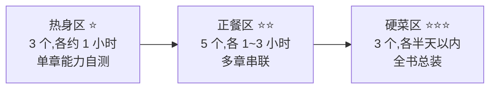

# 附录E 练兵场:11 个自选项目

> 本附录学习目标:
> 1. 能不看正文提示,独立走完"拿数据 → 提特征 → 训练 → 验收"的完整流程
> 2. 能用验收清单给自己打分,并说清每个验收数字背后是哪一章的原理
> 3. 能在文本、图像、声音、表格、推荐、时序与强化学习中,按自己的兴趣选做项目
> 4. 能在卡住时定位问题的类别:数学没懂、代码没对,还是数据没看

## E.0 使用指南

正文里,每一步都有人手把手;这个附录没有。这里是**练兵场**:11 个真实的小项目,每个都像附录 C 那样走完整流程,但路要你自己走。

先说清楚三件事:

1. **任选,不必全做。** 11 个项目分成三档难度,按兴趣和精力挑。想验证基本功,做热身;想证明真的学会了,做正餐;想挑战自己,上硬菜。
2. **验收数字是裁判。** 每个项目都给出写死的验收标准(误差小于多少、正确率高于多少、该看见什么现象)。做没做对,程序会告诉你,不需要老师。
3. **没有参考实现。** 附录给足提示和检查断言,但不给答案——答案抄来了,验证就失效了。卡住时回到对应章节,那里有你需要的全部数学。



### 通关路线

| 称号 | 达成条件 |
|------|----------|
| **出师** | 任意 1 个热身 + 任意 1 个正餐 |
| **毕业** | 出师 + 任意 1 个硬菜 |
| **结业证书** | 11 个全部达标(文末有打分卡) |

### 项目总览

| 编号 | 项目 | 模态 | 考什么 | 难度 | 耗时 |
|------|------|------|--------|------|------|
| W1 | 注意力实验室 | 注意力 | 第 20 章 | ⭐ | 0.5~1 小时 |
| W2 | 手写卷积图像滤镜 | 图像 | 第 18 章 | ⭐ | 1 小时 |
| W3 | 马尔可夫链名字生成器 | 文本·生成 | 第 3 章 | ⭐ | 1 小时 |
| M1 | 中文评论情感分类器 | 文本 | 第 6~9、16 章 | ⭐⭐ | 1~2 小时 |
| M2 | 鼾声识别 | 声音 | 第 16~18 章、附录 C | ⭐⭐ | 2~3 小时 |
| M3 | 鸢尾花毕业考 | 表格 | 第 14~17 章总装 | ⭐⭐ | 1.5~2 小时 |
| M4 | 电影推荐:矩阵分解 | 推荐 | 第 2、5、10 章 | ⭐⭐ | 2 小时 |
| M5 | 梯度检查器 | 工具 | 第 5、10 章 | ⭐⭐ | 1~1.5 小时 |
| H1 | 手写数字识别 MNIST | 图像 | 第 14~18 章、附录 C | ⭐⭐⭐ | 2~3 小时 |
| H2 | 迷你 RNN 序列预测 | 时序 | 第 10、19 章 | ⭐⭐⭐ | 半天以内 |
| H3 | 网格世界寻宝:Q 学习 | 强化学习 | 第 3 章 + 向外一步 | ⭐⭐⭐ | 2~4 小时 |

环境要求与全书一致:**Python 3 标准库**,一个文本编辑器。只有 H1 需要一个随书附带的数据文件(`data/mnist_mini.gz`,约 0.4 MB),其余项目的数据要么内置在本附录里,要么用代码生成。

---

## E.1 热身区

热身项目的共同点:不训练、不调参,纯靠"把正文的一个计算写成程序"。别小看它们——正文看懂和亲手写对之间,隔着一整条鸿沟。

### W1 注意力实验室

> **考什么**:第 20 章的缩放点积注意力 | **前置**:第 4 章 softmax | **建议代码量**:30~40 行

**真实用途**:注意力是 Transformer 的心脏。在大模型时代读懂它,从这个 30 行的小函数开始。

**任务**:写一个 `attention(q, keys, values)` 函数,完成"打分 → softmax 归一 → 加权求和"三步,然后用两组已知答案对账。

**关卡**:

1. **对账一(正文例)**:用正文第 20 章手算过的例子——`q1 = [1, 0]`,`k1 = [1, 0]`,`v1 = [1, 1]`,`k2 = [0, 1]`,`v2 = [2, 0]`。你的函数必须输出权重 `[0.731, 0.269]`、新表示 `[1.269, 0.731]`,与正文逐位一致。
2. **对账二(习题例)**:换用章末习题 2 的 Query:`q = [0, 1]`,其余不变。预期输出:权重 `[0.269, 0.731]`,输出 `[1.731, 0.269]`——答案就在附录 A,自己翻对账。
3. **温度旋钮**:给 softmax 加一个温度系数,权重变成 `softmax(s / τ)`。固定上面那组打分 `[0, 1]`,打印 τ = 0.5、1、2 三档的权重表。预期:τ 越小,注意力越"专注"(权重越接近 `[0.119, 0.881]`);τ 越大越"涣散"(τ = 2 时约 `[0.378, 0.622]`)。
4. **四词句子**:自造 4 个 token(比如"小猫 追 毛线 球",每个词随手给一个 2 维向量),打印 4×4 注意力权重矩阵。每一行加起来必须是 1。

**✅ 验收清单**:

- [ ] 两组对账全部逐位一致(保留 3 位小数)
- [ ] 温度表:τ = 0.5 时最大权重 ≥ 0.88,τ = 2 时最大权重 ≤ 0.63
- [ ] 4×4 矩阵每行和为 1(误差 < 1e-9)
- [ ] 能口头回答:为什么第 3 步里 τ 变小会让 softmax "变专一"?(提示:回看第 13 章饱和)

**常见翻车点**:忘了 softmax 要对"一组"打分整体归一,而不是每个打分单独过 sigmoid;加权求和时把 Value 忘了,只输出了权重。

**加餐挑战**:实现**因果掩码**——让每个词只能看它自己和左边的词(把右边位置的打分换成负无穷再 softmax)。这是 GPT 类模型的看家本领:打印掩码后的 4×4 矩阵,右上三角应该全是 0。

### W2 手写卷积图像滤镜

> **考什么**:第 18 章的卷积与局部感受野 | **前置**:无 | **建议代码量**:60~80 行

**真实用途**:你手机里每张照片的锐化、模糊、边缘增强,底层都是这几行代码。

**任务**:手写二维卷积 `conv2d(image, kernel)`,对一张 64×64 的测试图套三种 3×3 卷积核,肉眼验收三种效果。

图片用 **PGM 格式**(可移植灰度图):纯文本,标准库直接读写,长这样:

```
P2
64 64
255
0 0 0 0 …(共 64×64 个 0~255 的灰度值,每行 8 个换一行)
```

测试图不用下载,用代码画:黑底,中间画一个白色实心圆和一个白色实心矩形(判断"像素到圆心的距离"和"像素是否落在矩形内"即可,下面给你):

```python
# 测试图生成:黑底 + 白圆 + 白矩形 → test.pgm
W = H = 64
px = [0] * (W * H)
for y in range(H):
    for x in range(W):
        if (x - 20) ** 2 + (y - 32) ** 2 <= 12 ** 2:   # 圆:圆心 (20,32) 半径 12
            px[y * W + x] = 255
        if 40 <= x < 58 and 20 <= y < 44:               # 矩形
            px[y * W + x] = 255
with open("test.pgm", "w") as f:
    f.write("P2\n%d %d\n255\n" % (W, H))
    for y in range(H):
        f.write(" ".join(str(v) for v in px[y * W:(y + 1) * W]) + "\n")
```

**关卡**:

1. **读写关卡**:运行上面代码生成 `test.pgm`;再写一个读取函数把它读回 `px` 列表,断言读回的列表和写出的完全一致。
2. **卷积关卡**:实现 `conv2d(image, kernel)`,带 zero padding(输出尺寸与输入相同)。提示:输出像素 $(x, y)$ = 卷积核与以 $(x, y)$ 为中心的 3×3 邻域对应相乘再求和。
3. **三种滤镜**,卷积核自己写(第 18 章都见过它们的样子):
   - 均值模糊(9 个格子全是 1/9)
   - 锐化(中心 5,上下左右 −1)
   - 边缘检测(中心 −4,上下左右 1)
4. **肉眼验收**:把三种输出各打印成 ASCII 热力图(比如按灰度映射到 `" .:*#"` 五个字符),或者写回 PGM 用看图软件打开。

**✅ 验收清单**:

- [ ] 模糊后圆的边缘发虚(边界行出现中间灰度)
- [ ] 锐化后圆的边缘更亮(边界像素值明显高于内部)
- [ ] 边缘检测输出:图形内部和背景都接近 0,只在轮廓处发亮——**圆的边界出现一个亮环**
- [ ] 能口头回答:边缘核为什么长那个样子?(提示:图形内部像素的邻域一片黑或一片白,加起来为什么恰好是 0)

**常见翻车点**:忘加 padding,图越卷越小;忘了卷积核要"翻转 180° 再滑动"(对称核看不出来,但它是定义的一部分);输出值超出 0~255 忘了截断,负值打印出来一片乱码。

**加餐挑战**:把边缘核旋转 180° 再卷一次,验证结果不变(对称核);再自己造一个不对称的核感受区别;最后把手机里一张照片转成 PGM(网上有在线转换器)做滤镜。

### W3 马尔可夫链名字生成器

> **考什么**:第 3 章的条件概率与期望;为第 19/20 章的序列模型埋伏笔 | **前置**:无 | **建议代码量**:50~70 行

**真实用途**:手机输入法的联想词、输入时的"下一个词"预测,最朴素的形态就是马尔可夫链。它是**没有神经网络的语言模型**——做完这个项目,你会亲眼看清它的本事和它的天花板,然后明白第 19 章为什么要发明 RNN。

**数据从哪来**:157 个《三国演义》人名,直接内置:

```python
NAMES = """刘备 关羽 张飞 诸葛亮 诸葛瑾 诸葛瞻 司马懿 司马师 司马昭 司马徽
曹操 曹丕 曹植 曹仁 曹洪 曹真 曹休 曹爽 夏侯惇 夏侯渊 夏侯霸 夏侯玄 孙权 孙策 孙坚 孙尚香
周瑜 鲁肃 吕蒙 陆逊 陆抗 黄盖 程普 韩当 太史慈 甘宁 周泰 凌统 徐盛 丁奉 朱治 朱然 朱桓 全琮
赵云 马超 黄忠 魏延 姜维 庞统 法正 马岱 王平 关兴 张苞 廖化 周仓 张嶷 马忠 霍峻 罗宪 宗预
刘表 刘璋 马腾 韩遂 张鲁 董卓 吕布 貂蝉 袁绍 袁术 公孙瓒 陶谦 华雄 颜良 文丑 高顺 高览
张辽 徐晃 张郃 于禁 乐进 李典 典韦 许褚 庞德 郭淮 王双 郝昭 文鸯 毛玠 刘晔 蒋济
郭嘉 荀彧 荀攸 程昱 贾诩 满宠 陈宫 沮授 田丰 许攸 陈登 糜竺 审配 陈琳 辛毗 杨修 蒋干
孙乾 简雍 华佗 左慈 孟获 祝融 大乔 小乔 甄宓 蔡琰 庞德 曹节 董承 杨彪 孔融 祢衡
张昭 顾雍 虞翻 薛综 周鲂 步骘 吕范 董袭 陈武 潘璋 宋谦 张温 骆统 是仪 吾粲
王朗 华歆 钟繇 陈群 王肃 傅嘏 邓艾 钟会 王濬 羊祜 杜预 孙峻 孙綝 滕胤""".split()
```

**任务**:学一个"下一个字"模型,生成像三国人物的新名字;再用数字回答一个问题——**上下文看两个字,是不是一定比看一个字好?**

**约定**:每个名字前后加特殊符号——开头补 `^`,结尾补 `$`,比如"赵云"变成 `^赵云$`。"下一个字"问题就变成:给定前面的上下文,预测下一个字符(包括结尾符 `$`)。

**关卡**:

1. **数出概率**:把每个名字加上 `^`、`$`,扫描统计一张计数表——每个字后面跟着什么字、跟了几次(字 → {下一字: 次数}),以及 `^` 开头的首字分布。这就是第 3 章的条件概率 $P(\text{下一字} \mid \text{当前字})$ 的频数版。
2. **平滑**:直接用频率会出事——没见过的组合概率为 0,$\log 0$ 直接爆炸。给每个计数加一个小的 $\alpha$(比如 0.1),分母加上 $\alpha \times$ 字表大小(这就是 Laplace 平滑)。**这一步不能跳,后面所有数字都依赖它。**
3. **一阶生成**:从 `^` 出发,按当前字的分布**随机采样**下一个字,采到 `$` 停;名字超过 4 个字也停,不足 2 个字的作废重采。生成 10 个,至少 6 个不在原名单里,而且"看着像三国人物"。
4. **二阶升级**:上下文改成前两个字,重做统计、平滑、生成。直观上它"记得更多",生成的名字应该更连贯——真的吗?
5. **用数字裁决**:把 157 个名字分成训练集(前 145 个)和留出集(最后 12 个),分别用一阶、二阶模型算**平均负对数似然** $-\frac{1}{N}\sum \log P(\text{每个字})$——这个数越小,模型觉得这批名字越"顺口"。我们跑出来的表:

   | 平均负对数似然(越小越好) | 一阶 | 二阶 |
   |------|------|------|
   | 训练集 | 3.388 | 3.419 |
   | 留出集 | 5.213 | 5.407 |

   **二阶不但没占便宜,留出集上反而更差。** 你的数字不会和这张表完全一致(除非用同一套平滑和划分),但结论方向应该一致。
6. **抓"背课文"现行**:让两个模型各生成 300 个名字,统计与原名单完全重合的比例。我们的结果:一阶 79.7%,二阶 84.7%——二阶"背课文"背得更凶。

**✅ 验收清单**:

- [ ] 能生成 10 个名字,≥ 6 个不在原名单且读起来像三国人名
- [ ] NLL 表复现:训练集上二阶没有优势,留出集上二阶更差(方向一致即可)
- [ ] 重合率统计完成:二阶 ≥ 一阶
- [ ] 能用自己的话解释:为什么"看更多上下文"反而可能更差?(提示:两个字组成的上下文有几百种组合,每种只出现过一两次——参数多了,数据没跟上。这个现象第 14 章有个正式名字)

**常见翻车点**:概率忘了归一化,采样越采越偏;没做平滑,$\log 0$ 崩掉;忘了 `$` 也是个"字",生成的名字永远不停;统计表用了全量名单,留出集被污染。

**加餐挑战**:换语料再玩一次(你的歌单、唐诗三百首、菜单名);实现**回退(backoff)**——二阶上下文没见过时退回一阶,看 NLL 能不能真正反超;等你做完第 19 章,回来回答:RNN 比这条马尔可夫链强在哪?

## E.2 正餐区

正餐项目要串联多个章节:数据不会自己变成特征,特征不会自己变成模型。做之前建议把附录 C 再翻一遍——它是唯一一个"有人带"的全流程项目,这里的五个都要靠你自己带自己。

### M1 中文评论情感分类器

> **考什么**:第 6~9 章的完整训练回路、第 10 章的梯度推导、第 16 章的特征工程 | **前置**:无(第 17 章的库本项目不用) | **建议代码量**:80~120 行 | **建议耗时**:1~2 小时

**真实用途**:电商平台每天产生的评论里藏着商家的命脉,"好评率"就是最原始的情感分析。这是 NLP 里最常见的入门任务,也是"从原始文本到可训练特征"全流程的最佳练习场。

**数据从哪来**:135 条真实风格的中文电商评论直接内置在下面——**113 条训练集 + 22 条测试集,划分是固定的,顺序不要动**(真实数据集也是这样,测试集只属于测试)。另外还有 10 条"噩梦测试集",专门收拾词袋模型。

```python
# 每行格式:"标签,评语"。标签与评语之间是半角逗号,
# 评语内部的逗号是全角逗号,所以用 split(",", 1) 切分。
# ===== 训练集(113 条,顺序勿动)=====
TRAIN = """
1,物流全程可查,心里踏实
0,没有锅气,像隔夜回热
1,笔顺滑不断墨,写字很舒服
1,包装严实,汤一点都没洒
0,说明书语焉不详,装了两小时
0,四个人没吃饱,人均死贵
0,包装也不好,箱子压瘪了
0,客服答应退款,却拖着不办,失望
1,手机反应很快,用着不卡顿
0,亏是老字号,完全在砸招牌
1,送餐速度超快,半小时就到了
1,摆盘精致,宴客特别有面子
1,二次回购了,品质稳定,好评
1,充电线做工扎实,接口严丝合缝
0,服务员态度不好,上菜还慢
1,鞋子轻便透气,跑步很舒服
0,餐具有股塑料味,不敢用
1,服务从没让人失望过
0,保温效果差,两小时就凉透
0,小笼包皮厚馅少,没有汤汁
0,价格贵了,分量还缩水
0,键盘手感发绵,回弹无力
1,不难吃,分量也足
1,书印刷清晰,纸质也很好
1,售后很负责,坏了直接给换新
0,桌子油腻,椅子还粘手
0,电池虚标,掉电太快
0,优惠规则绕来绕去,结算才发觉
0,体验不好,不会再来了
0,味道又咸又腻,太难吃了
0,鲜花不新鲜,蔫了一半
1,鱼很新鲜,一点腥味都没有
1,客服态度特别好,问题秒解决
0,面条坨成一团,难吃得咽不下
1,锅气十足,和堂食一个味
1,下单到收货只用了一天,物流给力
1,服务员微笑服务,上菜也快
1,面包松软拉丝,奶香十足
1,鲜花新鲜,花期比预期长
0,物流慢得离谱,五天才到,差评
0,味道也不好,分量还少
0,充电线一周就坏,差评
0,售后推三阻四,电话都不回
1,包装很好,没有一点破损
1,换货只用了两天,好评
1,门店是远了点,但味道没得说
0,包装太随意,汤洒了一半
0,冷链形同虚设,到手都变味
0,甜得发齁,难吃,一口都咽不下
0,米饭夹生,菜是凉的
1,灯串很漂亮,家人都很满意
0,膜上全是气泡,白花了钱
1,保冷十二小时,夏天神器
1,保护壳质量好,跌落后屏幕没事
0,看着量大,一捞全是配菜
1,结构简单,装起来不费劲
0,上月还好,这次明显偷工减料
1,耳机音质通透,降噪明显
1,甜品不齁甜,甜度刚刚好
0,快递在网点压了三天不动
1,教程很详细,照着做很快就学会
1,手机续航比想象中强,充电也快
1,用券以后更便宜了,性价比高
1,快递小哥打电话确认,很贴心
1,茶叶很香,耐泡,还有回甘
0,面膜精华很少,敷完皮肤痒
0,用三天就变慢,还老卡死
0,物流太慢了,三天都不动一下
0,教程缺页漏步,装到一半卡住
0,酱包漏了一袋,全脏了
0,老板态度恶劣,差评
1,面料很舒服,尺码也合适,很满意
1,面条筋道,汤头浓郁,好吃
0,箱子一装重就裂,还刺鼻
0,底料一股味精味,齁咸
0,菜是凉的,环境倒还行
0,实物小一号,根本装不上
1,性价比很高,比店里便宜多了
1,味道正宗,和小时候吃的一样好吃
1,团购价太划算,四个人吃到撑
1,售后回访细致,建议真被采纳
1,键盘敲着舒服,打字也很快
0,台灯质量差,还一闪一闪
0,退货半个月,运费还让我垫
0,客服踢皮球,问题拖一周,差评
1,尺寸和描述一致,严丝合缝
1,味道很正,分量足,下次还点
0,上菜顺序混乱,凉菜最后来
1,客服半夜还在岗,秒回消息
1,现做现卖,热乎着送到,好评
0,半箱磕碰果,坏了一多半
1,台灯亮度可调,看着舒服
0,鞋子磨脚后跟,走一天起泡
0,客服已读不回,投诉也没用
1,送达时还是冰的,冷链给力
1,环境干净整洁,看着就放心
1,火锅底料麻辣鲜香,越煮越香
0,全家吃了一次,没人愿意再点
0,送到时冰都化了,盒子压扁
1,米饭软硬适中,菜也特别下饭
1,咖啡豆香气足,现磨的口感
1,料很足,味道好吃,两个人正好
0,笔芯断墨,写两笔就断
0,料少得可怜,全是汤水
0,忘带餐具,打电话也没人接
1,面膜精华多,敷完水润
1,果子个个饱满,一个坏果都没有
0,偷偷涨价,死贵,差评
1,配料表干净,没有乱七八糟的添加
0,并不新鲜,吃着像剩菜
0,面包干硬掉渣,难吃
0,茶叶碎渣多,一泡就没味
0,衣服颜色和图片差很多,很失望
"""
# ===== 测试集(22 条,训完只碰一次)=====
TEST = """
0,降噪是摆设,地铁里全是噪音
1,骑手冒着大雨送来,太感动了
0,投诉三次,再没回访过
1,款式除了少点,别的都很好
0,送了一个小时,面都坨了
1,骑手提前送达,还帮我带上楼
1,儿童餐具没异味,材质放心
1,店家附了手写卡片,好暖心
1,老板人实在,还送小菜,好评
0,是速溶兑的,还卖现磨价
0,等了四十分钟,催三次才上菜
0,配料表一长串看不懂的添加
1,酱料包给得足,味道有层次
1,水饺煮不破,馅大,特别好吃
0,灯串接一半不亮,还乱闪
0,书页装订歪斜,还有错印
0,味道一般,不值这个价
1,收纳箱结实,装满书也没问题
0,水饺一煮就破,馅都散了
0,鱼不新鲜,难吃,直接扔了
1,一家人都说好,推荐给了同事
1,小笼包皮薄汁多,特别好吃
"""
# ===== 噩梦测试集(10 条,全是否定/转折,永远不进训练)=====
NIGHT = [
    (0, "不好吃,再也不来了"),
    (1, "分量足,味道也不难吃"),
    (0, "包装很好,可惜全洒了"),
    (1, "上菜是慢了点,但味道没得说"),
    (0, "朋友都说好吃,我觉得一般"),
    (1, "服务从没让我失望过"),
    (0, "店面很干净,可惜菜是凉的"),
    (1, "除了包装朴素,别的都很好"),
    (0, "说不上难吃,但也仅此而已"),
    (1, "第一次吃到这么正宗的,以前都白吃了"),
]

def parse(block):
    rows = []
    for line in block.strip().split("\n"):
        lab, s = line.split(",", 1)      # 只切第一个半角逗号
        rows.append((int(lab), s))
    return rows
```

**任务**:训练一个**单神经元情感分类器**(就是第 6 章的那个神经元),输入一条评论,输出它是好评(1)还是差评(0)。**本项目不使用第 17 章的库**——训练循环要你自己写,第 8~10 章的推导这里全部要用。

**关卡**:

1. **建词表**:统计训练集里出现过的**每一个字**,这就是最朴素的特征——"字是否出现、出现几次"。然后做一步第 16 章会大力赞许的清洗:**剪掉出现次数不足 3 次的稀僻字**。我们剪完训练集词表只剩 139 维,而如果一个字都舍不得剪,模型会把每句话独有的字当成救命稻草,死记硬背——后面关卡会让你亲眼看到后果。
2. **造特征**:每条评论变成一个 139 维向量:第 $i$ 维 = 第 $i$ 个字在这条评论里出现的次数。写完先做一个**最小对实验**:把"这家店好吃"和"这家店不好吃"都变成向量,算它们的余弦相似度(第 2 章的点积除以两个模长)。我们算出来是 **0.816**——在词袋眼里,这两句几乎是同一句话!这就是词袋的天生残疾:**它没有语序**,而汉语的否定恰恰靠语序。
3. **补语序**:把特征从"单字"升级成"单字 + 相邻两字组合"(二元组,也叫 2-gram),"不好吃"会拆出"不好"和"好吃"两个特征,否定词终于有了自己的名字。重建词表(同样剪枝,我们剩 188 维),重算最小对——余弦降到 **0.775**,两句开始分开了。
4. **手写训练循环**:单神经元 + sigmoid + 交叉熵损失(第 8、9 章的老朋友),梯度自己推:$\frac{\partial L}{\partial w_i} = (p - y)\,x_i$,其中 $p = \sigma(w \cdot x + b)$。学习率 0.5,完整扫 250 轮(前 125 轮用 0.5,后 125 轮减半),每 50 轮打印一次训练集平均损失,应该从 0.7 左右一路降到 0.2 以下。
5. **留出测试**:在 22 条测试集上判对错(z > 0 判好评)。**验收线:≥ 19/22(85%)**。我们的参考成绩:一元词袋 19/22,一元+二元 19/22。把分错的几条打出来看看——它们错得有没有道理?
6. **噩梦时刻**:跑那 10 条噩梦测试。**验收线:≥ 5/10**。我们的参考成绩:6/10,其中"不好吃,再也不来了"和"分量足,味道也不难吃"靠二元组特征被救回来了,而"上菜是慢了点,但味道没得说"这种转折句,词袋到今天也读不懂——**这不是你学废了,是词袋的天花板**。能在验收报告里写清"哪些错是特征造成的、哪些错是数据造成的",这个项目才算真做完。

**✅ 验收清单**:

- [ ] 词表只用了训练集构建(用测试集的字建词表 = 数据泄漏,第 14 章的红旗)
- [ ] 最小对实验完成:一元余弦 ≈ 0.8,升级二元后下降
- [ ] 训练损失单调下降到 0.1 以下
- [ ] 测试集 ≥ 19/22,噩梦集 ≥ 5/10
- [ ] 错例分析:至少解释 2 个错例,并区分"特征锅"和"数据锅"
- [ ] 能口头回答:为什么稀僻字要剪掉?"不好吃"为什么救得回来,"没得说"救不回来?

**常见翻车点**:词表混进测试集的字(泄漏);没做剪枝,训练 100%、测试对半开——**如果留出集成绩在 60% 附近徘徊,九成是这个原因**;梯度忘了除以样本数;把交叉熵的梯度写成 MSE 的。

**加餐挑战**:调判决阈值——把"判好评"的线从 0.5 挪到 0.7,统计"差评被放过的比例"和"好评被误杀的比例",替商家做一个"宁可错杀"的版本;换第 17 章的库加一层隐式神经元(4→8→1)对比;把权重导出成文本,写 50 行 C 程序做同样的推理(附录 C 的五步法直接套用)。

### M2 鼾声识别

> **考什么**:第 16 章特征工程、第 17 章手写库、第 18 章卷积直觉、附录 C 全流程 | **前置**:建议先读过附录 C | **建议代码量**:120~160 行 | **建议耗时**:2~3 小时

**真实用途**:智能枕头和手环的"夜间鼾声记录仪"——数一晚打鼾多少次、多响,生成睡眠报告,甚至在鼾声响起时震动提醒你侧睡。附录 C 教你走过一遍"采数 → 打标 → 提特征 → 训练 → 导出 → C 端推理"的全流程;这个项目把信号从加速度换成声音,**流程同款,但这次没人手把手**。它检验的是:附录 C 你是真会了,还是只是跟着敲了一遍。

**数据从哪来**:和附录 C 一样,给出模拟器,**没有麦克风也能完整跑通**;有真实设备的读者,把第 1 关的模拟数据换成手机录音即可(见加餐)。四类一秒长的声音信号:

| 类别 | 听感 | 波形特征 |
|------|------|----------|
| 鼾声 | 低沉的"呼——噜——",有节律 | 低频载波(70~120 Hz)乘 1~2 个长鼓包 |
| 说话 | 音节快速起伏 | 载波频率乱变,3~6 个短包络 |
| 咳嗽 | 短促爆发 | 极短的高幅脉冲 + 噪声 |
| 安静 | 底噪 | 微弱噪声 |

模拟器代码(约 60 行,直接拿去用,它不是练习——练习从第 2 关开始):

```python
# -*- coding: utf-8 -*-
"""附录E-M2 声音模拟器:一次生成四类 1 秒信号,16000 点/条"""
import math
import random

SR = 16000      # 采样率:每秒 16000 个点
WIN = 16000     # 每个窗口 1 秒

def env_bursts(rng, n, w_lo, w_hi, a_lo, a_hi):
    """在 1 秒里放 n 个随机鼓包(中心、半宽、幅度),返回包络函数"""
    bursts = [(rng.uniform(0, WIN), rng.uniform(w_lo, w_hi),
               rng.uniform(a_lo, a_hi)) for _ in range(n)]

    def env(t):
        e = 0.0
        for c, w, a in bursts:
            if abs(t - c) < w:
                e += a * 0.5 * (1 + math.cos(math.pi * (t - c) / w))
        return min(1.0, e)
    return env

def gen_snore(rng):                     # 鼾声:低频载波 × 长鼓包
    f0 = rng.uniform(70, 120)
    harm = [rng.uniform(0.5, 1.0), rng.uniform(0.2, 0.6), rng.uniform(0.1, 0.4)]
    env = env_bursts(rng, rng.randint(1, 2), 2000, 5000, 0.6, 1.0)
    return [env(t) * sum(h * math.sin(2 * math.pi * f0 * (k + 1) * t / SR)
                         for k, h in enumerate(harm)) + rng.gauss(0, 0.02)
            for t in range(WIN)]

def gen_speech(rng):                    # 说话:变频载波 × 音节短包络
    env = env_bursts(rng, rng.randint(3, 6), 400, 1200, 0.3, 0.7)
    f, phase, out = rng.uniform(150, 300), 0.0, []
    for t in range(WIN):
        phase += 2 * math.pi * (f + 500 * env(t) * rng.uniform(0.5, 1.5)) / SR
        out.append(env(t) * math.sin(phase) + rng.gauss(0, 0.02))
    return out

def gen_cough(rng):                     # 咳嗽:极短爆发 + 噪声
    env = env_bursts(rng, 1, 60, 200, 0.8, 1.0)
    f = rng.uniform(300, 600)
    return [env(t) * (math.sin(2 * math.pi * f * t / SR) + rng.gauss(0, 0.5))
            for t in range(WIN)]

def gen_quiet(rng):                     # 安静:微弱底噪
    return [rng.gauss(0, 0.03) for _ in range(WIN)]
```

**任务**:把四类信号分成"鼾声 / 非鼾声"两类,做一台能数鼾声的记录仪。

**关卡**:

1. **认识信号**:每类生成 4 条,把波形每隔 100 点抽 1 个打印成 ASCII 包络图(`*` 号长短表示幅度)。你应该能肉眼看出:鼾声是 1~2 个大鼓包,说话是一串小碎包,咳嗽是孤立尖峰,安静是一条直线。确认这四张"脸"不一样,再往下走。
2. **降采样**:16000 点太多,写一个 `downsample(x, k=32)`:每 32 个点先求均值、再保留这个均值——16000 点变成 500 点。写完后回答验收清单里的问题:这个"均值滤波 + 抽取"是第 18 章的什么?
3. **提特征**:每个 500 点的窗口提 4 个特征(第 16 章的活):
   - **RMS 幅度**:$\sqrt{\frac{1}{n}\sum x_i^2}$——整体多响
   - **过零率**:相邻两数符号相反的比例——声音有多"尖细"
   - **包络起伏**:把窗口切成 5 段,每段算能量,求能量的标准差 ÷ 均值——响声有没有节律
   - **峰值因子**:最大幅度 ÷ RMS——是不是孤立尖峰
4. **看表选特征**:对训练集打印特征均值表(这是我们自己跑出来的,你的数字应在同一量级):

   | 信号 | RMS 幅度 | 过零率 | 包络起伏 | 峰值因子 |
   |------|---------|--------|---------|---------|
   | 鼾声 | 0.204 | 0.448 | 1.36 | 3.8 |
   | 说话 | 0.035 | 0.525 | 0.91 | 4.7 |
   | 咳嗽 | 0.013 | 0.009 | 1.99 | 16.1 |
   | 安静 | 0.005 | 0.508 | 0.12 | 3.3 |

   好消息:不看这张表你也该会读——**每一类都靠不同的特征区隔开**:鼾声靠"响"(RMS 一骑绝尘),咳嗽靠尖峰(峰值因子 16),安静靠"轻",说话哪项都不突出但组合起来认得出。特征好不好,训练之前就能从这张表看出来——这就是第 16 章说的"数据和特征决定上限"。
5. **训练与验收**:每类生成 80 条(共 320 条,模拟器已打好标:鼾声 = 1,其余 = 0),洗牌后前 240 条训练、后 80 条测试。特征先做 z-score 标准化(均值方差只从训练集算——第 14 章的教训),然后第 17 章的库上场:`Network([4, 8, 1])`,学习率 0.3,训练 150 轮,输出过 0.5 判类。
6. **特征消融**(本章最有含金量的一关):逐个去掉一种特征重新训练,填一张 4 行的消融表。我们跑出来的结果会让你意外:4 个全用是 80/80;去掉 RMS 掉到 79/80;**去掉其他任何一个,还是 80/80**——模拟数据上四个特征高度冗余,谁下岗都有人顶班。这不是实验失败,这本身是数据科学的重要一课:**冗余特征会在简单任务上互相掩护**。把消融留到加餐的真实录音上再做一次——真实世界的冗余没这么多,高下立现。

**✅ 验收清单**:

- [ ] 四类信号的 ASCII 包络图肉眼可辨
- [ ] 能一句话说出降采样和卷积的关系
- [ ] 测试集(80 条)正确率 **≥ 95%**(我们实测 100%,留了点余量)
- [ ] 消融表填完,并能解释"为什么模拟数据上谁被去掉都几乎不掉分"(参考:去掉 RMS 只掉 1/80)
- [ ] 能解释:为什么归一化必须用训练集的均值方差,不能把测试集混进来算

**常见翻车点**:窗口切在鼾声正中间,导致特征"半死不活"(附录 C 同款坑,模拟器里鼓包位置随机,你的窗口是完整 1 秒所以没事——但真实滑窗推理时就会撞上,见加餐);忘做 z-score,四个特征量纲差几百倍,训练损失几乎不动;把四类当多分类硬训,忘了本题只要二分类。

**加餐挑战**:

- **真实数据**:手机装一个能导出 WAV 的录音 APP(16 kHz、单声道、16 bit PCM),自录 20 段鼾声(可以对着麦克风发"呼噜"音)和 20 段干扰(说话、敲桌子),标准库 `wave` 模块直接读。重新训练,真实数据正确率 **≥ 80%** 即达标,并写 3 句话分析:模拟器教的和真实世界教的差在哪。
- **鼾声计数器**:对一整晚的录音用 1 秒滑窗(步长 0.5 秒)连续推理,统计鼾声次数,生成"睡眠报告"。你会撞上"窗口切一半"的问题——想想附录 C 是怎么处理的。
- **C 端移植**:按附录 C 的五步导出法把权重写进文本文件,4→8→1 的网络不到百行 C 就能推理——一台真正的"离线鼾声记录仪"。

### M3 鸢尾花毕业考

> **考什么**:第 14 章数据集划分、第 15 章正则化、第 16 章标准化、第 17 章手写库——四章总装 | **前置**:第 17 章的库 | **建议代码量**:60~90 行 | **建议耗时**:1.5~2 小时

**真实用途**:鸢尾花数据集是数据科学的"Hello World",1936 年 Fisher 用它开创了判别分析。今天它仍是面试和课程的标准考题:**给你一份陌生的表格数据,你能不能独立走完全流程?**

**数据从哪来**:150 条鸢尾花测量记录(公有领域数据),直接内置。四列特征:花萼长、花萼宽、花瓣长、花瓣宽(单位 cm),标签是三个品种:0 = 山鸢尾(setosa)、1 = 变色鸢尾(versicolor)、2 = 维吉尼亚鸢尾(virginica),每类 50 条。

```text
# 花萼长,花萼宽,花瓣长,花瓣宽,品种(0/1/2)——共 150 行
5.1,3.5,1.4,0.2,0
4.9,3.0,1.4,0.2,0
4.7,3.2,1.3,0.2,0
4.6,3.1,1.5,0.2,0
5.0,3.6,1.4,0.2,0
5.4,3.9,1.7,0.4,0
4.6,3.4,1.4,0.3,0
5.0,3.4,1.5,0.2,0
4.4,2.9,1.4,0.2,0
4.9,3.1,1.5,0.1,0
5.4,3.7,1.5,0.2,0
4.8,3.4,1.6,0.2,0
4.8,3.0,1.4,0.1,0
4.3,3.0,1.1,0.1,0
5.8,4.0,1.2,0.2,0
5.7,4.4,1.5,0.4,0
5.4,3.9,1.3,0.4,0
5.1,3.5,1.4,0.3,0
5.7,3.8,1.7,0.3,0
5.1,3.8,1.5,0.3,0
5.4,3.4,1.7,0.2,0
5.1,3.7,1.5,0.4,0
4.6,3.6,1.0,0.2,0
5.1,3.3,1.7,0.5,0
4.8,3.4,1.9,0.2,0
5.0,3.0,1.6,0.2,0
5.0,3.4,1.6,0.4,0
5.2,3.5,1.5,0.2,0
5.2,3.4,1.4,0.2,0
4.7,3.2,1.6,0.2,0
4.8,3.1,1.6,0.2,0
5.4,3.4,1.5,0.4,0
5.2,4.1,1.5,0.1,0
5.5,4.2,1.4,0.2,0
4.9,3.1,1.5,0.1,0
5.0,3.2,1.2,0.2,0
5.5,3.5,1.3,0.2,0
4.9,3.1,1.5,0.1,0
4.4,3.0,1.3,0.2,0
5.1,3.4,1.5,0.2,0
5.0,3.5,1.3,0.3,0
4.5,2.3,1.3,0.3,0
4.4,3.2,1.3,0.2,0
5.0,3.5,1.6,0.6,0
5.1,3.8,1.9,0.4,0
4.8,3.0,1.4,0.3,0
5.1,3.8,1.6,0.2,0
4.6,3.2,1.4,0.2,0
5.3,3.7,1.5,0.2,0
5.0,3.3,1.4,0.2,0
7.0,3.2,4.7,1.4,1
6.4,3.2,4.5,1.5,1
6.9,3.1,4.9,1.5,1
5.5,2.3,4.0,1.3,1
6.5,2.8,4.6,1.5,1
5.7,2.8,4.5,1.3,1
6.3,3.3,4.7,1.6,1
4.9,2.4,3.3,1.0,1
6.6,2.9,4.6,1.3,1
5.2,2.7,3.9,1.4,1
5.0,2.0,3.5,1.0,1
5.9,3.0,4.2,1.5,1
6.0,2.2,4.0,1.0,1
6.1,2.9,4.7,1.4,1
5.6,2.9,3.6,1.3,1
6.7,3.1,4.4,1.4,1
5.6,3.0,4.5,1.5,1
5.8,2.7,4.1,1.0,1
6.2,2.2,4.5,1.5,1
5.6,2.5,3.9,1.1,1
5.9,3.2,4.8,1.8,1
6.1,2.8,4.0,1.3,1
6.3,2.5,4.9,1.5,1
6.1,2.8,4.7,1.2,1
6.4,2.9,4.3,1.3,1
6.6,3.0,4.4,1.4,1
6.8,2.8,4.8,1.4,1
6.7,3.0,5.0,1.7,1
6.0,2.9,4.5,1.5,1
5.7,2.6,3.5,1.0,1
5.5,2.4,3.8,1.1,1
5.5,2.4,3.7,1.0,1
5.8,2.7,3.9,1.2,1
6.0,2.7,5.1,1.6,1
5.4,3.0,4.5,1.5,1
6.0,3.4,4.5,1.6,1
6.7,3.1,4.7,1.5,1
6.3,2.3,4.4,1.3,1
5.6,3.0,4.1,1.3,1
5.5,2.5,4.0,1.3,1
5.5,2.6,4.4,1.2,1
6.1,3.0,4.6,1.4,1
5.8,2.6,4.0,1.2,1
5.0,2.3,3.3,1.0,1
5.6,2.7,4.2,1.3,1
5.7,3.0,4.2,1.2,1
5.7,2.9,4.2,1.3,1
6.2,2.9,4.3,1.3,1
5.1,2.5,3.0,1.1,1
5.7,2.8,4.1,1.3,1
6.3,3.3,6.0,2.5,2
5.8,2.7,5.1,1.9,2
7.1,3.0,5.9,2.1,2
6.3,2.9,5.6,1.8,2
6.5,3.0,5.8,2.2,2
7.6,3.0,6.6,2.1,2
4.9,2.5,4.5,1.7,2
7.3,2.9,6.3,1.8,2
6.7,2.5,5.8,1.8,2
7.2,3.6,6.1,2.5,2
6.5,3.2,5.1,2.0,2
6.4,2.7,5.3,1.9,2
6.8,3.0,5.5,2.1,2
5.7,2.5,5.0,2.0,2
5.8,2.8,5.1,2.4,2
6.4,3.2,5.3,2.3,2
6.5,3.0,5.5,1.8,2
7.7,3.8,6.7,2.2,2
7.7,2.6,6.9,2.3,2
6.0,2.2,5.0,1.5,2
6.9,3.2,5.7,2.3,2
5.6,2.8,4.9,2.0,2
7.7,2.8,6.7,2.0,2
6.3,2.7,4.9,1.8,2
6.7,3.3,5.7,2.1,2
7.2,3.2,6.0,1.8,2
6.2,2.8,4.8,1.8,2
6.1,3.0,4.9,1.8,2
6.4,2.8,5.6,2.1,2
7.2,3.0,5.8,1.6,2
7.4,2.8,6.1,1.9,2
7.9,3.8,6.4,2.0,2
6.4,2.8,5.6,2.2,2
6.3,2.8,5.1,1.5,2
6.1,2.6,5.6,1.4,2
7.7,3.0,6.1,2.3,2
6.3,3.4,5.6,2.4,2
6.4,3.1,5.5,1.8,2
6.0,3.0,4.8,1.8,2
6.9,3.1,5.4,2.1,2
6.7,3.1,5.6,2.4,2
6.9,3.1,5.1,2.3,2
5.8,2.7,5.1,1.9,2
6.8,3.2,5.9,2.3,2
6.7,3.3,5.7,2.5,2
6.7,3.0,5.2,2.3,2
6.3,2.5,5.0,1.9,2
6.5,3.0,5.2,2.0,2
6.2,3.4,5.4,2.3,2
5.9,3.0,5.1,1.8,2
```

**任务**:用第 17 章的库做一个三分类器,并给出一份完整的评估报告。

**关卡**:

1. **数据体检**:载入后先回答三个问题——各类多少条?每个特征的取值范围差多少倍?有没有明显异常(比如花瓣长 0.2 cm 的花是什么类型)?我们体检的结论:三类各 50 条;山鸢尾的花瓣长全部在 **1.0~1.9 cm**,而另外两类全部 ≥ 3.0 cm——这一条特征就几乎能分开山鸢尾。
2. **划分**:固定随机种子 `random.seed(7)`,洗牌,前 100 条训练、中 25 条验证、后 25 条测试。**测试集从现在起封存**,早停看验证集。
3. **标准化**:四个特征的量纲差着好几倍(花萼长 ~7 vs 花瓣宽 ~0.2)。做 z-score 标准化——**均值和标准差只从训练集算**,再用同一组参数去变换验证集和测试集。想想为什么不能用全量数据算,想不清楚就去看第 14 章。
4. **训练**:标签 one-hot 化,`Network([4, 8, 3])`,学习率 0.3,200 轮。每 10 轮在**验证集**上看一眼正确率,画出曲线——它应该很快到 90% 以上然后趴住不动。
5. **毕业答辩**:封存的测试集只跑**一次**:我们实测 24/25(96%)。然后打印 3×3 混淆矩阵(行 = 真实类,列 = 预测类),找出哪两类在互相冒充。
6. **答疑问**:为什么山鸢尾 25 条全对、错误全部集中在另外两类?用关卡 1 的体检结论回答。

**✅ 验收清单**:

- [ ] 划分用固定种子,测试集只碰一次
- [ ] 标准化参数只来自训练集
- [ ] 测试集正确率 ≥ 90%(参考 96%)
- [ ] 混淆矩阵打印正确,能指出主要混淆的两类
- [ ] 能解释山鸢尾为什么完美可分,以及这和"线性可分"(第 9 章的 XOR 反例)的关系

**常见翻车点**:标准化用了全量数据的均值方差(测试集信息泄漏进训练);标签忘 one-hot,网络输出 3 维标签却是 1 维直接报错;验证集和测试集混用,早停早到了测试集头上。

**加餐挑战**:只留 2 个特征(花瓣长、花瓣宽),还能 ≥ 90% 吗?——这就是特征选择;把 200 轮改成"验证集 20 轮不提升就早停",对比训练轮数;用纯 Python 写一个最近邻分类器(KNN,10 行)对比神经网络的正确率。

### M4 电影推荐:矩阵分解

> **考什么**:第 2 章点积、第 5 章梯度下降、第 10 章链式法则——但参数不是网络权重 | **前置**:无 | **建议代码量**:80~110 行 | **建议耗时**:2 小时

**真实用途**:短视频和购物网站的"猜你喜欢",心脏就是协同过滤 + 矩阵分解。这个项目会给你一种奇妙的体验:**梯度下降的对象不是神经网络,而是两张"口味表"**——学完你会明白,梯度下降是一个通用的数学思想,不属于任何网络。

**数据从哪来**:8 位用户 × 12 部电影的评分矩阵直接内置(1~5 分,空格 = 没看过)。M0~M5 是科幻片(《星际回响》《引力尽头》《银河驿站》《时间裂隙》《深空信号》《量子花园》),M6~M11 是爱情片(《午夜信笺》《四月物语》《咖啡与雨》《晚风信箱》《海边来信》《冬日告白》)。

```python
# R[u][m] = 用户 u 对电影 m 的评分;None = 没看过
R = [
    [5, 4, None, 5, 4, 5, 1, None, 2, 1, None, 2],
    [4, 5, 4, None, 5, 4, 2, 1, None, 2, 1, None],
    [5, None, 4, 4, 5, None, None, 2, 1, 2, 1, 1],
    [None, 4, 5, 4, 4, 5, 1, 2, None, 1, 2, None],
    [2, 1, None, 2, 1, 2, 4, 5, 4, None, 5, 4],
    [1, None, 2, 1, None, 2, 5, 4, None, 5, 4, 5],
    [2, 1, 2, None, 1, None, 4, None, 5, 4, 5, None],
    [None, 2, 1, 2, None, 1, None, 5, 4, 5, None, 4],
]
```

**任务**:给每位用户学一个 2 维"口味向量" $u_k$,给每部电影学一个 2 维"属性向量" $v_m$,让 $\ u_k \cdot v_m$ 尽量接近已知评分——然后预测缺失的评分。

**关卡**:

1. **摆模型**:两张随机小表 `U`(8×2)、`V`(12×2),初始化成 ±0.3 之间的随机数。预测评分 = 两个二维向量的点积——你在第 2 章手算过的那个运算。
2. **定损失**:只看**有评分的格子**(116 个),损失 = 预测分与真实分的均方误差。**没评分的格子不许参与训练**——它们正是我们要预测的东西,拿"答案"训练等于作弊。
3. **推梯度**:损失对 $U$、对 $V$ 各自的梯度。对单个格子 $e = u_k \cdot v_m - r$,链式法则给出 $\frac{\partial L}{\partial u_k} = e \cdot v_m$、$\frac{\partial L}{\partial v_m} = e \cdot u_k$(自己推一遍,这是第 10 章的直接复用)。注意:**一个格子会同时给一个用户行和一个电影列提供梯度**。
4. **训练**:全批量梯度下降,学习率 0.1,8000 轮(纯 Python 几秒钟)。每 2000 轮打印已知格 RMSE,应该一路降到 **0.5 以下**(我们实测 0.460)。
5. **揭暗线**:打印 12 部电影的二维属性向量。你会发现 6 部科幻片和 6 部爱情片**自动聚成了两簇**(我们的结果:科幻片向量均值约 $(-0.35,\ 2.09)$,爱情片约 $(1.86,\ 1.01)$)——没有任何人告诉模型"类型"这回事,类型是它从评分模式里**自己学出来**的。这就是嵌入向量(embedding)的诞生现场。
6. **预测与验收**:对 25 个缺失格给出预测,**先把预测截断到 [1, 5]**——评分只有 1~5 分,模型给出的 0.68 分在现实里不存在。下面是这 25 格的"标准答案"(当年收集数据时用户后来补填的),你的预测误差应全部 ≤ 1.0(我们实测最大 0.93):

<details>
<summary>🔑 缺失格标准答案(先自己预测,再看)</summary>

```text
u0: M2=4  M7=2  M10=1        u4: M2=1  M9=5
u1: M3=4  M8=1  M11=2        u5: M1=2  M4=1  M8=4
u2: M1=4  M5=4  M6=1         u6: M3=2  M5=1  M7=5  M11=5
u3: M0=4  M8=2  M11=1        u7: M0=1  M4=1  M6=5  M10=4
```

</details>

**✅ 验收清单**:

- [ ] 训练只用了有评分的格子
- [ ] 已知格 RMSE ≤ 0.5(参考 0.460)
- [ ] 缺失格预测(截断后)与标准答案误差全部 ≤ 1.0
- [ ] 二维向量打印出来,科幻/爱情自动分成两簇
- [ ] 能口头回答:为什么把维度从 2 加到 8,已知格 RMSE 会更低,但预测缺失格反而可能更不准?

**常见翻车点**:把 None 当 0 分塞进训练(灾难:模型开始认真学习"用户讨厌没看过的电影");一个格子的误差只更新了 $U$ 忘了 $V$;忘了截断预测值;学习率给到 1.0,两张表当场飞出数轴。

**加餐挑战**:把口味维度从 2 调到 4、8,记录已知格 RMSE 与缺失格误差的变化——亲手制造一次过拟合;给预测加"用户平均分偏置",看误差还掉不掉;给任意两位用户算口味向量夹角,找出"品味最像的两人"。

### M5 梯度检查器

> **考什么**:第 5 章的数值导数、第 10 章的反向传播 | **前置**:第 17 章的库 | **建议代码量**:50~70 行 | **建议耗时**:1~1.5 小时

**真实用途**:PyTorch 有个官方工具叫 `torch.autograd.gradcheck`,干的就是这件事。工程师写完一个新的反向传播,第一件事就是拿数值梯度对账——**这个项目造的是"能证明你其他代码正确"的工具**,是元技能。

**原理只有一条**(第 5 章讲过):导数的定义允许用两根很近的针刺逼近斜率——

$$f'(x) \approx \frac{f(x + h) - f(x - h)}{2h}$$

这叫**中心差分**,误差是 $O(h^2)$,比单侧差分精确得多。我们实测:$f(x) = x^3$ 在 $x = 2$ 处,$h = 10^{-5}$ 时中心差分给出 12.000000,与解析解 $3x^2 = 12$ 的相对误差只有 $1.8 \times 10^{-11}$。

**任务**:写一个 `grad_check(net, x, y)`,拿数值梯度逐一对账第 17 章库算出的梯度。

**关卡**:

1. **数值梯度函数**:对网络里每一个参数 $w_{ji}$,把它拨动 $\pm h$(其他参数不动),用损失 $L(x, y)$ 的变化算中心差分。$h$ 取 $10^{-5}$。参数很多,双重循环慢慢拨就好——检查器不需要快。
2. **解析梯度**:损失对第 $L$ 层输出 $a$ 的梯度是 $\hat{y} - y$(第 17 章 `train_one` 的第一行),套上激活导数和链式法则就是对本层权重的梯度。把每一层、每个参数的解析梯度收集起来。提示:可以直接借用 `Layer.backward` 的中间量 `dz`,也可以自己重写一份纯计算梯度的函数(不更新权重)——推荐后者,`backward` 是"边算边更新",对账时应该用"只算不更"的干净版本。
3. **对账**:逐参数算**相对误差**

   $$\text{err} = \frac{|g_{\text{解析}} - g_{\text{数值}}|}{\max(|g_{\text{解析}}|,\ |g_{\text{数值}}|) + 10^{-8}}$$

   分母上的 $10^{-8}$ 是防止两个梯度都接近 0 时除爆。用 `Network([2, 3, 2])` 和一条随机样本测试,**全部参数的相对误差应 < 10⁻⁶**,静默通过。
4. **抓 bug 演练**:往解析梯度里**故意**埋三种 bug,每次跑检查器——(a) 忘乘激活导数;(b) 梯度方向写反;(c) 误差反传时用了新权重。三种情况下,检查器都必须**大声报警**(最大相对误差冲到 10⁻³ 以上)。抓不住自己埋的 bug 的检查器,不配叫检查器。
5. **h 的讲究**:把 $h$ 从 $10^{-2}$ 扫到 $10^{-9}$,画最大相对误差随 $h$ 的变化。你会发现它先降后升:$h$ 太大,差分本身不准(截断误差);$h$ 太小,$f(x+h)$ 和 $f(x-h)$ 差到浮点数都分不清(舍入误差)。**为什么本书推荐 $10^{-5}$,答案就藏在这条曲线上。**

**✅ 验收清单**:

- [ ] 干净网络全部参数相对误差 < 10⁻⁶
- [ ] 三种人为 bug 全部被抓(相对误差 > 10⁻³)
- [ ] h 扫描表完成,能指出误差最低的 h 并解释两头为什么变差
- [ ] 能口头回答:为什么用相对误差而不是绝对误差?(想想梯度本身接近 0 的参数)

**常见翻车点**:数值梯度只拨了一个方向(成了单侧差分,精度差 100 倍);对账时用了"更新过的权重"算解析梯度(先更后算,必挂);忘了检查偏置 $b$——它也是参数。

**加餐挑战**:支持 tanh 激活;对**一批**样本的平均损失做检查;把检查器包装成 `assert_grad_close(a, b, name)` 通用函数,以后你每个项目的梯度都先过它。

---

## E.3 硬菜区

硬菜是全书总装:真实数据、分钟级的训练等待、完整的评估报告。做硬菜之前,确认正餐区的项目你已经做过至少一个——它们是硬菜的零件。

### H1 手写数字识别 MNIST

> **考什么**:第 14~17 章全流程 + 附录 C 的导出思想 | **前置**:第 17 章的库 | **建议代码量**:100~150 行 | **建议耗时**:2~3 小时(含约 3 分钟训练等待)

**真实用途**:银行支票上的手写金额、快递单上的手写邮编,靠的都是它。"能不能把 MNIST 跑起来"是业界默认的入门判据题。这一题过了,你可以心安理得地说:**我会神经网络了**。

**数据从哪来**:MNIST 是 7 万张 28×28 的手写数字灰度图。随书附带 `data/mnist_mini.gz`(约 0.4 MB):训练 2000 张 + 测试 500 张,**每个数字各取等量**,零下载开箱即跑。想用全量 7 万张的读者:从 `https://ossci-datasets.s3.amazonaws.com/mnist/` 下载四个 IDX 原始文件,用随书的 `data/gen_mnist_mini.py`(把每类抽取数量改大)重新生成,训练代码一字不改。

文件格式极简:每条记录 **785 个字节 = 1 字节标签 + 784 字节像素**(0~255,按行排列),先训练后测试,用标准库 `gzip` 打开。读数据的活儿,书替你干了:

```python
import gzip

with gzip.open("mnist_mini.gz", "rb") as f:
    raw = f.read()
N_TRAIN = 2000
assert len(raw) == (N_TRAIN + 500) * 785      # 2500 条,每条 785 字节

records = [raw[i * 785:(i + 1) * 785] for i in range(N_TRAIN + 500)]
train_recs, test_recs = records[:N_TRAIN], records[N_TRAIN:]
```

**任务**:训一个 784→24→10 的网络(第 17 章的库原样能用),在 500 张测试图上拿下 85% 以上的正确率。

**关卡**:

1. **验数据**:把第一条训练样本画成 ASCII 图(`#` 深、`.` 浅),先肉眼看,再对照标签。我们打印的第一条长这样,标签是 0——你打印的第一条也应该是一模一样的"0",**如果不像,后面全白搭**:

```text
............................
............................
............................
............................
...............+###+........
..............+#####........
.............+######+.......
............+#####+##+......
...........#######+###......
..........+####+##++##......
.........+####.++...##+.....
........+####+......###.....
........###+........###.....
.......+##+.........###.....
.......###..........###.....
......+##+..........###.....
......+##..........###......
......+##.........###+......
......+##.......+###........
......+##......+###.........
......+###+.+#####+.........
......+##########...........
.......########.............
........+####+..............
............................
............................
............................
............................
```

2. **基线**:写一个"永远猜 0"的分类器——正确率 10%。它是所有模型的及格线:你的网络必须远胜于此,否则前面一定有 bug。
3. **预处理**:像素除以 255 归一到 0~1;标签 one-hot 成 10 维。各写一个断言:输入最大值 ≤ 1、one-hot 每行和为 1。
4. **训练**:`Network([784, 24, 10])`,学习率 0.1,15 轮。纯 Python 每轮约 10 秒,**15 轮约 3 分钟——这是正常的,不是卡死**,去泡杯茶。我们的参考轨迹(每 5 轮):平均损失 0.061 → 0.034 → 0.021。学习率取 0.3 也行,但实测反而略差(85.2% 对 89.2%)——步子不是越大越好,第 11 章的说法在这里应验。
5. **评估**:测试集只跑一次。**验收线:≥ 85%**(我们实测 89.2%)。然后做两件更有意思的事:打印 10×10 混淆矩阵,找出最容易认错的一对数字;挑 3 张分错的图打成 ASCII,亲眼看它们长得多像——多数人会觉得"这我人也认不出来"。
6. **每类成绩单**:算出每个数字各自的正确率。你会发现 4、7、9 这类"笔画纠缠型"选手常年垫底,而 0、1 稳居前排。

**✅ 验收清单**:

- [ ] ASCII 验图通过,2500 条记录、每条 785 字节的断言通过
- [ ] 基线、预处理断言齐全
- [ ] 训练损失降到 0.03 以下,测试集 ≥ 85%(参考 89.2%)
- [ ] 混淆矩阵 + 3 张错图分析完成
- [ ] 能口头回答:为什么像素要除以 255?为什么"永远猜 0"恰好是 10%?

**常见翻车点**:忘除 255,损失趴在 2.3 附近一动不动(sigmoid 全员饱和);在测试集上反复调参挑最好成绩——**这一条抓到就重做**(第 14 章:测试集只准碰一次);嫌 3 分钟慢把轮数砍到 2 轮,然后得出"神经网络不行"的结论。

**加餐挑战**:给第 17 章的库加 **softmax 输出层**——`Layer._activate` 增加按行 softmax 分支,损失换成交叉熵,输出层误差变成 $\hat{y} - y$(推导在第 13 章);自制 **2×2 平均池化**把 784 维压到 196 维再训,对比训练时长与正确率(第 18 章池化的亲身体验);按附录 C 的五步法导出权重,写 80 行 C 推理程序——约 1.9 万个参数(浮点存约 75 KB),常见的单片机完全装得下。

### H2 迷你 RNN 序列预测

> **考什么**:第 10 章链式法则的极限测试 + 第 19 章 RNN | **前置**:完成过任意一个正餐项目 | **建议代码量**:100~140 行 | **建议耗时**:半天以内

**真实用途**:输入法联想、天气滚动预报、股价曲线(的民科版本),都是"看序列、猜下一帧"。RNN 是全书第一个**带记忆**的模型。

**任务**:纯正弦波 $\sin$ 的下一步预测。序列长度 32,相位随机,角步长 $\omega = 0.25$;输入 $x_t = \sin(\omega t + \phi)$,预测 $x_{t+1}$。网络:$h_t = \tanh(W_x x_t + U h_{t-1} + b)$,输出 $y_t = W_y h_t$,隐藏层 4 维。

**先立基准**:最笨的预测器——"抄当前帧":预言下一帧就等于当前这一帧($\hat{y}_t = x_t$)。正弦变化缓慢,这个基线并不弱,它的 MSE 约 0.031。**你的 RNN 必须压到它的一半以下**——做不到,说明"记忆"没起作用。

**关卡**:

1. **前向传播**(书给你,不长):初始化 $h_0 = \mathbf{0}$,逐步算 $h_t$、$y_t$,单步 MSE 取平均。
2. **BPTT 推导**(书给骨架,肉长在你身上):损失 $L = \frac{1}{T}\sum_t (y_t - x_{t+1})^2$。从最后一步往回走——第 10 章的链式法则在时间轴上的版本:
   - 输出端:$\frac{\partial L_t}{\partial y_t} = \frac{2(y_t - x_{t+1})}{T}$,继而 $\frac{\partial L_t}{\partial W_y}$、$\frac{\partial L_t}{\partial h_t}$;
   - 时间回传:第 $t$ 步的 $h_t$ 同时被 $y_t$ 和 $h_{t+1}$ 用,两路梯度**相加**:$\frac{\partial L}{\partial h_t} = \frac{\partial L_t}{\partial h_t} + U^\top \frac{\partial L}{\partial h_{t+1}} \odot (1 - h_{t+1}^2)$;
   - 落账:$\frac{\partial L}{\partial W_x}$、$\frac{\partial L}{\partial U}$、$\frac{\partial L}{\partial b}$ 在每个时间步累积。
   **最常见的死法:梯度忘了加"后传回来的那一支",或求和顺序写反。检查方法:对你手推的梯度,用 M5 的梯度检查器对账——这就是热身工具存在的意义。**
3. **训练**:随机相位采 3000 条序列做 SGD,学习率 0.03。收敛后在新序列上测:**验收线:MSE ≤ 抄上一帧基线的 50%**。我们实测:RNN 0.0045 vs 基线 0.0313,只有基线的 **14.5%**——网络从序列里学出了"正弦在振荡"这个规律,而抄作业的家伙永远慢半拍。
4. **神奇的彩蛋**:把隐藏层固定为 2 维,训练后对一条序列打印每一步的 $(h_1, h_2)$——用第一个分量当行、第二个当列,在 20×20 的 ASCII 网格里点一个点。你会看到一个**圆圈**:网络自发地把"正弦进行到哪了"编码成了一个旋转的时钟指针。第 19 章说"隐状态是网络的记忆",这就是记忆的形状。
5. **记忆的价值**:换任务——输入 8 位 0/1 串逐位喂入,预测 1 的总个数。对照实验:一个只看当前输入、不看历史的网络(把 $h_{t-1}$ 那一项删掉)注定卡在 ≈ 50% 上下(它只能猜"当前位是几");你的 RNN 应到 **≥ 95%**。两个网络的唯一差别是"有没有记忆"——差距就是记忆的价格。

**✅ 验收清单**:

- [ ] BPTT 通过 M5 梯度检查器的对账(相对误差 < 10⁻⁶)
- [ ] 正弦任务 MSE ≤ 基线 50%(参考 14.5%)
- [ ] 2 维隐状态画出旋转轨迹
- [ ] 数 1 任务 ≥ 95%,且"无记忆对照网络"确实 ≤ 60%
- [ ] 能口头回答:为什么梯度会随时间步指数衰减?这就是第 19 章 LSTM 要救的什么火?

**常见翻车点**:BPTT 从 $t=0$ 往 $t=T$ 正着回传(方向反了,损失"收敛"到基线附近就不再动);学习率 0.3 起步,$\tanh$ 全体饱和;数 1 任务忘了在序列末尾才取输出。

**加餐挑战**:把回传步数截断到最近 8 步(truncated BPTT),对比完整回传的收敛速度与稳定性;把正弦换成两个不同频率正弦的叠加,看 4 维隐状态够不够用;数 1 任务的串长从 8 加到 16,验证"记忆长度"的极限。

### H3 网格世界寻宝:Q 学习

> **考什么**:第 3 章期望与概率 + 一整块新范式 | **前置**:无硬性前置,胆子要大 | **建议代码量**:90~120 行 | **建议耗时**:2~4 小时

**真实用途**:AlphaGo 下棋、机器人绕障、大模型按人类偏好对齐,根都是强化学习。前面十个项目都在"有标准答案"的世界里;这个项目里**没人告诉你正确动作是什么**,只有环境的奖励反馈。它检验的是:你带走的是数学,还是套路。

**地图**:5×5 网格,左上角 (0,0) 出发,右下角 (4,4) 是宝藏,三个陷阱格:

```text
S . . . .
. # . . .
. . . # .
. . # . .
. . . . G
(# 为陷阱;S 起点,G 宝藏)
```

规则:每步上下左右选一个方向,撞墙原地不动;踩到宝藏 +1 分并结束,踩到陷阱 −1 分并结束,普通移动 −0.01 分(逼它抄近路)。

**任务**:用 Q 学习训练一个"格子→四个动作的评分表"(Q 表,25×4),让贪婪策略从起点稳定走出最短路径。

**关卡**:

1. **环境函数**:写 `step(state, action)`,返回 (新位置, 奖励, 是否结束)。先人工调几个用例:撞墙不动、踩陷阱 −1、踩宝藏 +1。
2. **Q 表与探索**:Q 表初始化全 0。行动策略用 **ε-贪婪**:以 ε = 0.15 的概率随机乱走(探索世界),否则选当前 Q 值最高的动作(利用知识)。
3. **更新公式**(这是全文唯一的新公式,而它其实就一句大白话——"**让 Q 值朝'这一步的实际所得 + 下一格的未来前途'** 靠一点"):

   $$Q(s, a) \leftarrow Q(s, a) + \alpha \big[ r + \gamma \max_{a'} Q(s', a') - Q(s, a) \big]$$

   $\alpha = 0.2$ 是学习步长(第 5 章的老朋友),$\gamma = 0.9$ 是"未来的分值打几折"(第 4 章的贴现直觉)。结束在陷阱时没有"下一步",直接用 $r$;结束在宝藏同理。
4. **训练**:跑 500 回合,每回合最多 100 步。盯着两样东西:平均回合长度应该从 100(乱撞)掉到 8 左右;触宝成功率应该爬到接近 100%。
5. **毕业考核**:关掉探索(纯贪婪),从起点走一遍——**验收线:恰好 8 步到达宝藏**(8 就是最短步数,用 BFS 或手数都行),连走 100 次全部成功。然后打印两张图:**策略箭头图**(每格画 ↑↓←→,标出陷阱 ×、宝藏 ◎)和 **Q 值热力图**(每格取最大 Q 值,映射到 `" .:*#"` 字符)。你应该看到 Q 值像涟漪一样从宝藏往外递减——离宝藏越远,前途越"便宜"。

**✅ 验收清单**:

- [ ] 环境函数的人工用例全部通过
- [ ] 训练后贪婪路径恰为 8 步,100 次测试全成功
- [ ] 箭头图没有任何一格指向陷阱
- [ ] Q 值热力图呈现从宝藏向外的"涟漪"
- [ ] 能口头回答:$\gamma = 0$ 时策略会变成什么样?为什么普通移动要扣 0.01 分?(试着去掉它再训一次,看看会发生什么)

**常见翻车点**:更新时忘了取下一格的最大 Q(变成"只看眼前"的被动学习);ε 永远保持 0.5,学到的策略一半是抽奖;陷阱奖励忘了终止回合,资格被反复扣分;打印箭头图时行列写反(转置的地图会指向虚空)。

**加餐挑战**:把 γ 改成 0 / 0.5 / 0.99 各训一次,对比策略的"远见"——γ = 0 的智能体只顾眼前一步;把宝藏挪到陷阱旁边,看它能不能学会"贴着悬崖走";自己设计一套新奖励(比如每步扣 0.1),观察行为如何被奖励规则扭曲——**奖励设计就是价值观设计**,这件事在大模型训练里有个正式名字(RLHF,第 21 章提过)。

---

## E.4 打分卡与出师证书

每做完一个项目,把日期和成绩填进表里。达标标准全部来自前面各节的验收清单,裁判就是程序本身。

| 编号 | 项目 | 达标标准 | 我的成绩 | 日期 |
|------|------|----------|----------|------|
| W1 | 注意力实验室 | 两组对账逐位一致,温度表正确 | | |
| W2 | 手写卷积图像滤镜 | 三种滤镜效果肉眼可辨,边缘核出亮环 | | |
| W3 | 马尔可夫名字生成器 | 10 个新名字 + NLL 表方向正确 | | |
| M1 | 中文评论情感分类器 | 测试 ≥ 85%,噩梦集 ≥ 5/10 | | |
| M2 | 鼾声识别 | 测试 ≥ 95%,消融表完成 | | |
| M3 | 鸢尾花毕业考 | 测试 ≥ 90%,混淆矩阵正确 | | |
| M4 | 电影推荐:矩阵分解 | RMSE ≤ 0.5,缺失格误差 ≤ 1.0 | | |
| M5 | 梯度检查器 | 干净网络 < 10⁻⁶,三种 bug 全抓到 | | |
| H1 | 手写数字识别 MNIST | 测试 ≥ 85%,错例分析完成 | | |
| H2 | 迷你 RNN 序列预测 | MSE ≤ 基线 50%,BPTT 过检查 | | |
| H3 | 网格世界寻宝:Q 学习 | 8 步最短路径,100/100 成功 | | |

**称号规则**:1 热身 + 1 正餐达标 → **出师**;再加 1 硬菜 → **毕业**;11 格全清 → 恭喜,把下面这段话抄给你的朋友:

> 我从"什么是函数"开始,亲手推导了反向传播,手写了神经网络库,然后独立完成了文本、图像、声音、表格、推荐、时序与强化学习共 11 个项目,每一个都通过了可以复现的数字验收。——《零基础学神经网络》练兵场结业证书,年 月 日

做完之后去哪?回到第 21 章的知识地图,把预训练与微调那一页读掉;然后去附录 B 的资源清单挑下一本书。练兵场没有教你的东西只剩一样:**在真实世界找到你自己的数据**——那是下一本书的事了。
